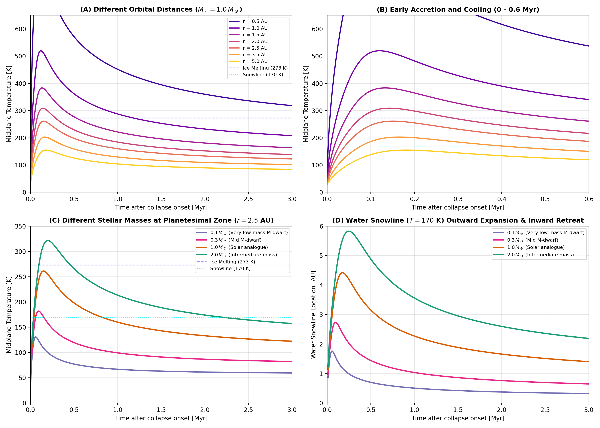

# Protoplanetary Disk Temperature Evolution

Planetesimal interior thermal structure, volatile retention, and hydrothermal circulation depend strongly on the thermal environment of the surrounding protoplanetary disk. The ambient nebular temperature sets the outer radiative boundary condition for planetesimal cooling and determines the background temperature of surrounding gas.

`Erebus.jl` provides two continuous, physically grounded protoplanetary disk temperature evolution models in addition to constant ambient temperature runs.

---

## Physical Background and Regimes

During star and planet formation, circumstellar disks transition through evolutionary stages:

1. **Class 0 ($t \lesssim 0.05\text{ to }0.1\text{ Myr}$)**: The protostellar core is embedded in an infalling molecular cloud envelope (Shu 1977; Ulrich 1976). Envelope mass exceeds protostellar mass, and the rotationally supported disk begins to assemble.
2. **Class I ($0.1 \lesssim t \lesssim 0.5\text{ Myr}$)**: Mass infall from the envelope feeds the circumstellar disk. Intense accretion shock dissipation and viscous shear heating produce maximum midplane temperatures, pushing volatile snowlines (such as the $\text{H}_2\text{O}$ ice sublimation front at $T \approx 170\text{ K}$) outward to multi-AU orbital separations (Drążkowska & Dullemond 2018; Lichtenberg et al. 2021).
3. **Class II ($0.5 \lesssim t \lesssim 5\text{ to }10\text{ Myr}$)**: Infall has ceased and the envelope has dissipated. Accretion rates decay following a viscous power law ($\dot{M} \propto t^{-\gamma}$ with $\gamma \approx 1.2\text{ to }1.5$; Lynden-Bell & Pringle 1974; Hartmann et al. 1998). As viscous heating diminishes, the midplane cools and asymptotically approaches the passive stellar irradiation floor of a flared disk (Chiang & Goldreich 1997). The water snowline retreats back inward toward the central star.

---

## Model 1: Monotonic Viscous Clearing (`model = :monotonic`)

When planetesimal formation or simulation integration begins after cloud infall has completed, viscous clearing governs the ambient temperature evolution (Chambers 2009; Johansen et al. 2015; Drążkowska & Alibert 2017):

$$T_{\text{disk}}(t, r, M_\star) = \left[ T_{\text{irr}}(r, M_\star)^4 + \left(T_{\text{peak}}(r, M_\star)^4 - T_{\text{irr}}(r, M_\star)^4\right) \left( 1 + \frac{t}{t_{\text{visc}}(M_\star)} \right)^{-\gamma} \right]^{1/4}$$

| Parameter | Description | Scaling / Definition | Units |
|:---|:---|:---|:---|
| $T_{\text{irr}}(r, M_\star)$ | Flared disk passive stellar irradiation temperature | $T_{\text{irr}, 1\text{AU}} (M_\star / 1.0 M_\odot)^{0.25} (r / 1.0\text{ AU})^{-3/7}$ | $\text{K}$ |
| $T_{\text{peak}}(r, M_\star)$ | Initial viscous midplane peak temperature at $t = 0$ | $T_{\text{peak}, 1\text{AU}} (M_\star / 1.0 M_\odot)^{0.30} (r / 1.0\text{ AU})^{-0.75}$ | $\text{K}$ |
| $t_{\text{visc}}(M_\star)$ | Characteristic viscous decay timescale | $t_{\text{visc}, 0} (M_\star / 1.0 M_\odot)^{0.30}$ ($t_{\text{visc}, 0} = 0.25\text{ Myr}$) | $\text{Myr}$ |
| $\gamma$ | Viscous clearing power-law decay exponent | Fiducial value: $1.4$ | - |

In this model, $T_{\text{disk}}$ decreases monotonically from $T_{\text{peak}}$ at $t = 0$ toward $T_{\text{irr}}$ as $t \to \infty$.

---

## Model 2: Cold to Hot to Cold Evolution in Class I and II (`model = :class1_to_class2`)

To simulate the full timeline of planetesimal formation and early hydrothermal evolution from disk buildup through viscous clearing, `Erebus.jl` incorporates a closed-form algebraic formulation calibrated against the multi-zone hydrodynamical and dust coagulation models of Drążkowska & Dullemond (2018), Lichtenberg et al. (2021), and Williams et al. (2026):

$$T_{\text{disk}}(t, r, M_\star) = \left[ T_{\text{eff, irr}}(t, r, M_\star)^4 + \left(T_{\text{peak}}(r, M_\star)^4 - T_{\text{irr}}(r, M_\star)^4\right) f_{\text{acc}}(t, r, M_\star) \right]^{1/4}$$

The symbol `:class0_to_class2` is supported as an equivalent configuration alias.

### 1. Accretion Heating Factor

The non-monotonic accretion heating factor captures early infall ramp-up and subsequent viscous decay:

$$f_{\text{acc}}(t, r, M_\star) = \left( 1 + \frac{\alpha}{\gamma} \right) \frac{\left(t / t_{\text{peak}}\right)^\alpha}{1 + \frac{\alpha}{\gamma} \left(t / t_{\text{peak}}\right)^{\alpha + \gamma}}$$

| Parameter | Description | Value / Limiting Form | Units |
|:---|:---|:---|:---|
| $\alpha$ | Accretion rise power-law exponent (envelope infall) | $2.0$ | - |
| $\gamma$ | Viscous accretion decay power-law exponent | $1.4$ | - |
| $t_{\text{peak}}(r, M_\star)$ | Epoch of maximum accretion heating | $t_{\text{peak}, 1\text{AU}} (M_\star / 1.0 M_\odot)^{0.40} (r / 1.0\text{ AU})^{0.25}$ | $\text{Myr}$ |
| $f_{\text{acc}}(0)$ | Initial accretion heating factor at onset | $0.0$ | - |
| $f_{\text{acc}}(t_{\text{peak}})$ | Maximum accretion heating factor at peak epoch | $1.0$ (yields $T_{\text{peak}}$) | - |
| $f_{\text{acc}}(t \gg t_{\text{peak}})$ | Asymptotic late-time accretion decay factor | $\approx (1 + \gamma/\alpha) (t / t_{\text{peak}})^{-\gamma}$ | - |

### 2. Protostellar Irradiation Emergence

During the early embedded phase, dense envelope dust obscures stellar irradiation. As the envelope clears on a timescale $\tau_\star = 0.8\, t_{\text{peak}}$, passive stellar irradiation emerges from the molecular cloud background:

$$T_{\text{eff, irr}}(t, r, M_\star) = \left[ T_{\text{cloud}}^4 + \left(T_{\text{irr}}(r, M_\star)^4 - T_{\text{cloud}}^4\right) \left( 1 - \exp\left(-\frac{t}{\tau_\star}\right) \right) \right]^{1/4}$$

| Parameter | Description | Value / Scaling | Units |
|:---|:---|:---|:---|
| $T_{\text{cloud}}$ | Molecular cloud background temperature floor | $30.0$ | $\text{K}$ |
| $\tau_\star$ | Envelope clearing timescale for stellar irradiation | $0.8\, t_{\text{peak}}(r, M_\star)$ | $\text{Myr}$ |
| $T_{\text{eff, irr}}(0)$ | Initial irradiation temperature before envelope clears | $T_{\text{cloud}} = 30.0$ | $\text{K}$ |
| $T_{\text{eff, irr}}(t \gg \tau_\star)$ | Asymptotic passive stellar irradiation temperature | $T_{\text{irr}}(r, M_\star)$ | $\text{K}$ |

---

## Radial and Stellar Mass Scaling Laws

Both models scale dynamically with orbital distance $r$ and central stellar mass $M_\star$:

### 1. Flared Disk Passive Irradiation Floor
Following Chiang & Goldreich (1997) and numerical calibrations against multi-zone disk models (Williams et al. 2026), stellar irradiation in flared geometry scales with host star mass and distance $r$:

$$T_{\text{irr}}(r, M_\star) = T_{\text{irr}, 1\text{AU}} \left(\frac{M_\star}{1.0\,M_\odot}\right)^{0.25} \left(\frac{r}{1.0\text{ AU}}\right)^{-3/7}$$

where $T_{\text{irr}, 1\text{AU}} = 150.0\text{ K}$ and $q_{\text{irr}} = 3/7 \approx 0.4286$.

### 2. Viscous Dissipation Peak Temperature
From Shakura & Sunyaev (1973) and Bell et al. (1997), midplane viscous heating scales with accretion rate and orbital frequency:

$$T_{\text{peak}}(r, M_\star) = T_{\text{peak}, 1\text{AU}} \left(\frac{M_\star}{1.0\,M_\odot}\right)^{0.30} \left(\frac{r}{1.0\text{ AU}}\right)^{-0.75}$$

where $T_{\text{peak}, 1\text{AU}} = 520.0\text{ K}$ and $q_{\text{visc}} = 0.75$.

### 3. Infall Peak Epoch and Collapse Duration
Cloud collapse duration depends on envelope mass and sound speed (Shu 1977). For low-mass stars (M-dwarfs), cloud collapse occurs on shorter timescales ($t_{\text{peak}} \approx 0.05\text{ Myr}$) than for solar-mass clouds ($t_{\text{peak}} \approx 0.12\text{ Myr}$), following Williams et al. (2026):

$$t_{\text{peak}}(r, M_\star) = t_{\text{peak}, 1\text{AU}} \left(\frac{M_\star}{1.0\,M_\odot}\right)^{0.40} \left(\frac{r}{1.0\text{ AU}}\right)^{0.25}$$

where $t_{\text{peak}, 1\text{AU}} = 0.12\text{ Myr}$.

---

## Verification and Diagnostic Curves

The multi-distance and multi-mass dynamics are illustrated in the 4-panel diagnostic below:

- **Panel (A)**: Midplane temperature evolution for a solar-mass star ($M_\star = 1.0\,M_\odot$) at orbital separations $r \in [0.5, 5.0]\text{ AU}$.
- **Panel (B)**: Zoom into early accretion heating and subsequent cooling ($0\text{ to }0.6\text{ Myr}$). This demonstrates the cold $\to$ hot $\to$ cold trajectory.
- **Panel (C)**: Midplane temperature at the canonical planetesimal zone ($r = 2.5\text{ AU}$) for stellar masses $M_\star \in [0.1, 0.3, 1.0, 2.0]\,M_\odot$ (Williams et al. 2026).
- **Panel (D)**: Dynamic migration of the water snowline ($T = 170\text{ K}$). The snowline expands outward during peak accretion heating and retreats inward as viscous accretion subsides.

---

## References

- **Bell, K. R., Cassen, P. M., Klahr, H. H., & Henning, T. (1997)**. The Structure and Appearance of Protostellar Accretion Disks: Limits on Disk Flaring. *The Astrophysical Journal*, 486(1), 372-387.
- **Chambers, J. E. (2009)**. An analytic model for the evolution of a viscous, irradiated disk. *The Astrophysical Journal*, 705(2), 1206-1214.
- **Chiang, E. I., & Goldreich, P. (1997)**. Spectral energy distributions of T Tauri stars with passive circumstellar disks. *The Astrophysical Journal*, 490(1), 368-376.
- **Drążkowska, J., & Alibert, Y. (2017)**. Planetesimal formation starts at the snow line. *Astronomy & Astrophysics*, 608, A92.
- **Drążkowska, J., & Dullemond, C. P. (2018)**. Planetesimal formation during protoplanetary disk buildup. *Astronomy & Astrophysics*, 614, A62.
- **Hartmann, L., Calvet, N., Gullbring, E., & D’Alessio, P. (1998)**. Accretion and the evolution of T Tauri disks. *The Astrophysical Journal*, 495(1), 385-400.
- **Johansen, A., Mac Low, M. M., Lacerda, P., & Bizzarro, M. (2015)**. Growth of asteroids, planetary embryos, and Kuiper belt objects by chondrule accretion. *Science Advances*, 1(3), e1500109.
- **Lichtenberg, T., Drążkowska, J., Schönbächler, M., Golabek, G. J., & Hands, T. O. (2021)**. Bifurcation of planetary building blocks during Solar System formation. *Science*, 371(6527), 365-370.
- **Lynden-Bell, D., & Pringle, J. E. (1974)**. The evolution of viscous discs and the origin of the nebular variables. *Monthly Notices of the Royal Astronomical Society*, 168(3), 603-637.
- **Shakura, N. I., & Sunyaev, R. A. (1973)**. Black holes in binary systems. Observational appearance. *Astronomy and Astrophysics*, 24, 337-355.
- **Shu, F. H. (1977)**. Self-similar collapse of isothermal spheres and star formation. *The Astrophysical Journal*, 214, 488-497.
- **Ulrich, R. K. (1976)**. An infall model for the T Tauri phenomenon. *The Astrophysical Journal*, 210, 377-391.
- **Visser, R., van Dishoeck, E. F., Doty, S. D., & Dullemond, C. P. (2009)**. The chemical history of molecules in circumstellar disks. I. Ices. *Astronomy & Astrophysics*, 495(3), 881-897.
- **Williams, J., Krijt, S., Drążkowska, J., & Lichtenberg, T. (2026)**. Planetesimal formation across the stellar mass spectrum and its influence on exoplanet-inherited volatile budgets. *Monthly Notices of the Royal Astronomical Society*, 551(3), stag1510.

