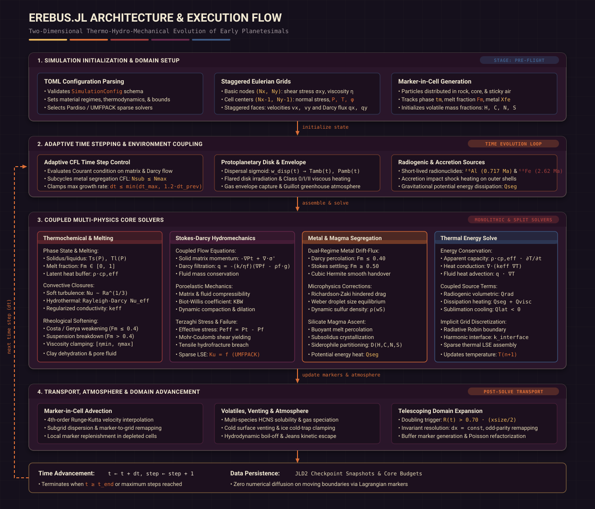

# Scientific Context: Early Planetesimal Evolution

`Erebus.jl` models the internal physical and geochemical evolution of icy and rocky planetesimals during the first tens of millions of years of Solar System history.

---

## The Physical Scenario

Planetesimals formed in the solar protoplanetary disk through the gravitational collapse of pebble swarms or streaming instabilities.
Bodies that accreted during the first 2 to 3 million years after the formation of Calcium-Aluminum-rich Inclusions (CAIs) incorporated substantial quantities of short-lived radioactive isotopes, predominantly $^{26}\text{Al}$ (half-life $t_{1/2} \approx 0.717\text{ Ma}$) and $^{60}\text{Fe}$ ($t_{1/2} \approx 2.62\text{ Ma}$).

As these radionuclides decayed, they generated intense internal volumetric heating:

### 1. Ice Melting
Initial temperatures of $\approx 170\text{ K}$ rose rapidly.
Once internal temperatures reached $273\text{ K}$, primordial water ice melted, absorbing latent heat ($L^f \approx 333\text{ kJ/kg}$) and generating mobile pore water in the porous silicate matrix.

### 2. Hydrothermal Circulation
Liquid water percolated through the interconnected pore network under Darcy flow, driven by thermal buoyancy and compaction-induced fluid pressure gradients.

### 3. Clay Dehydration and Gas Generation
At elevated temperatures ($T \approx 500\text{--}900\text{ K}$), hydrous phyllosilicates, such as serpentine, underwent thermal dehydration reactions, releasing bound hydroxyl groups as free supercritical fluid.

### 4. Matrix Compaction and Pore Overpressure
Viscous, elastic, and plastic deformation of the silicate matrix reduced porosity ($\phi$).
When the compaction rate exceeded the rate of fluid escape via Darcy percolation, pore fluid pressure ($P_f$) rose to match or exceed the lithostatic solid pressure ($P_t$).

### 5. Failure and Hydrofracture
When the Terzaghi effective stress became tensile ($\sigma_{\text{eff}} \le -\sigma_{\text{tensile}}$), the silicate matrix experienced hydrofracturing, creating high-permeability pathways that vented fluids to the planetesimal surface.

### 6. Silicate Rock Melting, Magma Ascent, and Magma Ocean Formation
In planetesimals that accreted early, decay heating drove temperatures past the silicate solidus ($T_{\text{sol}} \approx 1400\text{ K}$).
Rock melted into a crystal-liquid mush and transitioned into a vigorously convecting magma ocean above the rheological disaggregation threshold ($\phi_{\text{crit}} \approx 0.40$).
Buoyant silicate melt segregates outward via porous Darcy percolation and hindered Stokes crystal settling, releasing gravitational shear dissipation and latent heat of crystallization.
Sub-grid soft turbulence convection transported heat outward to the surface, buffering interior temperatures and governing core segregation.

### 7. Iron Core Formation and Metal Segregation
At temperatures exceeding the Fe-FeS eutectic ($T_{\text{eut}} \approx 1213\text{ K}$), dense metallic liquid melts and segregates inward toward the center.
In partially molten rock, metal trickles downward by porous Darcy percolation.
In magma oceans, metal droplets rain downward via Stokes settling, releasing gravitational potential energy that accelerates core formation.

---

## Global Architecture & Execution Flow

The full simulation lifecycle, coupling between Eulerian staggered grids and Lagrangian markers, and the nested sequence of multi-physics solvers are visualized in the flowchart below:

### Numerical Execution Pipeline

1. **Simulation Initialization**:
   - Parses and validates configuration settings via `SimulationConfig`.
   - Allocates staggered Eulerian finite-difference grids for momentum, mass conservation, Darcy filtration, and energy equations.
   - Populates Lagrangian markers with initial thermochemical, phase, porosity, metal fraction, and volatile budgets across planetary layers and surrounding sticky air.

2. **Adaptive Time Stepping & Boundary Pre-Solve**:
   - Determines the global timestep $\Delta t = \min(\Delta t_{\text{CFL}}, \Delta t_{\text{diff}}, \Delta t_{\text{thermal}}, \Delta t_{\text{max}})$, with adaptive subcycling for metal segregation CFL constraints.
   - Evaluates ambient protoplanetary disk thermal conditions ($T_{\text{amb}}, P_{\text{amb}}$), disk dispersal weighting $w_{\text{disp}}(t)$, gas envelope capture, Guillot semi-grey greenhouse atmosphere, and non-linear Stefan-Boltzmann surface radiation.
   - Ingests volumetric radiogenic heating ($^{26}\text{Al}, ^{60}\text{Fe}$), accretion impact heating, and dissipation source terms.

3. **Coupled Multi-Physics Core Solvers**:
   - **Thermochemical & Phase State**: Evaluates pressure-dependent silicate solidus/liquidus, apparent heat capacity latent heat buffering, Solomatov (2007) sub-grid soft turbulence scaling ($k_{\text{turb}} \sim \text{Ra}^{1/3}$), hydrothermal Rayleigh-Darcy porous convection closures, Costa / Gerya rheological weakening, and clay dehydration.
   - **Stokes-Darcy Hydromechanics**: Monolithic linear system assembly ($K \mathbf{u} = \mathbf{f}$) solving solid matrix deformation, Darcy fluid filtration, poroelastic compaction/dilation, and Terzaghi effective stress plasticity with tensile hydrofracturing.
   - **Metal & Magma Segregation**: Dual-regime metal drift-flux solver transitioning from porous Darcy percolation ($F_m \le 0.40$) to hindered Stokes droplet settling ($F_m \ge 0.50$) via cubic Hermite blending, coupled with buoyant silicate melt migration, accessory mineral crystallization, and gravitational dissipation heating ($Q_{\text{seg}}$).
   - **Thermal Energy Solve**: Implicit sparse solve for temperature $T^{n+1}$ incorporating conduction, advection, latent heats, radiogenic sources, and segregation dissipation.

4. **Transport, Atmosphere & Mesh Advancement**:
   - Advects Lagrangian markers via 4th-order Runge-Kutta velocity interpolation, applying local particle replenishment in under-resolved cells.
   - Evaluates multi-species HCNS volatile degassing, cold surface venting, ice cold-trap clamping, and atmospheric escape.
   - Executes telescoping domain coordinate doubling ($x_{\text{size}} \to 2 x_{\text{size}}$) with invariant resolution ($dx = \text{const}$) and odd-parity remapping when the planetesimal exceeds 70% of the domain half-width.

5. **State Persistence & Time Advancement**:
   - Updates simulation time $t \leftarrow t + \Delta t$, exports JLD2 checkpoint snapshots and core budget metrics, and advances to the next time step until reaching target epoch or maximum steps.

---

## Thermo-Hydro-Mechanical Coupling

`Erebus.jl` resolves these interacting regimes through a fully coupled numerical framework:
- Thermal solver calculates conduction, radioactive decay, latent heat buffering, fluid advective heat transport, and segregation dissipation heating.
- Hydromechanical solver simultaneously solves coupled Stokes solid deformation, Darcy fluid flux, and poroelastic volume changes in a monolithic linear system.
- Marker-in-Cell advects material phases, temperature, composition, and porosity without numerical diffusion across moving boundaries.
- Melting and soft turbulence routines evaluate pressure-dependent silicate melting, apparent heat capacity latent heat buffering, suspension rheology, and regularized sub-grid convective conductivity.
- Magma transport drift-flux solver tracks conservative outward buoyant migration of silicate melt, couples Darcy percolation and hindered Stokes crystal settling, models subsolidus crystallization and dissipation heating, and tracks mantle depletion.
- Metal segregation drift-flux solver tracks conservative downward migration of molten iron, couples percolation and Stokes droplet settling through the rheological transition, and computes gravitational dissipation heating.

---

## Geometry Convention

Erebus.jl models the planetesimal as a 2D Cartesian cross-section passing through the planetary center $(x_{\text{center}}, y_{\text{center}})$.

### Two-Dimensional Form and Three-Dimensional Mapping

The computational domain represents a planar slice through an axisymmetric or spherical body. To evaluate three-dimensional integral quantities (such as total mass, component inventories, and integrated volatile degassing) from planar marker positions, each Lagrangian marker $m$ at distance $r_m = \sqrt{(x_m - x_{\text{center}})^2 + (y_m - y_{\text{center}})^2}$ carries an effective out-of-plane cylindrical integration length $L(r_m)$:

\[
L(r_m) = 2 r_m
\]

Integrating over a circular disk of radius $R$ in the 2D Cartesian cross-section with differential marker area $A_m = \Delta x_m \Delta y_m$ recovers the exact volume of a sphere:

\[
V_{\text{3D}} = \int_{\text{disk}} L(r) \, dA = \int_0^{2\pi} d\theta \int_0^R (2r) \, r \, dr = 4\pi \int_0^R r^2 \, dr = \frac{4}{3} \pi R^3
\]

Mass increments and volatile transfers map between the 2D planar sums and 3D spherical inventories via:

\[
\Delta M = \sum_m \rho_m A_m L(r_m) \Delta C_m, \quad L(r_m) = 2 r_m, \quad A_m = \Delta x_m \cdot \Delta y_m
\]

where $\rho_m$ is the marker density, $A_m$ is the marker differential area, and $\Delta C_m$ is the dimensionless mass fraction or phase change increment.

### Weighting Limits

The out-of-plane weighting function $L(r) = 2r$ exhibits three characteristic limits in planetary structures:
1. **Planetary surface limit ($r \to R$)**: Near the outer planetary radius, $L(R) = 2R$. Surface flux and atmospheric exchange calculations scale with out-of-plane diameter $2R$.
2. **Thin spherical shell limit ($r \in [r_{\text{inner}}, R]$)**: For an outer spherical shell, the ratio of integrated 3D shell mass to 2D planar shell mass equals $\frac{4}{3} \frac{R^3 - r_{\text{inner}}^3}{R^2 - r_{\text{inner}}^2}$. For a near-surface shell spanning $0.9R \le r \le R$, this ratio evaluates to approximately $1.902 R$.
3. **Full spherical disk limit**: Integrating over the entire circular section yields the full spherical volume $\frac{4}{3} \pi R^3$, corresponding to an area-weighted mean out-of-plane thickness of $\frac{4}{3} R$.

### Dynamic Flow and Conservation

Strict conserved bookkeeping is maintained in the 2D Cartesian frame during hydromechanical Stokes flow, Darcy filtration, and marker transport. Because 2D Cartesian divergence-free velocity fields ($\nabla \cdot \mathbf{v} = 0$) do not preserve the axisymmetric volume element $r \, dr$, advection in the 2D plane does not automatically conserve the 3D-weighted inventory $\sum_m \rho_m A_m (2 r_m)$. Conserved physical transfers (such as volatile degassing, fluid drainage, and core metal growth) explicitly record both the 2D cross-sectional quantities and their 3D spherical projections.

Thermal conduction incorporates an optional radial geometric metric term to account for spherical divergence in conductive heat flow in the cross-section.

### Gravitational Source Term

The Poisson solver evaluates gravitational potential from the 2D density field using an effective source term $(8/3) \pi G \rho$. This source coefficient reproduces the exact radial gravitational acceleration at the surface of a uniform-density sphere of radius $R$. For differentiated bodies with strong radial density variations (such as a dense metallic core surrounded by a lower-density silicate mantle), radial gravity modes can evaluate the enclosed spherical mass directly from radial density fields.

