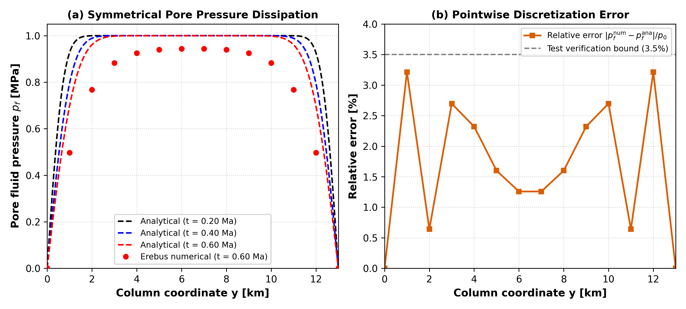
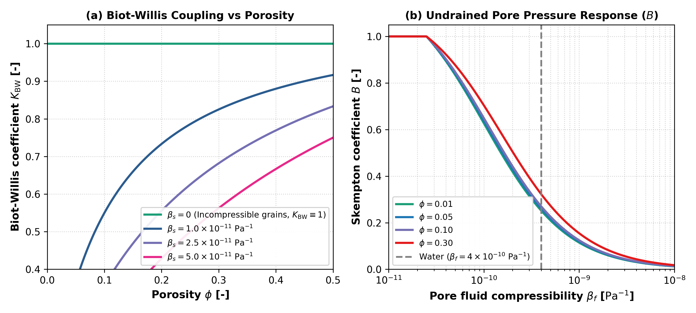
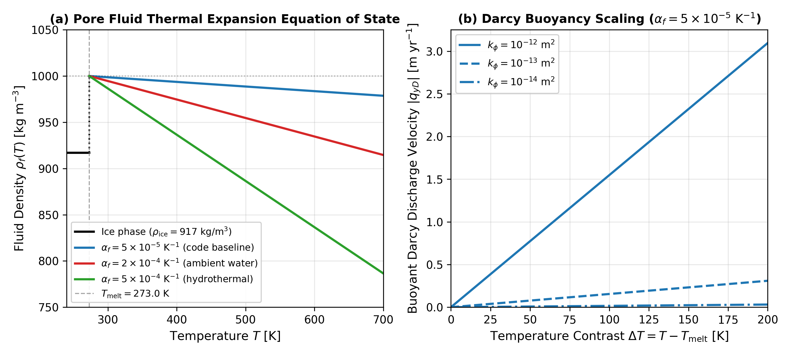
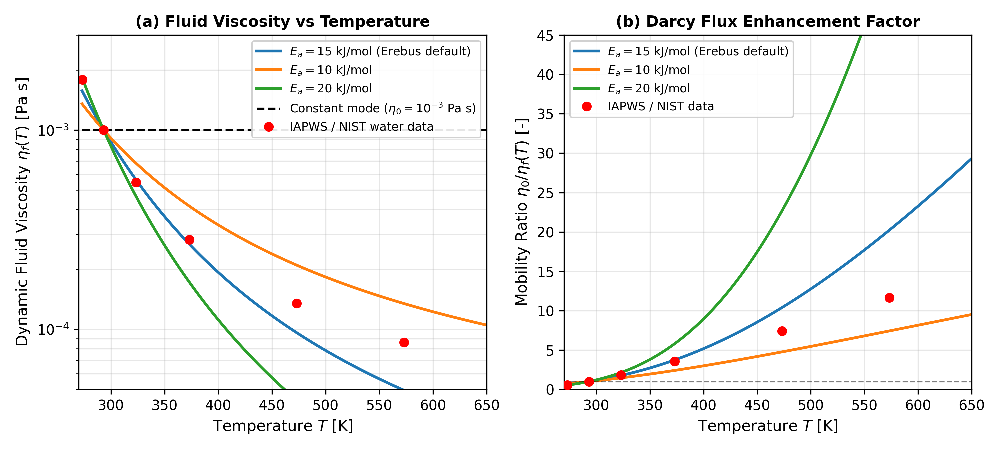
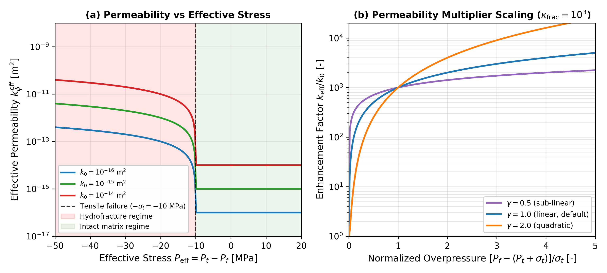

# Verification and Validation

This page summarizes the benchmarks and tests used to ensure numerical accuracy and physical fidelity in `Erebus.jl`.

---

## 1. 1D Terzaghi Analytical Consolidation Benchmark

The primary verification test for the coupled Stokes-Darcy formulation is the one-dimensional Terzaghi consolidation problem.

- **Setup**: Saturated porous column of height $H$ with draining boundary anchors ($P_f = p_{\text{surface}} = 1000\text{ Pa}$) subjected to excess pore pressure dissipation.
- **Analytical Solution**: Fourier series representation of two-way pore pressure dissipation over dimensionless time factor $T_v = c_v t / H^2$.
- **Result**: The numerical pore pressure field computed by the monolithic solver matches the analytical Fourier series solution at all column depths with a relative error $< 3.5\%$. See the [Terzaghi Consolidation Tutorial](../tutorials/terzaghi_consolidation.md) for the full derivation and code.

*Figure 1: Benchmark verification of the coupled Stokes-Darcy solver against the analytical 1D Terzaghi consolidation solution. (a) Pore fluid pressure dissipation along column height $y \in [0, H]$ at three successive timesteps, comparing the analytical Fourier series (dashed curves) with Erebus numerical results (dots). (b) Pointwise relative error $|p_f^{\text{num}} - p_f^{\text{ana}}| / p_0$ showing that numerical discretization error remains strictly below $3.5\%$ throughout the column.*

---

## 2. Poroelastic Constitutive Limits

The constitutive poroelastic functions in `src/physics.jl` are verified against physical asymptotic limits:

1. **Incompressible Solid Skeleton ($\beta_s \to 0$)**:
   $$\lim_{\beta_s \to 0} K_{\text{BW}} = 1, \quad \lim_{\beta_s \to 0} B = \frac{\beta_\phi}{\beta_\phi + \phi(1 - \phi)\beta_f}$$
   Verified over porosity values $\phi \in [\phi_{\text{min}}, \phi_{\text{max}}]$.

2. **Incompressible Pore Fluid ($\beta_f \to 0$)**:
   As fluid compressibility approaches zero, Skempton coefficient $B$ approaches its undrained upper bound:
   $$\lim_{\beta_f \to 0} B = \min\left(1, \frac{\beta_d - \beta_s}{\beta_d - (1 + \phi)\beta_s}\right) = 1$$
   where the code clamps the theoretical ratio to $[0, 1]$ to enforce the physical upper bound.

3. **Porosity Bounding Guarantees**:
   Constitutive routines clamp porosity to $[\phi_{\text{min}}, \phi_{\text{max}}]$ to prevent singular division when $\phi \to 0$ or $\phi \to 1$.

*Figure 2: Theoretical behavior of derived poroelastic coefficients in Erebus. (a) Biot-Willis coefficient $K_{\text{BW}}$ as a function of porosity $\phi$ for varied solid grain compressibility $\beta_s$ to confirm asymptotic convergence toward unity ($K_{\text{BW}} \equiv 1$) in the incompressible solid grain limit. (b) Skempton pore pressure coefficient $B$ as a function of fluid compressibility $\beta_f$ for representative porosity values to display undrained response transitions.*

---

## 3. Matrix Block Consistency Tests

The individual coupling sub-blocks in `assemble_hydromechanical_lse!` are tested independently against theoretical values:
- **Solid continuity diagonal ($L[P_t, P_t]$)**: Matches $+K_{\text{cont}} \left(\frac{1}{(1-\phi)\eta_\phi} + \frac{\beta_d}{\Delta t}\right)$.
- **Poroelastic cross-coupling ($L[P_t, P_f] = L[P_f, P_t]$)**: Matches $-K_{\text{cont}} \left(\frac{1}{(1-\phi)\eta_\phi} + \frac{\beta_d K_{\text{BW}}}{\Delta t}\right)$.
- **Fluid continuity diagonal ($L[P_f, P_f]$)**: Matches $+K_{\text{cont}} \left(\frac{1}{(1-\phi)\eta_\phi} + \frac{\beta_d K_{\text{BW}}}{B \Delta t}\right)$.

---

## 4. Radiogenic Energy and Mass Conservation

- **Radioactive Decay Kinetics**: Exponential decay of $^{26}\text{Al}$ and $^{60}\text{Fe}$ is verified against analytical integration $\int_0^t Q(t') dt'$ to confirm exact conservation of energy release.
- **Dehydration Mass Balance**: Fluid released from decomposing hydrated silicates matches matrix mass loss ($DMP$).

---

## 5. Darcy Thermal Buoyancy Verification

The fluid thermal expansion equation of state and the Darcy thermal buoyancy driving force are verified against theoretical scaling:

$$\mathbf{q}_D = - \frac{k_\phi}{\eta_f} \left(\nabla P_f - \rho_f(T) \mathbf{g}\right)$$

In a hydrostatic vertical column with temperature contrast $\Delta T = T - T_{\text{melt}}$, the upward buoyant Darcy discharge velocity scaling is:

$$|q_{yD}| = \frac{k_\phi}{\eta_f} \rho_{f0} \alpha_f \Delta T g$$

*Figure 3: Thermal buoyancy and fluid equation of state verification in Erebus. (a) Temperature-dependent fluid density $\rho_f(T)$ across $T \in [240, 700]\text{ K}$ displaying sub-freezing ice density ($\rho_{\text{ice}} = 917\text{ kg/m}^3$), liquid water density at $T_{\text{melt}} = 273.0\text{ K}$ ($\rho_{\text{water}} = 1000\text{ kg/m}^3$), linear thermal expansion above melting, and positive density clamping. Curves compare the code baseline ($\alpha_f = 5\times 10^{-5}\text{ K}^{-1}$) against ambient water and hydrothermal regimes. (b) Upward buoyant Darcy discharge velocity $|q_{yD}|$ as a function of thermal contrast $\Delta T$ for representative crustal permeabilities ($k_\phi \in [10^{-14}, 10^{-12}]\text{ m}^2$) at the code baseline $\alpha_f = 5\times 10^{-5}\text{ K}^{-1}$.*

---

## 6. Temperature-Dependent Fluid Viscosity Benchmarking

The temperature-dependent fluid viscosity formulation approximates liquid water behavior across planetesimal hydrothermal conditions:

$$\eta_f(T) = \eta_{f0} \exp\left[\frac{E_a}{R} \left(\frac{1}{T} - \frac{1}{T_0}\right)\right]$$

with reference viscosity $\eta_{f0} = 1.0\times 10^{-3}\text{ Pa}\cdot\text{s}$ at $T_0 = 293.15\text{ K}$ ($20^\circ\text{C}$) and activation energy $E_a = 15.0\text{ kJ/mol}$.

This single-activation energy relation closely tracks experimental liquid water data (IAPWS / NIST standard tables) within $12\%$ across the sub-boiling regime $T \in [273, 373]\text{ K}$. At higher temperatures ($T \approx 470\text{--}570\text{ K}$), liquid water curvature follows a Vogel-Fulcher-Tammann profile, where the single Arrhenius fit underestimates viscosity by $\approx 30\text{--}40\%$ before entering the supercritical regime ($T > 647\text{ K}$).

*Figure 4: Benchmarking of temperature-dependent pore fluid viscosity $\eta_f(T)$ in Erebus. (a) Dynamic fluid viscosity across $T \in [270, 700]\text{ K}$ on a logarithmic scale, comparing the default Arrhenius model ($E_a = 15.0\text{ kJ/mol}$, blue curve) against experimental liquid water measurements from IAPWS/NIST standards (red circles). (b) Hydrothermal Darcy mobility enhancement factor $\eta_{f0} / \eta_f(T)$ illustrating the $5\times\text{--}20\times$ increase in fluid percolation speed as interior temperatures rise across liquid hydrothermal conditions.*

---

## 7. Dynamic Hydrofracture Permeability Verification

The dynamic hydrofracture formulation enhances Darcy permeability when pore fluid pressure exceeds total confining pressure plus the rock tensile strength:

$$P_{\text{eff}} = P_t - P_f \le -\sigma_t$$

The effective permeability scaling:

$$k_\phi^{\text{eff}} = \min\left(k_\phi \cdot \left[1 + \kappa_{\text{frac}} \left(\frac{\max(0, -P_{\text{eff}} - \sigma_t)}{\sigma_t}\right)^\gamma\right], k_{\text{max}}\right)$$

is verified across intact and fractured regimes:

*Figure 5: Verification of dynamic hydrofracturing permeability enhancement in Erebus. (a) Effective permeability $k_\phi^{\text{eff}}$ as a function of Terzaghi effective stress $P_{\text{eff}} = P_t - P_f$ across compressive ($P_{\text{eff}} > 0$), intact tensile ($-\sigma_t < P_{\text{eff}} \le 0$), and hydrofractured ($P_{\text{eff}} \le -\sigma_t$) regimes for representative matrix permeabilities ($k_0 \in [10^{-16}, 10^{-14}]\text{ m}^2$) at tensile strength $\sigma_t = 10\text{ MPa}$. (b) Permeability enhancement factor $k_{\text{eff}} / k_0$ as a function of normalized overpressure for scaling exponents $\gamma \in \{0.5, 1.0, 2.0\}$ at $\kappa_{\text{frac}} = 10^3$.*
