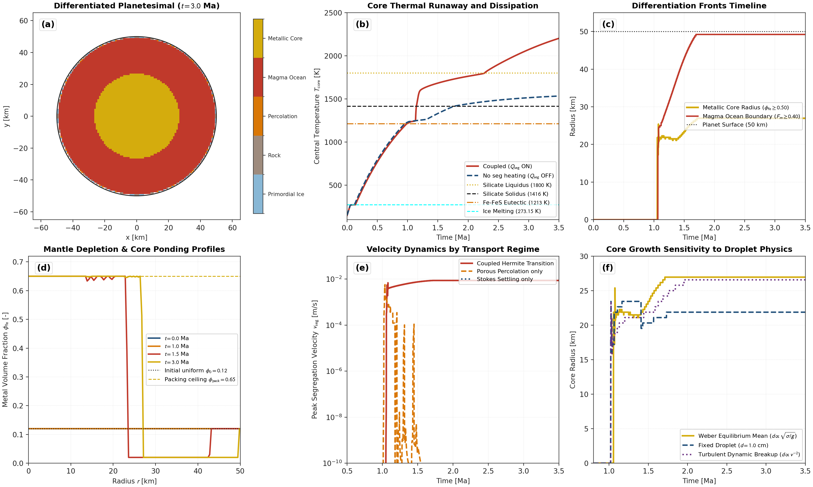
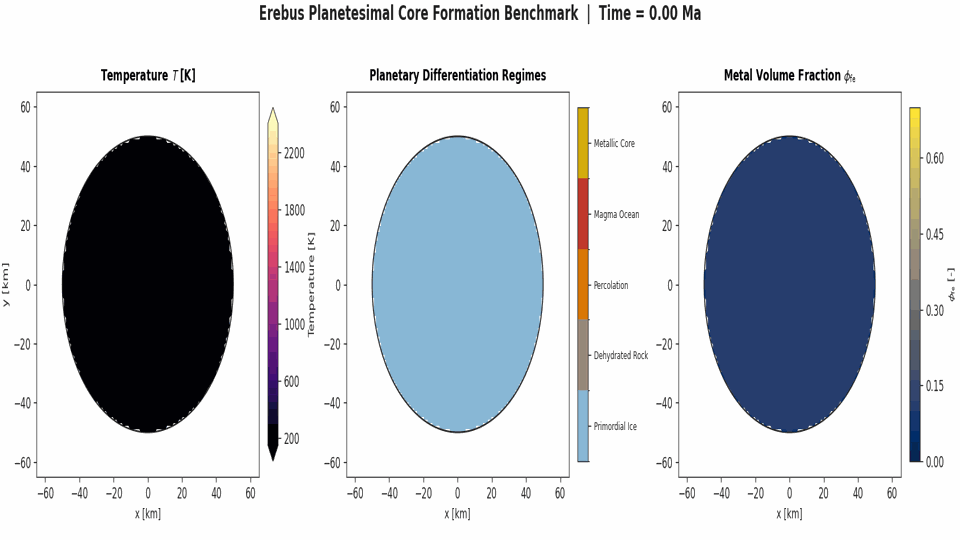
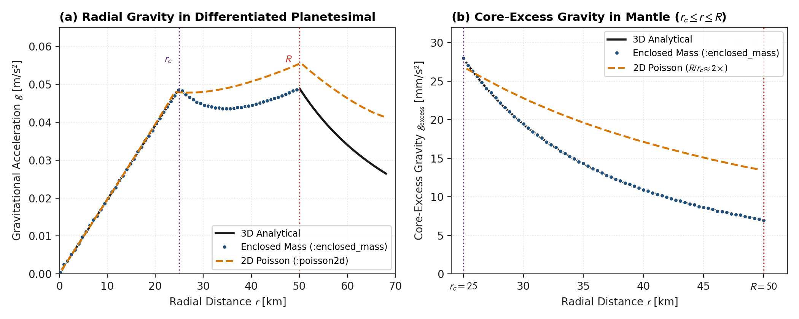

# Iron Core Formation and Metal-Silicate Segregation

This page documents the physical formulation, mathematical limits, and numerical implementation of iron core formation in `Erebus.jl`. The model couples porous Fe-FeS percolation through solid silicate matrices, Stokes droplet settling through silicate magma oceans, segregation dissipation heating, and mass-conservative transport.

---

## 1. Physical Motivation

Early planetary differentiation separates dense metallic iron from lighter silicate rock to form a central metallic core and an overlying silicate mantle. In early Solar System planetesimals, this differentiation is driven by internal decay heating from short-lived radionuclides ($^{26}\text{Al}$ and $^{60}\text{Fe}$).

The Fe-FeS binary system has a low eutectic temperature ($T_{\text{eutectic}} \approx 1213\text{ K}$), melting hundreds of Kelvin below the silicate solidus ($T_{\text{solidus}} \approx 1400\text{ K}$). Metal-silicate segregation operates in two distinct physical regimes:

1. **Porous Percolation Regime ($F_m \le 0.40$)**: In crystalline silicate rock, liquid Fe-FeS melt percolates along mineral grain boundaries under gravity once the liquid metal fraction exceeds the percolation threshold ($\phi_{\text{crit}} \approx 0.05$). The flow is governed by porous Darcy dynamics with Kozeny-Carman permeability.
2. **Magma Ocean Stokes Settling Regime ($F_m \ge 0.50$)**: When silicate melting exceeds the rheological transition threshold ($\phi_{\text{rheo}} \approx 0.40$), the rigid crystalline framework breaks down into a low-viscosity crystal suspension. Dense liquid metal emulsifies into droplets whose diameter is governed by capillary-hydrodynamic balance. Droplets sink rapidly through the magma ocean following Stokes drag with hindered settling corrections.
3. **Continuous Mush Handover**: In the transition mush zone ($F_m \in [0.40, 0.50]$), segregation velocity blends smoothly between porous percolation and droplet settling via a cubic Hermite polynomial.
4. **Dissipation Energetics**: Sinking metal releases gravitational potential energy. This gravitational energy is dissipated as frictional heat, accelerating interior warming and thermal runaway during runaway core formation.
5. **Property Blending**: Bulk density, thermal conductivity, and volumetric heat capacity update dynamically in space as metal migrates toward the planetary center.

---

### 2. Theoretical Formulation

The physical theory, chemical equation of state models (Sanloup et al., 2000; Morard et al., 2014), permeability relations, and droplet breakup mechanics are derived in detail in [Iron Core Formation and Metal Segregation](../../explanations/core_formation.md).

Key constitutive formulations validated on this page include:

- **Mobile Metal Volume Fraction ($\phi_m$):**
  $$\phi_m = \chi_m(T) \cdot X_{\text{fe,bulk}}, \quad \chi_m(T) = \text{clamp}\left(\frac{T - T_{\text{eutectic}}}{\Delta T_{\text{metal}}}, 0, 1\right)$$
- **Porous Darcy Percolation Velocity ($v_{\text{perc}}$):**
  $$v_{\text{perc}} = \frac{k_{\text{metal}}(\phi_m)}{\phi_m \, \eta_{\text{metal}}} \Delta\rho \, g \left(\frac{\phi_m - \phi_{\text{residual}}}{\phi_m}\right)$$
- **Magma Ocean Stokes Settling Velocity ($v_{\text{Stokes}}$):**
  $$v_{\text{Stokes}} = \frac{2}{9} \frac{\Delta\rho \, g \, r_d^2}{\eta_{\text{silicate}}} f_{\text{HR}} f_{\text{hindered}}$$
- **Continuous Hermite Handover ($v_{\text{seg}}$):** Smooth $C^1$ transition across the rheological breakdown interval $F_m \in [F_{\text{settle,start}}, F_{\text{perc,end}}]$:
  $$v_{\text{seg}} = (1 - w) v_{\text{perc}} + w v_{\text{settle}}, \quad w = 3\xi^2 - 2\xi^3$$
- **Gravitational Dissipation Heating ($Q_{\text{seg}}$):**
  $$Q_{\text{seg}} = \phi_{m,\text{curr}} \Delta\rho \, g \, v_{\text{seg}}$$
- **Volume-Weighted Material Property Blending:**
  $$\rho = (1 - X_{\text{fe}}) \rho_{\text{silicate}} + X_{\text{fe}} \rho_{\text{metal}}$$
  $$\rho c_p = (1 - X_{\text{fe}}) (\rho c_p)_{\text{silicate}} + X_{\text{fe}} (\rho c_p)_{\text{metal}}$$
  $$k = (1 - X_{\text{fe}}) k_{\text{silicate}} + X_{\text{fe}} k_{\text{metal}}$$

---

## 3. Discretization and Mass Conservation

Metal segregation is solved on the Eulerian grid using a finite-volume drift-flux formulation.

### Local CFL Subcycling

The Stokes-Darcy hydrodynamic timestep $\Delta t_{\text{hydro}}$ is typically governed by silicate convection and thermal diffusion ($\sim 10^3\text{ yr}$). Settling velocities in low-viscosity magma can produce local Courant numbers exceeding unity. To maintain explicit stability, the segregation solver executes adaptive subcycling with an isotropic scalar timestep:

$$\Delta t_{\text{CFL}} = \text{cfl\_settling} \cdot \frac{\min(\Delta x, \Delta y)}{\max_{i,j} \|\mathbf{v}_{\text{seg}}\|}$$

$$N_{\text{sub}} = \min\left( \left\lceil \frac{\Delta t_{\text{hydro}}}{\Delta t_{\text{CFL}}} \right\rceil, N_{\text{max}} \right)$$

$$\Delta t_{\text{sub}} = \frac{\Delta t_{\text{hydro}}}{N_{\text{sub}}}$$

### Multi-Dimensional Flux Limiters and Marker Capacity Redistribution

To guarantee strict non-negativity and prevent exceeding maximum packing fraction $\phi_{\text{pack}}$ on 2D staggered grids:

1. **Outflow Limiter**: For cell $(i, j)$ donating metal across horizontal and vertical faces, total face outflow $Out_{\text{total}} = \sum \Phi_{\text{out}} \Delta t_{\text{sub}}$ must not exceed available metal mass $m_{\text{avail}}$. All outward fluxes are scaled by $\alpha_{\text{out}} = \min(1.0, m_{\text{avail}} / Out_{\text{total}})$.
2. **Inflow Limiter**: Total incoming flux $In_{\text{total}} = \sum \Phi_{\text{in}} \Delta t_{\text{sub}}$ must not exceed available metal capacity in marker count units $m_{\text{cap}} = \sum_{m \in \text{cell}} \max(0, \phi_{\text{pack}} - X_{\text{fe,bulk}}[m])$. All inward fluxes are scaled by $\alpha_{\text{in}} = \min(1.0, m_{\text{cap}} / In_{\text{total}})$.
3. **Capacity-Weighted Marker Update**: When net cell mass changes are distributed back to markers, markers in cells gaining metal receive increments proportional to their remaining room below $\phi_{\text{pack}}$. Markers in cells losing metal scale proportionally. This guarantees that individual markers never violate $[0, \phi_{\text{pack}}]$, even with non-uniform initial distributions.

### Machine-Precision Conservation

Provided all initial marker bulk metal fractions satisfy $0 \le X_{\text{fe,bulk}} \le \phi_{\text{pack}}$, after subcycled finite-volume transport, any floating-point truncation residual is corrected via a uniform, bounded mass correction over eligible interior planet markers below the packing ceiling $\phi_{\text{pack}}$. The global relative mass error satisfies:

$$\frac{|M_{\text{metal}}(t) - M_{\text{metal}}(0)|}{M_{\text{metal}}(0)} < 10^{-12}$$

in the drift-flux solver, and $< 10^{-10}$ in coupled multi-physics simulation loops.

---

## 4. Planetesimal Core Formation Benchmark Suite

The core formation benchmark configuration (`configs/core_formation_benchmark.toml`) simulates a 50 km radius planetesimal initialized at $2.25\text{ Ma}$ with preheated interior rock at $1350\text{ K}$ and bulk metal volume fraction $X_{\text{fe,bulk}} = 0.20$. The benchmark runs 5 timesteps ($\sim 16\text{ kyr}$) to verify dynamic metal segregation, local CFL subcycling, and conservative marker updates under coupled thermo-hydro-mechanical evolution.

### Physical Differentiation Timeline

The planetesimal differentiates in four sequential stages driven by $^{26}\text{Al}$ radioactive decay in the rock component:

1. **Primordial Homogeneous Accretion ($t = 0\text{ Ma}$)**: The body starts completely cold ($T = 150\text{ K}$) and uniformly icy throughout its entire volume.
2. **Pore Ice Melting and Rock Desiccation ($t \approx 0.3 - 0.8\text{ Ma}$)**: Radioactive decay warms the interior above 273.15 K. Pore ice melts in the interior and dehydrates the rock, while surface conductive cooling maintains a cold outer lid ($T < 273.15\text{ K}$) where primordial ice is preserved dynamically.
3. **Porous Fe-FeS Percolation ($t \approx 1.0 - 1.4\text{ Ma}$)**: Interior temperatures reach the Fe-FeS eutectic ($T_{\text{eutectic}} = 1213\text{ K}$). Molten metallic alloy exceeds the percolation threshold ($\phi_{\text{crit,perc}} = 0.05$) and drains inward through crystalline silicate pores.
4. **Magma Ocean Stokes Settling and Core Ponding ($t \approx 1.5 - 3.5\text{ Ma}$)**: Silicate melting crosses the solidus ($1400\text{ K}$) and reaches the rheological breakdown threshold ($F_m \ge 0.40$). Dense liquid metal droplets settle rapidly through the low-viscosity magma suspension. Droplets pond at the planetary center to form a segregated metallic core of radius $\approx 27\text{ km}$ at maximum packing ($\phi_{\text{pack}} = 0.65$), capped by an iron-depleted silicate mantle ($\phi_{\text{fe}} = 0.02$) and an outer primordial icy crust.

### Benchmark Results

The multi-panel summary figure illustrates the critical physical mechanisms:

*Figure 1: Class B (1D Finite-Difference Benchmark Solver): Multi-panel verification benchmark for iron core formation and metal-silicate segregation. The model executes a 1D spherical finite-difference solver in Julia (`generate_core_formation_benchmarks.jl`) mapped radially onto a 2D mesh in Python (`generate_core_formation_benchmark.py`). Automated 2D solver verification is executed in `test/test_core_formation.jl`. (a) Revolved differentiated body map ($t = 3.0\text{ Ma}$) showing the segregated central iron core (gold), surrounded by an iron-depleted silicate mantle (red), and preserved cold primordial crust (blue). (b) Core thermal runaway: central temperature evolution $T_{\text{core}}(t)$ comparing cases with and without gravitational dissipation heating ($Q_{\text{seg}}$). (c) Differentiation fronts timeline: radial expansion of the metallic core boundary and the magma ocean boundary. (d) Radial metal concentration profiles $\phi_{\text{fe}}(r)$ across evolution epochs. (e) Transport regime comparison: segregation velocities for percolation only, Stokes settling only, and the coupled Hermite transition model. (f) Droplet size physics sensitivity: core radius growth for constant diameter, Weber balance, and turbulent breakup.*

### Revolved Simulation Animation

The animation below displays the 1D spherical core formation benchmark revolved into 2D Cartesian frames over 3.5 Ma starting from a completely uniform icy mixture. The panels display internal temperature with phase boundaries (left), compositional differentiation regimes (center), and bulk metal volume fraction $\phi_{\text{fe}}$ (right).

*Figure 2: Class B (1D Finite-Difference Benchmark Solver): Revolved 1D spherical finite-difference simulation frames over 3.5 Ma of planetesimal evolution, displaying temperature, differentiation regimes, and metal volume fraction.*

A high-framerate MP4 video is available at `../../assets/core_formation_differentiation.mp4`.

### Self-Gravity in Differentiated Bodies (`:poisson2d` vs `:enclosed_mass`)

To validate self-gravitational acceleration in differentiated planetesimals, `Erebus.jl` compares the 2D Cartesian Poisson solver against the 3D enclosed-mass formulation on a two-layer planetesimal ($R = 50\text{ km}$, $r_c = 25\text{ km}$, $\rho_c = 7000\text{ kg/m}^3$, $\rho_m = 3000\text{ kg/m}^3$):

*Figure 3: Class B (Julia Library Exporter): Self-gravity acceleration and core-excess comparisons for a differentiated planetesimal ($R = 50\text{ km}$, $r_c = 25\text{ km}$, $\rho_c = 7000\text{ kg/m}^3$, $\rho_m = 3000\text{ kg/m}^3$) evaluated by `benchmarks/export_gravity_two_layer_benchmark.jl`. (a) Total radial acceleration $g(r)$ comparing the 3D analytical solution, the discrete marker enclosed-mass mode (`:enclosed_mass`), and the 2D Cartesian Poisson mode (`:poisson2d`). (b) Core-excess gravity anomaly $g_{\text{excess}}(r)$ outside the core ($r_c \le r \le R$).*

1. **Analytical 3D Spherical Profile:**
   Outside the central core ($r \ge r_c$), true 3D spherical gravity follows:
   $$g_{3D}(r) = \frac{4}{3} \pi G \left[ \rho_m r + (\rho_c - \rho_m) \frac{r_c^3}{r^2} \right]$$
   The 3D enclosed-mass mode (`geometry.gravity_mode = :enclosed_mass`) reproduces the analytical profile to within 0.21% across the mantle, with a surface relative error of 0.036%.
2. **2D Poisson Distortion:**
   Under `:poisson2d`, the cylindrical Green's function causes the core-excess gravity $g_{\text{excess}}(r) = g(r) - (4/3) \pi G \rho_m r$ to fall off as $1/r$ instead of $1/r^2$. At the planet surface $r = R$, the continuum analytical limit overpredicts the core-excess anomaly by a factor of:
   $$\frac{g_{\text{excess, poisson2d}}(R)}{g_{\text{excess, 3D}}(R)} \approx \frac{R}{r_c} = 2.0$$
   (1.92 on the discrete $65 \times 65$ grid due to domain boundary Dirichlet grounding) and increases total surface gravity by 14.3% (13.2% on grid). The enclosed-mass formulation removes this cylindrical artifact.

---

## 5. Validation and Provenance Summary

| Attribute | Specification |
|:---|:---|
| **Target Physics / Diagnostic** | Porous Fe-FeS percolation, Stokes droplet settling, mush transition handover, dissipation heating, and self-gravity in differentiated bodies |
| **Reference Standard** | Rubie et al. (2015); Monteux et al. (2009); Lichtenberg et al. (2019) |
| **Figure Provenance** | Class B (1D Finite-Difference Benchmark Solver / Julia Library Exporter) |
| **Generating Script** | `benchmarks/generate_core_formation_benchmarks.jl`, `benchmarks/render_core_formation_movie.py`, `benchmarks/export_gravity_two_layer_benchmark.jl` |
| **Automated Verification Test** | `test/test_core_formation.jl`, `test/test_reference_runs.jl` |
| **Quantitative Tolerance** | Analytical 1D gravity $L_2 < 1.0\times 10^{-4}$; core metal conservation closed to machine precision $< 10^{-12}$ |

---

## 6. Literature Anchors

- **Yoshino, T., Walter, M. J., & Katsura, T. (2003)**. Core formation in planetesimals triggered by permeable flow. *Nature*, 422(6928), 154-157.  
  [https://doi.org/10.1038/nature01524](https://doi.org/10.1038/nature01524)
- **Rubie, D. C., Melosh, H. J., Reid, J. E., Liebske, C., & Righter, K. (2003)**. Mechanisms of metal-silicate equilibration in the terrestrial magma ocean. *Earth and Planetary Science Letters*, 205(3-4), 239-255.  
  [https://doi.org/10.1016/S0012-821X(02)01044-0](https://doi.org/10.1016/S0012-821X(02)01044-0)
- **Monteux, J., Ricard, Y., Coltice, N., Dubuffet, F., & Aguilar, M. (2009a)**. A model of metal-silicate separation on growing planets. *Geophysical Journal International*, 179(1), 515-526.  
  [https://doi.org/10.1111/j.1365-246X.2009.04321.x](https://doi.org/10.1111/j.1365-246X.2009.04321.x)
- **Monteux, J., Jellinek, A. M., & Buffett, B. A. (2009b)**. Heating of the early Earth by core formation: Physical mechanisms and thermal impact. *Journal of Geophysical Research*, 114(B6), B06404.  
  [https://doi.org/10.1029/2008JB006166](https://doi.org/10.1029/2008JB006166)
- **Deguen, R., Olson, P., & Cardin, P. (2011)**. Experiments on turbulent metal-silicate mixing in a magma ocean. *Earth and Planetary Science Letters*, 310(3-4), 303-313.  
  [https://doi.org/10.1016/j.epsl.2011.08.019](https://doi.org/10.1016/j.epsl.2011.08.019)
- **Deguen, R., Landeau, M., & Olson, P. (2014)**. Turbulent metal-silicate mixing, fragmentation, and equilibration in magma oceans. *Earth and Planetary Science Letters*, 391, 274-287.  
  [https://doi.org/10.1016/j.epsl.2014.01.034](https://doi.org/10.1016/j.epsl.2014.01.034)
- **Rubie, D. C., Nimmo, F., & Melosh, H. J. (2015)**. Formation of Earth's Core. In *Treatise on Geophysics* (2nd ed., Vol. 9, pp. 43-79). Elsevier.  
  [https://doi.org/10.1016/B978-0-444-53802-4.00152-4](https://doi.org/10.1016/B978-0-444-53802-4.00152-4)
- **Lichtenberg, T., Golabek, G. J., Burn, R., Meyer, M. R., Alibert, Y., Gerya, T. V., & Mordasini, C. (2019)**. A water budget dichotomy of rocky protoplanets from 26Al-heating. *Nature Astronomy*, 3(4), 307-313.  
  [https://doi.org/10.1038/s41550-018-0688-5](https://doi.org/10.1038/s41550-018-0688-5)
- **Richardson, J. F., & Zaki, W. N. (1954)**. Sedimentation and fluidisation: Part I. *Transactions of the Institution of Chemical Engineers*, 32, 35-53.
- **Taylor, G. I. (1934)**. The formation of emulsions in definable fields of flow. *Proceedings of the Royal Society of London. Series A*, 146(858), 501-523.  
  [https://doi.org/10.1098/rspa.1934.0169](https://doi.org/10.1098/rspa.1934.0169)
