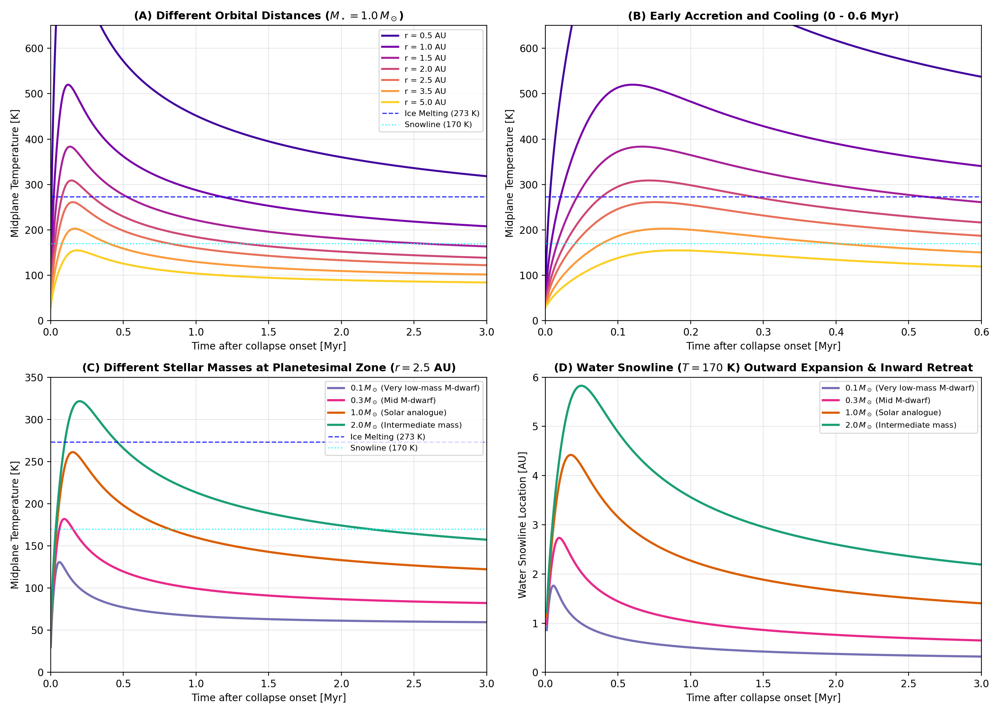

# Surface Radiation and Disk Evolution Validation

This module validates the Stefan-Boltzmann surface radiation boundary condition and ambient protoplanetary disk thermal evolution models.

---

## 1. Stefan-Boltzmann Surface Radiative Boundary

### Governing Formulation
The boundary heat flux between the planetesimal surface and the surrounding disk gas is:

$$F_{\text{rad}} = \epsilon \sigma_{\text{SB}} \left( T_{\text{surf}}^4 - T_{\text{disk}}^4 \right)$$

Linearized as $F_{\text{rad}} = h_{\text{rad}} (T_{\text{surf}} - T_{\text{disk}})$ with:

$$h_{\text{rad}} = \epsilon \sigma_{\text{SB}} \left( T_{\text{surf}}^2 + T_{\text{disk}}^2 \right) \left( T_{\text{surf}} + T_{\text{disk}} \right)$$

At boundary faces, effective harmonic series conductivity couples internal conduction to radiative transfer:

$$k_{\text{interface}} = \frac{2 k_{\text{rock}} h_{\text{rad}} \Delta}{2 k_{\text{rock}} + h_{\text{rad}} \Delta}$$

### Literature Anchors
- **Gerya, T. (2019)**. *Introduction to Numerical Geodynamic Modelling* (2nd ed.). Cambridge University Press.  
  [https://doi.org/10.1017/9781316534243](https://doi.org/10.1017/9781316534243)

### Invariants and Limits
1. **Thermal Equilibrium**: When $T_{\text{surf}} = T_{\text{disk}}$, $F_{\text{rad}} = 0$ exactly.
2. **Directional Heat Transfer**: $T_{\text{surf}} > T_{\text{disk}} \implies F_{\text{rad}} > 0$ (cooling); $T_{\text{surf}} < T_{\text{disk}} \implies F_{\text{rad}} < 0$ (heating).
3. **Harmonic Bounding**: $k_{\text{interface}} \le 2 k_{\text{rock}}$ under arbitrarily intense radiation ($h_{\text{rad}} \to \infty$).
4. **Error Contract and Truncation**: Passing unphysical emissivity ($\epsilon \notin [0, 1]$) throws `DomainError`. Passing non-positive or non-finite absolute temperatures ($T \le 0\text{ K}$) returns $0.0$, which disables radiative coupling without numerical instability.

---

## 2. Protoplanetary Disk Temperature Evolution

The physical foundations of disk accretion heating, flared disk irradiation scaling, cloud infall, and viscous dissipation decay are derived in detail in [Protoplanetary Disk Temperature Evolution](../../explanations/disk_temperature_evolution.md).

Key temperature evolution models validated on this page include:

- **Monotonic Viscous Clearing (`:monotonic`):**
  $$T_{\text{disk}}(t, r, M_\star) = \left[ T_{\text{irr}}^4 + \max(0, T_{\text{peak}}^4 - T_{\text{irr}}^4) \left( 1 + \frac{t}{t_{\text{visc}}} \right)^{-\gamma} \right]^{1/4}$$
- **Two-Stage Accretion Heating (`:class1_to_class2`):**
  $$T_{\text{disk}}(t, r, M_\star) = \left[ T_{\text{eff, irr}}(t)^4 + \max(0, T_{\text{peak}}^4 - T_{\text{irr}}^4) f_{\text{acc}}(t) \right]^{1/4}$$

### Invariants and Limits
1. **Asymptotic Convergence**: For both models, $\lim_{t \to \infty} T_{\text{disk}}(t, r) = T_{\text{irr}}(r)$.
2. **Molecular Cloud Floor**: $T_{\text{disk}} \ge T_{\text{cloud}} = 30.0\text{ K}$ for all radial distances and times.
3. **Viscous Peak Heating**: For Model 2, protostellar irradiation emergence $g_\star(t_{\text{peak}}) = 1 - \exp(-1.25) \approx 0.7135 < 1$ keeps peak midplane temperature $T_{\text{disk}}(t_{\text{peak}}) < T_{\text{peak}}$ when $T_{\text{peak}} > T_{\text{irr}}$.
4. **Snowline Migration**: The water snowline ($T = 170\text{ K}$ for disk sublimation, configurable via `T_sub`; cf. $T_{\text{cond}} = 160\text{ K}$ for pebble accretion condensation) expands outward during accretion peak and retreats inward during viscous clearing.

---

## 3. Parameterization Behavior and Snowline Dynamics

Figure 1 illustrates the operational behavior of the two-stage protoplanetary disk thermal evolution parameterization (`:class1_to_class2`):

*Figure 1: Class C (Analytical / Empirical Reference Formulation): Protoplanetary disk midplane temperature evolution over orbital distances and stellar masses. The curves evaluate analytical disk models in Python (`scripts/generate_disk_temperature_plots.py`). Numerical integration and snowline tracking are verified in `test/test_geometry_radiation.jl`. (a) Thermal history at orbital distances $r \in \{0.5, 1.0, 2.5, 5.0\}\text{ AU}$ around a solar-mass star ($1.0\,M_\odot$), showing early accretion heating rising to peak temperatures followed by viscous clearing decay toward the flared irradiation floor. (b) Midplane temperature profiles for central star masses $M_\star \in \{0.5, 1.0, 2.0\}\,M_\odot$ at $r = 2.5\text{ AU}$. Dotted horizontal lines mark the water snowline ($T = 170\text{ K}$).*

---

## 4. Validation and Provenance Summary

| Attribute | Specification |
|:---|:---|
| **Target Physics / Diagnostic** | Stefan-Boltzmann radiative boundary, protoplanetary disk midplane temperature evolution, and water snowline dynamics |
| **Reference Standard** | Chiang & Goldreich (1997); Drążkowska & Dullemond (2018); Gerya (2019) |
| **Figure Provenance** | Class C (Analytical / Empirical Reference Formulation) |
| **Generating Script** | `scripts/generate_disk_temperature_plots.py` |
| **Automated Verification Test** | `test/test_geometry_radiation.jl` |
| **Quantitative Tolerance** | Analytical temperature profile $T_{\text{disk}}(r, t)$ match $< 10^{-12}$; 2D conduction gradient match $< 1.0\%$ |

---

## 5. Verification Test Suite

- `test/test_geometry_radiation.jl`:
  - `@testset "Stefan-Boltzmann Surface Radiation Physics"`
  - `@testset "Radiative Boundary Application on Staggered Grid"`
  - `@testset "Disk Temperature Model 1: Monotonic Viscous Decay"`
  - `@testset "Disk Temperature Model 2: Cold -> Hot -> Cold (Option 2A)"`
  - `@testset "Water Snowline Dynamics Across Evolutionary Stages"`
