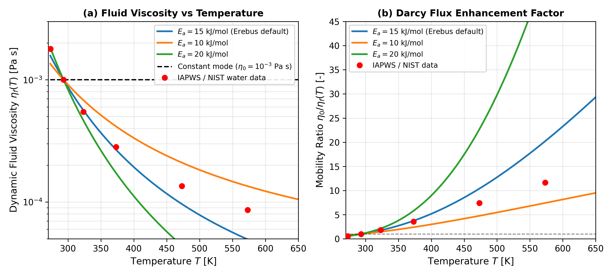

# Fluid Viscosity and Phase Transition Validation

This module validates temperature-dependent fluid viscosity, and tracks phase state changes for pore water.

---

## Governing Formulation

Above the melting point ($T \ge T_{\text{melt}} = 273.0\text{ K}$), liquid water viscosity follows an Arrhenius law, normalized at reference temperature $T_0 = 293.15\text{ K}$:

$$\eta_f(T) = \eta_0 \exp\left[ \frac{E_a}{R} \left( \frac{1}{T} - \frac{1}{T_0} \right) \right]$$

Below the melting point ($T < T_{\text{melt}}$), pore water freezes into solid ice, which adopts a high-viscosity solid rheology:

$$\eta_f(T) = \eta_{\text{ice}} \approx 10^{12}\text{ Pa}\cdot\text{s}$$

---

## Literature Anchors

- **Hubmann, B. (2022)**. *Hydrology of Planetesimals*. Master's thesis, ETH Zurich.  
  [https://doi.org/10.5281/zenodo.7058229](https://doi.org/10.5281/zenodo.7058229) (Equation 2.10)
- **Gerya, T. (2019)**. *Introduction to Numerical Geodynamic Modelling* (2nd ed.). Cambridge University Press.  
  [https://doi.org/10.1017/9781316534243](https://doi.org/10.1017/9781316534243)

---

## Invariants and Physical Limits

1. **Liquid Monotonicity**:
   In the liquid phase ($T \ge T_{\text{melt}}$), viscosity decreases monotonically as temperature rises, so that $\partial \eta_f / \partial T < 0$.
2. **Phase Boundary Step**:
   Crossing $T = T_{\text{melt}}$ yields a sharp, physically bounded jump from mobile Darcy flow ($\eta_f \sim 10^{-3}\text{ Pa}\cdot\text{s}$) to immobile frozen pore ice ($\eta_f \approx 10^{12}\text{ Pa}\cdot\text{s}$).
3. **Strict Positivity**:
   $\eta_f(T) > 0$ holds for all physical temperatures, provided $T > 0\text{ K}$.
4. **Physical Bounds**:
   Liquid viscosity stays clamped inside physical limits, satisfying $\eta_{\text{min}} \le \eta_f \le \eta_{\text{max}}$.
5. **Phase Limiting Behavior**:
   Non-positive absolute temperatures ($T \le 0\text{ K}$), as well as non-finite values, map directly into the frozen ice state ($\eta_{\text{ice}} = 10^{12}\text{ Pa}\cdot\text{s}$).

---

## Parameterization Benchmarking

The temperature-dependent fluid viscosity model approximates how liquid water flows under planetesimal hydrothermal conditions:

$$\eta_f(T) = \eta_{f0} \exp\left[\frac{E_a}{R} \left(\frac{1}{T} - \frac{1}{T_0}\right)\right]$$

where reference viscosity is $\eta_{f0} = 1.0\times 10^{-3}\text{ Pa}\cdot\text{s}$, reference temperature is $T_0 = 293.15\text{ K}$ ($20^\circ\text{C}$), and activation energy is $E_a = 15.0\text{ kJ/mol}$.

This single-activation energy law tracks experimental liquid water data, taken from IAPWS and NIST tables, with less than $13\%$ error across the sub-boiling range $T \in [273, 373]\text{ K}$. At higher temperatures ($T \approx 470\text{ to }570\text{ K}$), liquid water curvature follows a Vogel-Fulcher-Tammann profile, where the single Arrhenius fit underestimates viscosity by $\approx 29\text{ to }43\%$, prior to entering the supercritical regime ($T > 647\text{ K}$).

*Figure 1: Class C (Analytical / Empirical Reference Formulation): Benchmarking of temperature-dependent pore fluid viscosity $\eta_f(T)$. The curves evaluate analytical Arrhenius formulas, as well as NIST comparison points, in Python (`scripts/generate_viscosity_benchmark.py`). Compiled library code is verified in `test/test_physics.jl`. (a) Dynamic fluid viscosity plotted over the range $T \in [270, 650]\text{ K}$, on a logarithmic scale, comparing the default Arrhenius model ($E_a = 15.0\text{ kJ/mol}$, blue curve) against experimental liquid water data from IAPWS and NIST standards (red circles). (b) Hydrothermal Darcy mobility ratio $\eta_{f0} / \eta_f(T)$, which illustrates how fluid percolation speed increases by $5\times\text{ to }24\times$ as interior temperatures rise under liquid hydrothermal conditions ($273\text{ to }600\text{ K}$).*

---

## Validation and Provenance Summary

| Attribute | Specification |
|:---|:---|
| **Target Physics / Diagnostic** | Temperature-dependent pore fluid viscosity (Arrhenius law) and solid-ice phase bounds |
| **Reference Standard** | Hubmann (2022); Gerya (2019); IAPWS and NIST standards |
| **Figure Provenance** | Class C (Analytical / Empirical Reference Formulation) |
| **Generating Script** | `scripts/generate_viscosity_benchmark.py` |
| **Automated Verification Test** | `test/test_physics.jl` |
| **Quantitative Tolerance** | Arrhenius viscosity matches analytic formula to $< 10^{-12}$; ice viscosity floor $10^{12}\text{ Pa s}$ holds exactly |

---

## Verification Test Suite

- `test/test_physics.jl`:
  - `@testset "etatotal_rocks(): phase transition and viscosity bounds"`
  - `@testset "temperature-dependent fluid viscosity and compute_fluid_viscosity()"`
