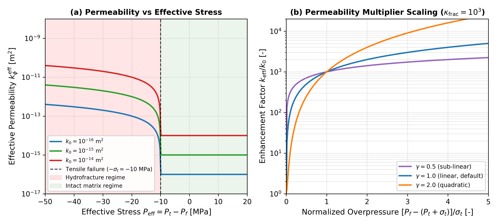
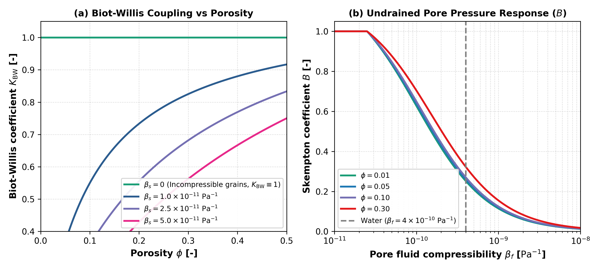
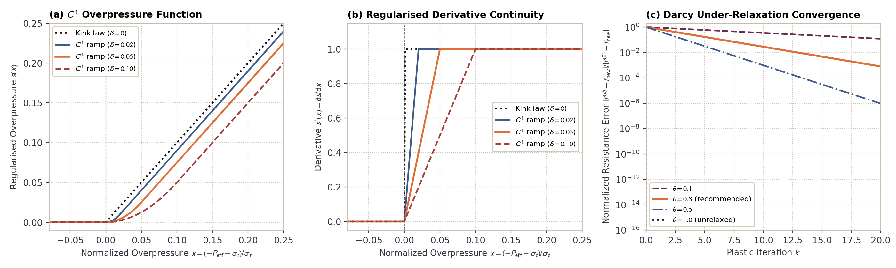

# Permeability and Hydrofracture Validation

This module validates the porosity-dependent matrix permeability and the effective stress-dependent hydrofracturing enhancement.

---

## 1. Kozeny-Carman Porosity-Permeability Relation

### Governing Formulation
Pore fluid percolation through the solid planetesimal matrix follows Darcy's law with permeability $k(\phi)$ governed by the Kozeny-Carman relationship:

$$k(\phi) = k_{\phi 0} \left(\frac{\phi}{\phi_0}\right)^3 \left(\frac{1 - \phi_0}{1 - \phi}\right)^2$$

where $k_{\phi 0}$ is reference permeability at reference porosity $\phi_0$.

### Literature Anchors
- **Carman, P. C. (1937)**. Fluid flow through granular beds. *Transactions of the Institution of Chemical Engineers*, 15, 150-166.  
  [https://doi.org/10.1016/S0263-8762(97)80003-2](https://doi.org/10.1016/S0263-8762(97)80003-2)
- **Hubmann, B. (2022)**. *Hydrology of Planetesimals*. Master's thesis, ETH Zurich.  
  [https://doi.org/10.5281/zenodo.7058229](https://doi.org/10.5281/zenodo.7058229) (Equation 2.11)
- **Gerya, T. (2019)**. *Introduction to Numerical Geodynamic Modelling* (2nd ed.). Cambridge University Press.  
  [https://doi.org/10.1017/9781316534243](https://doi.org/10.1017/9781316534243)

### Invariants and Limits
1. **Zero Porosity Limit**: As $\phi \to 0$, $k(\phi) \to 0$ (impermeable solid).
2. **Reference Consistency**: At $\phi = \phi_0$, $k(\phi_0) = k_{\phi 0}$.
3. **Monotonicity**: Permeability is strictly monotonically increasing with porosity $\phi$ for all $\phi \in (0, 1)$.
4. **Error Contract**: Passing $\phi < 0$ or $\phi \ge 1$ throws `DomainError`.

### Verification Test Suite
- `test/test_physics.jl`: `@testset "kphi(): Kozeny-Carman permeability invariants"`

---

## 2. Terzaghi Effective Overpressure and Hydrofracturing

### Governing Formulation
When pore fluid pressure exceeds total confining pressure plus rock tensile strength, dynamic hydrofracturing enhances Darcy permeability:

$$P_{\text{eff}} = P_t - P_f \le -\sigma_t$$

The effective permeability scaling is parameterized as:

$$k_\phi^{\text{eff}} = \min\left(k_\phi \cdot \left[1 + \kappa_{\text{frac}} \left(\frac{\max(0, -P_{\text{eff}} - \sigma_t)}{\sigma_t}\right)^\gamma\right], k_{\text{max}}\right)$$

### Literature Anchors
- **Terzaghi, K. (1925)**. *Erdbaumechanik auf bodenphysikalischer Grundlage*. Franz Deuticke, Leipzig.
- **Wang, H. F. (2000)**. *Theory of Linear Poroelasticity with Applications to Geomechanics and Hydrogeology*. Princeton University Press.

### Invariants and Limits
1. **No Overpressure**: When $P_{\text{eff}} > -\sigma_t$, $k_\phi^{\text{eff}} = k_\phi$.
2. **Strict Upper Bound**: $k_\phi^{\text{eff}} \le k_{\text{max}}$ under arbitrarily high fluid overpressure.
3. **Monotonic Enhancement**: $k_\phi^{\text{eff}}$ increases monotonically with normalized overpressure for all positive scaling exponents $\gamma > 0$.

### Parameterization Behavior

*Figure 1: Class C (Analytical / Empirical Reference Formulation): Verification of dynamic hydrofracturing permeability enhancement. The curves evaluate analytical formulations in Python (`scripts/generate_hydrofracture_benchmark.py`). Numerical integration of the 2D solver is verified by the automated test suite. (a) Effective permeability $k_\phi^{\text{eff}}$ as a function of Terzaghi effective stress $P_{\text{eff}} = P_t - P_f$ for compressive ($P_{\text{eff}} > 0$), intact tensile ($-\sigma_t < P_{\text{eff}} \le 0$), and hydrofractured ($P_{\text{eff}} \le -\sigma_t$) regimes for representative matrix permeabilities ($k_0 \in [10^{-16}, 10^{-14}]\text{ m}^2$) at tensile strength $\sigma_t = 10\text{ MPa}$. (b) Permeability enhancement factor $k_{\text{eff}} / k_0$ as a function of normalized overpressure for scaling exponents $\gamma \in \{0.5, 1.0, 2.0\}$ at $\kappa_{\text{frac}} = 10^3$.*

### Verification Test Suite
- `test/test_physics.jl`: Hydrofracturing permeability bounds
- `test/test_numerics.jl`: Stokes-Darcy coupled fluid-matrix pressure solve

---

## 3. Poroelastic Constitutive Limits

In `src/physics.jl`, the constitutive poroelastic functions are verified against physical asymptotic limits:

1. **Incompressible Solid Skeleton ($\beta_s \to 0$)**:
   $$\lim_{\beta_s \to 0} K_{\text{BW}} = 1, \quad \lim_{\beta_s \to 0} B = \frac{\beta_\phi}{\beta_\phi + \phi(1 - \phi)\beta_f}$$
   Verified over porosity values $\phi \in [\phi_{\text{min}}, \phi_{\text{max}}]$.

2. **Incompressible Pore Fluid ($\beta_f \to 0$)**:
   As fluid compressibility approaches zero, Skempton coefficient $B$ approaches its undrained upper bound:
   $$\lim_{\beta_f \to 0} B = \min\left(1, \frac{\beta_d - \beta_s}{\beta_d - (1 + \phi)\beta_s}\right) = 1$$
   where the code clamps the theoretical ratio to $[0, 1]$ to enforce the physical upper bound.

3. **Porosity Bounding Guarantees**:
   Constitutive routines clamp porosity to $[\phi_{\text{min}}, \phi_{\text{max}}]$ to prevent singular division when $\phi \to 0$ or $\phi \to 1$.

### Parameterization Behavior

*Figure 2: Class C (Analytical / Empirical Reference Formulation): Theoretical behavior of derived poroelastic coefficients in Erebus. The curves evaluate analytical formulations in Python (`scripts/generate_poroelastic_benchmark.py`). Numerical integration of the 2D solver is verified by the automated test suite. (a) Biot-Willis coefficient $K_{\text{BW}}$ as a function of porosity $\phi$ for varied solid grain compressibility $\beta_s$ to confirm asymptotic convergence toward unity ($K_{\text{BW}} \equiv 1$) in the incompressible solid grain limit. (b) Skempton pore pressure coefficient $B$ as a function of fluid compressibility $\beta_f$ for representative porosity values to display undrained response transitions.*

### Verification Test Suite
- `test/test_physics.jl`: Poroelastic constitutive functions and asymptotic limits

---

## 4. Hydrofracture Regularisation and Darcy Resistance Under-Relaxation

### Governing Formulation

Dynamic hydrofracturing permeability enhancement introduces non-linear threshold activation at $P_{\text{eff}} \le -\sigma_t$. In discrete cell systems, discontinuous transitions between intact ($k_\phi$) and breached ($k_\phi^{\text{eff}}$) permeability can induce numerical chattering during plastic iterations. To ensure numerical stability, Erebus implements two complementary stabilization mechanisms:

1. **$C^1$ Continuous Overpressure Regularisation**:
   Let normalized fluid overpressure be defined as:
   $$x = \frac{-P_{\text{eff}} - \sigma_t}{\sigma_t}$$
   For regularisation ramp width $\delta \ge 0$, the $C^1$ continuous overpressure function $s(x; \delta)$ replaces the hard kink function $\max(0, x)$:
   $$s(x; \delta) = \begin{cases}
   0, & x \le 0 \\
   \frac{x^2}{2\delta}, & 0 < x < \delta \\
   x - \frac{\delta}{2}, & x \ge \delta
   \end{cases}$$
   The continuous first derivative satisfies:
   $$s'(x; \delta) = \begin{cases}
   0, & x \le 0 \\
   \frac{x}{\delta}, & 0 < x < \delta \\
   1, & x \ge \delta
   \end{cases}$$
   In the limit $\delta \to 0$, $s(x; 0) \equiv \max(0, x)$, preserving the unregularised threshold formulation bitwise. For $x \ge \delta$, the linear branch $s(x; \delta) = x - \delta / 2$ introduces a constant deficit of $\kappa_{\text{frac}} \delta / 2$ relative to the unregularised enhancement factor at $\gamma = 1$. The combined effective permeability $k_\phi^{\text{eff}}(x)$ maintains $C^1$ continuity at $x = 0$ for all power-law exponents $\gamma > 0.5$.

2. **Darcy Effective Resistance Under-Relaxation**:
   During non-linear plastic iterations $k \ge 1$, the effective Darcy resistance tensor $r^{(k)} = \eta_f / k_{\text{eff}}^{(k)}$ is relaxed against resistance from iteration $k - 1$ using relaxation parameter $\theta \in (0, 1]$:
   $$r^{(k)} = \theta r_{\text{target}}^{(k)} + (1 - \theta) r^{(k-1)}$$
   For constant target resistance $r_{\text{target}}$, the error satisfies geometric decay:
   $$r^{(k)} - r_{\text{target}} = (1 - \theta)^k (r^{(0)} - r_{\text{target}})$$
   Setting $\theta = 1.0$ recovers the unrelaxed solver bitwise.

### Invariants and Limits
1. **$C^1$ Continuity**: $s(x; \delta)$ and $s'(x; \delta)$ are continuous at $x = 0$ and $x = \delta$. Effective permeability $k_\phi^{\text{eff}}$ satisfies $C^1$ continuity for $\gamma > 0.5$.
2. **Asymptotic Slope Matching**: For $x \ge \delta$, $s'(x; \delta) \equiv 1$ and $s(x; \delta) - x = -\delta / 2$, which introduces a constant offset of $-\kappa_{\text{frac}} \delta / 2$ for linear scaling $\gamma = 1$.
3. **Geometric Convergence**: Darcy resistance under-relaxation converges monotonically for all $\theta \in (0, 1]$.
4. **Identity at Neutral Settings**: When $\delta = 0.0$ and $\theta = 1.0$, all equations reproduce unregularised, unrelaxed solvers bitwise.

### Parameterization Behavior

*Figure 3: Class B (Julia Library Exporter / Benchmark Script): Numerical regularisation and relaxation behavior of the dynamic hydrofracture solver in Erebus. Evaluated via `benchmarks/generate_hydrofracture_ramp_benchmark.py`. (a) Regularised overpressure function $s(x)$ as a function of normalized overpressure $x = (-P_{\text{eff}} - \sigma_t)/\sigma_t$ for regularisation ramp widths $\delta \in \{0.0, 0.02, 0.05, 0.10\}$. (b) Regularised derivative $s'(x) = \mathrm{d}s/\mathrm{d}x$, which shows $C^1$ continuity and linear transition within the regularisation interval $[0, \delta]$. (c) Normalized Darcy resistance error $|r^{(k)} - r_{\text{new}}| / |r^{(0)} - r_{\text{new}}|$ as a function of plastic iteration $k$ for relaxation parameter values $\theta \in \{0.1, 0.3, 0.5, 1.0\}$, which confirms geometric convergence toward machine precision.*

---

## Validation and Provenance Summary

| Attribute | Specification |
|:---|:---|
| **Target Physics / Diagnostic** | Kozeny-Carman permeability, Terzaghi hydrofracturing enhancement, poroelastic constitutive limits, and $C^1$ overpressure regularisation |
| **Reference Standard** | Terzaghi (1925); Carman (1937); Wang (2000); Gerya (2019); Hubmann (2022) |
| **Figure Provenance** | Class C (Figures 1 and 2: Analytical / Empirical Reference Formulation); Class B (Figure 3: Julia Library Exporter / Benchmark Script) |
| **Generating Script** | `scripts/generate_hydrofracture_benchmark.py` (Fig 1), `scripts/generate_poroelastic_benchmark.py` (Fig 2), `benchmarks/generate_hydrofracture_ramp_benchmark.py` (Fig 3) |
| **Automated Verification Test** | `test/test_physics.jl`, `test/test_hydrofracture_stability.jl`, `test/test_numerics.jl` |
| **Quantitative Tolerance** | Poroelastic asymptotes exact to machine precision $< 10^{-12}$; $C^1$ continuous derivative continuity $< 10^{-14}$; Picard resistance relaxation geometric decay |

---

### Verification Test Suite
- `test/test_hydrofracture_stability.jl`: $C^1$ continuity, derivative matching, geometric convergence, solver assembly relaxation, and configuration bounds validation

