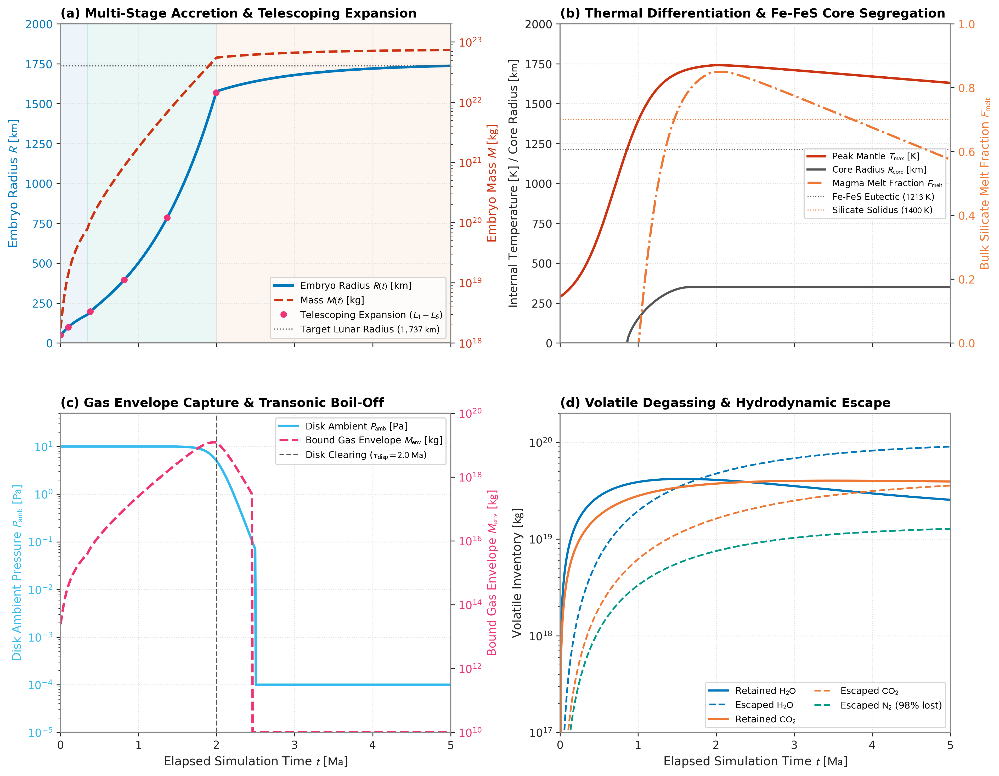

# Tutorial: Growth to Lunar Mass

This flagship tutorial demonstrates modeling the continuous, multi-stage evolution of a planetary embryo from a $50\text{ km}$ planetesimal seed ($M_0 \approx 1.75 \times 10^{18}\text{ kg}$, $\rho_{\text{bulk}} = 3348.0\text{ kg/m}^3$) to a differentiated, lunar-mass body ($R \approx 1{,}737\text{ km}$, $M \approx 7.35 \times 10^{22}\text{ kg}$) in `Erebus.jl`.

The tutorial couples all primary physical modules:
- Multi-stage accretion (`:multistage`: mutual planetesimal collisions $\to$ aerodynamic pebble capture $\to$ late giant impacts)
- Dynamic protoplanetary disk gas dispersal and pebble accretion shut-off
- Telescoping computational mesh coordinate transforms ($50\text{ km} \to 1{,}737\text{ km}$)
- Hydrothermal alteration, multi-phase HCNSPO volatile degassing, and iron redox partitioning
- Protoplanetary disk gas envelope capture and hydrodynamic boil-off
- Coupled 1D semi-grey radiative equilibrium and surface temperature feedback
- Multi-species hydrodynamic crossover escape
- Fe-FeS metallic core segregation and magma ocean crystallization

---

## Physical Overview

Planetary embryo formation links dust coagulation in protoplanetary disks to the assembly of terrestrial planets. An embryo experiences distinct physical regimes as its gravity strengthens:

```text
    Seed (t = 0 Ma)                 Pebble Growth (0.4 - 2 Ma)          Lunar Embryo (t = 5 Ma)
   +----------------+                 +---------------------+           +------------------------+
   |  50 km Seed    |                 |   Telescoping Grid  |           |     1,737 km Body      |
   |  R0 = 50 km    |   =========>    |   Pebble Accretion  |  ======>  |  +------------------+  |
   |  Cold Mixture  |                 |   Gas Envelope      |           |  | Primordial Crust |  |
   |  T = 170 K     |                 |   Fe-FeS Drainage   |           |  | Silicate Mantle  |  |
   +----------------+                 +---------------------+           |  | (Fe-FeS Core)    |  |
                                                                        +--+------------------+--+
```

```math
\begin{aligned}
\text{Initial Seed Mass: } & M_0 = 1.753 \times 10^{18}\text{ kg} \quad (R_0 = 50\text{ km}, \rho_{\text{bulk}} = 3348.0\text{ kg/m}^3) \\
\text{Target Final Mass: } & M_{\text{target}} = 7.35 \times 10^{22}\text{ kg} \quad (R_{\text{target}} = 1{,}737\text{ km}) \\
\text{Orbital Distance: } & a = 1.0\text{ AU} \quad (\tau_{\text{disp}} = 2.0\text{ Ma})
\end{aligned}
```

---

## The Six Evolutionary Epochs

### 1. Early Planetesimal Accretion (Safronov Collisional Regime)

Growth starts with mutual collisions among planetesimals in the protoplanetary disk. For bodies smaller than the pebble accretion onset mass ($M < M_{\text{onset}}$), aerodynamic gas drag does not decelerate drifting pebbles within the Hill or Bondi sphere. Growth proceeds via gravitational cross-section focusing (Safronov 1972):

```math
\dot{M}_{\text{coll}} = \pi R^2 \Sigma_{\text{pl}} \Omega_K \left(1 + \frac{2 G M}{R \sigma_v^2}\right)
```

where $\Sigma_{\text{pl}}$ is the planetesimal swarm surface density, $\Omega_K$ is the Keplerian frequency, and $\sigma_v$ is the velocity dispersion.

### 2. Aerodynamic Pebble Accretion Onset and Growth

When the planetesimal exceeds the aerodynamic onset mass (Visser & Ormel 2016):

```math
M_{\text{onset}} \approx \frac{\eta^3 v_K^3 \text{St}}{G \Omega_K}
```

aerodynamic gas drag dissipates pebble orbital kinetic energy during flybys. The embryo enters Stage 2 runaway pebble accretion (Ormel & Klahr 2010; Lambrechts & Johansen 2012). At small mass, pebbles settle within the aerodynamic Bondi radius $R_B = G M / v_{\text{rel}}^2$, where $v_{\text{rel}}$ is the relative velocity between pebbles and the embryo. In contrast, atmospheric gas capture (Section 3) is governed by thermal Bondi capture $R_{B,\text{gas}} = G M / c_s^2$, defined with the local sound speed $c_s$. As mass increases past $M_{\text{trans}} \approx \sqrt{1/3} v_{\text{rel}}^3 / (G \Omega_K)$, the accretion radius transitions to the Hill regime $R_H \text{St}^{1/3}$.

### 3. Protoplanetary Disk Gas Envelope Capture

The deepening gravity captures ambient nebular gas, forming a bound isothermal gas envelope:

```math
R_{\text{capt}} = \min(R_B, R_H)
```

Advective shear and convective recycling exchange envelope gas with the background disk on orbital timescales (Ormel et al. 2015):

```math
M_{\text{env}} = \min\left(M_{\text{iso}}, f_{\text{rec}} \frac{4\pi}{3} R_{\text{capt}}^3 \rho_{\text{disk}}\right)
```

where $f_{\text{rec}} \approx 0.10$ is the convective replenishment reduction factor.

### 4. Hydrothermal Alteration, Volatile Degassing, and Redox Evolution

Radioactive decay ($^{26}\text{Al}$ and $^{60}\text{Fe}$) heats the interior past water ice melting ($273\text{ K}$) and silicate serpentine dehydration ($550\text{ to } 700\text{ K}$):
- Liquid pore water drives Darcy hydrothermal circulation.
- High pore fluid pressures trigger hydraulic fracturing and volatile venting.
- Magma ocean formation enables multi-species volatile solubility and exsolution ($\text{H}_2\text{O}, \text{CO}_2, \text{CO}, \text{CH}_4, \text{N}_2, \text{NH}_3, \text{H}_2\text{S}$).
- Iron redox equilibrium ($f\text{O}_2 \sim \text{IW}-2$ to $\text{IW}-1$) partitions siderophile and volatile species between mantle silicates and liquid metal.

### 5. Disk Dispersal and Transonic Hydrodynamic Boil-Off

At epoch $t = \tau_{\text{disp}} = 2.0\text{ Ma}$, photoevaporation and stellar accretion disperse the disk gas ($w_{\text{disp}} \to 1$). Pebble surface density scales with the gas fraction ($\Sigma_{\text{peb}}(t) \propto 1 - w_{\text{disp}}$); Stokes drag ceases in space vacuum, which terminates pebble accretion. Simultaneously, ambient pressure drops from $10\text{ Pa}$ to the interplanetary vacuum ($10^{-4}\text{ Pa}$). The rapid decompression drives sonic hydrodynamic boil-off of the captured envelope:

```math
\dot{M}_{\text{boil}} = \frac{\max(0, M_{\text{env}} - M_{\text{env,target}})}{\tau_{\text{boil}}}
```

### 6. Late Giant Impacts, Core Segregation, and Hydrodynamic Escape

Following gas disk clearing, accretion transitions to mutual embryo and planetesimal collisions in a gas-free environment (Stage 3). Fe-FeS liquid drains through solid silicates via Darcy percolation ($F_{\text{silicate}} \le 0.50$) and Stokes settling in the magma ocean ($F_{\text{silicate}} \ge 0.40$), assembling a central metallic core ($R_{\text{core}} \approx 350\text{ km}$). Concurrently, EUV-driven hydrodynamic crossover escape selectively depletes light volatiles ($\text{H}_2, \text{N}_2$) while retaining heavier constituents ($\text{CO}_2, \text{H}_2\text{O}$).

---

## Benchmark Evolution Figures

The figure below shows the synthesized multi-stage evolutionary sequence computed for the lunar growth configuration:



*Figure 1: Analytical multi-stage evolutionary sequence from a 50 km planetesimal seed to a 1,737 km lunar embryo. Panel (a) shows analytical radius and mass trajectories across the three accretion regimes (Safronov, pebble settling, and late giant impacts), along with telescoping grid doubling events (L1 through L6). Panel (b) illustrates thermal heating, Fe-FeS core segregation reaching a 350 km core, and magma ocean melt fraction. Panel (c) displays protoplanetary disk ambient pressure decay and gas envelope boil-off during disk dispersal at 2.0 Ma. Panel (d) traces cumulative retained versus escaped volatile inventories under hydrodynamic crossover escape.*

---

## Computational Architecture: Telescoping Mesh Expansion

Modeling growth from $R = 50\text{ km}$ to $R = 1{,}737\text{ km}$ on a static Cartesian grid would cause the expanding planetary surface to hit domain boundaries.

`Erebus.jl` solves this using telescoping coordinate transformations:
1. When embryo radius exceeds the threshold fraction of the current domain radius:
```math
R(t) \ge r_{\text{threshold\_fraction}} \cdot r_{\text{max\_domain}} \quad (r_{\text{threshold\_fraction}} = 0.70)
```
2. The domain dimensions double ($L_{k+1} = 2 L_k$):
   - Level 0: $140\text{ km} \times 140\text{ km}$ (seed $R_0 = 50\text{ km}$)
   - Level 1: $280\text{ km} \times 280\text{ km}$
   - Level 2: $560\text{ km} \times 560\text{ km}$
   - Level 3: $1{,}120\text{ km} \times 1{,}120\text{ km}$
   - Level 4: $2{,}240\text{ km} \times 2{,}240\text{ km}$
   - Level 5: $4{,}480\text{ km} \times 4{,}480\text{ km}$ ($r_{\text{max}} = 2{,}240\text{ km}$, threshold $1{,}568\text{ km}$)
   - Level 6: $8{,}960\text{ km} \times 8{,}960\text{ km}$ (contains full $1{,}737\text{ km}$ lunar embryo)
3. Interior markers and physical fields ($T, P, P_f, \phi, X_{\text{Fe}}$) are conserved identically under the coordinate affine scaling $x' = (x - x_c)/2 + x_c$. New exterior cells receive sticky-air boundary conditions.

---

## Configuration Walkthrough

The configuration file `configs/lunar_growth_tutorial.toml` specifies all physical parameters:

```toml
[grid]
xsize = 140000.0        # Initial horizontal domain [m] (expands via telescoping)
ysize = 140000.0        # Initial vertical domain [m]
Nx = 33                  # Grid resolution in x
Ny = 33                  # Grid resolution in y

[geometry]
rplanet = 50000.0       # Initial seed radius [m] (50 km)
rcrust = 50000.0        # Crust radius [m]
xcenter = 70000.0       # Domain center [m]
ycenter = 70000.0

[accretion]
active = true
mode = "multistage"
stage1_mode = "safronov"
stage2_mode = "pebble_auto"
stage3_mode = "safronov"
M_initial = 1.753e18    # 50 km seed mass [kg] at 3348 kg/m^3
M_target = 7.35e22      # Lunar mass [kg]
R_initial = 50000.0     # 50 km radius [m]
R_target = 1737000.0    # 1,737 km lunar radius [m]
rho_bulk = 3348.0       # Bulk embryo density [kg/m^3]
Sigma_pl_0 = 100.0      # Planetesimal surface density [kg/m^2]
Sigma_peb_0 = 50.0      # Pebble surface density [kg/m^2]
stokes_number = 0.05    # Aerodynamic Stokes number
transition_smoothing = true
transition_width = 0.10

[telescoping]
active = true
r_threshold_fraction = 0.70
max_telescope_levels = 6
target_radius = 1737000.0

[disk]
enabled = true
dispersal_active = true
t_dispersal_myr = 2.0   # Disk gas clearing epoch [Ma]
dt_dispersal_myr = 0.10 # Transition duration [Ma]
p_amb_disk = 10.0       # Nebular midplane pressure [Pa]
p_amb_space = 1.0e-4    # Interplanetary space vacuum [Pa]

[atmosphere]
active = true
mode = "guillot"
tau_boil = 3.15576e11   # 10 kyr characteristic boil-off timescale [s]
f_rec = 0.10
crossover_active = true
b_diff_ref = 1.0e21

[coreformation]
percolation_active = true
settling_active = true
Xfe_bulk = 0.015

[melting]
active = true
```

---

## Running the Simulation

Load the configuration and execute the simulation in Julia:

```julia
using Erebus

# Load and validate tutorial configuration
cfg = load_config("configs/lunar_growth_tutorial.toml")
validate_config(cfg)

# Run coupled simulation
# A standard demonstration run executes in 5 to 15 minutes on a modern workstation
simulation_loop(cfg; output_path="output_lunar_growth")
```

To run from the command line:

```bash
julia --project=. -t 4 -e '
using Erebus
cfg = load_config("configs/lunar_growth_tutorial.toml")
simulation_loop(cfg; output_path="output_lunar_growth")
'
```

---

## Inspecting Checkpoint Outputs

Output checkpoints are saved as `output_lunar_growth/output_XXXXX.jld2`. Inspect physical state variables:

```julia
using JLD2

data = JLD2.load("output_lunar_growth/output_00010.jld2")

# Current planetary radius and mass
r_planet = data["rplanet"]
m_planet = data["M_planet_val"]
println("Embryo Radius: $(r_planet / 1e3) km")
println("Embryo Mass:   $(m_planet) kg")

# Current telescoping level and domain size
telescope_level = data["telescope_level"]
domain_size_km = data["xsize"] / 1e3
println("Telescope Level: $telescope_level (Domain: $domain_size_km km)")

# Peak internal temperature and melt fraction
max_T = maximum(data["tk2"])
println("Peak Mantle Temperature: $(round(max_T, digits=1)) K")
```

---

## References

- Alexander, C. M. O'D. et al. (2012). The Provenance of Carbonaceous Chondrites. *Science*, 337(6095), 721-723. [doi:10.1126/science.1223474](https://doi.org/10.1126/science.1223474)
- Guillot, T. (2010). On the Radiative Equilibrium of Irradiated Planetary Atmospheres. *Astronomy & Astrophysics*, 520, A27. [doi:10.1051/0004-6361/200913396](https://doi.org/10.1051/0004-6361/200913396)
- Johansen, A. & Lambrechts, M. (2017). Forming Planets by Pebble Accretion. *Annual Review of Earth and Planetary Sciences*, 45, 359-387. [doi:10.1146/annurev-earth-063016-020226](https://doi.org/10.1146/annurev-earth-063016-020226)
- Lambrechts, M. & Johansen, A. (2012). Rapid Growth of Gas-Giant Cores by Pebble Accretion. *Astronomy & Astrophysics*, 544, A32. [doi:10.1051/0004-6361/201219127](https://doi.org/10.1051/0004-6361/201219127)
- Ormel, C. W. & Klahr, H. H. (2010). The Effect of Gas Drag on the Growth of Protoplanets. Analytical Expressions for the Accretion of Small Bodies in Laminar Disks. *Astronomy & Astrophysics*, 520, A43. [doi:10.1051/0004-6361/201014903](https://doi.org/10.1051/0004-6361/201014903)
- Ormel, C. W., Shi, J.-M., & Kuiper, R. (2015). Hydrodynamics of Embedded Planets' First Atmospheres. II. Rapid Gas Exchange with the Protoplanetary Disk. *Monthly Notices of the Royal Astronomical Society*, 447(4), 3512-3525. [doi:10.1093/mnras/stu2704](https://doi.org/10.1093/mnras/stu2704)
- Safronov, V. S. (1972). *Evolution of the Protoplanetary Cloud and Formation of the Earth and Planets*. NASA TT F-677.
- Visser, R. G. & Ormel, C. W. (2016). On the Onset of Pebble Accretion for Planetesimals. *Astronomy & Astrophysics*, 586, A66. [doi:10.1051/0004-6361/201527361](https://doi.org/10.1051/0004-6361/201527361)
- Zahnle, K. J. & Kasting, J. F. (1986). Mass Fractionation during Transonic Escape and Implications for Planetesimal Atmospheres. *Icarus*, 68(3), 462-480. [doi:10.1016/0019-1035(86)90051-5](https://doi.org/10.1016/0019-1035(86)90051-5)
