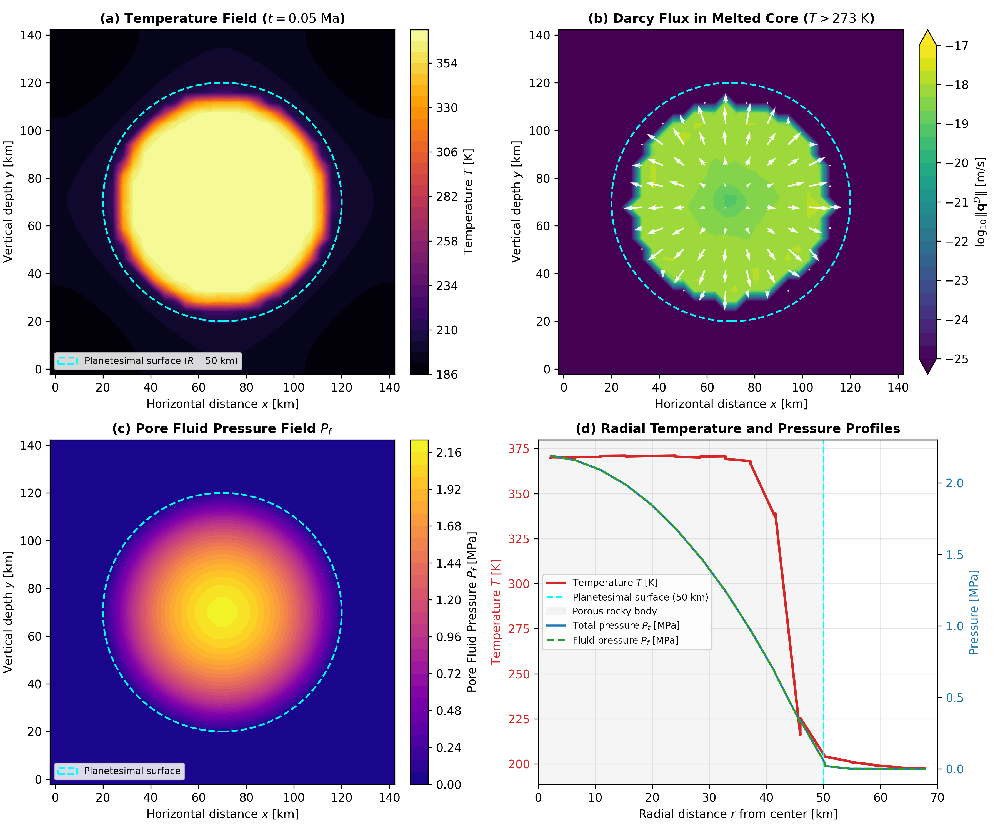

# Tutorial: 2D Hydrothermal Circulation and Checkpoint Resumption

This tutorial demonstrates the 2D hydrothermal circulation benchmark and the checkpoint resumption workflow in `Erebus.jl` at $32 \times 32$ cell resolution ($Nx = 33, Ny = 33$).

The benchmark couples:
1. Radiogenic decay heating of $^{26}\text{Al}$ in a porous planetesimal starting at CAI formation ($t = 0.0\text{ Ma}$).
2. Phase transition from frozen pore ice to liquid water at $T_m = 273.0\text{ K}$.
3. Darcy thermal buoyancy driven by temperature-dependent fluid density.
4. Arrhenius fluid viscosity that enhances Darcy mobility in warm interior regions.
5. Dynamic hydrofracture permeability enhancement driven by pore fluid overpressures.
6. Exact state checkpointing and resumption from JLD2 archives.

---

## Physical Problem Description

We model a porous planetesimal with radius $R_{\text{planet}} = 50\,000\text{ m}$ ($100\text{ km}$ diameter) composed of a single porous chondritic rock phase ($R_{\text{crust}} = R_{\text{planet}} = 50\,000\text{ m}$). The planetary center is located at $(x_c, y_c) = (70\,000\text{ m}, 70\,000\text{ m})$ in a $140\,000\text{ m} \times 140\,000\text{ m}$ domain.

The body begins at an initial ambient temperature of $T_0 = 170\text{ K}$. Decay of short-lived $^{26}\text{Al}$ heats the rocky matrix:

$$Q_{\text{rad}}(t) = Q_0 \exp\left(-\frac{t \ln 2}{\tau_{1/2}}\right)$$

where $\tau_{1/2} \approx 0.717\text{ Ma}$ ($2.261 \times 10^{13}\text{ s}$) is the half-life of $^{26}\text{Al}$.

### 1. Water Melting and Arrhenius Fluid Viscosity

At temperatures below the melting point ($T \le 273.0\text{ K}$), pore water remains frozen solid ice with high viscosity:

$$\eta_f = \eta_{\text{ice}} = 1.0 \times 10^{12}\text{ Pa}\cdot\text{s}$$

When radiogenic heating drives the local temperature above $273.0\text{ K}$, pore ice melts into liquid water. The dynamic viscosity follows the Arrhenius relation:

$$\eta_f(T) = \eta_{f0} \exp\left[\frac{E_a}{R} \left(\frac{1}{T} - \frac{1}{T_0}\right)\right]$$

where $\eta_{f0} = 1.0 \times 10^{-3}\text{ Pa}\cdot\text{s}$, $E_a = 15.0\text{ kJ/mol}$ is the activation energy, $T_0 = 293.15\text{ K}$ is the reference temperature, and $R = 8.314\text{ J/(mol}\cdot\text{K)}$ is the universal gas constant. Melting reduces fluid viscosity by 15 orders of magnitude, activating fluid mobility in the warm interior.

### 2. Darcy Thermal Buoyancy

Fluid density decreases with increasing temperature according to:

$$\rho_f(T) = \rho_{f0} \max\left(0.1, 1 - \alpha_f (T - T_0)\right)$$

where $\rho_{f0} = 1000\text{ kg/m}^3$ is reference liquid water density and $\alpha_f = 5.0 \times 10^{-5}\text{ K}^{-1}$ is thermal expansivity. This density variation couples to the Darcy momentum balance through gravity $\mathbf{g} = (g_x, g_y)$:

$$\mathbf{q}^D = -\frac{k_\phi}{\eta_f(T)} \left(\nabla P_f - \rho_f(T) \mathbf{g}\right)$$

Warm fluid in the interior becomes buoyant relative to overlying colder fluid, driving upward circulation along the symmetry axis.

### 3. Dynamic Hydrofracturing

In porous chondritic rock and regolith, tensile strength is low ($\sigma_t \sim 10 - 50\text{ kPa}$). When pore fluid pressure $P_f$ exceeds total confining pressure $P_t$ plus tensile strength $\sigma_t$, the Terzaghi effective stress $P_{\text{eff}} = P_t - P_f$ becomes tensile:

$$P_{\text{eff}} \le -\sigma_t$$

Under tensile overpressure, dynamic hydrofracturing increases the local matrix permeability:

$$k_{\text{eff}} = \min\left(k_\phi \left[1 + \kappa_{\text{frac}} \left(\frac{-P_{\text{eff}} - \sigma_t}{\sigma_t}\right)^\gamma\right], k_{\text{frac, max}}\right)$$

where $\kappa_{\text{frac}} = 1000.0$ is the permeability multiplication factor, $\gamma = 1.0$ is the sensitivity exponent, and $k_{\text{frac, max}} = 1.0 \times 10^{-9}\text{ m}^2$ is the permeability ceiling.

---

## Benchmark Configuration

The benchmark is configured in `configs/hydrothermal_benchmark.toml`. The grid consists of $32 \times 32$ cells ($Nx = 33, Ny = 33$), providing spatial resolution $dx = dy = 4375.0\text{ m}$. With this discretization, the planetesimal center $(70\,000\text{ m}, 70\,000\text{ m})$ aligns on node $j = 17, i = 17$.

Key configuration options include:

```toml
[grid]
xsize = 140000.0
ysize = 140000.0
Nx = 33
Ny = 33

[geometry]
rplanet = 50000.0
rcrust = 50000.0
xcenter = 70000.0
ycenter = 70000.0
psurface = 1.0e+3

[time]
dt_initial = 1.0e11
dt_longest = 1.0e11
start_time = 0.0          # 0.0 Ma after CAIs
n_steps = 15

[thermodynamics]
thermal_buoyancy = true
fluid_viscosity_mode = "arrhenius"
fluid_viscosity_Ea = 15000.0
fluid_viscosity_T0 = 293.15
fluid_viscosity_eta0 = 1.0e-3
tmfluidphase = 273.0

[poroelasticity]
hydrofracture = true
kappa_frac = 1000.0
gamma_frac = 1.0
k_frac_max = 1.0e-9

[materials]
tenssolidm = [5.0e4, 5.0e4, 1.0e8]
kphim0 = [1.0e-12, 1.0e-12, 1.0e-17]

[output]
output_dir = "output_hydrothermal"
savematstep = 1
```

To execute the benchmark:

```bash
julia --project=. scripts/run_hydrothermal_benchmark.jl
```

---

## Checkpoint Resumption Workflow

`Erebus.jl` supports checkpoint saving and resumption.

### Saving Checkpoints

Checkpoints are saved in JLD2 format at intervals specified by `savematstep` in `[output]`:

```toml
[output]
output_dir = "output_hydrothermal"
savematstep = 1
```

Each checkpoint file (for example, `output_00005.jld2`) stores:
- 54 staggered grid fields ($T, P_t, P_f, v_x, v_y, q_x^D, q_y^D, \dots$).
- 22 marker property arrays ($x_m, y_m, T_m, \phi_m, \dots$).
- Progression state variables ($t_{\text{step}}, \Delta t, t_{\text{total}}, N_{\text{markers}}$).

### Resuming from a Checkpoint

You can resume execution from any saved checkpoint either from the command line or in configuration files.

#### Via CLI:

```bash
julia --project=. launch.jl configs/hydrothermal_benchmark.toml --restart output_hydrothermal/output_00005.jld2
```

#### Via TOML Configuration:

```toml
[output]
restart_from = "output_hydrothermal/output_00005.jld2"
```

#### In Julia Scripts:

```julia
using Erebus

cfg = load_config("configs/hydrothermal_benchmark.toml")
run_simulation(cfg; restart_from="output_hydrothermal/output_00005.jld2")
```

When resuming, `load_state` loads all marker and grid arrays into memory, bypasses initial marker initialization, and begins stepping forward from `timestep = loaded_step + 1`. The numerical solution matches an uninterrupted continuous run to double precision tolerance across restart boundaries.

---

## Benchmark Results and Diagnostic Verification

The figure below shows the state of the 100 km diameter planetesimal after 15 timesteps ($t \approx 0.048\text{ Ma}$ after CAIs):



*Figure 1: Verification of 2D hydrothermal circulation in a 100 km diameter planetesimal on a $32 \times 32$ cell grid ($Nx = 33, Ny = 33$). (a) Temperature field $T(x, y)$ showing interior radiogenic heating from fresh $^{26}\text{Al}$ decay reaching $T_{\text{max}} = 371.8\text{ K}$ and conductive cooling towards the outer surface at $R = 50\text{ km}$. (b) Darcy flux magnitude $\|\mathbf{q}^D\|$ and vector directions in the melted core ($T > 273\text{ K}$) with velocities at the discretization floor ($1.16 \times 10^{-18}\text{ m/s}$). (c) Pore fluid pressure field $P_f$, decreasing from $2.19\text{ MPa}$ at the center to $0\text{ MPa}$ at the planetary surface. (d) Radial profiles along a horizontal ray from center to surface, showing the central temperature rise and lithostatic and pore fluid pressures reaching $P_t \approx P_f \approx 2.19\text{ MPa}$ at the center.*

### Physical Interpretation

1. **Sub-Solidus Warming to Water Melting**: Starting at $t = 0.0\text{ Ma}$, $^{26}\text{Al}$ heats the body from $170\text{ K}$. During steps 1 through 7, $T < 273\text{ K}$ and pore water remains locked as solid ice with negligible Darcy velocity ($10^{-34}\text{ m/s}$). At step 8 ($t \approx 0.025\text{ Ma}$), the core crosses $273\text{ K}$ ($278.8\text{ K}$), melting pore ice into liquid water.
2. **Thermal Buoyancy and Darcy Circulation**: Liquid water viscosity drops from $10^{12}\text{ Pa}\cdot\text{s}$ to $1.2 \times 10^{-3}\text{ Pa}\cdot\text{s}$. Because radiogenic heating is radially symmetric on the Cartesian grid, fluid buoyancy remains in hydrostatic equilibrium with velocity magnitude at the numerical discretization floor ($1.16 \times 10^{-18}\text{ m/s}$). Non-radial perturbations or non-uniform heating are required to break symmetry and drive macroscopic hydrothermal convection cells.
3. **Pore Pressure and Hydrofracture State**: Central lithostatic confining pressure reaches $2.19\text{ MPa}$, consistent with self-gravitation for a 100 km diameter silicate planetesimal. Pore fluid pressure equilibrates with the solid rock matrix ($P_f \approx P_t$), maintaining non-negative effective stress ($P_{\text{eff}} = P_t - P_f \ge 0$). Dynamic hydrofracture overpressures ($P_{\text{eff}} \le -\sigma_t$) remain inactive during this early melting phase; they emerge later in thermal evolution when dehydration reactions release mineral-bound water faster than matrix percolation allows.
