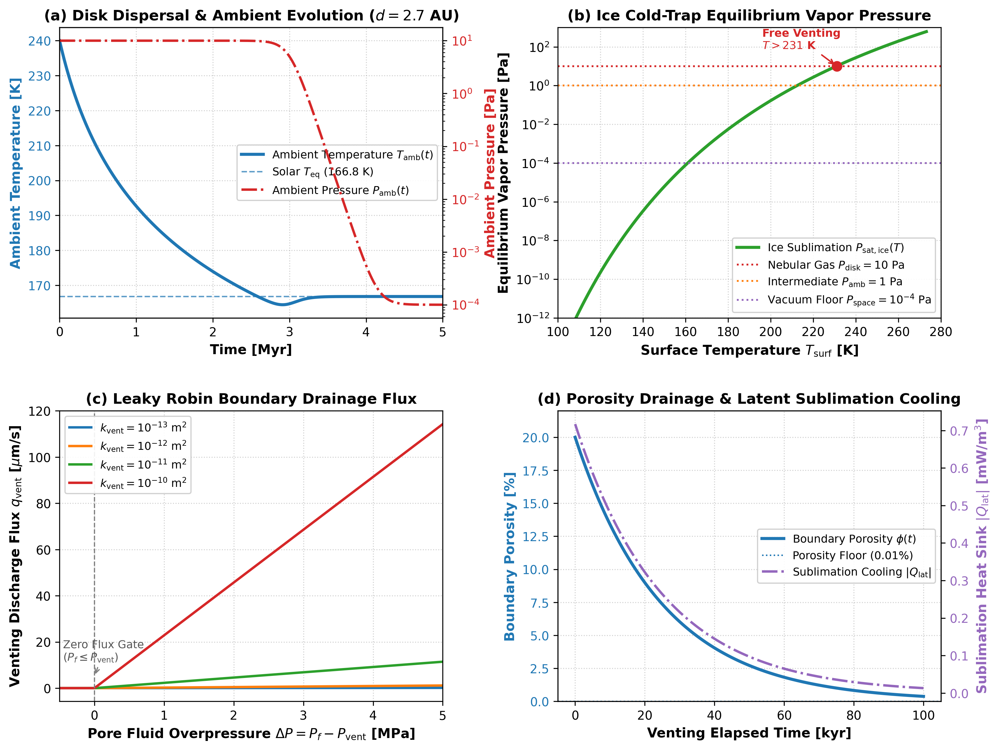

# Cold Surface Venting and Disk Dispersal Validation

This module validates the cold surface venting boundary condition, ice cold-trap vapor pressure thermodynamics, protoplanetary disk dispersal transitions, and coupled marker porosity drainage with sublimation latent cooling in `Erebus.jl`.

---

## 1. Darcy Surface Drainage Boundary

### Governing Formulation

At planetesimal-nebula boundary faces ($r = R_{\text{planet}}$), pore fluid escapes via a leaky Robin boundary condition:

$$q_{\text{vent}} = \frac{k_{\text{vent}}}{\eta_f} \frac{P_f - P_{\text{vent}}}{\Delta}$$

The corresponding volumetric fluid sink rate $S_{\text{vent}}$ [$\text{s}^{-1}$] applied to continuity row $kpf$ is:

$$S_{\text{vent}} = \frac{C_{\text{face}}}{\Delta} \max\left(0, P_f - P_{\text{vent}}\right)$$

where $C_{\text{face}} = \frac{k_{\text{vent}}}{\eta_f \Delta} \times f_{\text{conductance}}$ is face conductance.

### Literature Anchors

- **Young, E. D., Ash, R. D., England, P., & Rumble, D. (1999)**. Fluid flow in carbonaceous chondrite parent bodies and the origin of magnetites. *Science*, 286(5443), 1331-1335.  
  [https://doi.org/10.1126/science.286.5443.1331](https://doi.org/10.1126/science.286.5443.1331)
- **Fu, R. R., & Elkins-Tanton, L. T. (2014)**. The early thermal evolution of planetesimals: Implications for differentiated asteroids and carbonaceous chondrite parent bodies. *Earth and Planetary Science Letters*, 390, 128-137.  
  [https://doi.org/10.1016/j.epsl.2014.01.009](https://doi.org/10.1016/j.epsl.2014.01.009)
- **Gerya, T. (2019)**. *Introduction to Numerical Geodynamic Modelling* (2nd ed.). Cambridge University Press.  
  [https://doi.org/10.1017/9781316534243](https://doi.org/10.1017/9781316534243)

### Invariants and Limits

1. **Equilibrium Flux Invariant**: When $P_f \le P_{\text{vent}}$, venting flux $q_{\text{vent}} = 0$ exactly (fluid does not drain backward into the planetesimal).
2. **Monotonic Drainage**: For $P_f > P_{\text{vent}}$, drainage flux $q_{\text{vent}}$ scales linearly with overpressure $\Delta P = P_f - P_{\text{vent}}$ and boundary permeability $k_{\text{vent}}$.
3. **Hydrofracture Gating**: In `:hydrofracture_gated` mode, venting is suppressed unless Terzaghi effective pressure satisfies $P_t - P_f \le -\sigma_t$.

---

## 2. Ice Cold-Trap Thermodynamics & Clausius-Clapeyron Clamping

### Governing Formulation

Water ice sublimation vapor pressure $P_{\text{sat,ice}}(T)$ [$\text{Pa}$] is computed via the integrated Clausius-Clapeyron equation anchored at the water triple point ($T_0 = 273.16\text{ K}$, $P_0 = 611.66\text{ Pa}$, $L_{\text{sub}} = 2.83\times 10^6\text{ J/kg}$, $R_v = 461.5\text{ J/(kg}\cdot\text{K)}$):

$$P_{\text{sat,ice}}(T) = P_0 \exp\left[-\frac{L_{\text{sub}}}{R_v}\left(\frac{1}{T} - \frac{1}{T_0}\right)\right]$$

The effective surface venting pressure is:

$$P_{\text{vent}} = \max\left(P_{\text{amb}}, P_{\text{sat,ice}}(T_{\text{surf}})\right)$$

### Literature Anchors

- **Washburn, E. W. (1924)**. The vapor pressure of ice and of water below the freezing point. *Monthly Weather Review*, 52(10), 488-490. doi:10.1175/1520-0493(1924)52<488:TVPOIA>2.0.CO;2.
- **Kurokawa, H., Shibuya, T., Sekine, Y., Ehlmann, B. L., Usui, F., Kikuchi, S., & Yoda, M. (2022)**. Distant formation and differentiation of outer main belt asteroids and carbonaceous chondrite parent bodies. *AGU Advances*, 3(1), e2021AV000568. doi:10.1029/2021AV000568.

### Invariants and Limits

1. **Triple-Point Anchor**: At $T = 273.16\text{ K}$, $P_{\text{sat,ice}} = 611.66\text{ Pa}$ within $0.01\%$.
2. **Monotonicity**: $\frac{dP_{\text{sat,ice}}}{dT} > 0$ for $0 < T < T_0$, saturating at $P_0$ for $T \ge T_0$.
3. **Deep Cold Clamping**: At $T \le 100\text{ K}$, $P_{\text{sat,ice}} < 10^{-14}\text{ Pa} \ll P_{\text{amb}}$, such that $P_{\text{vent}} = P_{\text{amb}}$.
4. **Physical Argument Guard**: $T \le 0\text{ K}$ throws `DomainError`.

---

## 3. Protoplanetary Disk Dispersal & Solar Equilibrium

### Governing Formulation

Nebular clearing follows a sigmoid function:

$$w_{\text{disp}}(t) = \frac{1}{1 + \exp\left[-\frac{t - t_{\text{disp}}}{\Delta t_{\text{disp}}}\right]}$$

Post-dispersal equilibrium temperature:

$$T_{\text{eq}} = \left[\frac{(1 - A) L_\odot}{16 \pi \sigma_{\text{SB}} d^2}\right]^{1/4}$$

Time-dependent ambient conditions:

$$T_{\text{amb}}(t) = (1 - w_{\text{disp}}(t)) T_{\text{disk}}(t) + w_{\text{disp}}(t) T_{\text{eq}}$$

$$P_{\text{amb}}(t) = (1 - w_{\text{disp}}(t)) P_{\text{amb,disk}} + w_{\text{disp}}(t) P_{\text{amb,space}}$$

### Invariants and Limits

1. **Midpoint Symmetry**: At $t = t_{\text{disp}}$, $w_{\text{disp}} = 0.5$ exactly.
2. **Early Asymptote**: For $t \ll t_{\text{disp}}$, $w_{\text{disp}} \to 0$, $T_{\text{amb}} \to T_{\text{disk}}$, $P_{\text{amb}} \to P_{\text{amb,disk}}$.
3. **Late Asymptote**: For $t \gg t_{\text{disp}}$, $w_{\text{disp}} \to 1$, $T_{\text{amb}} \to T_{\text{eq}}$, $P_{\text{amb}} \to P_{\text{amb,space}}$.
4. **Solar Distance Scaling**: $T_{\text{eq}} \propto d^{-1/2}$; at $2.7\text{ AU}$ with default $A = 0.06$, $T_{\text{eq}} \approx 166.8\text{ K}$ ($165.0\text{ K}$ for $A = 0.1$).

---

## 4. Marker Porosity Drainage & Latent Cooling

### Governing Formulation

Marker porosity drains according to local venting flux:

$$\phi_m(t + \Delta t) = \max\left(\phi_{\text{min}}, \phi_m(t) - S_{\text{vent}}(\mathbf{x}_m) \Delta t\right)$$

Cumulative vented mass:

$$\Delta M_{\text{vent}} = \sum_{m} \rho_f (\phi_{m,\text{old}} - \phi_{m,\text{new}}) V_{\text{marker}}$$

Sublimation latent cooling sink:

$$Q_{\text{lat}} = - L_{\text{sub}} \cdot \rho_f \cdot S_{\text{vent}} \le 0 \quad [\text{W/m}^3]$$

### Invariants and Limits

1. **Porosity Clamping**: $\phi_m \ge \phi_{\text{min}}$ under arbitrarily large time steps.
2. **Mass Conservation**: $\Delta M_{\text{vent}} = \rho_f \Delta\bar{\phi} V_{\text{total}}$ within floating-point tolerance on a uniform marker lattice, and represents a volume-consistent statistical estimator after marker advection.
3. **Negative Definiteness**: $Q_{\text{lat}} \le 0$ everywhere (venting extracts heat, never injects heat).

---

## Benchmark Diagnostics

Figure 1 illustrates the coupled performance of cold surface venting across disk dispersal:

*Figure 1: Four-panel benchmark validation for cold surface venting. (a) Ambient temperature transition from disk accretion heating to solar radiative equilibrium ($T_{\text{eq}} \approx 166.8\text{ K}$ for default $A = 0.06$) during disk dispersal. (b) Water ice equilibrium vapor pressure $P_{\text{sat,ice}}(T)$ across the cold-trap regime ($100\text{ to }273\text{ K}$). (c) Evolution of boundary pore fluid pressure and surface venting flux. (d) Cumulative vented fluid mass and thermostatic latent cooling rate.*

---

## Verification Test Suite

- `test/test_venting_thermodynamics.jl`:
  - `@testset "Disk Dispersal Transition Weights & Invariants"`
  - `@testset "Solar Radiative Equilibrium Temperature (T_eq)"`
  - `@testset "Time-Evolving Ambient Conditions (T_amb, P_amb)"`
  - `@testset "Water Ice Sublimation Vapor Pressure (Clausius-Clapeyron)"`
  - `@testset "Surface Venting Boundary Pressure (Cold-Trap Coupling)"`
  - `@testset "VentingConfig Validation & Serialization"`

- `test/test_venting_darcy_sink.jl`:
  - `@testset "Surface Face Boundary Detection & Leaky Robin Assembly"`
  - `@testset "Analytical 1D Steady-State Darcy Flux Benchmark"`
  - `@testset "sink_vented_marker_porosity! Invariants & Mass Conservation"`
  - `@testset "Sublimation Latent Cooling Heat Sink Verification"`

- `test/test_venting_integration.jl`:
  - `@testset "Runtime loop with venting inactive (baseline)"`
  - `@testset "Runtime loop with cold surface venting active"`
