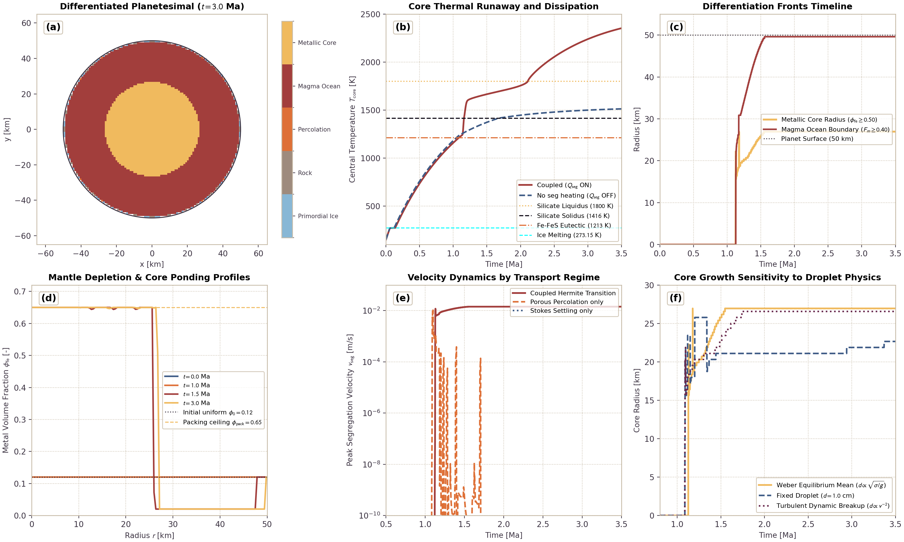
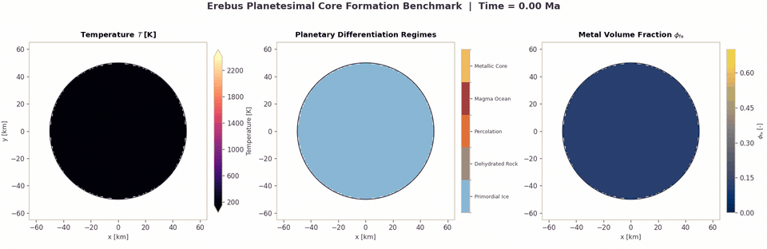

# Iron Core Formation and Metal-Silicate Segregation

This page documents the physical formulation, mathematical limits, and numerical implementation of iron core formation in `Erebus.jl`. The model couples porous Fe-FeS percolation through solid silicate matrices, Stokes droplet settling through silicate magma oceans, segregation dissipation heating, and mass-conservative transport.

---

## 1. Physical Motivation

Early planetary differentiation separates dense metallic iron from lighter silicate rock to form a central metallic core and an overlying silicate mantle. In early Solar System planetesimals, this differentiation is driven by internal decay heating from short-lived radionuclides ($^{26}\text{Al}$ and $^{60}\text{Fe}$).

The Fe-FeS binary system has a low eutectic temperature ($T_{\text{eutectic}} \approx 1213\text{ K}$), melting hundreds of Kelvin below the silicate solidus ($T_{\text{solidus}} \approx 1416\text{ K}$). Metal-silicate segregation operates in two distinct physical regimes:

1. **Porous Percolation Regime ($F_m \le 0.40$)**: In crystalline silicate rock, liquid Fe-FeS melt percolates along mineral grain boundaries under gravity once the liquid metal fraction exceeds the percolation threshold ($\phi_{\text{crit}} \approx 0.05$). The flow is governed by porous Darcy dynamics with Kozeny-Carman permeability.
2. **Magma Ocean Stokes Settling Regime ($F_m \ge 0.50$)**: When silicate melting exceeds the rheological transition threshold ($\phi_{\text{rheo}} \approx 0.40$), the rigid crystalline framework breaks down into a low-viscosity crystal suspension. Dense liquid metal emulsifies into droplets whose diameter is governed by capillary-hydrodynamic balance. Droplets sink rapidly through the magma ocean following Stokes drag with hindered settling corrections.
3. **Continuous Mush Handover**: In the transition mush zone ($F_m \in [0.40, 0.50]$), segregation velocity blends smoothly between porous percolation and droplet settling via a cubic Hermite polynomial.
4. **Dissipation Energetics**: Sinking metal releases gravitational potential energy. This gravitational energy is dissipated as frictional heat, accelerating interior warming and thermal runaway during runaway core formation.
5. **Property Blending**: Bulk density, thermal conductivity, and volumetric heat capacity update dynamically in space as metal migrates toward the planetary center.

---

## 2. Mathematical Formulation

### Metal Melting and Volume Fraction

The local metallic melt fraction $\chi_m(T)$ transitions linearly over a specified melting interval $\Delta T_{\text{metal}}$ above the eutectic temperature $T_{\text{eutectic}}$:

$$\chi_m(T) = \text{clamp}\left(\frac{T - T_{\text{eutectic}}}{\Delta T_{\text{metal}}}, 0, 1\right)$$

The mobile liquid metal volume fraction $\phi_m$ is:

$$\phi_m = \chi_m(T) \cdot X_{\text{fe,bulk}}$$

where $X_{\text{fe,bulk}}$ is the local bulk metal volume fraction on markers.

### Porous Percolation Regime

When the silicate matrix remains predominantly solid ($F_m \le F_{\text{settle,start}}$), liquid metal drains as a porous fluid through interconnected grain edges. Darcy filtration flux is $q_{\text{perc}} = (k_{\text{metal}} / \eta_{\text{metal}}) \Delta\rho g$. The interstitial pore segregation velocity $v_{\text{perc}}$ available for mobile metal transport is:

$$v_{\text{perc}} = \frac{k_{\text{metal}}(\phi_m)}{\phi_m \, \eta_{\text{metal}}} \Delta\rho \, g \left(\frac{\phi_m - \phi_{\text{residual}}}{\phi_m}\right)$$

where $\Delta\rho = \rho_{\text{metal}} - \rho_{\text{silicate}}$ is the density contrast, $\eta_{\text{metal}}$ is the liquid metal dynamic viscosity ($10^{-2}\text{ Pa s}$), and $g$ is local gravitational acceleration. The term $(\phi_m - \phi_{\text{residual}}) / \phi_m$ accounts for the mobile fraction above the residual trapped threshold.

The permeability of the liquid metal network follows the modified Kozeny-Carman power-law:

$$k_{\text{metal}}(\phi_m) = \begin{cases}
0, & \phi_m \le \phi_{\text{crit}} \\
k_{\text{ref}} \left(\frac{\phi_m - \phi_{\text{crit}}}{\phi_0}\right)^n \left(\frac{1 - (\phi_m - \phi_{\text{crit}})}{1 - \phi_0}\right)^{-2}, & \phi_{\text{crit}} < \phi_m < \phi_{\text{pack}}
\end{cases}$$

where $\phi_{\text{crit}}$ is the percolation threshold, $\phi_0$ is the reference porosity ($0.10$ by default, configurable via `phi0`), $k_{\text{ref}}$ is the reference permeability ($10^{-9}\text{ m}^2$), and $n$ is the permeability exponent ($n = 3$). If $\phi_m \le \phi_{\text{residual}}$, flow ceases and residual metal is trapped in matrix pores.

### Magma Ocean Droplet Settling Regime

When silicate melt fraction exceeds $F_{\text{perc,end}}$, the silicate matrix loses macroscopic shear strength. Liquid metal droplets sink through the magma suspension. The terminal Stokes settling velocity of an isolated droplet of radius $r_d$ is:

$$v_{\text{Stokes}} = \frac{2}{9} \frac{\Delta\rho \, g \, r_d^2}{\eta_{\text{silicate}}}$$

where $\eta_{\text{silicate}}$ is the effective melt-weakened viscosity of the surrounding silicate magma.

To account for two-phase fluid interactions, two corrections are applied:

1. **Hadamard-Rybczynski Circulation Factor**: For fluid metal droplets in fluid silicate:
   $$f_{\text{HR}} = \frac{3\eta_{\text{silicate}} + 3\eta_{\text{metal}}}{2\eta_{\text{silicate}} + 3\eta_{\text{metal}}}$$
   When enabled, this factor increases terminal velocity by up to $1.5$ relative to rigid spheres in the inviscid droplet limit ($\eta_{\text{metal}} \ll \eta_{\text{silicate}}$).
2. **Richardson-Zaki Hindered Settling**: Droplet-droplet return flow suppresses settling velocity at finite metal concentration up to the packing ceiling $\phi_{\text{pack}}$:
   $$f_{\text{hindered}} = \left(1 - \frac{\phi_m}{\phi_{\text{pack}}}\right)^m$$
   where $m$ is the hindered settling exponent ($m = 4.5$).

The stable droplet diameter $d_d = 2 r_d$ is evaluated based on `droplet_size_mode`:

- `:fixed`: Uses constant specified diameter $d_d = \text{droplet\_diameter\_fixed}$.
- `:weber_mean`: Gravity-capillary balance balancing interfacial surface tension and gravitational body force:
  $$d_d = \sqrt{\frac{\text{We}_{\text{crit}} \sigma_{\text{metal-silicate}}}{\Delta\rho \, g}}$$
- `:weber_turbulent`: Relative velocity dynamic pressure balance:
  $$d_d = \frac{\text{We}_{\text{crit}} \sigma_{\text{metal-silicate}}}{\rho_{\text{silicate}} v_{\text{rel}}^2}$$

In numerical calculations, $r_d$ is clamped within $[10^{-4}, 0.05]\text{ m}$.

### Continuous Regime Transition

Over the rheological breakdown interval $F_m \in [F_{\text{settle,start}}, F_{\text{perc,end}}]$, the net segregation velocity transitions smoothly using a cubic Hermite polynomial:

$$\xi = \text{clamp}\left(\frac{F_m - F_{\text{settle,start}}}{F_{\text{perc,end}} - F_{\text{settle,start}}}, 0, 1\right)$$

$$w = 3\xi^2 - 2\xi^3$$

$$v_{\text{seg}} = (1 - w) v_{\text{perc}} + w v_{\text{settle}}$$

This guarantees $C^1$ continuity of the velocity field and prevents unphysical numerical shocks.

### Segregation Dissipation Heating

The loss of gravitational potential energy during metal descent is converted into volumetric dissipation heat:

$$Q_{\text{seg}} = \phi_{m,\text{curr}} \Delta\rho \, g \, v_{\text{seg}}$$

where $\phi_{m,\text{curr}} = \chi_m(T) \cdot X_{\text{fe,bulk}}$ is the local molten metal fraction. This volumetric heating rate [$W/\text{m}^3$] is distributed to surrounding grid nodes. In the numerical operator splitting, dissipation heating $Q_{\text{seg}}$ computed at timestep $t$ is added to the thermal right-hand-side vector $HR$ before the energy solve at timestep $t+1$.

### Material Property Blending

As metal migrates, physical properties blend locally based on bulk metal fraction $X_{\text{fe}}$:

- **Density**: Volume-weighted mixture:
  $$\rho = (1 - X_{\text{fe}}) \rho_{\text{silicate}} + X_{\text{fe}} \rho_{\text{metal}}$$
- **Heat Capacity**: Volumetric mixture:
  $$\rho c_p = (1 - X_{\text{fe}}) (\rho c_p)_{\text{silicate}} + X_{\text{fe}} (\rho c_p)_{\text{metal}}$$
- **Thermal Conductivity**: Volume-weighted arithmetic mixture (standard in simulation loop):
  $$k = (1 - X_{\text{fe}}) k_{\text{silicate}} + X_{\text{fe}} k_{\text{metal}}$$

---

## 3. Discretization and Mass Conservation

Metal segregation is solved on the Eulerian grid using a finite-volume drift-flux formulation.

### Local CFL Subcycling

The Stokes-Darcy hydrodynamic timestep $\Delta t_{\text{hydro}}$ is typically governed by silicate convection and thermal diffusion ($\sim 10^3\text{ yr}$). Settling velocities in low-viscosity magma can produce local Courant numbers exceeding unity. To maintain explicit stability, the segregation solver executes adaptive subcycling:

$$\Delta t_{\text{CFL}} = \text{cfl} \cdot \min_{i,j} \left( \frac{\Delta x}{|v_{x,\text{seg}}|}, \frac{\Delta y}{|v_{y,\text{seg}}|} \right)$$

$$N_{\text{sub}} = \min\left( \left\lceil \frac{\Delta t_{\text{hydro}}}{\Delta t_{\text{CFL}}} \right\rceil, N_{\text{max}} \right)$$

$$\Delta t_{\text{sub}} = \frac{\Delta t_{\text{hydro}}}{N_{\text{sub}}}$$

### Multi-Dimensional Flux Limiters and Marker Capacity Redistribution

To guarantee strict non-negativity and prevent exceeding maximum packing fraction $\phi_{\text{pack}}$ on 2D staggered grids:

1. **Outflow Limiter**: For cell $(i, j)$ donating metal across horizontal and vertical faces, total face outflow $Out_{\text{total}} = \sum \Phi_{\text{out}} \Delta t_{\text{sub}}$ must not exceed available metal mass $m_{\text{avail}}$. All outward fluxes are scaled by $\alpha_{\text{out}} = \min(1.0, m_{\text{avail}} / Out_{\text{total}})$.
2. **Inflow Limiter**: Total incoming flux $In_{\text{total}} = \sum \Phi_{\text{in}} \Delta t_{\text{sub}}$ must not exceed available pore capacity $m_{\text{cap}} = (\phi_{\text{pack}} - \phi_m) V_{\text{cell}} \cdot n_m$. All inward fluxes are scaled by $\alpha_{\text{in}} = \min(1.0, m_{\text{cap}} / In_{\text{total}})$.
3. **Capacity-Weighted Marker Update**: When net cell mass changes are distributed back to markers, markers in cells gaining metal receive increments proportional to their remaining room below $\phi_{\text{pack}}$. Markers in cells losing metal scale proportionally. This guarantees that individual markers never violate $[0, \phi_{\text{pack}}]$, even with non-uniform initial distributions.

### Machine-Precision Conservation

Provided all initial marker bulk metal fractions satisfy $0 \le X_{\text{fe,bulk}} \le \phi_{\text{pack}}$, after subcycled finite-volume transport, any floating-point truncation residual is corrected via a uniform, bounded mass correction over eligible interior planet markers below the packing ceiling $\phi_{\text{pack}}$. The global relative mass error satisfies:

$$\frac{|M_{\text{metal}}(t) - M_{\text{metal}}(0)|}{M_{\text{metal}}(0)} < 10^{-12}$$

in the drift-flux solver, and $< 10^{-10}$ in coupled multi-physics simulation loops.

---

## 4. Planetesimal Core Formation Benchmark Suite

The core formation benchmark simulates a 50 km radius planetesimal over 3.5 Ma of early solar system evolution. The benchmark starts from a completely homogeneous, cold primordial mixture of water ice ($\phi_{\text{ice}} = 0.30$), metallic iron ($\phi_{\text{fe}} = 0.12$), and silicate rock matrix ($\phi_{\text{rock}} = 0.58$) throughout the entire body at $T = 150\text{ K}$.

### Physical Differentiation Timeline

The planetesimal differentiates in four sequential stages driven by $^{26}\text{Al}$ radioactive decay in the rock component:

1. **Primordial Homogeneous Accretion ($t = 0\text{ Ma}$)**: The body starts completely cold ($T = 150\text{ K}$) and uniformly icy throughout its entire volume.
2. **Pore Ice Melting and Rock Desiccation ($t \approx 0.3 - 0.8\text{ Ma}$)**: Radioactive decay warms the interior above 273.15 K. Pore ice melts in the interior and dehydrates the rock, while surface conductive cooling maintains a cold outer lid ($T < 273.15\text{ K}$) where primordial ice is preserved dynamically.
3. **Porous Fe-FeS Percolation ($t \approx 1.0 - 1.4\text{ Ma}$)**: Interior temperatures reach the Fe-FeS eutectic ($T_{\text{eutectic}} = 1213\text{ K}$). Molten metallic alloy exceeds the percolation threshold ($\phi_{\text{crit,perc}} = 0.05$) and drains inward through crystalline silicate pores.
4. **Magma Ocean Stokes Settling and Core Ponding ($t \approx 1.5 - 3.5\text{ Ma}$)**: Silicate melting crosses the solidus ($1416\text{ K}$) and reaches the rheological breakdown threshold ($F_m \ge 0.40$). Dense liquid metal droplets settle rapidly through the low-viscosity magma suspension. Droplets pond at the planetary center to form a segregated metallic core of radius $\approx 27\text{ km}$ at maximum packing ($\phi_{\text{pack}} = 0.65$), capped by an iron-depleted silicate mantle ($\phi_{\text{fe}} = 0.02$) and an outer primordial icy crust.

### Benchmark Results

The multi-panel summary figure illustrates the critical physical mechanisms:

- **(a) Differentiated Body Map ($t = 3.0\text{ Ma}$)**: 2D Cartesian slice showing the segregated central iron core (gold), surrounded by an iron-depleted silicate mantle (red), and preserved cold primordial crust (blue).
- **(b) Core Thermal Runaway**: Shows central temperature evolution $T_{\text{core}}(t)$. Gravitational dissipation heating ($Q_{\text{seg}}$ ON) releases potential energy as metal settles, boosting peak core temperatures above the case without dissipation heating ($Q_{\text{seg}}$ OFF).
- **(c) Differentiation Fronts Timeline**: Traces the radial expansion of the metallic core boundary ($\phi_{\text{fe}} \ge 0.50$, reaching $27\text{ km}$) and the magma ocean boundary ($F_m \ge 0.40$).
- **(d) Radial Metal Concentration Profiles**: Shows $\phi_{\text{fe}}(r)$ at $t = 0.0, 1.0, 1.5,$ and $3.0\text{ Ma}$. Bulk iron begins uniformly at $0.12$, depletes to the residual threshold $0.02$ in the mantle, and ponds up to $\phi_{\text{pack}} = 0.65$ in the central core.
- **(e) Transport Regime Comparison**: Compares segregation velocities for three configurations: porous percolation only (slow, $\sim 10^{-7}\text{ m/s}$), Stokes droplet settling only, and the coupled Hermite transition model.
- **(f) Droplet Size Physics Sensitivity**: Compares core radius growth for constant droplet diameter ($1.0\text{ cm}$), Weber equilibrium balance ($d \propto \sqrt{\sigma / g}$), and dynamic turbulent breakup ($d \propto v^{-2}$).

### 2D Simulation Video

The animation below displays the 2D Cartesian revolved core formation benchmark over 3.5 Ma starting from a completely uniform icy mixture. The panels display internal temperature with phase boundaries (left), compositional differentiation regimes (center), and bulk metal volume fraction $\phi_{\text{fe}}$ (right).

A high-framerate MP4 video is available at `../assets/core_formation_differentiation.mp4`.

---

## 5. Literature Anchors

- **Yoshino, T., Walter, M. J., & Katsura, T. (2003)**. Core formation in planetesimals triggered by permeable flow. *Nature*, 422(6928), 154-157.  
  [https://doi.org/10.1038/nature01524](https://doi.org/10.1038/nature01524)
- **Rubie, D. C., Melosh, H. J., Reid, J. E., Liebske, C., & Righter, K. (2003)**. Mechanisms of metal-silicate equilibration in the terrestrial magma ocean. *Earth and Planetary Science Letters*, 205(3-4), 239-255.  
  [https://doi.org/10.1016/S0012-821X(02)01044-0](https://doi.org/10.1016/S0012-821X(02)01044-0)
- **Monteux, J., Ricard, Y., Coltice, N., Dubuffet, F., & Aguilar, M. (2009a)**. A model of metal-silicate separation on growing planets. *Geophysical Journal International*, 179(1), 515-526.  
  [https://doi.org/10.1111/j.1365-246X.2009.04321.x](https://doi.org/10.1111/j.1365-246X.2009.04321.x)
- **Monteux, J., Jellinek, A. M., & Buffett, B. A. (2009b)**. Heating of the early Earth by core formation: Physical mechanisms and thermal impact. *Journal of Geophysical Research*, 114(B6), B06404.  
  [https://doi.org/10.1029/2008JB006166](https://doi.org/10.1029/2008JB006166)
- **Deguen, R., Olson, P., & Cardin, P. (2011)**. Experiments on turbulent metal-silicate mixing in a magma ocean. *Earth and Planetary Science Letters*, 310(3-4), 303-313.  
  [https://doi.org/10.1016/j.epsl.2011.08.019](https://doi.org/10.1016/j.epsl.2011.08.019)
- **Deguen, R., Landeau, M., & Olson, P. (2014)**. Turbulent metal-silicate mixing, fragmentation, and equilibration in magma oceans. *Earth and Planetary Science Letters*, 391, 274-287.  
  [https://doi.org/10.1016/j.epsl.2014.01.034](https://doi.org/10.1016/j.epsl.2014.01.034)
- **Rubie, D. C., Nimmo, F., & Melosh, H. J. (2015)**. Formation of Earth's Core. In *Treatise on Geophysics* (2nd ed., Vol. 9, pp. 43-79). Elsevier.  
  [https://doi.org/10.1016/B978-0-444-53802-4.00152-4](https://doi.org/10.1016/B978-0-444-53802-4.00152-4)
- **Lichtenberg, T., Golabek, G. J., Burn, R., Meyer, M. R., Alibert, Y., Gerya, T. V., & Mordasini, C. (2019)**. A water budget dichotomy of rocky protoplanets from 26Al-heating. *Nature Astronomy*, 3(4), 307-313.  
  [https://doi.org/10.1038/s41550-018-0688-5](https://doi.org/10.1038/s41550-018-0688-5)
- **Richardson, J. F., & Zaki, W. N. (1954)**. Sedimentation and fluidisation: Part I. *Transactions of the Institution of Chemical Engineers*, 32, 35-53.
- **Taylor, G. I. (1934)**. The formation of emulsions in definable fields of flow. *Proceedings of the Royal Society of London. Series A*, 146(858), 501-523.  
  [https://doi.org/10.1098/rspa.1934.0169](https://doi.org/10.1098/rspa.1934.0169)
