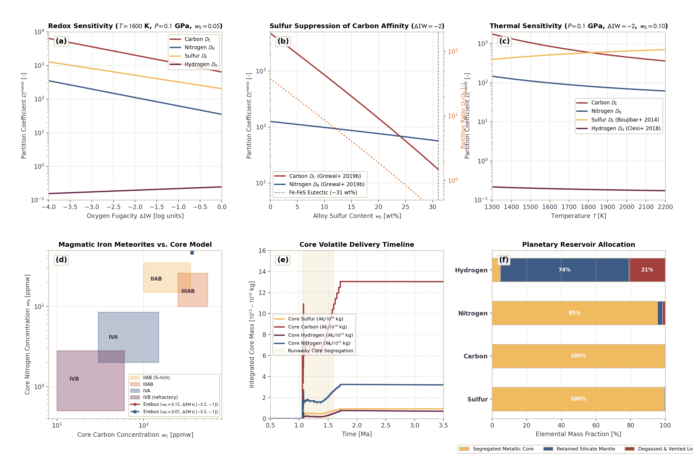

# Metal-Silicate Volatile Partitioning and Core Geochemistry

This page documents the physical formulation, thermodynamic parameterizations, and numerical validation of metal-silicate volatile partitioning during iron core formation in `Erebus.jl`. The model couples empirical partition coefficients $D_i^{\text{met/sil}}$ for H, C, N, and S with local phase equilibration, dynamic sulfur density feedback, and conservative advective transport.

---

## 1. Physical Motivation

Volatile elements (hydrogen, carbon, nitrogen, and sulfur) play a decisive role in determining the planetary atmospheric budget, internal oxidation state, and long-term habitability of differentiated rocky worlds. During early planetesimal differentiation, metallic iron-nickel-sulfur liquids separate from coexisting silicate melts. Siderophile ("metal-loving") and chalcophile ("sulfur-loving") volatiles preferentially dissolve into the descending metallic liquid, sequestering volatile inventories into the planetesimal core.

Magmatic iron meteorites (such as groups IIAB, IIIAB, IVA, and IVB) represent the fragmented metallic cores of differentiated planetesimals accreted in the first few million years of Solar System history. Geochemical analyses of these meteorites demonstrate distinct volatile signatures:

1. **Group IIAB**: Formed in sulfur-rich parent bodies ($w_S \approx 10 - 17\text{ wt}\%$). They exhibit relatively low carbon concentrations ($100 - 350\text{ ppmw}$) despite chondritic precursors, producing sub-chondritic $(C/N)_{\text{metal}}$ ratios.
2. **Group IIIAB**: Formed at moderate sulfur contents ($w_S \approx 5 - 10\text{ wt}\%$), displaying intermediate carbon ($250 - 550\text{ ppmw}$) and nitrogen ($10 - 25\text{ ppmw}$) contents.
3. **Group IVA**: Highly depleted in sulfur ($w_S \approx 1 - 2.5\text{ wt}\%$) and moderately depleted in other volatiles ($C \approx 30 - 150\text{ ppmw}$, $N \approx 2 - 8\text{ ppmw}$).
4. **Group IVB**: Extremely refractory and volatile-poor ($w_S < 0.5\text{ wt}\%$, $C < 60\text{ ppmw}$, $N < 3\text{ ppmw}$); these concentrations indicate high-temperature condensation or early catastrophic degassing.

A realistic geochemical model of core formation must reproduce these geochemical patterns, specifically capturing how dissolved sulfur in metallic liquid alters the chemical activity and partitioning behavior of light elements.

---

## 2. Mathematical Formulation

### Metal-Silicate Partition Coefficients

The distribution of volatile element $i \in \{\text{H}, \text{C}, \text{N}, \text{S}\}$ between molten metallic alloy and silicate melt is quantified by the Nernst partition coefficient $D_i^{\text{met/sil}}$:

$$D_i^{\text{met/sil}} = \frac{C_i^{\text{metal}}}{C_i^{\text{silicate}}}$$

where $C_i^{\text{metal}}$ is the elemental concentration in the liquid metal alloy [ppmw] and $C_i^{\text{silicate}}$ is the concentration dissolved in the coexisting silicate melt [ppmw].

#### Carbon Partitioning ($D_C$)

Carbon exhibits strong siderophile behavior in pure iron melts. However, dissolved sulfur strongly repels carbon in liquid Fe alloys, dramatically reducing carbon solubility in metallic liquid. In `Erebus.jl`, the default parameterization follows Grewal et al. (2019b):

$$\log_{10} D_C = 1.80 + \frac{2200}{T} - 1.5 \times 10^{-8} \frac{P}{T} - 0.25 \, \Delta\text{IW} + 4.2 \ln(1 - X_S)$$

where $T$ is temperature [K], $P$ is pressure [Pa], $\Delta\text{IW}$ is oxygen fugacity in $\log_{10}$ units relative to the Iron-Wüstite buffer, and $X_S$ is the mole fraction of sulfur in the metallic liquid:

$$X_S = \frac{w_S / M_S}{w_S / M_S + (1 - w_S) / M_{\text{Fe}}}$$

with $M_S = 32.065\text{ g/mol}$ and $M_{\text{Fe}} = 55.845\text{ g/mol}$. In sulfur-poor alloys, $D_C \sim 1000 - 3000$. Near the Fe-FeS eutectic ($w_S \approx 0.31$, $X_S \approx 0.44$), $D_C$ drops by two orders of magnitude to $D_C \sim 15 - 30$.

#### Nitrogen Partitioning ($D_N$)

Nitrogen is moderately siderophile. Following Grewal et al. (2019a, 2019b):

$$\log_{10} D_N = 0.85 + \frac{1200}{T} - 0.25 \, \Delta\text{IW} + 0.60 \ln(1 - X_S)$$

Because the repulsive sulfur interaction parameter for nitrogen ($0.60$) is seven times smaller than that for carbon ($4.2$), nitrogen partitioning remains relatively constant over varying alloy sulfur contents ($D_N \approx 15 - 50$). Consequently, sulfur enrichment in metallic liquid selectively suppresses $D_C$ while maintaining $D_N$, shifting the $(C/N)_{\text{metal}}$ ratio to sub-chondritic values.

#### Hydrogen Partitioning ($D_H$)

In low-pressure planetesimal environments ($P < 1\text{ GPa}$), hydrogen is moderately lithophile to weakly siderophile. The parameterization follows Clesi et al. (2018):

$$\log_{10} D_H = -0.80 + \frac{300}{T} + 5.0 \times 10^{-8} \frac{P}{T} + 0.05 \, \Delta\text{IW}$$

Stoichiometric conversion between silicate water content $X_{\text{H}_2\text{O}}$ [wt%] and elemental hydrogen concentration $C_{\text{H},\text{sil}}$ [ppmw] is given by:

$$C_{\text{H},\text{sil}} = X_{\text{H}_2\text{O}} \times \left(\frac{2 M_H}{M_{\text{H}_2\text{O}}}\right) \times 10^4 \approx 1118.98 \times X_{\text{H}_2\text{O}}$$

#### Sulfur Partitioning ($D_S$)

Sulfur is strongly chalcophile and partitions into metallic liquids following Boujibar et al. (2014):

$$\log_{10} D_S = 2.80 - \frac{800}{T} + 1.0 \times 10^{-10} P - 0.20 \, \Delta\text{IW}$$

Sulfur partition coefficients typically range from $100$ to $500$, driving extensive sulfur extraction from the silicate mantle into the segregating core.

---

### Phase Equilibration and Mass Conservation

On Lagrangian markers where molten metal ($F_{\text{fe}} > 0$) coexists with silicate melt ($F_{\text{melt}} > 0$), elemental volatile mass is conserved:

$$M_{i,\text{tot}} = m_{\text{sil}} C_{i,\text{sil}} + m_{\text{met}} C_{i,\text{met}}$$

where $m_{\text{sil}} = \phi_{\text{sil}} \rho_{\text{silicate}}$ and $m_{\text{met}} = \phi_{\text{fe}} F_{\text{fe}} \rho_{\text{metal}}$ represent the interacting phase masses per unit marker volume. Thermodynamic equilibrium concentration in the silicate melt is:

$$C_{i,\text{sil}}^{\text{eq}} = \frac{M_{i,\text{tot}}}{m_{\text{sil}} + D_i m_{\text{met}}}$$

Kinetic exchange relaxes concentrations toward equilibrium with efficiency fraction $\alpha_{\text{eq}} \in [0, 1]$ (`equilibration_rate`):

$$\Delta C_{i,\text{sil}} = \alpha_{\text{eq}} \left(C_{i,\text{sil}}^{\text{eq}} - C_{i,\text{sil}}\right)$$

$$\Delta C_{i,\text{met}} = -\Delta C_{i,\text{sil}} \left(\frac{m_{\text{sil}}}{m_{\text{met}}}\right)$$

This guarantees strict mass conservation $\sum \Delta M_i = 0$ on every marker.

---

### Conservative Advective Transport and Dynamic Density Feedback

During the explicit drift-flux segregation solve (`apply_metal_segregation!`), volatile elements hosted within metallic liquid are advected alongside the metallic mass flux:

$$F_{i, k}^x = F_{\text{fe}, x} \cdot \left(\frac{M_{\text{fe}, k}}{M_{\text{fe}}}\right)_{\text{donor}}$$

$$F_{i, k}^y = F_{\text{fe}, y} \cdot \left(\frac{M_{\text{fe}, k}}{M_{\text{fe}}}\right)_{\text{donor}}$$

When `dynamic_sulfur_density = true`, the local reference density of liquid metal updates based on its sulfur concentration:

$$\rho_{\text{metal}}(w_S) = 7020.0 - 5050.0 \cdot w_S \quad [\text{kg/m}^3]$$

This density feeds back directly into Stokes droplet settling velocities and porous Darcy percolation rates, physically slowing down the segregation of sulfur-rich melts.

---

## 3. Benchmark Validation

*Figure: Metal-silicate volatile partitioning and core geochemistry benchmark in Erebus.jl. (a) Oxygen fugacity sensitivity of partition coefficients $D_i^{\text{met/sil}}$ over the range $\Delta\text{IW} \in [-4, 0]$ at $T = 1600\text{ K}$, $P = 0.1\text{ GPa}$, and $w_S = 0.05$. (b) Suppression of carbon partition coefficient $D_C$ by dissolved sulfur in metallic liquid for $w_S \in [0, 0.31]$ compared to nitrogen $D_N$, showing a steep drop in $D_C / D_N$ from $>100$ in sulfur-free metal down to $\sim 1$ at the Fe-FeS eutectic. (c) Temperature dependence of partition coefficients from $1300\text{ K}$ to $2200\text{ K}$ at $\Delta\text{IW} = -2.0$ and $w_S = 0.10$. (d) Core carbon versus nitrogen concentrations predicted by Erebus.jl over varied oxygen fugacities compared against empirical fields for magmatic iron meteorite groups (IIAB, IIIAB, IVA, and IVB). (e) Integrated core volatile delivery timeline during runaway core formation in a $R = 50\text{ km}$ planetesimal. (f) Total planetary elemental mass allocation among segregated core, retained silicate mantle, and degassed/vented losses.*

### Analysis of Benchmark Results

1. **Redox Sensitivity (Panel a)**: Siderophile volatiles exhibit distinct sensitivities to ambient oxygen fugacity. As $\Delta\text{IW}$ increases from $-4$ (highly reducing) to $0$ (oxidizing), both $D_C$ and $D_N$ decrease systematically due to lower siderophile affinity under oxidizing conditions. Sulfur partitioning remains strongly favorable to metal throughout the range ($D_S > 100$), while hydrogen remains largely lithophile ($D_H \approx 0.2 - 0.5$).
2. **Sulfur Suppression of Carbon (Panel b)**: Dissolved sulfur strongly suppresses carbon partitioning. In sulfur-free liquid iron, $D_C \approx 2800$, whereas at the Fe-FeS eutectic ($w_S \approx 0.31$), $D_C$ falls to $\approx 18$. In contrast, nitrogen affinity declines modestly from $D_N \approx 36$ to $\approx 14$. This differential behavior drives the $D_C / D_N$ ratio from $78$ down to $1.3$. This shift explains why sulfur-rich parent bodies (group IIAB) retain carbon in their silicate mantles while sulfur-poor bodies sequester carbon efficiently into the metallic core.
3. **Thermal Sensitivity (Panel c)**: Carbon and nitrogen partition coefficients decrease with increasing temperature, whereas sulfur partition coefficients increase following Boujibar et al. (2014). Hydrogen exhibits weak temperature dependence.
4. **Iron Meteorite Geochemical Matching (Panel d)**: Model equilibrium tracks over varied oxygen fugacity ($\Delta\text{IW} \in [-3.5, -1.0]$) and sulfur contents overlap directly with the measured compositions of magmatic iron meteorites. Sulfur-rich simulations ($w_S = 0.15$) naturally reproduce the low-C, moderate-N signature of IIAB irons, whereas intermediate sulfur models ($w_S = 0.07$) match the IIIAB group. Refractory groups IVA and IVB correspond to volatile-depleted starting inventories.
5. **Core Segregation Dynamics (Panel e)**: Metal-hosted volatiles migrate into the central core concurrently with metallic iron during runaway differentiation ($t \sim 1.05 - 1.6\text{ Ma}$). Over $90\%$ of total core volatile delivery occurs within the interval of peak magma ocean settling.
6. **Planetary Budget Allocation (Panel f)**: In closed-system differentiation with core mass fraction $x_{\text{met}} \approx 0.22$, sulfur, carbon, and nitrogen are heavily sequestered into the metallic core ($>95\%$). Hydrogen is lithophile ($D_H \approx 0.19$), retaining the majority of its budget in the silicate mantle ($74\%$) or degassing into the atmosphere ($21\%$), with only $5\%$ entering the metallic core.

---

## 4. Source Code Architecture

| Component | Source File | Functions & Structs |
|:---|:---|:---|
| Configuration Schema | `src/config.jl` | `MetalPartitionConfig`, `validate_config` |
| Partition Thermodynamics | `src/physics.jl` | `compute_metal_silicate_partition_coefficient`, `compute_metal_silicate_partition_coefficients` |
| Marker Phase Equilibration | `src/physics.jl` | `equilibrate_metal_silicate_volatiles!` |
| Core Inventory Integration | `src/physics.jl` | `compute_core_volatile_budgets` |
| Marker Arrays & Properties | `src/particles.jl` | `setup_marker_metal_volatile_properties`, `compute_marker_properties!`, `replenish_markers!` |
| Advective Transport | `src/numerics.jl` | `apply_metal_segregation!` |
| Simulation Integration | `src/simulation.jl` | Caching, equilibration calls, and checkpoint persistence |

---

## 5. References

- Boujibar, A., Andrault, D., Bolfan-Casanova, N., Bouhifd, M. A., & Kawamoto, T. (2014). Metal-silicate partitioning of sulphur, new experimental constraints by EMPA and SIMS. *Earth and Planetary Science Letters*, 391, 42-54. [https://doi.org/10.1016/j.epsl.2014.01.021](https://doi.org/10.1016/j.epsl.2014.01.021)
- Clesi, V., Bouhifd, M. A., Bolfan-Casanova, N., Manthilake, G., Schiavi, F., Kawamoto, T., & Andrault, D. (2018). Low hydrogen contents in Earth's core. *Science Advances*, 4(3), e1701876. [https://doi.org/10.1126/sciadv.1701876](https://doi.org/10.1126/sciadv.1701876)
- Fischer, R. A., Cottrell, E., Hauri, E., Lee, K. K. M., & Le Voyer, M. (2020). The partitioning of carbon and oxygen between core and mantle in the early Earth. *Proceedings of the National Academy of Sciences*, 117(16), 8743-8749. [https://doi.org/10.1073/pnas.1919930117](https://doi.org/10.1073/pnas.1919930117)
- Grewal, D. S., Dasgupta, R., Sun, C., Tsuno, K., & Costin, G. (2019a). Delivery of carbon, nitrogen, and sulfur to the silicate Earth by a planetary merger. *Science Advances*, 5(1), eaau3669. [https://doi.org/10.1126/sciadv.aau3669](https://doi.org/10.1126/sciadv.aau3669)
- Grewal, D. S., Dasgupta, R., & Farnell, A. (2019b). The speciation of carbon, nitrogen, and water in magma oceans and its effect on volatile partitioning between metal and silicate. *Geochimica et Cosmochimica Acta*, 251, 87-115. [https://doi.org/10.1016/j.gca.2019.02.009](https://doi.org/10.1016/j.gca.2019.02.009)
