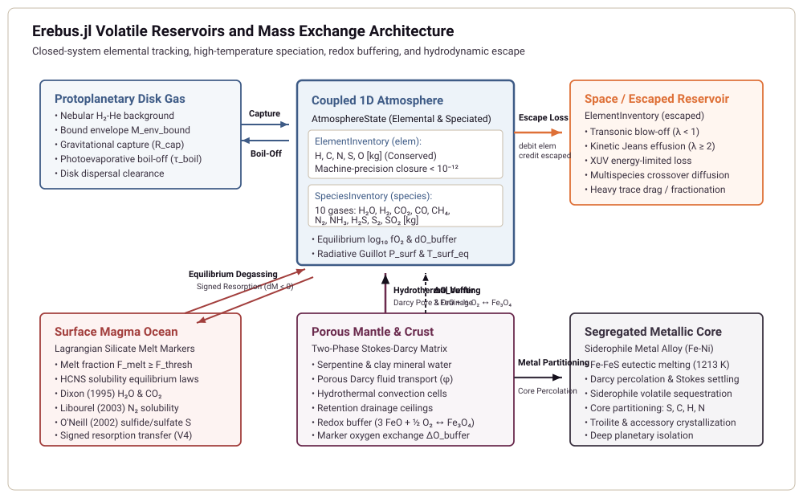
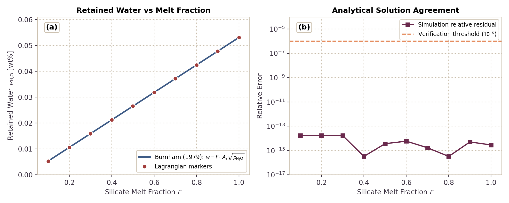

# Coupled 1D Atmosphere, Disk Gas Envelope, and Depressurization

This module documents the physical formulation, mathematical limits, and numerical implementation of coupled 1D proto-atmospheres, protoplanetary disk gas envelope capture and boil-off, semi-grey radiative equilibrium, greenhouse blanketing, and multi-species crossover hydrodynamic escape in `Erebus.jl`.

---

## 1. Physical Motivation

During planetesimal accretion and differentiation, interior volatile outgassing couples to external nebular and radiative environments:

1. *Live Planetary Geometry*. As planetesimals grow from kilometer-scale seeds to lunar-mass embryos ($R \sim 50\text{ km} \to 1740\text{ km}$, $M \sim 10^{18}\text{ kg} \to 7.3\times 10^{22}\text{ kg}$), surface gravity $g(t) = G M(t) / R(t)^2$ increases by more than an order of magnitude. Surface atmospheric pressure $P_{\text{surf}} = g M_{\text{atm}} / (4\pi R^2)$ and scale height $H = k_B T / (m g)$ dynamically adjust to the instantaneous planetary radius and mass.

2. *Protoplanetary Disk Gas Envelopes*. Planetesimals embedded in the gas-rich nebular disk capture ambient hydrogen and helium gas within their gravitational sphere of influence ($R_{\text{cap}} = \min(R_{\text{Bondi}}, R_{\text{Hill}})$). For small bodies ($R \le 100\text{ km}$), thermal velocity exceeds escape velocity, yielding no bound envelope. For massive embryos ($M \gtrsim 10^{22}\text{ kg}$), bound isothermal envelopes develop up to the recycling limit established by 3D hydrodynamics (Ormel et al. 2015).

3. *Envelope Depressurization and Hydrodynamic Boil-Off*. As the protoplanetary disk disperses ($w_{\text{disp}} \to 1$), ambient nebular pressure plummets from $10^{-1}\text{--}10^2\text{ Pa}$ down to space vacuum ($10^{-8}\text{ Pa}$). This rapid depressurization unbinds the captured envelope, driving transonic hydrodynamic boil-off into space until the envelope mass matches the post-dispersal equilibrium target.

4. *Semi-Grey Radiative Equilibrium and Greenhouse Blanketing*. Outgassed volatiles ($\mathrm{H_2O}, \mathrm{CO_2}, \mathrm{CH_4}, \mathrm{CO}, \mathrm{N_2}, \mathrm{H_2S}, \mathrm{SO_2}$) accumulate in the planetary atmosphere, producing significant infrared longwave optical depth $\tau_{\text{LW}}$. This volatile blanket suppresses surface radiative cooling by attenuating the effective radiative heat transfer coefficient ($h_{\text{rad,eff}} = h_{\text{bare}} / [1 + 0.75\tau_{\text{LW}}]$), elevating the surface temperature in accordance with the semi-grey analytical solution of Guillot (2010).

5. *Convex Multi-Species Active-Set Hydrodynamic Escape*. Escaping light volatiles exert collisional drag on heavier species. Rather than restricting escape to hydrogen-dominated atmospheres, `Erebus.jl` implements the general convex active-set closure of Attia & Lichtenberg (2026). When volatiles escape hydrodynamically, the active-set closure determines individual species escape fluxes by minimizing inter-species frictional dissipation subject to non-negativity constraints. In the binary hydrogen-carrier limit, this formulation reproduces the classical crossover mass of Zahnle & Kasting (1986). In arbitrary multi-component mixtures without hydrogen, it partitions hydrodynamic base flux over the remaining volatile inventory while maintaining machine-precision mass conservation.

---

## 2. Mathematical Formulation

### Gravitational Capture Radius and Bound Disk Envelope

For a planetesimal of mass $M$ orbiting a central star of mass $M_\star$ at semi-major axis $a$ in disk gas with sound speed $c_s$, the gravitational capture radius is:

$$R_{\text{cap}} = \min(R_{\text{Bondi}}, R_{\text{Hill}}) = \min\left(\frac{G M}{c_s^2}, a \left(\frac{M}{3 M_\star}\right)^{1/3}\right)$$

When $R_{\text{cap}} > R_{\text{planet}}$, the body binds an isothermal envelope with density profile:

$$\rho(r) = \rho_{\text{disk}} \exp\left[\frac{G M}{c_s^2} \left(\frac{1}{r} - \frac{1}{R_{\text{cap}}}\right)\right]$$

The integrated isothermal envelope mass is capped by the convective recycling limit of Ormel et al. (2015):

$$M_{\text{env}}^* = \min\left(\int_{R_{\text{planet}}}^{R_{\text{cap}}} 4\pi r^2 \rho(r)\, dr, \; f_{\text{rec}} \frac{4\pi}{3} R_{\text{cap}}^3 \rho_{\text{disk}}\right)$$

where $f_{\text{rec}} \approx 0.10$ parameterizes the steady-state replenishment fraction from 3D shear flow.

### Hydrodynamic Boil-Off Loss Rate

During disk dispersal, the ambient gas density decays toward space vacuum, reducing $M_{\text{env}}^*$. The excess envelope boils off hydrodynamically over characteristic expansion timescale $\tau_{\text{boil}}$:

$$\dot{M}_{\text{boil}} = \frac{\max(0, M_{\text{env}} - M_{\text{env}}^*)}{\tau_{\text{boil}}}$$

Mass removed by boil-off transfers strictly to $M_{\text{escaped}}$, preserving global mass balance.

### Multi-Species Optical Depth and Greenhouse Blanketing

The total longwave optical depth of an atmosphere with species masses $M_{\text{atm}, i}$ and specific opacities $\kappa_i$ [$\text{m}^2/\text{kg}$] over surface area $4\pi R_{\text{planet}}^2$ is:

$$\tau_{\text{LW}} = \frac{1}{4\pi R_{\text{planet}}^2} \sum_i \kappa_i M_{\text{atm}, i}$$

The presence of the greenhouse blanket modifies the surface thermal boundary condition. In the two-phase staggered grid finite-difference solver, the linearized Stefan-Boltzmann radiative heat transfer coefficient $h_{\text{rad}}$ is attenuated according to:

$$h_{\text{rad,eff}} = \frac{h_{\text{bare}}}{1 + \frac{3}{4}\tau_{\text{LW}}}$$

where $h_{\text{bare}} = 4 \varepsilon \sigma_{\text{SB}} \bar{T}^3$ is the bare-rock linearized radiative coefficient.

### Semi-Grey Radiative Equilibrium Profile

Following Guillot (2010), the temperature profile of an irradiated semi-grey atmosphere in radiative equilibrium is:

$$T^4(\tau) = \frac{3}{4} T_{\text{int}}^4 \left(\tau + \frac{2}{3}\right) + \frac{3}{4} T_{\text{eqm}}^4 \left[\frac{2}{3} + \frac{1}{\gamma \sqrt{3}} + \left(\frac{\gamma}{\sqrt{3}} - \frac{1}{\gamma \sqrt{3}}\right) e^{-\gamma \tau \sqrt{3}}\right]$$

where $T_{\text{eqm}}^4 = (1 - A) T_{\text{irr}}^4 / 4$, $\gamma = \kappa_{\text{vis}} / \kappa_{\text{IR}}$ is the visible-to-infrared opacity ratio, and $A$ is Bond albedo.

In the optically thin limit ($\tau \to 0$), the surface skin temperature asymptotically satisfies:

$$T^4(0) = \frac{1}{2} T_{\text{int}}^4 + \left(\frac{1}{2} + \frac{\sqrt{3}}{4} \gamma\right) T_{\text{eqm}}^4$$

exhibiting the characteristic $2^{-1/4} \approx 0.84$ temperature depression relative to the ambient irradiation equilibrium temperature when $\gamma \ll 1$.

### Multi-Species Hydrodynamic Escape and Convex Active-Set Closure

When light carrier hydrogen escapes hydrodynamically with molecular flux $\Phi_H = \dot{M}_H / (m_H 4\pi R^2)$ [$\text{molecules}/(\text{m}^2\cdot\text{s})$], heavier volatile species $j$ experience upward collisional drag against gravity. Following Zahnle & Kasting (1986), the crossover mass $m_c$ above which species cannot escape is:

$$m_c = m_H + \frac{k_B T_{\text{exo}} \Phi_H}{b_{j,H} g X_H}$$

where $b_{j,H} \approx 1.0\times 10^{21}\text{ m}^{-1}\text{s}^{-1}$ is the binary diffusion parameter and $X_H$ is the carrier mole fraction.

For species with molecular mass $m_j < m_c$, the hydrodynamic drag efficiency factor $x_j$ is:

$$x_j = \max\left(0, 1 - \frac{m_j - m_H}{m_c - m_H}\right)$$

Collisional momentum transfer couples the dragged escape flux directly to the carrier flux:

$$\Phi_j = \Phi_H \frac{X_j}{X_H} x_j$$

giving mass loss rate $\Delta M_{j,\text{drag}} = \Delta M_H \frac{M_j}{M_H} x_j$.

For general $N$-component mixtures with arbitrary volatile compositions, `Erebus.jl` computes escape partitioning via the convex active-set closure of Attia & Lichtenberg (2026). The solver minimizes total inter-species frictional dissipation:

$$\min_{\mathbf{w} \ge 0} \frac{1}{4} \sum_{j=1}^N \sum_{k=1}^N \frac{X_j X_k}{b_{jk}} (w_j - w_k)^2 + \sum_{j=1}^N \frac{m_j g}{k_B T_{\text{exo}}} X_j w_j \quad \text{subject to} \quad \sum_{j=1}^N m_j X_j w_j = \phi_{\text{base}}$$

where $w_j = \Phi_j / X_j$ are species drift variables, and $\phi_{\text{base}}$ is the total hydrodynamic mass flux [$\text{kg}/(\text{m}^2\cdot\text{s})$].

The active-set algorithm partitions the volatile inventory into an active escaping set $\mathcal{A}$ ($w_j > 0$) and an inactive retained set $\mathcal{R}$ ($w_k = 0$). Retention stability is verified via:

$$R_k = \sum_{i \in \mathcal{A}} \frac{X_i w_i}{b_{ik}} - \left(\frac{m_k g}{k_B T_{\text{exo}}} - C\right) \le 0, \quad \forall k \in \mathcal{R}$$

This multi-species closure satisfies exact physical and mathematical limits:
1. *IsoFATE Binary Equivalence*: In binary mixtures, the active-set closure reproduces the crossover mass and flux partition of Hunten et al. (1987) throughout the full supercritical and subcritical parameter space.
2. *Gu & Chen (2023) Ternary Reduction*: In three-species mixtures ($\mathrm{H} + \mathrm{He} + \mathrm{D}$), the closure matches numerical integrations in both supercritical and subcritical regimes.
3. *Chassefière (1996) Analytical Partition*: In equal-drag binary systems, the solver reproduces the exact algebraic flux ratio.
4. *Carrier Independence*: Hydrodynamic loss proceeds for active volatiles even in atmospheres devoid of molecular hydrogen.
5. *Exact Mass Conservation*: For all species, $\sum_j \Delta M_{j,\text{escaped}} + \sum_j M_{j,\text{atm}} = \sum_j M_{j,\text{atm,init}} + \sum_j \dot{M}_{j,\text{vent}} \Delta t$ to floating-point precision.

### Volatile Influx Coupling: Porosity Venting and Retention Drainage

Volatiles enter the coupled atmosphere through surface mechanisms in each simulation timestep $\Delta t$:

1. *Pore Fluid Porosity Venting*. Pore fluid reaching permeable surface cells discharges via the Darcy sink. Weighted by each marker's out-of-plane spherical integration length $w_{3\text{D}, m} = 2 r_m = 2 \sqrt{(x_m - x_c)^2 + (y_m - y_c)^2}$, this injects into the bulk venting species budget (default $\mathrm{H_2O}$):
   $$\dot{M}_{\text{vent,pore}} = \frac{\Delta M_{\text{vent,pore,3D}}}{\Delta t} = \frac{\sum_m \rho_f \Delta\phi_m A_m w_{3\text{D}, m}}{\Delta t}$$
2. *Mineral Mobile Volatile Drainage*. Mobile volatiles in solid markers within active venting zones drain above retention floors with 3D mass increments $\Delta M_{\text{vent,el,3D}} = \sum_m \rho_m A_m \Delta X_{\text{el}, m} (1 - \phi_m) w_{3\text{D}, m}$.

When `speciation_active = false`, elemental releases partition via direct stoichiometry:
$$\dot{M}_{\text{H2O}} = \frac{\Delta M_{\text{vent,H2O,3D}}}{\Delta t}$$
$$\dot{M}_{\text{CO2}} = \frac{\Delta M_{\text{vent,C,3D}} \cdot (44.0095 / 12.011)}{\Delta t}$$
$$\dot{M}_{\text{N2}} = \frac{\Delta M_{\text{vent,N,3D}}}{\Delta t}$$
$$\dot{M}_{\text{H2S}} = \frac{\Delta M_{\text{vent,S,3D}} \cdot (34.08 / 32.06)}{\Delta t}$$

When `speciation_active = true`, the elemental volatile mass releases ($M_{\text{H2O,3D}}$, $M_{\text{C,3D}}$, $M_{\text{N,3D}}$, $M_{\text{S,3D}}$) are partitioned into equilibrium gas species through `speciate_vented_volatiles`:
$$\mathbf{\dot{M}}_{\text{vent}} = \frac{\text{speciate\_vented\_volatiles}(M_{\text{H2O,3D}}, M_{\text{C,3D}}, M_{\text{N,3D}}, M_{\text{S,3D}}, P_{\text{surf}}, T_{\text{surf}}, \Delta\text{IW})}{\Delta t}$$
resolving molecular speciation across $\mathrm{H_2, H_2O, CO, CO_2, CH_4, N_2, NH_3, H_2S, S_2, SO_2}$ at local ambient surface pressure $P_{\text{surf}}$, temperature $T_{\text{surf}}$, and mantle oxygen fugacity $\Delta\text{IW}$.

Both contributions sum additively into $\mathbf{\dot{M}}_{\text{vent}}$ to preserve complete volatile mass conservation between hydromechanical and atmospheric modules.

### Elemental Inventory and Reservoir Tracking

Atmospheric mass is tracked on an elemental basis using typed `ElementInventory` and `SpeciesInventory` structures within `AtmosphereState`:

```julia
struct ElementInventory
    H::Float64
    C::Float64
    N::Float64
    S::Float64
    O::Float64
end

struct SpeciesInventory
    H2::Float64
    H2O::Float64
    CH4::Float64
    CO::Float64
    CO2::Float64
    NH3::Float64
    N2::Float64
    H2S::Float64
    SO2::Float64
    S2::Float64
end
```

Planetary volatile cycles transfer mass across three core reservoirs: interior rock and melt, the active atmospheric envelope, and space loss via escape:



1. *Interior to Atmosphere*: Surface venting and volcanic degassing deliver elemental masses $(M_{\text{H}}, M_{\text{C}}, M_{\text{N}}, M_{\text{S}}, M_{\text{O}})$ into the atmospheric reservoir `atm_state.elem`. Degassing at local mantle oxygen fugacity exchanges oxygen $\Delta O_{\text{buffer}}$ with the interior FeO-Fe3O4 mineral buffer via `apply_buffer_oxygen!`.
2. *Closed-System Speciation*: At each atmospheric timestep, the closed-system speciation solver `speciate_closed_system(elem, T_surf, P_surf)` solves the coupled non-linear equilibrium across all 10 gas species. The solver performs a bracketed root find on oxygen fugacity $\log_{10} f\mathrm{O}_2 \in [-40, 0]$ satisfying:
   $$O_{\text{species}}(f\mathrm{O}_2) - M_{\text{O,elem}} = 0$$
   This guarantees exact machine-precision conservation of all five elements (H, C, N, O, S) in the molecular species inventory `atm_state.species`. If the oxygen mass $M_{\text{O,elem}}$ lies outside the stoichiometric capacity of the gas species, the solver throws a `ConvergenceError`.
3. *Atmosphere to Space*: Atmospheric escape processes (transonic hydrodynamic blow-off, Jeans kinetic effusion, and multi-species active-set crossover drag) remove volatile species from the atmosphere. Escaped species masses are converted back into elemental equivalents via exact molecular stoichiometry, decrementing `atm_state.elem` and incrementing cumulative space loss `atm_state.escaped`. Invariant conservation holds to double precision:
   $$\mathbf{M}_{\text{elem}}(t + \Delta t) + \Delta \mathbf{M}_{\text{escaped}} = \mathbf{M}_{\text{elem}}(t) + \mathbf{\dot{M}}_{\text{vent,elem}} \Delta t$$

### Bidirectional Surface Thermal Coupling

Atmosphere and interior thermal solvers interact through a closed boundary coupling loop:
1. *Interior to Atmosphere*. The mean surface rock temperature $T_{\text{int}}$ is computed by averaging rock temperatures along the physical planetesimal boundary ($r \approx R_{\text{planet}}$) via `compute_mean_surface_temperature`. This value supplies the internal heat source term $T_{\text{int}}$ to `evolve_coupled_atmosphere_step!`.
2. *Atmosphere to Interior*. The resulting atmospheric equilibrium surface temperature $T_{\text{surf,eq}}$ replaces the far-field ambient disk temperature $T_{\text{amb}}$ in `apply_radiative_surface_boundary!`, self-consistently adjusting internal conductive heat loss to atmospheric greenhouse blanketing.

---

## 3. Benchmark Verification


The 4 panels above verify the numerical implementation against analytical limits and published benchmarks:

- *Panel (a) Semi-Grey Radiative Equilibrium*. Shows $T(\tau)$ profiles for $\gamma \in [0.01, 5.0]$. For $\gamma < 1$, visible radiation penetrates deeper than thermal emission, establishing a strong greenhouse temperature inversion in the deep atmosphere. At low optical depth ($\tau \to 0$), temperatures converge to the skin temperature limit.
- *Panel (b) Disk Gas Envelope Capture & Recycling*. Compares the captured isothermal envelope mass to the Ormel et al. (2015) recycling limit for planetesimal radii from $100\text{ km}$ to $2000\text{ km}$. For sub-Ceres bodies ($R \le 200\text{ km}$), $R_{\text{cap}} \le R_{\text{planet}}$, preventing gas capture. For embryos exceeding $R \sim 1500\text{ km}$, bound envelope mass reaches $10^{18}\text{ to }10^{19}\text{ kg}$.
- *Panel (c) Greenhouse Thermal Blanketing*. Illustrates the rapid attenuation of effective surface heat transfer coefficient $h_{\text{rad,eff}}$ with longwave optical depth $\tau_{\text{LW}}$, reducing surface heat loss by more than a factor of 10 for $\tau_{\text{LW}} > 10$.
- *Panel (d) Zahnle-Kasting Crossover Drag*. Evaluates drag efficiencies $x_j$ for common planetary volatiles ($\mathrm{CH_4}, \mathrm{H_2O}, \mathrm{CO}, \mathrm{CO_2}, \mathrm{SO_2}$) as a function of carrier hydrogen escape flux $\Phi_{\mathrm{H}_2}$. At low fluxes ($\Phi_{\mathrm{H}_2} < 10^{18}\text{ m}^{-2}\text{s}^{-1}$), heavy species remain completely retained ($x_j = 0$). At extreme fluxes ($\Phi_{\mathrm{H}_2} \ge 10^{20}\text{ m}^{-2}\text{s}^{-1}$), even sulfur dioxide experiences substantial hydrodynamic drag.

### Magma-Ocean Degassing

Dynamic magma ocean volatile release from Lagrangian markers evaluates equilibrium saturation in the melt frame at the reference melt temperature $T_{\text{melt\_ref}}$.
For a marker with silicate melt fraction $F \in (0, 1]$, bulk dissolved volatile mass fraction $w$, and equilibrium solubility $w_{\text{sat}}$, the extracted mass fraction is:

$$ex = \min\left(w, \max\left(0, \frac{w}{F} - w_{\text{sat}}\right) \cdot F \cdot \epsilon_{\text{eff}}\right)$$

where $\epsilon_{\text{eff}}$ is degassing efficiency.
For water solubility obeying the Burnham (1979) / Dixon et al. (1995) law:

$$w_{\text{sat}} = A_s \sqrt{p_{\mathrm{H}_2\mathrm{O},\text{MPa}}}$$

the retained water mass fraction in a degassed marker is:

$$w_{\text{retained}} = F \cdot A_s \sqrt{p_{\mathrm{H}_2\mathrm{O},\text{MPa}}}$$



Retained water mass fraction versus melt fraction $F \in [0.1, 1.0]$ at constant surface partial pressure $p_{\mathrm{H}_2\mathrm{O}}$.
The solid curve shows the analytical Burnham (1979) / Dixon et al. (1995) law, while circles show values retained in Lagrangian markers.
Panel (b) confirms numerical agreement to relative tolerance $10^{-6}$.

### Coupled Magma Ocean Multi-Component Volatile Partitioning

The planetary-scale volatile equilibrium between the magma ocean melt reservoir and the overlying atmosphere is solved across four independent volatile element systems (H, C, N, S).

#### Mathematical Formulation

The primary unknowns are the log partial pressures of the four master element carriers:
$$u = \left[\ln p_{\mathrm{H}_2\mathrm{O}}, \; \ln p_{\mathrm{CO}_2}, \; \ln p_{\mathrm{N}_2}, \; \ln p_{\mathrm{SO}_2}\right]$$
The remaining six equilibrium gas species ($p_{\mathrm{H}_2}, p_{\mathrm{CO}}, p_{\mathrm{CH}_4}, p_{\mathrm{NH}_3}, p_{\mathrm{H}_2\mathrm{S}}, p_{\mathrm{S}_2}$) are derived from high-temperature thermodynamic equilibrium constants evaluated at magma ocean reference melt temperature $T_{\text{melt\_ref}}$ and mantle redox state $\Delta\text{IW}$:
- Hydrogen ratio: $p_{\mathrm{H}_2} = p_{\mathrm{H}_2\mathrm{O}} / r_{\mathrm{H}}$ with $\log_{10} r_{\mathrm{H}} = \frac{12700}{T} - 2.80 + 0.5 \log_{10} f_{\mathrm{O}_2}$
- Carbon ratio: $p_{\mathrm{CO}} = p_{\mathrm{CO}_2} / r_{\mathrm{CO}_2}$ with $\log_{10} r_{\mathrm{CO}_2} = \frac{14800}{T} - 4.58 + 0.5 \log_{10} f_{\mathrm{O}_2}$
- Sulfur ratio: $p_{\mathrm{SO}_2} = r_{\mathrm{SO}_2} \sqrt{p_{\mathrm{S}_2} \cdot 10^{-5}} \cdot 10^5$ with $\log_{10} r_{\mathrm{SO}_2} = \frac{18800}{T} - 3.80 + \log_{10} f_{\mathrm{O}_2}$
- Reduced hydride species ($p_{\mathrm{CH}_4}, p_{\mathrm{NH}_3}, p_{\mathrm{H}_2\mathrm{S}}$) follow from their corresponding homogeneous gas equilibria.

Total surface atmospheric pressure satisfies Dalton's law:
$$P_{\text{surf}} = \sum_{i=1}^{10} p_i$$
with total atmospheric column mass $M_{\text{atm,tot}} = \frac{4\pi R_{\text{planet}}^2}{g} P_{\text{surf}} = \text{col\_coeff} \cdot P_{\text{surf}}$. Individual species atmospheric masses are:
$$M_{\text{atm}, i} = \text{col\_coeff} \cdot p_i \left(\frac{\mu_i}{\bar{\mu}}\right)$$
where $\bar{\mu} = \sum_i p_i \mu_i / P_{\text{surf}}$ is the mean atmospheric molecular weight.

#### Physical Solubility and Exact Elemental Conservation

Melt volatile masses $M_{\text{melt}, E}$ are evaluated directly from physical solubility laws at the converged partial pressures and melt temperature:
- Hydrogen mass: $M_{\text{melt}, \mathrm{H}} = M_{\text{melt}} \left[w_{\text{diss}}^{\mathrm{H}_2\mathrm{O}}(p_{\mathrm{H}_2\mathrm{O}}) \frac{2 \mu_{\mathrm{H}}}{\mu_{\mathrm{H}_2\mathrm{O}}} + w_{\text{diss}}^{\mathrm{H}_2}(p_{\mathrm{H}_2})\right]$
- Carbon mass: $M_{\text{melt}, \mathrm{C}} = M_{\text{melt}} \left[C_{\text{diss}}^{\mathrm{CO}}(p_{\mathrm{CO}}, P_{\text{surf}}) \frac{\mu_{\mathrm{C}}}{\mu_{\mathrm{CO}}} + C_{\text{diss}}^{\mathrm{CH}_4}(p_{\mathrm{CH}_4}, P_{\text{surf}}) \frac{\mu_{\mathrm{C}}}{\mu_{\mathrm{CH}_4}} + C_{\text{diss}}^{\mathrm{CO}_2}(p_{\mathrm{CO}_2}, T) \frac{\mu_{\mathrm{C}}}{\mu_{\mathrm{CO}_2}}\right] \times 10^{-6}$
- Nitrogen mass: $M_{\text{melt}, \mathrm{N}} = M_{\text{melt}} \left[S_{\text{N}}(p_{\mathrm{N}_2}, \Delta\text{IW})\right] \times 10^{-6}$
- Sulfur mass: $M_{\text{melt}, \mathrm{S}} = M_{\text{melt}} \left[C_{\text{S}}(p_{\mathrm{S}_2}, T, \Delta\text{IW})\right] \times 10^{-6}$

Melt concentrations are never assigned by difference ($M_{\text{tot}} - M_{\text{atm}}$). Elemental mass conservation requires:
$$M_{\text{calc}, E}(u) - M_{\text{tot}, E} = 0, \quad E \in \{\mathrm{H}, \mathrm{C}, \mathrm{N}, \mathrm{S}\}$$

#### Graphite Saturation Complementarity

Carbon fugacity is bounded by the CCO buffer ceiling ($p_{\mathrm{CO}} \le f_{\mathrm{CO}}^{\text{max}}$ and $p_{\mathrm{CO}_2} \le f_{\mathrm{CO}_2}^{\text{max}}$). When the total carbon inventory exceeds the combined storage capacity of the silicate melt and atmosphere at the CCO ceiling, the gas partial pressures clamp to their saturation values, and the excess carbon precipitates into the solid graphite reservoir:
$$M_{\text{graphite}} = \max\left(0, \; M_{\text{tot}, \mathrm{C}} - (M_{\text{melt}, \mathrm{C}} + M_{\text{atm}, \mathrm{C}})\right)$$
satisfying $M_{\text{calc}, \mathrm{C}} = M_{\text{melt}, \mathrm{C}} + M_{\text{atm}, \mathrm{C}} + M_{\text{graphite}} = M_{\text{tot}, \mathrm{C}}$.

#### Numerical Solver and Convergence Policy

The 4-variable non-linear system is solved via Newton-Raphson iteration with Armijo backtracking line search in $u$:
1. A numerical Jacobian $J = \partial R / \partial u$ is constructed via forward differences in $u$.
2. The trial Newton step $\Delta u = -J^{-1} R$ is bounded by a maximum log step ($\|\Delta u\|_\infty \le 4.0$).
3. Armijo backtracking step halving (up to 30 halvings) ensures monotonic decrease of the normalized residual norm:
   $$\|R\|_{\text{norm}} = \max_{E \in \{\mathrm{H}, \mathrm{C}, \mathrm{N}, \mathrm{S}\}} \frac{|M_{\text{calc}, E} - M_{\text{tot}, E}|}{\text{rtol} \cdot M_{\text{tot}, E} + \text{atol}_E} \le 1.0$$
   with relative tolerance $\text{rtol} = 10^{-10}$ and absolute floor $\text{atol}_E = 10^{-12} \sum M_{\text{tot}}$.
4. If Newton iteration fails to converge within `max_newton_iter`, the solver falls back to a Picard fixed-point iteration on atmospheric mass fractions $f_E = M_{\text{atm}, E} / M_{\text{tot}, E}$ (up to `max_picard_iter = 500` iterations) and increments `PICARD_WARNING_COUNTER` in telemetry.
5. If Picard iteration also fails, the solver throws a typed `ConvergenceError` carrying the elemental residuals.

#### Literature Grounding and Verification

Thermodynamic equilibria and solubility parameterizations are grounded in:
- French, B. M. (1966). Some geological implications of equilibrium between graphite and a C-H-O gas at high temperatures and pressures. *Reviews of Geophysics*, 4(2), 223-253. DOI: [10.1029/RG004i002p00223](https://doi.org/10.1029/RG004i002p00223)
- Holloway, J. R., Pan, V., & Gudmundsson, G. (1992). High-pressure fluid-absent melting in mantle systems: an experimental study. *European Journal of Mineralogy*, 4(1), 105-114. DOI: [10.1127/ejm/4/1/0105](https://doi.org/10.1127/ejm/4/1/0105)
- Dixon, J. E., Stolper, E. M., & Holloway, J. R. (1995). An experimental study of water and carbon dioxide solubilities in mid-ocean ridge basaltic liquids. Part I: calibration and solubility models. *Journal of Petrology*, 36(6), 1607-1631. DOI: [10.1093/oxfordjournals.petrology.a037267](https://doi.org/10.1093/oxfordjournals.petrology.a037267)
- Armstrong, L. S., Hirschmann, M. M., Stanley, B. D., Falksen, E. G., & Jacobsen, S. D. (2015). Speciation and solubility of reduced C-O-H-N volatiles in mafic melt: Implications for volcanism, atmospheric evolution, and deep volatile cycles in the terrestrial planets. *Geochimica et Cosmochimica Acta*, 171, 283-302. DOI: [10.1016/j.gca.2015.07.007](https://doi.org/10.1016/j.gca.2015.07.007)
- Boulliung, J., & Wood, B. J. (2023). Sulfur oxidation state and solubility in silicate melts. *Contributions to Mineralogy and Petrology*, 178(8), 56. DOI: [10.1007/s00410-023-02033-9](https://doi.org/10.1007/s00410-023-02033-9)

Verification test suite: `@testset "Roadmap PR 1c-ii: Coupled Magma Ocean Solve"` in `test/test_magma_degassing.jl`.

---

## 4. Configuration Schema

The coupled atmosphere model is configured through the `[atmosphere]` table in simulation TOML files:

```toml
[atmosphere]
active = true
mode = "guillot"              # "guillot", "grey", "isothermal"
kappa_ir_default = 1.0e-2     # Specific longwave opacity [m^2/kg]
kappa_vis_default = 1.0e-3    # Specific shortwave opacity [m^2/kg]
albedo = 0.20                 # Planetary Bond albedo
gamma_guillot = 0.10          # Visible to IR opacity ratio
T_skin_floor = 50.0           # Minimum skin temperature floor [K]
f_rec = 0.10                  # Ormel et al. (2015) envelope recycling factor
tau_boil = 3.15576e11         # Hydrodynamic boil-off timescale [s] (1e4 yr)
crossover_active = true       # Hydrodynamic multispecies crossover drag
b_diff_ref = 1.0e21           # Binary diffusion parameter reference [m^-1 s^-1]

[atmosphere.opacities]
H2O = 1.0e-2
CO2 = 1.0e-3
CH4 = 2.0e-3
CO  = 1.0e-4
N2  = 1.0e-5
H2  = 1.0e-5
NH3 = 5.0e-3
H2S = 1.0e-3
SO2 = 2.0e-3
```

---

## 5. References

- **Attia, O., & Lichtenberg, T. (2026)**. A convex active-set closure for multi-species atmospheric escape. *arXiv preprint*, arXiv:2608.30106.
- **Burnham, C. W. (1979)**. The importance of volatile constituents. In *The Evolution of the Igneous Rocks: Fiftieth Anniversary Perspectives*, Princeton University Press, 439-482.
- **Chassefière, E. (1996)**. Hydrodynamic escape of hydrogen from a hot water-rich atmosphere: The case of Venus. *Journal of Geophysical Research: Planets*, 101(E11), 26039-26056.
- **Dixon, J. E., Stolper, E., & Holloway, J. R. (1995)**. An experimental study of water and carbon dioxide solubilities in mid-ocean ridge basaltic liquids at low pressures. *Journal of Petrology*, 36(6), 1607-1646.
- **Gu, Y., & Chen, J. (2023)**. Mass fractionation in multi-species hydrodynamic escape. *The Astrophysical Journal*, 959(2), 112.
- **Guillot, T. (2010)**. On the radiative equilibrium of irradiated planetary atmospheres. *Astronomy & Astrophysics*, 520, A27.  
  [https://doi.org/10.1051/0004-6361/200913396](https://doi.org/10.1051/0004-6361/200913396)
- **Hunten, D. M., Pepin, R. O., & Walker, J. C. G. (1987)**. Mass fractionation in hydrodynamic escape. *Icarus*, 69(3), 532-549.
- **Ormel, C. W., Shi, J.-M., & Kuiper, R. (2015)**. Hydrodynamics of embedded planets' first atmospheres - II. A rapid recycling of atmosphere gas. *Monthly Notices of the Royal Astronomical Society*, 447(4), 3512-3525.  
  [https://doi.org/10.1093/mnras/stu2704](https://doi.org/10.1093/mnras/stu2704)
- **Zahnle, K. J., & Kasting, J. F. (1986)**. Mass fractionation during transonic escape and implications for loss of water from Mars and Venus. *Icarus*, 68(3), 462-480.  
  [https://doi.org/10.1016/0019-1035(86)90051-5](https://doi.org/10.1016/0019-1035(86)90051-5)
- **Zahnle, K., Kasting, J. F., & Pollack, J. B. (1990)**. Mass fractionation of noble gases in diffusion-limited hydrodynamic hydrogen escape. *Icarus*, 84(2), 502-527.
