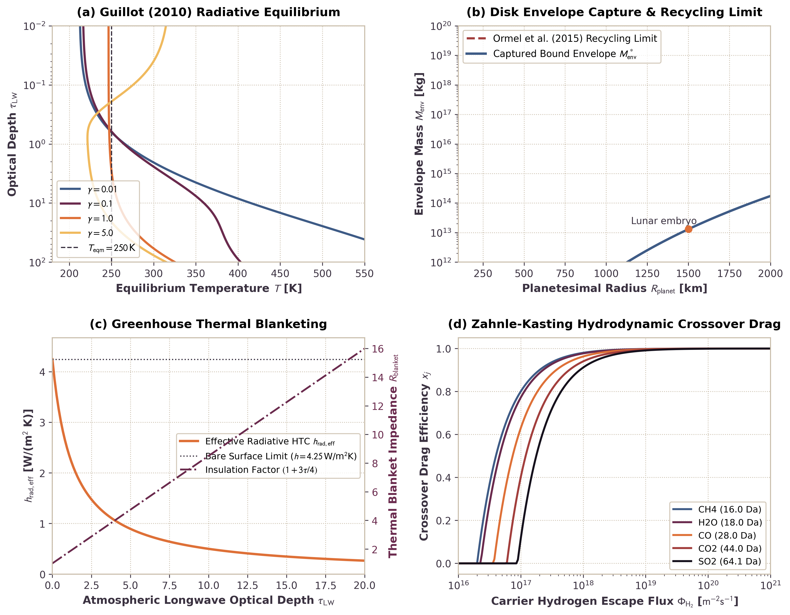

# Coupled 1D Atmosphere, Disk Gas Envelope, and Depressurization

This module documents the physical formulation, mathematical limits, and numerical implementation of coupled 1D proto-atmospheres, protoplanetary disk gas envelope capture and boil-off, semi-grey radiative equilibrium, greenhouse blanketing, and multi-species crossover hydrodynamic escape in `Erebus.jl`.

---

## 1. Physical Motivation

During planetesimal accretion and differentiation, interior volatile outgassing couples to external nebular and radiative environments:

1. *Live Planetary Geometry*. As planetesimals grow from kilometer-scale seeds to lunar-mass embryos ($R \sim 50\text{ km} \to 1740\text{ km}$, $M \sim 10^{18}\text{ kg} \to 7.3\times 10^{22}\text{ kg}$), surface gravity $g(t) = G M(t) / R(t)^2$ increases by more than an order of magnitude. Surface atmospheric pressure $P_{\text{surf}} = g M_{\text{atm}} / (4\pi R^2)$ and scale height $H = k_B T / (m g)$ dynamically adjust to the instantaneous planetary radius and mass.

2. *Protoplanetary Disk Gas Envelopes*. Planetesimals embedded in the gas-rich nebular disk capture ambient hydrogen and helium gas within their gravitational sphere of influence ($R_{\text{cap}} = \min(R_{\text{Bondi}}, R_{\text{Hill}})$). For small bodies ($R \le 100\text{ km}$), thermal velocity exceeds escape velocity, yielding no bound envelope. For massive embryos ($M \gtrsim 10^{22}\text{ kg}$), bound isothermal envelopes develop up to the recycling limit established by 3D hydrodynamics (Ormel et al. 2015).

3. *Envelope Depressurization and Hydrodynamic Boil-Off*. As the protoplanetary disk disperses ($w_{\text{disp}} \to 1$), ambient nebular pressure plummets from $10^{-1}\text{--}10^2\text{ Pa}$ down to space vacuum ($10^{-8}\text{ Pa}$). This rapid depressurization unbinds the captured envelope, driving transonic hydrodynamic boil-off into space until the envelope mass matches the post-dispersal equilibrium target.

4. *Semi-Grey Radiative Equilibrium and Greenhouse Blanketing*. Outgassed volatiles ($\mathrm{H_2O}, \mathrm{CO_2}, \mathrm{CH_4}, \mathrm{CO}, \mathrm{N_2}, \mathrm{H_2S}, \mathrm{SO_2}$) accumulate in the planetary atmosphere, producing significant infrared longwave optical depth $\tau_{\text{LW}}$. This volatile blanket suppresses surface radiative cooling by attenuating the effective radiative heat transfer coefficient ($h_{\text{rad,eff}} = h_{\text{bare}} / [1 + 0.75\tau_{\text{LW}}]$), elevating the surface temperature in accordance with the semi-grey analytical solution of Guillot (2010).

5. *Multi-Species Crossover Hydrodynamic Escape*. When light carrier gases (such as $\mathrm{H_2}$ from serpentinization, core formation, or envelope capture) escape hydrodynamically at high flux $\Phi_H$, momentum transfer through neutral collisions drags heavier volatile species into the escaping wind. Species heavier than the Zahnle & Kasting (1986) crossover mass $m_c$ remain gravitationally retained, driving elemental and isotopic fractionation.

---

## 2. Mathematical Formulation

### Gravitational Capture Radius and Bound Disk Envelope

For a planetesimal of mass $M$ orbiting a central star of mass $M_\star$ at semi-major axis $a$ in disk gas with sound speed $c_s$, the gravitational capture radius is:

$$R_{\text{cap}} = \min(R_{\text{Bondi}}, R_{\text{Hill}}) = \min\left(\frac{G M}{c_s^2}, a \left(\frac{M}{3 M_\star}\right)^{1/3}\right)$$

When $R_{\text{cap}} > R_{\text{planet}}$, the body binds an isothermal envelope with density profile:

$$\rho(r) = \rho_{\text{disk}} \exp\left[\frac{G M}{c_s^2} \left(\frac{1}{r} - \frac{1}{R_{\text{cap}}}\right)\right]$$

The integrated isothermal envelope mass is capped by the convective recycling limit of Ormel et al. (2015):

$$M_{\text{env}}^* = \min\left(\int_{R_{\text{planet}}}^{R_{\text{cap}}} 4\pi r^2 \rho(r)\, dr, \; f_{\text{rec}} \frac{4\pi}{3} R_{\text{cap}}^3 \rho_{\text{disk}}\right)$$

where $f_{\text{rec}} \approx 0.10$ parameterizes the steady-state replenishment fraction from 3D shear flow.

### Hydrodynamic Boil-Off Loss Rate

During disk dispersal, the ambient gas density decays toward space vacuum, reducing $M_{\text{env}}^*$. The excess envelope boils off hydrodynamically over characteristic expansion timescale $\tau_{\text{boil}}$:

$$\dot{M}_{\text{boil}} = \frac{\max(0, M_{\text{env}} - M_{\text{env}}^*)}{\tau_{\text{boil}}}$$

Mass removed by boil-off transfers strictly to $M_{\text{escaped}}$, preserving global mass balance.

### Multi-Species Optical Depth and Greenhouse Blanketing

The total longwave optical depth of an atmosphere with species masses $M_{\text{atm}, i}$ and specific opacities $\kappa_i$ [$\text{m}^2/\text{kg}$] across surface area $4\pi R_{\text{planet}}^2$ is:

$$\tau_{\text{LW}} = \frac{1}{4\pi R_{\text{planet}}^2} \sum_i \kappa_i M_{\text{atm}, i}$$

The presence of the greenhouse blanket modifies the surface thermal boundary condition. In the two-phase staggered grid finite-difference solver, the linearized Stefan-Boltzmann radiative heat transfer coefficient $h_{\text{rad}}$ is attenuated according to:

$$h_{\text{rad,eff}} = \frac{h_{\text{bare}}}{1 + \frac{3}{4}\tau_{\text{LW}}}$$

where $h_{\text{bare}} = 4 \varepsilon \sigma_{\text{SB}} \bar{T}^3$ is the bare-rock linearized radiative coefficient.

### Semi-Grey Radiative Equilibrium Profile

Following Guillot (2010), the temperature profile of an irradiated semi-grey atmosphere in radiative equilibrium is:

$$T^4(\tau) = \frac{3}{4} T_{\text{int}}^4 \left(\tau + \frac{2}{3}\right) + \frac{3}{4} T_{\text{eqm}}^4 \left[\frac{2}{3} + \frac{1}{\gamma \sqrt{3}} + \left(\frac{\gamma}{\sqrt{3}} - \frac{1}{\gamma \sqrt{3}}\right) e^{-\gamma \tau \sqrt{3}}\right]$$

where $T_{\text{eqm}}^4 = (1 - A) T_{\text{irr}}^4 / 4$, $\gamma = \kappa_{\text{vis}} / \kappa_{\text{IR}}$ is the visible-to-infrared opacity ratio, and $A$ is Bond albedo.

In the optically thin limit ($\tau \to 0$), the surface skin temperature asymptotically satisfies:

$$T^4(0) = \frac{1}{2} T_{\text{int}}^4 + \left(\frac{1}{2} + \frac{\sqrt{3}}{4} \gamma\right) T_{\text{eqm}}^4$$

exhibiting the characteristic $2^{-1/4} \approx 0.84$ temperature depression relative to the ambient irradiation equilibrium temperature when $\gamma \ll 1$.

### Zahnle-Kasting Multi-Species Crossover Hydrodynamic Escape

When light carrier hydrogen escapes hydrodynamically with molecular flux $\Phi_H = \dot{M}_H / (m_H 4\pi R^2)$ [$\text{molecules}/(\text{m}^2\cdot\text{s})$], heavier volatile species $j$ experience upward collisional drag against gravity. Following Zahnle & Kasting (1986), the crossover mass $m_c$ above which species cannot escape is:

$$m_c = m_H + \frac{k_B T_{\text{exo}} \Phi_H}{b_{j,H} g X_H}$$

where $b_{j,H} \approx 1.0\times 10^{21}\text{ m}^{-1}\text{s}^{-1}$ is the binary diffusion parameter and $X_H$ is the carrier mole fraction.

For species with molecular mass $m_j < m_c$, the hydrodynamic drag efficiency factor $x_j$ is:

$$x_j = \max\left(0, 1 - \frac{m_j - m_H}{m_c - m_H}\right)$$

Collisional momentum transfer couples the dragged escape flux directly to the carrier flux:

$$\Phi_j = \Phi_H \frac{X_j}{X_H} x_j$$

giving mass loss rate $\Delta M_{j,\text{drag}} = \Delta M_H \frac{M_j}{M_H} x_j$. In the coupled envelope model, heavier volatile species escape via carrier-drag entrainment when a light carrier wind is active; when carrier hydrogen is absent, heavier species remain gravitationally retained.

### Volatile Influx Coupling: Porosity Venting and Retention Drainage

Volatiles enter the coupled atmosphere through two additive surface mechanisms in each simulation timestep $\Delta t$:

1. *Pore Fluid Porosity Venting*. Pore fluid reaching permeable surface cells discharges via the Darcy sink $\Delta m_{\text{vent}}$. Scaled by geometric factor $L_{\text{3D}} = 2 R_{\text{planet}}$, this injects into the bulk venting species budget (default $\mathrm{H_2O}$):
   $$\dot{M}_{\text{vent,pore}} = \frac{\Delta m_{\text{vent}} \cdot 2 R_{\text{planet}}}{\Delta t}$$
2. *Mineral Mobile Volatile Drainage*. Mobile volatiles in solid markers within active venting zones drain above retention floors, providing stoichiometric influxes:
   $$\dot{M}_{\text{H2O}} = \frac{M_{\text{vent,H2O}} \cdot 2 R_{\text{planet}}}{\Delta t}$$
   $$\dot{M}_{\text{CO2}} = \frac{M_{\text{vent,C}} \cdot (44.0095 / 12.011) \cdot 2 R_{\text{planet}}}{\Delta t}$$
   $$\dot{M}_{\text{N2}} = \frac{M_{\text{vent,N}} \cdot 2 R_{\text{planet}}}{\Delta t}$$
   $$\dot{M}_{\text{H2S}} = \frac{M_{\text{vent,S}} \cdot (34.08 / 32.06) \cdot 2 R_{\text{planet}}}{\Delta t}$$

Both contributions sum additively into $\mathbf{\dot{M}}_{\text{vent}}$ to preserve complete volatile mass conservation across hydromechanical and atmospheric modules.

---

## 3. Benchmark Verification



The 4 panels above verify the numerical implementation against analytical limits and published benchmarks:

- *Panel (a) Semi-Grey Radiative Equilibrium*. Shows $T(\tau)$ profiles for $\gamma \in [0.01, 5.0]$. For $\gamma < 1$, visible radiation penetrates deeper than thermal emission, establishing a strong greenhouse temperature inversion in the deep atmosphere. At low optical depth ($\tau \to 0$), temperatures converge to the skin temperature limit.
- *Panel (b) Disk Gas Envelope Capture & Recycling*. Compares the captured isothermal envelope mass to the Ormel et al. (2015) recycling limit across planetesimal radii from $100\text{ km}$ to $2000\text{ km}$. For sub-Ceres bodies ($R \le 200\text{ km}$), $R_{\text{cap}} \le R_{\text{planet}}$, preventing gas capture. For embryos exceeding $R \sim 1500\text{ km}$, bound envelope mass reaches $10^{18}\text{--}10^{19}\text{ kg}$.
- *Panel (c) Greenhouse Thermal Blanketing*. Illustrates the rapid attenuation of effective surface heat transfer coefficient $h_{\text{rad,eff}}$ with longwave optical depth $\tau_{\text{LW}}$, reducing surface heat loss by more than a factor of 10 for $\tau_{\text{LW}} > 10$.
- *Panel (d) Zahnle-Kasting Crossover Drag*. Evaluates drag efficiencies $x_j$ for common planetary volatiles ($\mathrm{CH_4}, \mathrm{H_2O}, \mathrm{CO}, \mathrm{CO_2}, \mathrm{SO_2}$) as a function of carrier hydrogen escape flux $\Phi_{\mathrm{H}_2}$. At low fluxes ($\Phi_{\mathrm{H}_2} < 10^{18}\text{ m}^{-2}\text{s}^{-1}$), heavy species remain completely retained ($x_j = 0$). At extreme fluxes ($\Phi_{\mathrm{H}_2} \ge 10^{20}\text{ m}^{-2}\text{s}^{-1}$), even sulfur dioxide experiences substantial hydrodynamic drag.

---

## 4. Configuration Schema

The coupled atmosphere model is configured through the `[atmosphere]` table in simulation TOML files:

```toml
[atmosphere]
active = true
mode = "guillot"              # "guillot", "grey", "isothermal"
kappa_ir_default = 1.0e-2     # Specific longwave opacity [m^2/kg]
kappa_vis_default = 1.0e-3    # Specific shortwave opacity [m^2/kg]
albedo = 0.20                 # Planetary Bond albedo
gamma_guillot = 0.10          # Visible to IR opacity ratio
T_skin_floor = 50.0           # Minimum skin temperature floor [K]
f_rec = 0.10                  # Ormel et al. (2015) envelope recycling factor
tau_boil = 3.15576e11         # Hydrodynamic boil-off timescale [s] (1e4 yr)
crossover_active = true       # Zahnle-Kasting hydrodynamic crossover drag
b_diff_ref = 1.0e21           # Binary diffusion parameter [m^-1 s^-1]

[atmosphere.opacities]
H2O = 1.0e-2
CO2 = 1.0e-3
CH4 = 2.0e-3
CO  = 1.0e-4
N2  = 1.0e-5
H2  = 1.0e-5
NH3 = 5.0e-3
H2S = 1.0e-3
SO2 = 2.0e-3
```

---

## 5. References

- **Guillot, T. (2010)**. On the radiative equilibrium of irradiated planetary atmospheres. *Astronomy & Astrophysics*, 520, A27.  
  [https://doi.org/10.1051/0004-6361/200913396](https://doi.org/10.1051/0004-6361/200913396)
- **Ormel, C. W., Shi, J.-M., & Kuiper, R. (2015)**. Hydrodynamics of embedded planets' first atmospheres - II. A rapid recycling of atmosphere gas. *Monthly Notices of the Royal Astronomical Society*, 447(4), 3512-3525.  
  [https://doi.org/10.1093/mnras/stu2704](https://doi.org/10.1093/mnras/stu2704)
- **Zahnle, K. J., & Kasting, J. F. (1986)**. Mass fractionation during transonic escape and implications for loss of water from Mars and Venus. *Icarus*, 68(3), 462-480.  
  [https://doi.org/10.1016/0019-1035(86)90051-5](https://doi.org/10.1016/0019-1035(86)90051-5)
