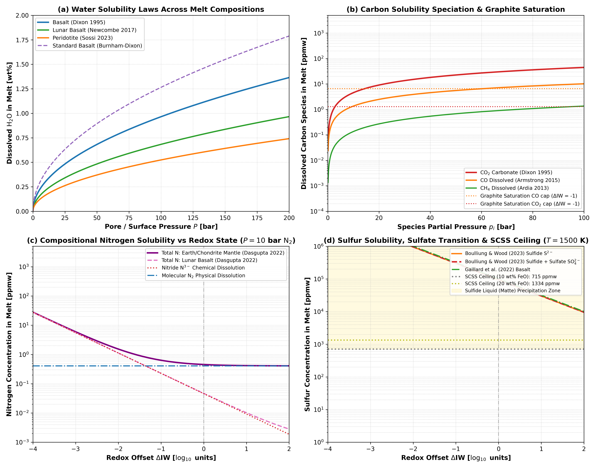

# Multi-Species H-C-N-S Volatile Solubility, Speciation, and Saturation Ceilings

This module describes the multi-component H-C-N-S volatile solubility laws, gas-phase chemical speciation, graphite saturation constraints, and sulfur content at sulfide saturation (SCSS) in `Erebus.jl`.

---

## 1. Physical Motivation

Early planetesimals and protoplanetary embryos accreted heterogeneous mixtures of hydrous silicates, iron sulfides, refractory carbonaceous matter, and trapped nebular gases. During core-mantle differentiation and internal radiogenic heating, silicate partial melting and magma ocean evolution partition volatile elements between the crystalline matrix, liquid silicate melt, immiscible metallic liquids, and exsolved gas phases:

1. Hydrogen ($\text{H}_2\text{O}$ and $\text{H}_2$) dissolves as hydroxyl ($\text{OH}^-$) and molecular $\text{H}_2\text{O}$ in silicate melts across basaltic, peridotitic, and lunar compositions. Molecular $\text{H}_2$ dissolves under strongly reducing conditions, where hydrogen outgassing is dominated by $\text{H}_2$ rather than $\text{H}_2\text{O}$.
2. Carbon ($\text{CO}$, $\text{CH}_4$, and $\text{CO}_2$) dissolves as neutral $\text{CO}$ and $\text{CH}_4$ in reduced silicate melts ($\Delta\text{IW} \le 0$). Under oxidized conditions ($\Delta\text{IW} > 0$), carbon dissolves predominantly as carbonate ($\text{CO}_3^{2-}$). Carbon fugacities are physically bounded by graphite saturation ($a_{\text{C}} = 1$), above which elemental graphite precipitates.
3. Nitrogen ($\text{N}_2$ and Nitride $\text{N}^{3-}$) dissolves physically as molecular $\text{N}_2$ in oxidizing environments. Under reducing conditions ($\Delta\text{IW} \le -1$), chemical dissolution as nitride ($\text{N}^{3-}$) dominates, strongly modulated by melt composition ($\text{SiO}_2$, $\text{Al}_2\text{O}_3$, and $\text{TiO}_2$).
4. Sulfur ($\text{S}^{2-}$ and $\text{SO}_4^{2-}$) dissolves as sulfide ($\text{S}^{2-}$) under reducing conditions and transitions to sulfate ($\text{SO}_4^{2-}$) above $\Delta\text{IW} \approx +1.5$. In silicate melts, dissolved sulfur content is physically capped by the sulfur content at sulfide saturation (SCSS). When sulfur exceeds SCSS, excess sulfur exsolves into an immiscible Fe-S sulfide liquid (matte) rather than remaining dissolved in the silicate melt.

---

## 2. Mathematical Formulation

### Water and Molecular Hydrogen Solubility

Water solubility in silicate melt is parameterized through multiple compositional laws:

- Burnham & Dixon standard basalt:
  $$w_{\text{melt}}^{\text{H}_2\text{O}} = A_s \sqrt{\max(0, P_f \times 10^{-6})} \quad [\text{wt}\%]$$
- Sossi et al. (2023) peridotite melt:
  $$w_{\text{melt}}^{\text{H}_2\text{O}} = \left(524.0 \sqrt{P_f \times 10^{-5}}\right) \times 10^{-4} \quad [\text{wt}\%]$$
- Dixon et al. (1995) MORB basalt:
  $$w_{\text{melt}}^{\text{H}_2\text{O}} = \left(965.0 \sqrt{P_f \times 10^{-5}}\right) \times 10^{-4} \quad [\text{wt}\%]$$
- Newcombe et al. (2017) lunar basalt:
  $$w_{\text{melt}}^{\text{H}_2\text{O}} = \left(683.0 \sqrt{P_f \times 10^{-5}}\right) \times 10^{-4} \quad [\text{wt}\%]$$

Molecular hydrogen dissolves under reducing conditions following Henry law calibrations (Hirschmann et al. 2012; Gaillard et al. 2003):

$$\log_{10}(X_{\text{H}_2} [\text{ppmw}]) = 1.1008 + 0.5241 \log_{10}(P_{\text{H}_2} [\text{bar}])$$

### Carbon Solubility Speciation and Graphite Saturation

Dissolved carbon partitions into $\text{CO}$, $\text{CH}_4$, and carbonate ($\text{CO}_3^{2-}$):

1. Carbon monoxide (Armstrong et al. 2015; Yoshioka et al. 2019):
   $$\log_{10}(X_{\text{CO}} [\text{ppmw}]) = -0.738 + 0.876 \log_{10}(p_{\text{CO}} [\text{bar}]) - 5.44 \times 10^{-5} P_{\text{tot}} [\text{bar}]$$
2. Methane (Ardia et al. 2013):
   $$X_{\text{CH}_4} [\text{ppmw}] = p_{\text{CH}_4} [\text{GPa}] \exp\left(4.93 - 1.93 P_{\text{tot}} [\text{GPa}]\right)$$
3. Carbon dioxide and carbonate (Dixon et al. 1995):
   $$x_{\text{CO}_2} = 3.8 \times 10^{-7} p_{\text{CO}_2} [\text{bar}] \exp\left[-\frac{23.0 (p_{\text{CO}_2} - 1)}{83.15 T}\right]$$
   $$X_{\text{CO}_2} [\text{ppmw}] = 10^4 \times \frac{4400.0 x_{\text{CO}_2}}{36.6 - 44.0 x_{\text{CO}_2}}$$

At graphite saturation ($a_{\text{C}} = 1$), maximum carbon monoxide and dioxide fugacities are governed by the heterogeneous buffer equilibria of French (1966) and Holloway et al. (1992):

$$\log_{10}(f_{\text{CO}}^{\text{max}} [\text{bar}]) = \frac{5785.0}{T} + 4.545 + 0.5 \log_{10}(f_{\text{O}_2})$$
$$\log_{10}(f_{\text{CO}_2}^{\text{max}} [\text{bar}]) = \frac{20590.0}{T} - 0.043 + \log_{10}(f_{\text{O}_2})$$

### Composition-Dependent Nitrogen Solubility

Dasgupta et al. (2022) parameterize nitrogen solubility in silicate melt by incorporating temperature, pressure, redox state, and network-forming cation fractions ($\text{SiO}_2, \text{Al}_2\text{O}_3, \text{TiO}_2$):

$$w_{\text{phys}}^{\text{N}} [\text{ppmw}] = p_{\text{N}_2} [\text{GPa}] \exp\left(4.67 + 7.11 x_{\text{SiO}_2} - 13.06 x_{\text{Al}_2\text{O}_3} - 120.67 x_{\text{TiO}_2}\right)$$
$$w_{\text{chem}}^{\text{N}} [\text{ppmw}] = \sqrt{p_{\text{N}_2} [\text{GPa}]} \exp\left[\frac{5908.0 \sqrt{P_{\text{tot}} [\text{GPa}]}}{T} - 1.6 \Delta\text{IW}\right]$$
$$w_{\text{total}}^{\text{N}} = w_{\text{phys}}^{\text{N}} + w_{\text{chem}}^{\text{N}}$$

### Sulfur Solubility and Sulfide Saturation Ceiling (SCSS)

Dissolved sulfur in silicate melt is governed by sulfide capacity under reducing conditions and sulfate capacity under oxidizing conditions (Boulliung & Wood 2022, 2023; Gaillard et al. 2022):

$$\log_{10}(C_{\text{S}^{2-}}) = 0.225 - \frac{\mathcal{S}_{\text{melt}}}{T}$$
$$S_{\text{sulfide}} [\text{wt}\%] = C_{\text{S}^{2-}} \sqrt{\frac{p_{\text{S}_2} [\text{bar}]}{f_{\text{O}_2} [\text{bar}]}}$$

Silicate melt cannot dissolve unbounded quantities of sulfide. When dissolved sulfur reaches the Sulfur Content at Sulfide Saturation (O'Neill & Mavrogenes 2002; Smythe et al. 2017), an immiscible Fe-S sulfide melt (matte) forms:

$$\ln(\text{SCSS} [\text{ppmw}]) = 7.50 - \frac{4500.0}{T} + 0.90 \ln(\max(0.1, x_{\text{FeO}})) - 2.5 \times 10^{-4} \frac{P_{\text{tot}} [\text{bar}]}{T}$$

In `Erebus.jl`, the physical routine `compute_sulfur_solubility_melt` supports enforcing the saturation ceiling via `scss_active = true`:

$$S_{\text{melt}} = \min(S_{\text{solubility}}, \text{SCSS})$$

where dissolved sulfur is capped at the sulfide saturation limit (SCSS) representing the threshold for exsolution of immiscible Fe-S matte. In atmospheric evolution runs, `simulation.jl` currently tracks atmospheric inventory dynamics and Jeans escape for the configured species (`cfg.escape.species`).

---

## 3. Literature Anchors

- French, B. M. (1966). Some geological implications of equilibrium between graphite and a C-H-O gas phase at high temperatures and pressures. *Reviews of Geophysics*, 4(2), 223-253. [https://doi.org/10.1029/RG004i002p00223](https://doi.org/10.1029/RG004i002p00223)
- Holloway, J. R., Pan, V., & Gudmundsson, G. (1992). High-pressure fluid-absent melting in mantle peridotite. *European Journal of Mineralogy*, 4(5), 905-914. [https://doi.org/10.1127/ejm/4/5/0905](https://doi.org/10.1127/ejm/4/5/0905)
- Dixon, J. E., Stolper, E. M., & Holloway, J. R. (1995). An experimental study of water and carbon dioxide solubilities in mid-ocean ridge basaltic liquids. Part I: Calibration and solubility models. *Journal of Petrology*, 36(6), 1607-1631. [https://doi.org/10.1093/petrology/36.6.1607](https://doi.org/10.1093/petrology/36.6.1607)
- O'Neill, H. S. C., & Mavrogenes, J. A. (2002). The sulfide capacity and the sulfur content at sulfide saturation of silicate melts at 1400 C and 1 bar. *Journal of Petrology*, 43(6), 1049-1087. [https://doi.org/10.1093/petrology/43.6.1049](https://doi.org/10.1093/petrology/43.6.1049)
- Gaillard, F., Schmidt, B. C., Mackwell, S., & McCammon, C. (2003). Rate of hydrogen-iron redox exchange in silicate melts and glasses. *Geochimica et Cosmochimica Acta*, 67(13), 2427-2441. [https://doi.org/10.1016/S0016-7037(02)01348-1](https://doi.org/10.1016/S0016-7037(02)01348-1)
- Hirschmann, M. M., Withers, A. C., Ardia, P., & Foley, N. T. (2012). Solubility of molecular H2 in silicate melts to 3 GPa with implications for degassed volatiles and early planetary atmospheres. *Earth and Planetary Science Letters*, 345, 38-48. [https://doi.org/10.1016/j.epsl.2012.06.031](https://doi.org/10.1016/j.epsl.2012.06.031)
- Ardia, P., Hirschmann, M. M., Withers, A. C., & Stanley, B. D. (2013). Solubility of CH4 in a synthetic basaltic melt, with applications to atmosphere-magma ocean interactions. *Geochimica et Cosmochimica Acta*, 114, 52-71. [https://doi.org/10.1016/j.gca.2013.03.028](https://doi.org/10.1016/j.gca.2013.03.028)
- Armstrong, L. S., Hirschmann, M. M., Withers, A. C., & Eiler, J. M. (2015). Solubility of carbon monoxide in a synthetic basaltic melt: Constraints on early planetary degassing. *Geochimica et Cosmochimica Acta*, 171, 283-302. [https://doi.org/10.1016/j.gca.2015.09.006](https://doi.org/10.1016/j.gca.2015.09.006)
- Newcombe, M. E., Brett, A., Beckett, J. R., Baker, M. B., Newman, S., Guan, Y., & Eiler, J. M. (2017). Solubility of water in lunar basalt. *Geochimica et Cosmochimica Acta*, 200, 330-352. [https://doi.org/10.1016/j.gca.2016.12.008](https://doi.org/10.1016/j.gca.2016.12.008)
- Smythe, D. J., Wood, B. J., & Kiseeva, E. S. (2017). The sulfur content of silicate melts at sulfide saturation: New experiments and a model incorporating the effects of melt composition. *American Mineralogist*, 102(4), 795-803. [https://doi.org/10.2138/am-2017-5931](https://doi.org/10.2138/am-2017-5931)
- Yoshioka, T., Watenphul, A., & Keppler, H. (2019). Carbon monoxide solubility in MORB basalt and graphite saturation. *Contributions to Mineralogy and Petrology*, 174(5), 45. [https://doi.org/10.1007/s00410-019-1582-7](https://doi.org/10.1007/s00410-019-1582-7)
- Boulliung, J., & Wood, B. J. (2022). The sulfur capacity of silicate melts: A new model for sulfide and sulfate solubility. *Geochimica et Cosmochimica Acta*, 336, 150-164. [https://doi.org/10.1016/j.gca.2022.09.009](https://doi.org/10.1016/j.gca.2022.09.009)
- Dasgupta, R., Ding, S., & Erdman, M. E. (2022). Nitrogen solubility in silicate melts and the volatile budget of terrestrial planets. *Geochimica et Cosmochimica Acta*, 324, 280-299. [https://doi.org/10.1016/j.gca.2022.03.010](https://doi.org/10.1016/j.gca.2022.03.010)
- Gaillard, F., Bouhifd, M. A., Fialin, M., Malki, M., & Iacono-Marziano, G. (2022). The sulfur content of magmas at sulfide and sulfate saturation. *Chemical Geology*, 605, 120952. [https://doi.org/10.1016/j.chemgeo.2022.120952](https://doi.org/10.1016/j.chemgeo.2022.120952)
- Sossi, P. A., Tollan, P. M. E., O'Neill, H. S. C., & Boulliung, J. (2023). Water solubility in peridotite liquid. *Earth and Planetary Science Letters*, 601, 117894. [https://doi.org/10.1016/j.epsl.2022.117894](https://doi.org/10.1016/j.epsl.2022.117894)

---

## 4. Parameterization Behavior

Figure 1 illustrates the operational behavior of the multi-component H-C-N-S volatile solubility, speciation, and saturation limits:

*Figure 1: Four-panel diagnostic demonstration of the multi-species H-C-N-S volatile solubility parameterizations in Erebus.jl. (a) Dissolved water concentration in silicate melt as a function of pore/surface pressure $P \in [0, 200]\text{ bar}$ across four compositional calibrations: MORB basalt (Dixon et al. 1995), lunar basalt (Newcombe et al. 2017), peridotite (Sossi et al. 2023), and the baseline Burnham-Dixon parameterization. (b) Carbon solubility speciation as a function of species partial pressure up to $100\text{ bar}$ at $T = 1500\text{ K}$, contrasting carbonate dissolution ($\text{CO}_2$), dissolved carbon monoxide ($\text{CO}$), and methane ($\text{CH}_4$). Dotted horizontal lines show the graphite saturation ceiling at $\Delta\text{IW} = -1$. (c) Composition-dependent nitrogen solubility as a function of redox offset $\Delta\text{IW} \in [-4, +2]$ at $p_{\text{N}_2} = 10\text{ bar}$ and $T = 1600\text{ K}$ (Dasgupta et al. 2022), decomposing total dissolved nitrogen into physical molecular ($\text{N}_2$) and chemical nitride ($\text{N}^{3-}$) dissolution for Earth mantle and lunar basalt compositions. (d) Sulfur solubility as a function of redox state at $T = 1500\text{ K}$ and $p_{\text{S}_2} = 1\text{ bar}$, showing sulfide and sulfate capacities (Boulliung & Wood 2023; Gaillard et al. 2022) and the sulfur content at sulfide saturation (SCSS) ceiling for $10\text{ wt}\%$ and $20\text{ wt}\%$ $\text{FeO}$ (Smythe et al. 2017). The yellow shaded region indicates where raw sulfide solubility exceeds SCSS, causing precipitation of an immiscible Fe-S sulfide liquid (matte).*
