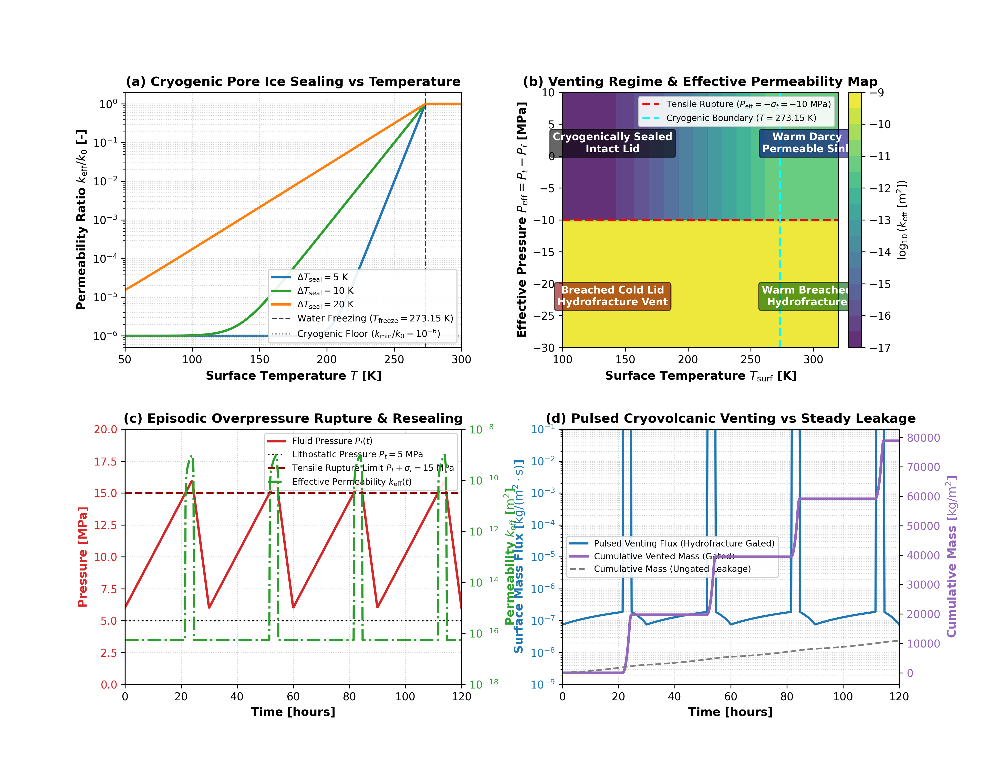

# Cold Lid Hydrofracture Breaching and Cryogenic Pore Ice Sealing Validation

This module validates the cold lid hydrofracture breaching criterion, cryogenic pore ice permeability sealing, and episodic cryovolcanic venting dynamics in `Erebus.jl`.

---

## 1. Physical Motivation

Early planetesimals and icy planetesimals undergo internal heating from short-lived radionuclides ($^{26}\text{Al}$ and $^{60}\text{Fe}$), triggering prograde metamorphic dehydration and fluid pressurization. However, near the surface, radiative equilibrium or cold nebular conditions maintain crustal temperatures well below the water freezing point ($T_{\text{surf}} \ll 273.15\text{ K}$).

In this cryogenic regime, pore fluid freezes into water ice, filling porosity and reducing the effective permeability by orders of magnitude. This cryogenic seal traps pressurized fluid beneath an impermeable crust. Venting occurs only when fluid overpressures overcome the lithostatic confining pressure and rock tensile strength:

$$P_f \ge P_t + \sigma_t \iff P_{\text{eff}} \le -\sigma_t$$

Tensile failure ruptures the cold lid, producing hydrofractures that discharge fluid rapidly into space or the nebular gas. As pore fluid drains, fluid pressure drops below the tensile threshold, hydrofractures close, and pore ice reseals the lid.

---

## 2. Theoretical Formulation

The physical theory of cryogenic pore ice sealing, tensile overpressure failure, and episodic hydrofracture venting dynamics is derived in detail in [Volatile Degassing, Cold Surface Venting, and Atmospheric Escape](../explanations/degassing_and_venting.md).

Key constitutive relations validated on this page include:

- **Cryogenic Pore Ice Permeability Sealing ($k_{\text{eff}}$):**
  $$k_{\text{eff}}(T) = k_v \cdot \left[(1 - r_{\text{min}}) \exp\left(-\frac{T_{\text{freeze}} - T}{\Delta T_{\text{seal}}}\right) + r_{\text{min}}\right] \quad (T < T_{\text{freeze}})$$
  with $k_{\text{eff}} = k_v$ for $T \ge T_{\text{freeze}}$.
- **Cold Lid Hydrofracture Breaching Criterion ($P_{\text{eff}}$):**
  $$P_{\text{eff}} = P_t - P_f \le -\sigma_t \iff P_f \ge P_t + \sigma_t$$
- **Fracture Permeability Enhancement ($k_{\text{frac}}$):**
  $$k_{\text{frac}}(P_{\text{eff}}) = \min\left(k_{\text{max}}, k_v \left[1 + \kappa_{\text{frac}} \left(\frac{-P_{\text{eff}} - \sigma_t}{\sigma_t}\right)^\gamma\right]\right)$$

---

## 3. Literature Anchors

- **Fu, R. R., & Elkins-Tanton, L. T. (2014)**. The early thermal evolution of planetesimals: Implications for differentiated asteroids and carbonaceous chondrite parent bodies. *Earth and Planetary Science Letters*, 390, 128-137.  
  [https://doi.org/10.1016/j.epsl.2014.01.009](https://doi.org/10.1016/j.epsl.2014.01.009)
- **Neveu, M., Desch, S. J., & Castillo-Rogez, J. C. (2015)**. Core cracking and hydrothermal circulation can profoundly affect Ceres' geophysical evolution. *Journal of Geophysical Research: Planets*, 120(2), 123-154.  
  [https://doi.org/10.1002/2014JE004714](https://doi.org/10.1002/2014JE004714)
- **Manga, M., & Wang, C.-Y. (2007)**. Pressurized oceans and eruptive mechanism for Enceladus. *Geophysical Research Letters*, 34(7), L07202.  
  [https://doi.org/10.1029/2007GL029297](https://doi.org/10.1029/2007GL029297)

---

## 4. Benchmark Diagnostics

Figure 1 presents an illustrative verification benchmark for the operational regimes and equations of cold lid hydrofracture venting:

*Figure 1: Four-panel verification benchmark schematic for cold lid hydrofracture breaching and cryogenic pore ice sealing equations. (a) Permeability ratio $k_{\text{eff}} / k_0$ as a function of surface temperature for transition scales $\Delta T_{\text{seal}} \in \{5, 10, 20\}\text{ K}$, with smooth exponential suppression down to the cryogenic floor ($10^{-6}$). (b) Venting regime map in the plane of surface temperature $T_{\text{surf}}$ and effective pressure $P_{\text{eff}}$, which delineates four quadrants: cryogenically sealed intact lid, breached cold lid hydrofracture vent, warm Darcy permeable sink, and warm hydrofracture. (c) Synthetic time series of episodic dehydration overpressure buildup, tensile rupture ($P_f \ge P_t + \sigma_t$), and subsequent resealing. (d) Resulting pulsed cryovolcanic surface venting mass flux and cumulative fluid mass comparison against continuous unsealed leakage.*

---

## 5. Mathematical Invariants and Limits

1. **Unsealed Thermal Asymptote**: For $T \ge T_{\text{freeze}}$, $k_{\text{eff}} = k_v$ within machine precision.
2. **Deep Cryogenic Limit**: For $T \ll T_{\text{freeze}}$, $k_{\text{eff}} \to k_v \cdot r_{\text{min}}$ monotonically.
3. **Tensile Failure Threshold**: A boundary cell transitions from closed to open when $P_{\text{eff}} = -\sigma_t$ exactly.
4. **Episodic Resealing**: As $P_f$ dissipates such that $P_{\text{eff}} > -\sigma_t$, venting shuts off completely in `:hydrofracture_gated` mode or drops toward the residual floor ratio $r_{\text{min}}$ (approaching $10^{-6}$ as $T$ decreases well below $T_{\text{freeze}}$) under cryogenic ice sealing.
5. **Domain Guards**: Non-positive reference permeability, zero or negative temperature, and non-physical sealing parameters raise informative errors.

---

## 6. Verification Test Suite

- `test/test_hydrofracture_venting.jl`:
  - `@testset "compute_ice_sealed_permeability Invariants & Asymptotics"`
  - `@testset "is_hydrofracture_breached Invariants"`
  - `@testset "Surface Boundary Hydrofracture Gating & Cryogenic Sealing Assembly"`
  - `@testset "compute_face_venting_permeability Invariants"`
  - `@testset "VentingConfig Validation on Ice Sealing Parameters"`
  - `@testset "Episodic Hydrofracture Breaching & Lid Resealing Dynamics"`
  - `@testset "Simulation Loop with Hydrofracture-Gated & Ice Sealed Venting"`
