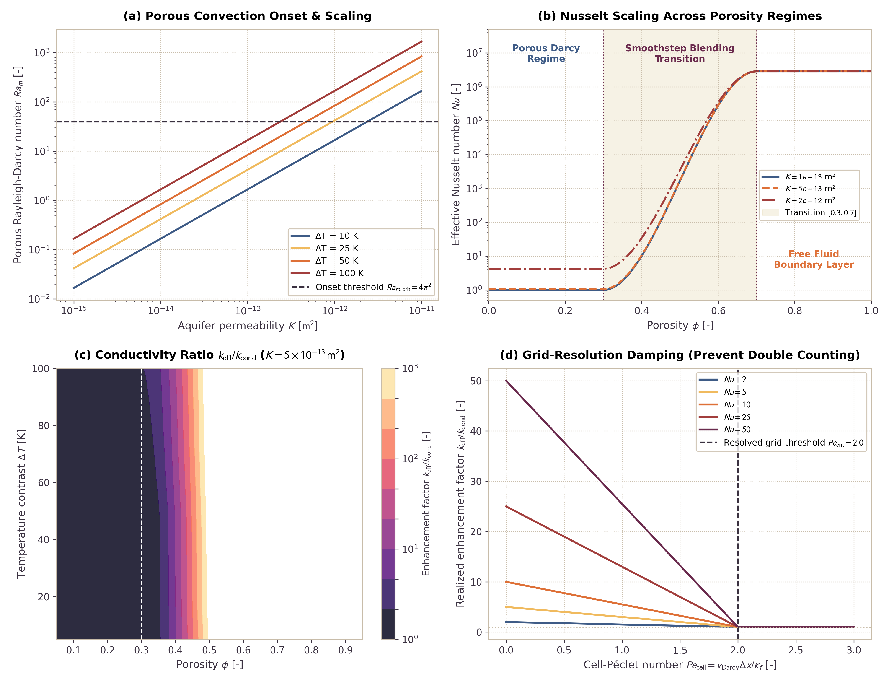

# Hydrothermal Subgrid Convection for Porous and Open Water Layers

This page documents the physics equations, constitutive relations, and numerical benchmarks for subgrid hydrothermal convection in `Erebus.jl`. The model bridges the porous Rayleigh-Darcy regime ($Nu_{\mathrm{porous}} \propto Ra_m$) in planetesimal rock aquifers with boundary-layer free-fluid Rayleigh scaling ($Nu_{\mathrm{free}} \propto Ra^{1/3}$) in open water layers, melt lenses, and oceans through a cubic smoothstep porosity transition. Heat transport closes through effective thermal conductivity enhancement with cell-Péclet resolution weighting and Picard damping.

---

## 1. Physical Motivation

Early planetesimals accreted variable mixtures of water ice and anhydrous silicates. Decay of short-lived radionuclides ($^{26}\mathrm{Al}$ and $^{60}\mathrm{Fe}$) heated planetesimal interiors, melted pore ice, and drove hydrothermal fluid flow (Hubmann, 2022; Lichtenberg et al., 2019, 2021):

1. **Porous Aquifers and Regolith:** In porous planetesimal crusts ($\phi \le 0.30$), fluid percolates through rock pore networks. When buoyant thermal forces overcome viscous drag in the rock matrix, porous Rayleigh-Darcy convection develops (Horton and Rogers, 1945; Lapwood, 1948). This circulation homogenizes temperatures, buffers peak core temperatures, and accelerates serpentinization.
2. **Muddy Slush, Melt Lenses, and Subsurface Oceans:** Extensive ice melting and fluid accumulation produce high-porosity slurry layers, water lenses, or global subsurface oceans ($\phi \ge 0.70$). In these fluid-dominated regimes, matrix drag vanishes, and heat transport transitions to boundary-layer free-fluid convection (Kraichnan, 1962; Howard, 1966).
3. **Subgrid Closure Need:** On planetary-scale numerical grids where cell spacing $\Delta x$ exceeds hydrothermal boundary layer thicknesses or Darcy convection cell wavelengths, conduction-only solvers underestimate vertical heat fluxes. Adding subgrid convective heat transport through an enhanced effective thermal conductivity $k_{\mathrm{eff}}$ captures convective heat loss without prohibitive grid refinement.

---

## 2. Governing Equations

### Porous Rayleigh-Darcy Convection ($Ra_m$)

In fluid-saturated porous rock, the dimensionless Rayleigh-Darcy number sets convective vigor (Horton and Rogers, 1945; Lapwood, 1948):

$$Ra_m = \frac{\rho_f^2 \, c_{p,f} \, g \, \alpha_f \, K \, \Delta T \, H}{\mu_f \, k_{\mathrm{cond}}}$$

where:
- Fluid density $\rho_f$ [$\mathrm{kg/m}^3$] from `compute_rhofluid(T)`
- Fluid isobaric heat capacity $c_{p,f}$ [$\mathrm{J/(kg\,K)}$] (default: $4184.0$)
- Gravitational acceleration $g$ [$\mathrm{m/s}^2$] (local or bulk)
- Fluid isobaric thermal expansivity $\alpha_f$ [$1/\mathrm{K}$] (default: $2.0 \times 10^{-4}$)
- Medium permeability $K$ [$\mathrm{m}^2$] from the Kozeny-Carman relation $k(\phi)$ or user input
- Convective driving temperature contrast $\Delta T = \max(0.0, T - T_{\mathrm{surface\_ref}})$ [$\mathrm{K}$]
- Characteristic convective layer thickness $H$ [$\mathrm{m}$] (default: $10^4\text{ m}$)
- Dynamic fluid viscosity $\mu_f$ [$\mathrm{Pa\,s}$] from `compute_fluid_viscosity(T)`
- Conductive bulk thermal conductivity $k_{\mathrm{cond}}$ [$\mathrm{W/(m\,K)}$]

Onset of porous convection occurs at the critical Rayleigh-Darcy number:

$$Ra_{m,\mathrm{crit}} = 4\pi^2 \approx 39.4784$$

For $Ra_m < Ra_{m,\mathrm{crit}}$, heat transport remains purely conductive ($Nu_{\mathrm{porous}} = 1.0$). Above threshold, the Nusselt number scales linearly (Elder, 1967; Turcotte and Schubert, 2014):

$$Nu_{\mathrm{porous}} = 1.0 + c_{\mathrm{porous}} \left(\frac{Ra_m}{Ra_{m,\mathrm{crit}}} - 1.0\right)$$

with prefactor $c_{\mathrm{porous}} = 1.0$.

---

### Free-Fluid Rayleigh Convection ($Ra$)

In open fluid layers and oceans ($\phi \ge \phi_{\mathrm{end}}$), viscous matrix drag vanishes, and the thermal Rayleigh number sets convective vigor:

$$Ra = \frac{\rho_f^2 \, c_{p,f} \, g \, \alpha_f \, \Delta T \, H^3}{\mu_f \, k_f}$$

where $k_f$ is fluid thermal conductivity (default: $0.6\text{ W/(m K)}$). Critical onset occurs at $Ra_{\mathrm{crit}} \approx 1100.0$. In turbulent boundary-layer convection, heat transport follows Kraichnan (1962) and Howard (1966) asymptotic $1/3$ power law scaling:

$$Nu_{\mathrm{free}} = \begin{cases} 1.0, & Ra \le Ra_{\mathrm{crit}} \\ \max\left(1.0, c_{\mathrm{free}} \, Ra^{1/3}\right), & Ra > Ra_{\mathrm{crit}} \end{cases}$$

with boundary layer coefficient $c_{\mathrm{free}} = 0.088$.

---

### Porosity Transition and Cubic Smoothstep Blending

Between the pure porous regime ($\phi \le \phi_{\mathrm{start}} = 0.30$) and open water regime ($\phi \ge \phi_{\mathrm{end}} = 0.70$), fluid and matrix coexist in variable proportions. The model evaluates a normalized porosity coordinate:

$$\xi = \mathrm{clamp}\left(\frac{\phi - \phi_{\mathrm{start}}}{\phi_{\mathrm{end}} - \phi_{\mathrm{start}}}, 0.0, 1.0\right)$$

and cubic smoothstep weighting factor:

$$w_\phi = \xi^2 \, (3.0 - 2.0 \, \xi)$$

Nusselt numbers blend in logarithmic space:

$$\log_{10}(Nu) = (1.0 - w_\phi) \log_{10}(Nu_{\mathrm{porous}}) + w_\phi \log_{10}(Nu_{\mathrm{free}})$$

$$Nu = 10^{\log_{10}(Nu)}$$

Because $w_\phi'(0) = 0$ and $w_\phi'(1) = 0$, the transition is $C^1$ smooth at both regime boundaries.

---

### Cell-Péclet Resolution Weighting and Picard Damping

When Darcy flow is resolved directly on the Eulerian grid, applying the full subgrid convective conductivity would double-count convective heat flux. To prevent double-counting, the solver computes the grid cell-Péclet number:

$$Pe_{\mathrm{cell}} = \frac{v_{\mathrm{Darcy}} \, \Delta x}{\kappa_f}$$

where $\kappa_f = k_{\mathrm{cond}} / (\rho_f \, c_{p,f})$ is thermal diffusivity. The resolution weighting factor:

$$w_{\mathrm{res}} = \mathrm{clamp}\left(\frac{Pe_{\mathrm{cell}}}{Pe_{\mathrm{crit}}}, 0.0, 1.0\right)$$

damps the target convective conductivity toward the conductive baseline when $Pe_{\mathrm{cell}} \to Pe_{\mathrm{crit}} = 2.0$:

$$k^\dagger = (1.0 - w_{\mathrm{res}}) \, k_{\mathrm{target}} + w_{\mathrm{res}} \, k_{\mathrm{cond}}$$

Picard damping stabilizes non-linear iterations:

$$k_{\mathrm{eff}} = (1.0 - \gamma) \, k_{\mathrm{prev}} + \gamma \, k^\dagger$$

where $\gamma \in (0, 1]$ is the damping factor (default: $0.5$).

---

## 3. Benchmark Results and Numerical Checks

The benchmark figure below illustrates scaling behavior in all four operational regimes:

### Panel Descriptions

- **(a) Porous Convection Onset and Scaling:** $Ra_m$ versus medium permeability $K$ for thermal driving scales $\Delta T \in [10, 25, 50, 100]\text{ K}$. Convection initiates once permeability exceeds $K \approx 5 \times 10^{-14}\text{ m}^2$, matching analytical Horton-Rogers-Lapwood criteria ($Ra_{m,\mathrm{crit}} = 4\pi^2$).
- **(b) Nusselt Scaling in Porosity Regimes:** Continuous transition from linear porous Darcy scaling ($Nu_{\mathrm{porous}} \propto Ra_m$) to asymptotic boundary-layer scaling ($Nu_{\mathrm{free}} \propto Ra^{1/3}$) through the smoothstep transition zone $[0.30, 0.70]$.
- **(c) Conductivity Ratio $k_{\mathrm{eff}} / k_{\mathrm{cond}}$:** State space contour map of porosity $\phi$ and temperature contrast $\Delta T$. Convective enhancement factors exceed $10^2$ in permeable aquifers and approach $10^3$ in open fluid lenses.
- **(d) Grid-Resolution Damping:** Attenuation of subgrid enhancement as cell-Péclet number $Pe_{\mathrm{cell}}$ approaches $Pe_{\mathrm{crit}} = 2.0$. Resolved Darcy advection replaces subgrid conduction smoothly without flux jumps.

---

## 4. Configuration Schema

Hydrothermal subgrid convection is configured via the `[hydrothermal]` table in `SimulationConfig`:

| Parameter | Type | Default | Units | Description |
|:----------|:-----|:--------|:------|:------------|
| `active` | Bool | `false` | - | Master activation switch for subgrid hydrothermal closure |
| `phi_start` | Float64 | `0.30` | - | Lower porosity boundary for smoothstep transition |
| `phi_end` | Float64 | `0.70` | - | Upper porosity boundary for smoothstep transition |
| `Ra_m_crit` | Float64 | `39.4784` | - | Critical Rayleigh-Darcy number for porous convection onset ($4\pi^2$) |
| `Ra_crit` | Float64 | `1100.0` | - | Critical Rayleigh number for free-fluid convection onset |
| `c_porous` | Float64 | `1.0` | - | Linear scaling prefactor for porous Nusselt number |
| `c_free` | Float64 | `0.088` | - | Boundary-layer scaling coefficient for free-fluid Nusselt number |
| `H_layer` | Float64 | `10000.0` | $\mathrm{m}$ | Characteristic convective layer thickness |
| `dT_min` | Float64 | `5.0` | $\mathrm{K}$ | Temperature contrast threshold for quadratic boundary regularization |
| `k_floor` | Float64 | `1.0e-3` | $\mathrm{W/(m\,K)}$ | Minimum thermal conductivity floor |
| `k_cutoff` | Float64 | `1.0e6` | $\mathrm{W/(m\,K)}$ | Maximum enhanced thermal conductivity ceiling |
| `picard_damping` | Float64 | `0.5` | - | Picard iteration damping factor $\gamma \in (0, 1]$ |
| `resolution_weighting` | Bool | `true` | - | Enable cell-Péclet grid-resolution damping |
| `Pe_crit` | Float64 | `2.0` | - | Critical cell-Péclet number for full grid-resolution transition |
| `T_surface_ref` | Float64 | `273.15` | $\mathrm{K}$ | Reference ambient surface temperature for convective driving scale |
| `gravity` | Float64 | `0.5` | $\mathrm{m/s}^2$ | Reference gravitational acceleration |
| `cp_fluid` | Float64 | `4184.0` | $\mathrm{J/(kg\,K)}$ | Fluid isobaric heat capacity |
| `alpha_fluid` | Float64 | `2.0e-4` | $1/\mathrm{K}$ | Fluid isobaric thermal expansivity |
| `k_fluid_ref` | Float64 | `0.6` | $\mathrm{W/(m\,K)}$ | Reference fluid thermal conductivity |
| `rho_fluid_ref` | Float64 | `1000.0` | $\mathrm{kg/m}^3$ | Reference fluid density |
| `mu_fluid_ref` | Float64 | `1.0e-3` | $\mathrm{Pa\,s}$ | Reference dynamic fluid viscosity |
| `kphi_ref` | Float64 | `1.0e-13` | $\mathrm{m}^2$ | Baseline reference permeability |

---

## 5. Literature References

- **Elder, J. W. (1967)**. Steady free convection in a porous medium heated from below. *Journal of Fluid Mechanics*, 27(1), 29-48. [https://doi.org/10.1017/s0022112067000023](https://doi.org/10.1017/s0022112067000023)
- **Horton, C. W., & Rogers, F. T. (1945)**. Convection currents in a porous medium. *Journal of Applied Physics*, 16(6), 367-370. [https://doi.org/10.1063/1.1707601](https://doi.org/10.1063/1.1707601)
- **Howard, L. N. (1966)**. Convection at high Rayleigh number. In *Applied Mechanics* (pp. 1109-1115). Springer, Berlin, Heidelberg. [https://doi.org/10.1007/978-3-662-29364-5_147](https://doi.org/10.1007/978-3-662-29364-5_147)
- **Kraichnan, R. H. (1962)**. Turbulent thermal convection at arbitrary Prandtl number. *The Physics of Fluids*, 5(11), 1374-1389. [https://doi.org/10.1063/1.1706533](https://doi.org/10.1063/1.1706533)
- **Lapwood, E. R. (1948)**. Convective flow of a fluid through a porous medium. *Mathematical Proceedings of the Cambridge Philosophical Society*, 44(4), 508-521. [https://doi.org/10.1017/S030500410002452X](https://doi.org/10.1017/S030500410002452X)
- **Turcotte, D. L., & Schubert, G. (2014)**. *Geodynamics* (3rd ed.). Cambridge University Press. [https://doi.org/10.1017/CBO9780511843877](https://doi.org/10.1017/CBO9780511843877)
