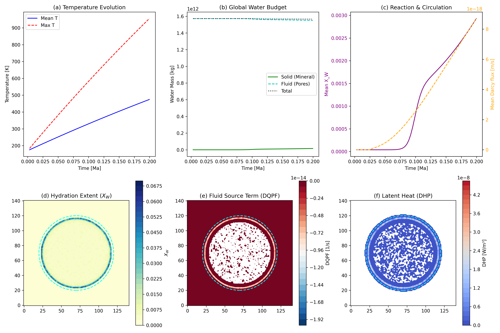
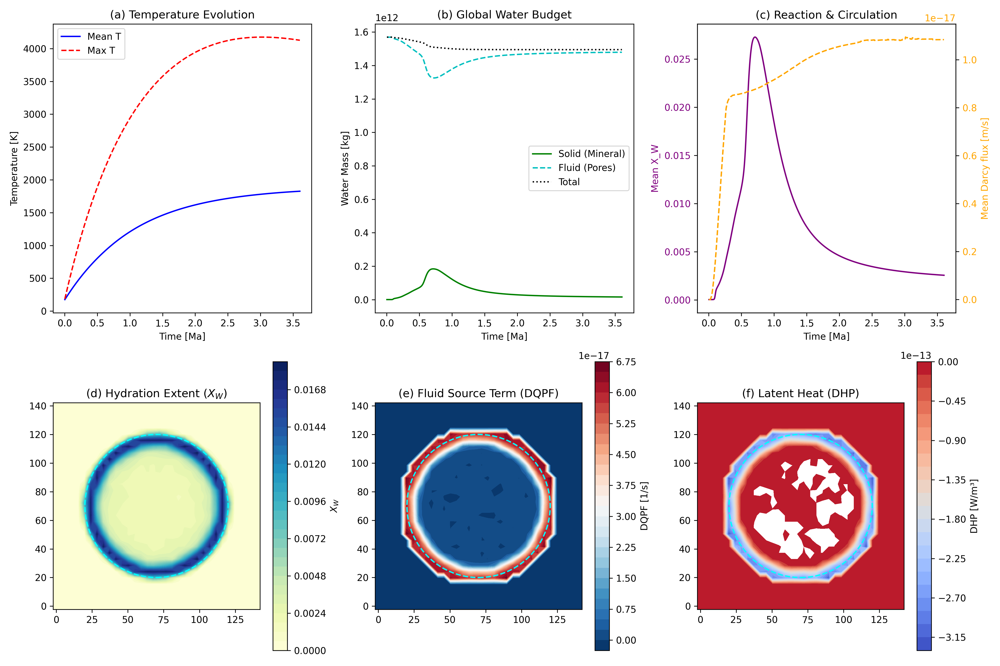

# Hydrothermal Reactions

This page validates the fully coupled hydro-thermo-chemical module in `Erebus.jl`. The model integrates multi-phase fluid flow, thermal evolution (including latent heat), and the kinetics of hydration and dehydration reactions. 

## 2D Hydrothermal Benchmark

To isolate the effects of hydrothermal reactions and fluid circulation on the global water budget, we initialize a 2D planetesimal (50 km radius) composed of anhydrous rock and pore ice (porosity $\phi = 0.2$). The planetesimal is heated by short-lived radionuclides, which melts the ice and drives hydrothermal circulation. 

As the interior heats up, hydration reactions consume pore fluid to produce hydrated minerals. The benchmark verifies:
1. **Reaction Kinetics:** The hydration and dehydration fronts propagate correctly according to the Arrhenius kinetic model (`hydration_mode = 1`, `dehydration_mode = 2`).
2. **Latent Heat (`DHP`):** The release of heat during hydration (exothermic) and absorption during dehydration (endothermic).
3. **Mass Conservation:** The exchange of water mass between the fluid (pore) phase and the solid (mineral) phase, diagnosed via the fluid source term `DQPF`.

### 128x128 High-Resolution Results

The following fields demonstrate the state of the planetesimal after internal heating has driven widespread hydration.

- **(a) Temperature Evolution:** The mean and maximum temperatures rise rapidly due to radiogenic heating, before relaxing as heat conducts outward.
- **(b) Global Water Budget:** The total water mass is conserved. Water transitions from the fluid phase (pores) to the solid phase (hydrated minerals) as the hydration front moves inward.
- **(c) Reaction & Circulation:** Mean fluid circulation (Darcy flux $|q|$) peaks during the main hydration phase.
- **(d) Hydration Extent ($X_W$):** A fully hydrated outer shell forms, while the inner core remains anhydrous due to high temperatures preventing hydration.
- **(e) Fluid Source Term (DQPF):** Active regions of fluid consumption (hydration) and production (dehydration).
- **(f) Latent Heat (DHP):** The corresponding thermal feedback from the reaction fronts.

### 32x32 Low-Resolution Comparison

For rapid testing and continuous integration, we also provide a 32x32 benchmark. Despite the coarser grid, it captures the same macroscopic physical behavior and mass conservation constraints.

## Configurations

The benchmark configurations can be found in `configs/`:
- `hydrothermal_reaction_on_128.toml` (Coupled, high-resolution)
- `hydrothermal_reaction_on_32.toml` (Coupled, low-resolution)
- `hydrothermal_reaction_off_32.toml` (Baseline, reactions disabled)
