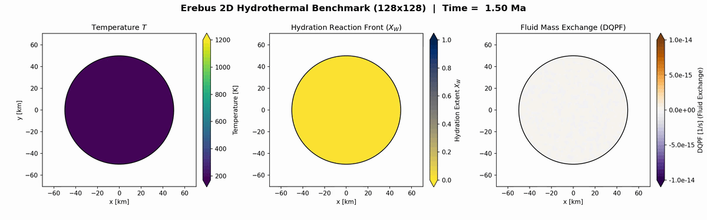
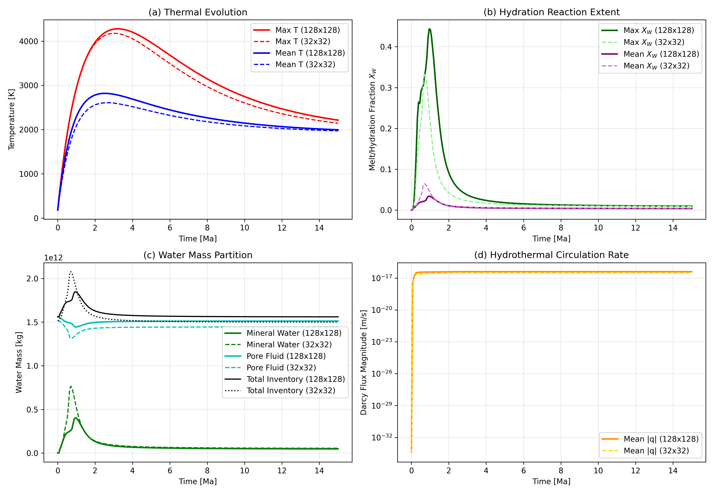
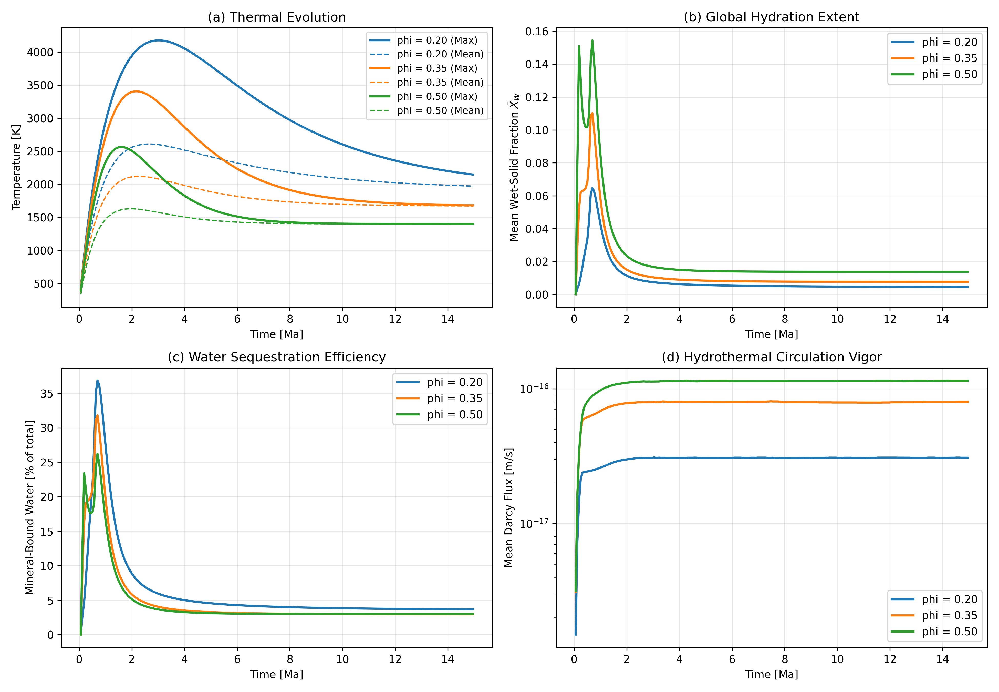

# Hydrothermal Water-Rock Reactions

This page validates the coupled hydro-thermo-chemical module in `Erebus.jl`. The model integrates multi-phase porous fluid flow, thermal changes with latent heat, and reaction rates.

## 2D Hydrothermal Benchmark

The numerical benchmark simulates the full two-dimensional coupled evolution of a 50 km radius planetesimal, resolving Darcy porous flow, thermal convection, and kinetic mineral hydration simultaneously. The interior starts with anhydrous rock, and pore ice. Short-lived radionuclide decay of $^{26}\text{Al}$ heats the interior, melts the ice, and starts fluid flow.

When temperatures rise, water-rock reactions bind pore fluid into hydrous phases. 

The benchmark verifies:
1. **Reaction Rates:** Wet and dry fronts advance following Arrhenius kinetics (`hydration_mode = 1`, `dehydration_mode = 2`).
2. **Latent Heat Feedback:** Heat releases when rock hydrates, and absorbs when hydrous rock breaks down, through the `DHP` term.
3. **Conserved Mass:** Fluid exchange between pore fluid and mineral phases conserves total water, tracked by the `DQPF` diagnostic.

### High-Resolution Benchmark (128x128)

The 128x128 grid resolves detailed reaction front geometry, and internal flow.

- **(a) Thermal History:** Central temperature increases from radiogenic heating, and relaxes as heat conducts outward.
- **(b) Water Mass Partition:** Total water mass stays constant. Pore fluid transitions into mineral-bound water, as the wet front moves inward.
- **(c) Fluid Flow:** Mean Darcy velocity peaks during the primary hydration window.
- **(d) Reaction Extent ($X_W$):** A hydrated outer shell forms around an anhydrous core. Core temperatures stay high.
- **(e) Fluid Source Term (DQPF):** Shows local fluid uptake in wet zones, and water loss in dry zones.
- **(f) Latent Heat (DHP):** Shows thermal release and heat loss along active reaction fronts.

### 2D Simulation Animation

The animation below shows the time history of internal temperature (left), hydration extent $X_W$ (center), and fluid mass exchange rate `DQPF` (right), over 15 Ma.

### Grid Convergence (32x32 versus 128x128)

We test spatial grid convergence by comparing the 32x32 grid ($4.24\text{ km}$ cell size), with the 128x128 grid ($1.09\text{ km}$ cell size).

Comparison yields:
- **Thermal Match:** Peak core temperature differs by 2.4% (4174.9 K at 32x32, versus 4277.2 K at 128x128).
- **Reaction Extent:** Final mean hydrous phase share $\bar{X}_W$ matches closely (0.0046 at 32x32, versus 0.0040 at 128x128), with a gap below 0.043 for all steps.
- **Conserved Water:** Both grid sizes conserve total water inventory during the run.
- **Flow Speed:** Peak Darcy velocity agrees to a factor of 1.2.

### Porosity Parameter Sweep ($\phi_0 \in [0.20, 0.50]$)

We test the role of initial pore ice, by varying initial porosity $\phi_0$ from 0.20 to 0.50.

The parameter sweep reveals three distinct regimes:
1. **Thermal Buffer:** Core temperature drops. Increasing $\phi_0$ from 0.20 to 0.50 lowers maximum core temperature from 4174.9 K, to 2564.1 K, because larger fluid volume increases heat capacity, and convective cooling.
2. **Hydration Bound:** Maximum hydration extent $X_W$ increases from 0.335 ($\phi_0 = 0.20$), to 0.639 ($\phi_0 = 0.50$). In low-porosity planetesimals, hydration stops when local pore water depletes. Higher initial porosity allows larger hydration extent.
3. **Flow Intensity:** Peak Darcy velocity increases by a factor of 3.7 (from $3.09 \times 10^{-17}\text{ m/s}$, to $1.15 \times 10^{-16}\text{ m/s}$), as higher porosity increases bulk permeability.

## Configurations

Model setup files live in `configs/`:
- `hydrothermal_reaction_on_128.toml` (Coupled benchmark, 128x128)
- `hydrothermal_reaction_on_32.toml` (Coupled benchmark, 32x32)
- `hydrothermal_reaction_off_32.toml` (Baseline benchmark, reactions disabled)
- `hydrothermal_reaction_sweep_phi20.toml` ($\phi_0 = 0.20$ sweep)
- `hydrothermal_reaction_sweep_phi35.toml` ($\phi_0 = 0.35$ sweep)
- `hydrothermal_reaction_sweep_phi50.toml` ($\phi_0 = 0.50$ sweep)
