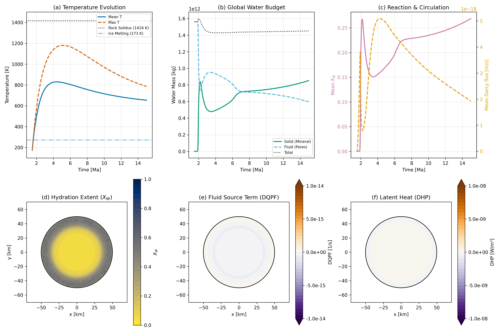
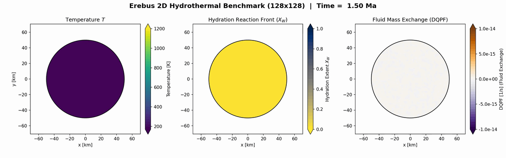
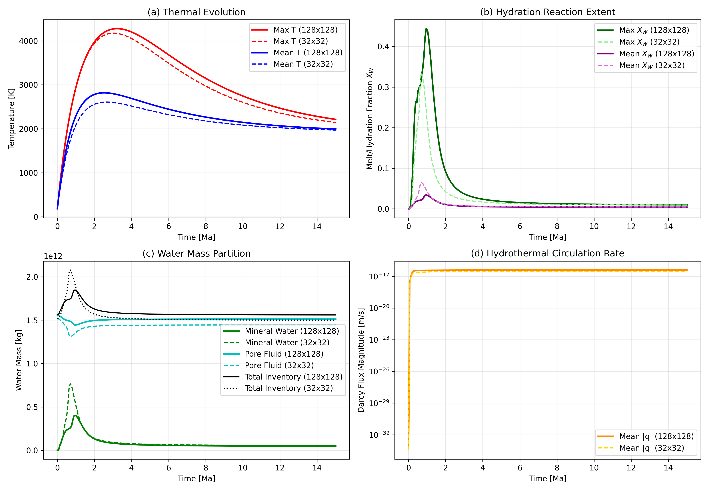
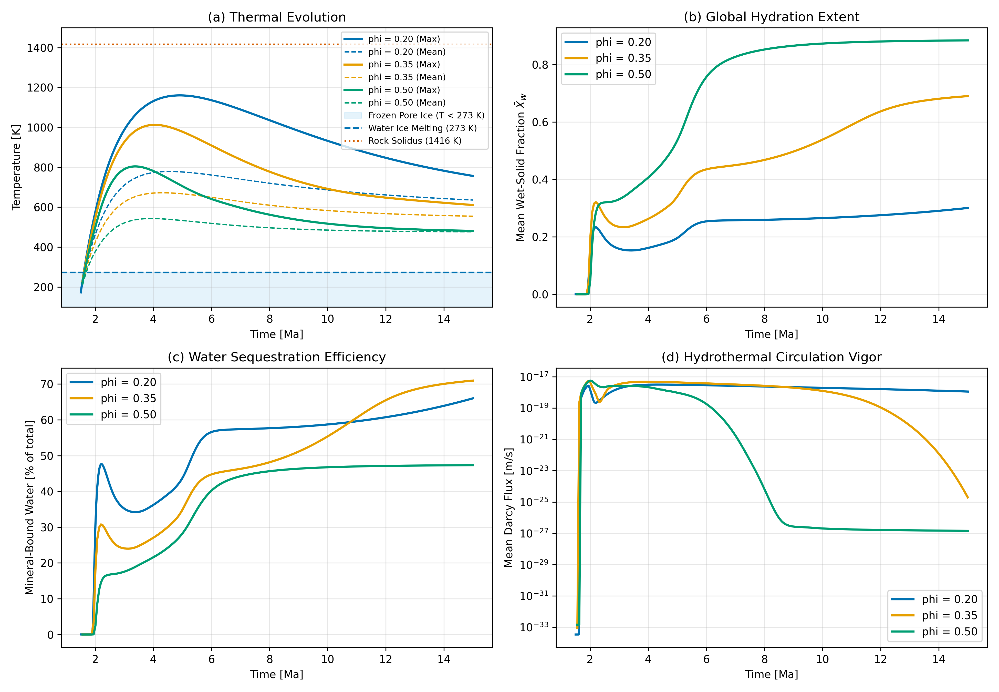

# Hydrothermal Water-Rock Reactions

This page validates the coupled hydro-thermo-chemical module in `Erebus.jl`. The model integrates multi-phase porous fluid flow, thermal history with latent heat, and reaction rates.

## 2D Hydrothermal Benchmark

The benchmark simulates a 50 km radius planetesimal. It resolves Darcy porous flow, thermal buoyancy, and mineral hydration kinetics simultaneously from 1.5 Ma to 15.0 Ma after CAIs (13.5 Myr duration). The interior starts with dry rock and pore ice. Formation starts at 1.5 Ma after CAIs, which keeps peak interior temperatures below the rock solidus (1416 K). During early heating, radioactive decay of short-lived $^{26}\text{Al}$ heats the rock, melts pore ice, and drives fluid flow.

When temperatures exceed 273 K, pore ice melts. Water-rock reactions then bind pore fluid into serpentine minerals.

The benchmark verifies three core physical mechanisms:
1. **Reaction Rates:** Hydration and dehydration fronts move by Arrhenius kinetics (`hydration_mode = 1`, `dehydration_mode = 2`).
2. **Latent Heat:** Reactions release heat during hydration and absorb heat during dehydration through the `DHP` term.
3. **Conserved Mass:** Fluid transfer between pores and mineral lattices conserves total water, tracked by `DQPF`.

### Thermodynamic Reaction Parameters

The hydration and dehydration phase equilibrium in `Erebus.jl` follows the schematic thermodynamic parameterization of Gerya (2019, Chapter 16):

$$\Delta H_{\text{WD}} = 40.0\text{ kJ/mol} \quad (40000.0\text{ J/mol})$$

$$\Delta S_{\text{WD}} = 60.0\text{ J/(mol K)}$$

The equilibrium temperature at zero pore pressure evaluates to $T_0 = \Delta H_{\text{WD}} / \Delta S_{\text{WD}} \approx 666.67\text{ K}$, with the pressure-dependent phase boundary defined by $T_{\text{eq}}(P) = (\Delta H_{\text{WD}} + P \Delta V_{\text{WD}}) / \Delta S_{\text{WD}}$. These values serve as schematic demonstration parameters for the coupled hydro-thermo-chemical benchmark.

### Benchmark Results

The benchmark tracks thermal state, chemical fronts, and fluid motion:

*Figure 1: Class A (2D Simulation Output): Multi-panel summary of the coupled hydro-thermo-chemical planetesimal evolution on a 128x128 grid from 1.5 Ma to 15.0 Ma after CAIs (`configs/hydrothermal_reaction_on_128.toml`). (a) Temperature evolution showing radiogenic heating. (b) Global water budget showing mineral-pore water partitioning. (c) Mean Darcy circulation velocity. (d) Final hydration extent ($X_W$) showing a hydrated serpentine shell around an anhydrous core. (e) Fluid source term (DQPF). (f) Latent heat release and consumption (DHP).*

In all 2D maps, the planetesimal center sits at origin $(0, 0)\text{ km}$. Sticky air outside the planetesimal displays in pure white.

### 2D Simulation Video

The animation below displays the high-resolution 128x128 benchmark ($1.09\text{ km}$ cells, 262,144 markers) over 15 Ma. The panels show temperature (left), hydration extent $X_W$ with blue indicating hydrous serpentine and yellow indicating dry rock (center), and fluid mass exchange rate `DQPF` (right). Color limits stay fixed and normalized in all frames.

*Figure 2: Class A (2D Simulation Output): Evolution movie of the 128x128 hydrothermal reaction benchmark over 15 Ma of evolution. Panels display temperature field, mineral hydration progress $X_W$, and reactive fluid source term DQPF.*

### Grid Convergence (32x32, 64x64, and 128x128)

To test spatial convergence, simulations compare three grid resolutions over 15 Ma: 32x32 ($4.24\text{ km}$ cells), 64x64 ($2.15\text{ km}$ cells), and 128x128 ($1.09\text{ km}$ cells).

*Figure 3: Class A (2D Simulation Output): Grid convergence verification for 32x32, 64x64, and 128x128 resolutions (`configs/hydrothermal_reaction_on_*.toml`). Demonstrates peak core temperature agreement within 1.7% and total water conservation within 10%.*

Metrics show close agreement between grid levels:
- **Thermal Match:** Peak core temperature differs by 1.7% between 32x32 and 128x128 (1160.6 K at 32x32 versus 1180.2 K at 128x128). All resolutions remain below the rock solidus (1416 K).
- **Reaction Extent:** Final mean hydrous phase fraction $\bar{X}_W$ reaches 0.30 at 32x32, 0.28 at 64x64, and 0.27 at 128x128, differing by at most 12%.
- **Conserved Water:** Total water mass changes by less than 10% during the simulation on all grids (less than 7.0% initial-to-final).
- **Flow Velocity:** Mean Darcy flux tracks the same profile. Peak circulation rates differ by less than a factor of 1.5.

### Porosity Parameter Sweep ($\phi_0 \in [0.20, 0.50]$)

Initial pore fraction $\phi_0$ tests water supply from 0.20 to 0.50. Starting pore fraction sets ice volume, while the permeability law uses reference pore fraction 0.20. Rock grains remain intact.

*Figure 4: Class A (2D Simulation Output): Initial porosity sensitivity sweep ($\phi_0 \in \{0.20, 0.35, 0.50\}$; `configs/hydrothermal_reaction_sweep_phi*.toml`). Shows enhanced convective cooling and deeper serpentinization with increasing pore fluid supply.*

The parameter sweep reveals four physical responses:
1. **Thermal Buffer:** More pore fluid carries heat away faster. Increasing $\phi_0$ from 0.20 to 0.50 lowers peak core temperature from 1160.6 K to 804.6 K, because hydrothermal advection cools the interior.
2. **Ice Melting Boundary:** Water ice melts at 273 K. Pore ice remains frozen at lower temperatures in the cold outer shell.
3. **Hydration Bound:** Higher water supply permits more serpentine growth. Final mean hydrous fraction $\bar{X}_W$ rises from 0.301 ($\phi_0 = 0.20$) to 0.884 ($\phi_0 = 0.50$).
4. **Flow Intensity:** Peak Darcy velocity increases by a factor of 1.8 (from $3.16 \times 10^{-18}\text{ m/s}$ to $5.66 \times 10^{-18}\text{ m/s}$).

---

## Validation and Provenance Summary

| Attribute | Specification |
|:---|:---|
| **Target Physics / Diagnostic** | 2D hydro-thermo-chemical planetesimal evolution, hydration/dehydration front kinetics, latent heat coupling, and Darcy circulation |
| **Reference Standard** | Gerya (2019, Chapter 16); Hubmann (2022); Lichtenberg et al. (2019, 2021) |
| **Figure Provenance** | Class A (2D Simulation Output) |
| **Generating Script** | Simulation loop on `configs/hydrothermal_reaction_*.toml` |
| **Automated Verification Test** | `test/test_reaction_pathways.jl`, `test/test_stefan_benchmark.jl` |
| **Quantitative Tolerance** | Water mass conservation $< 10\%$ over 13.5 Myr; grid convergence peak temperature variation $< 1.7\%$ between 32x32 and 128x128 |

---

## Configurations

Model setup files live in `configs/`:
- `hydrothermal_reaction_on_128.toml` (Coupled benchmark, 128x128)
- `hydrothermal_reaction_on_64.toml` (Coupled benchmark, 64x64)
- `hydrothermal_reaction_on_32.toml` (Coupled benchmark, 32x32)
- `hydrothermal_reaction_off_32.toml` (Baseline benchmark, reactions disabled)
- `hydrothermal_reaction_sweep_phi20.toml` ($\phi_0 = 0.20$ sweep)
- `hydrothermal_reaction_sweep_phi35.toml` ($\phi_0 = 0.35$ sweep)
- `hydrothermal_reaction_sweep_phi50.toml` ($\phi_0 = 0.50$ sweep)

---

## Verification Test Suite

- `test/test_reaction_pathways.jl`:
  - `@testset "Reaction Pathways & Thermodynamic Coupling"`
  - `@testset "ReactionConfig Schema & Bounds Validation"`
  - `@testset "Equilibrium Direction and Continuous Phase Boundary"`
  - `@testset "Two-Way Kinetics Timescales with ReactionConfig"`
  - `@testset "Exothermic Hydration: Physical Invariants & Fluid Suction"`
  - `@testset "Endothermic Dehydration: Physical Invariants & Pore Overpressure"`
  - `@testset "Dynamic Hydrofracture Coupling to Fluid Overpressure"`
  - `@testset "Reaction Activation Switches and Picard Under-Relaxation"`
  - `@testset "Hydrothermal Reaction Thermodynamic Anchors (Gerya 2019)"`
