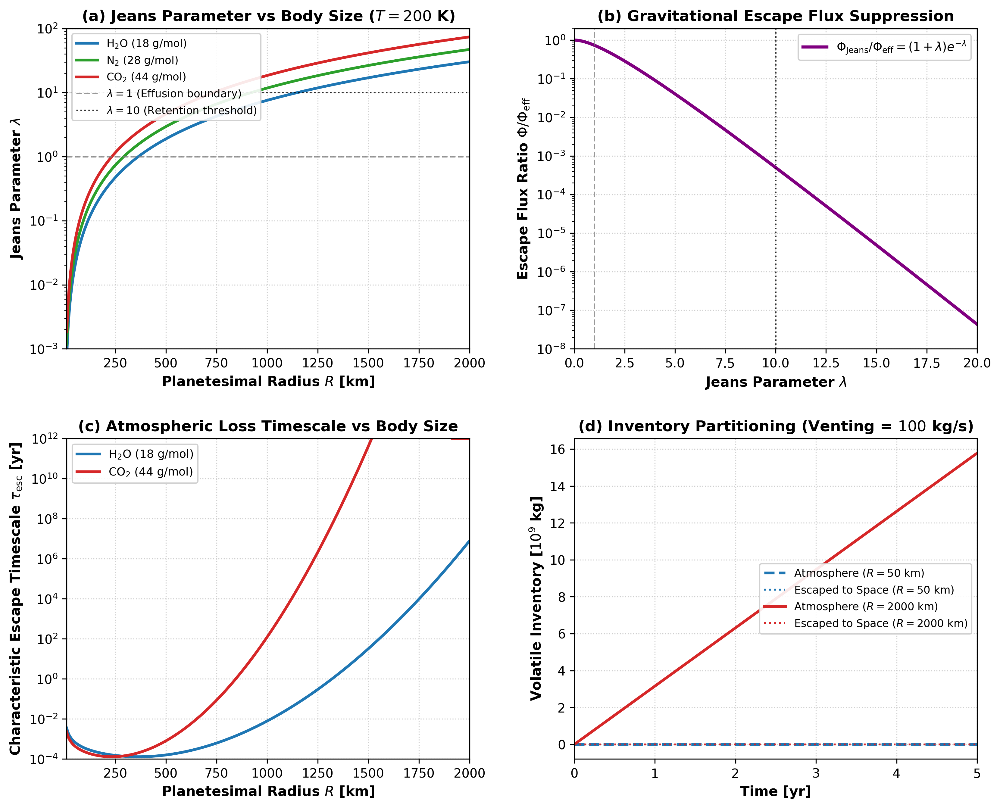

# Jeans Kinetic Atmospheric Escape and Boundary Feedback

This module documents the physical formulation, mathematical limits, and numerical implementation of thermal Jeans escape and atmospheric pressure feedback in `Erebus.jl`.

---

## 1. Physical Motivation

Volatiles released by cold surface venting or interior magma ocean degassing collect at the planetesimal surface, forming a transient vapor envelope. On low-mass bodies ($R \le 100\text{ km}$), gravitational binding energy is low compared to thermal kinetic energy, causing the atmosphere to escape rapidly into the surrounding space.

In `Erebus.jl`, atmospheric evolution connects surface venting, planetary gravity, thermal velocity distributions, and boundary pressure feedback:

1. **Effusion vs Retention**: Planetesimals with low escape velocity ($v_{\text{esc}} \ll v_{\text{th}}$, $\lambda \ll 1$) cannot retain vented volatiles; molecules in the high-velocity Maxwellian tail effuse into space. Larger planetary embryos ($R > 1400\text{ km}$, $\lambda > 10$) gravitationally trap volatiles, sustaining surface atmospheres.
2. **2D to 3D Planetary Coupling**: In the 2D Cartesian simulation grid, fluid mass draining from marker porosity is modeled per unit out-of-plane length ($[\text{kg/m}]$). To couple with the 3D spherical atmosphere, this 2D mass is scaled to 3D using the volume-to-area geometric depth $L_{\text{3D}} = V_{\text{3D}} / A_{\text{2D}} = \frac{4}{3} R_{\text{planet}}$ [m] before solving atmospheric inventory evolution; this ensures that $P_{\text{atm}} = M_{\text{atm}} g / (4 \pi R_{\text{planet}}^2)$ evaluates in true Pascals.
3. **Volatile Mass Fractionation**: Kinetic escape rates depend directly on molecular mass ($m_i$). Light species escape orders of magnitude faster than heavy species. In the 2D coupled Stokes-Darcy simulation loop, marker fluid drainage is tracked as a bulk $\text{H}_2\text{O}$ vapor reservoir, whereas multi-species fractionation is solved analytically via `evolve_atmospheric_species_inventory` and illustrated in standalone benchmarks.
4. **Surface Boundary Feedback**: The accumulated atmospheric mass generates a downward hydrostatic pressure $P_{\text{atm}} = M_{\text{atm}} g / (4 \pi R^2)$. This column weight adds to ambient nebular or space pressure ($P_{\text{amb,eff}} = P_{\text{amb}} + P_{\text{atm}}$), opposing porous Darcy venting and suppressing further volatile boiling.

---

## 2. Mathematical Formulation

### Gravitational Escape Velocity and Maxwellian Thermal Velocity

For a spherical body of total mass $M$ [$\text{kg}$] and radius $R$ [$\text{m}$], the gravitational escape velocity is:

$$v_{\text{esc}} = \sqrt{\frac{2 G M}{R}}$$

For a gas species of molecular mass $m$ [$\text{kg}$] at exobase temperature $T_{\text{exo}}$ [$\text{K}$], the most probable Maxwellian thermal velocity is:

$$v_{\text{th}} = \sqrt{\frac{2 k_B T_{\text{exo}}}{m}}$$

where $G = 6.67430\times 10^{-11}\text{ m}^3/(\text{kg}\cdot\text{s}^2)$ is the gravitational constant and $k_B = 1.380649\times 10^{-23}\text{ J/K}$ is the Boltzmann constant.

### Jeans Parameter and Kinetic Effusion Flux

The dimensionless Jeans escape parameter $\lambda$ characterizes the gravitational-to-thermal energy ratio:

$$\lambda = \left(\frac{v_{\text{esc}}}{v_{\text{th}}}\right)^2 = \frac{G M m}{k_B T_{\text{exo}} R_{\text{exo}}}$$

The classic kinetic escape flux $\Phi_{\text{Jeans}}$ [$\text{molecules}/(\text{m}^2\cdot\text{s})$] through the exobase surface $R_{\text{exo}}$ follows Jeans (1925):

$$\Phi_{\text{Jeans}} = \frac{n_{\text{exo}} v_{\text{th}}}{2 \sqrt{\pi}} (1 + \lambda) \exp(-\lambda)$$

where $n_{\text{exo}}$ is the number density at the exobase.

### Integrated Loss Rate and Timescale

Using the barometric scale height $H = k_B T / (m g)$, the planetary mass loss rate $\dot{M}_{\text{escape}}$ [$\text{kg/s}$] relates linearly to the atmospheric inventory $M_{\text{atm}}$:

$$\dot{M}_{\text{escape}} = 4 \pi R_{\text{exo}}^2 m \Phi_{\text{Jeans}} = k_{\text{escape}} M_{\text{atm}}$$

where the linear escape rate coefficient $k_{\text{escape}}$ [$\text{s}^{-1}$] is:

$$k_{\text{escape}} = \frac{v_{\text{th}}}{2 \sqrt{\pi} H} (1 + \lambda) \exp(-\lambda)$$

The exobase density closure $M_{\text{atm}} \approx 4 \pi R^2 \rho_{\text{exo}} H$ is an upper bound on escape loss for gravitationally bound atmospheres ($\lambda > 1$), where true exobase density falls below the column average. The characteristic atmospheric depletion timescale is $\tau_{\text{loss}} = 1 / k_{\text{escape}}$ [$\text{s}$].

### Atmospheric Mass Conservation and Analytic Step Solution

The ordinary differential equation for atmospheric mass evolution under surface venting $\dot{M}_{\text{vent}}$ and kinetic escape is:

$$\frac{d M_{\text{atm}}}{dt} = \dot{M}_{\text{vent}} - k_{\text{escape}} M_{\text{atm}}$$

For computational step $\Delta t$, the exact integration gives:

$$M_{\text{atm}}(t + \Delta t) = M_{\text{atm}}(t) \exp(-k_{\text{escape}} \Delta t) + \frac{\dot{M}_{\text{vent}}}{k_{\text{escape}}} \left[1 - \exp(-k_{\text{escape}} \Delta t)\right]$$

To prevent numerical catastrophic cancellation when $x = k_{\text{escape}} \Delta t < 10^{-6}$, the source factor is evaluated via its Taylor expansion:

$$\frac{1 - \exp(-x)}{k_{\text{escape}}} = \Delta t \left(1 - \frac{x}{2} + \frac{x^2}{6}\right)$$

Cumulative mass lost to space during the step is:

$$\Delta M_{\text{escaped}} = M_{\text{atm}}(t) + \dot{M}_{\text{vent}} \Delta t - M_{\text{atm}}(t + \Delta t)$$

which guarantees exact mass balance to double-precision tolerance.

### Surface Pressure Feedback

The downward atmospheric pressure at the solid boundary is:

$$P_{\text{atm}} = \frac{M_{\text{atm}} g}{4 \pi R_{\text{planet}}^2}$$

The effective ambient boundary pressure entering the venting boundary conditions is:

$$P_{\text{amb,eff}} = P_{\text{amb}} + P_{\text{atm}}$$

---

## 3. Literature Anchors

- **Jeans, J. H. (1925)**. *The Dynamical Theory of Gases* (4th ed.). Cambridge University Press.
- **Chamberlain, J. W., & Hunten, D. M. (1987)**. *Theory of Planetary Atmospheres: An Introduction to Radiative Transfer and Planetary Atmospheres* (2nd ed.). Academic Press.
- **Catling, D. C., & Kasting, J. F. (2017)**. *Atmospheric Evolution on Inhabited and Lifeless Worlds*. Cambridge University Press.  
  [https://doi.org/10.1017/9781139020558](https://doi.org/10.1017/9781139020558)
- **Tian, F. (2015)**. History of water on Mars: A review. *Solar System Research*, 49(7), 548-554.  
  [https://doi.org/10.1134/S003809461507011X](https://doi.org/10.1134/S003809461507011X)
- **Zahnle, K. J., & Catling, D. C. (2017)**. The cosmic shoreline: The evidence that atmospheric loss can explain the division between atmospheres and bare rocks in the Solar System and exoplanets. *The Astrophysical Journal*, 843(2), 122.  
  [https://doi.org/10.3847/1538-4357/aa7747](https://doi.org/10.3847/1538-4357/aa7747)

---

## 4. Parameterization Behavior

Figure 1 illustrates the scaling regimes of Jeans escape across planetary body sizes, volatile species, and evolutionary time:

*Figure 1: Four-panel diagnostic verification of thermal Jeans escape and atmospheric inventory evolution. (a) Dimensionless Jeans parameter $\lambda = (v_{\text{esc}}/v_{\text{th}})^2$ as a function of planetary radius ($R \in [10, 2000]\text{ km}$) for three volatile species ($\text{H}_2\text{O}, \text{N}_2, \text{CO}_2$) at exobase temperature $T_{\text{exo}} = 200\text{ K}$, which marks the transition from rapid kinetic effusion ($\lambda \ll 1$) on small planetesimals to gravitational retention ($\lambda \gg 10$) on massive embryos. (b) Normalized kinetic escape flux ratio $\Phi_{\text{Jeans}} / \Phi_{\text{eff}} = (1 + \lambda) e^{-\lambda}$ where $\Phi_{\text{eff}} = n_{\text{exo}} v_{\text{th}} / (2 \sqrt{\pi})$, which follows exponential suppression $\propto (1+\lambda) e^{-\lambda}$. (c) Characteristic atmospheric depletion timescale $\tau_{\text{loss}} = 1 / k_{\text{escape}}$ across planetary radius ($R \in [10, 2000]\text{ km}$) for $\text{H}_2\text{O}$ and $\text{CO}_2$. Small bodies ($R \le 100\text{ km}$) lose their atmospheres within hours to weeks, whereas bodies larger than $1400\text{ km}$ retain heavy species over gigayear timescales. (d) Water vapor inventory partitioning between atmospheric retention and escape to space over 5 years under steady surface venting ($\dot{M}_{\text{vent}} = 100\text{ kg/s}$) for a small planetesimal ($R = 50\text{ km}$, $\lambda = 0.0189$) and a large planetary embryo ($R = 2000\text{ km}$, $\lambda = 30.3$). On the small planetesimal, low gravity and rapid effusion allow all vented water to escape to space with minimal atmospheric accumulation, whereas the 2000 km embryo retains the vented volatiles in an accumulating atmosphere.*

---

## 5. Mathematical Invariants and Implementation Checks

1. **Positivity and Domain Bounds**: The gravitational escape velocity, thermal velocity, scale height, and Jeans parameter remain strictly positive for physical inputs ($M > 0$, $R > 0$, $T > 0$, $m > 0$). Non-physical inputs throw explicit `DomainError` exceptions.
2. **Mass Invariant Conservation**: In numerical integration of $dM_{\text{atm}}/dt = \dot{M}_{\text{vent}} - k_{\text{escape}} M_{\text{atm}}$, the sum of final atmospheric mass and cumulative escaped mass equals initial atmospheric mass plus total injected vented mass ($M_{\text{atm}}(t+\Delta t) + \Delta M_{\text{escaped}} = M_{\text{atm}}(t) + \dot{M}_{\text{vent}} \Delta t$) to double-precision tolerance ($< 10^{-12}$).
3. **Small-Loss Taylor Convergence**: When $k_{\text{escape}} \Delta t < 10^{-6}$, the linear source evaluation matches the unregularized formula to relative error $< 10^{-14}$, which eliminates numerical division-by-zero artifacts when escape rates approach zero.
4. **Exponential Flux Suppression**: For large Jeans parameters exceeding $\text{JEANS\_LAMBDA\_CUTOFF} = 100$, kinetic effusion flux is set to zero, which preserves atmospheric inventories on massive bodies.
5. **Species Mass Ordering**: For identical thermal and planetary conditions, heavier volatiles have strictly larger Jeans parameters ($\lambda_{\text{CO}_2} > \lambda_{\text{N}_2} > \lambda_{\text{H}_2\text{O}}$) and longer retention timescales.
