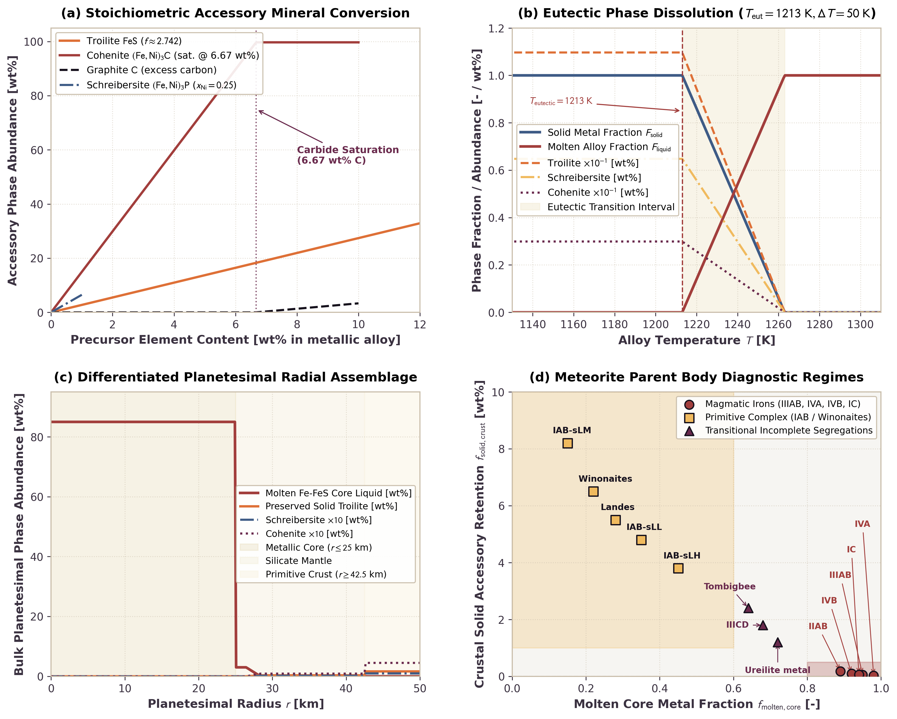

# Normative Accessory Mineral Tracking and Meteorite Diagnostics

This page documents the physical formulation, stoichiometric parameterizations, and numerical validation of normative accessory mineral tracking and meteorite parent body diagnostics in `Erebus.jl`. The model tracks sub-eutectic stoichiometric mineral allocation (troilite $\text{FeS}$, schreibersite $(\text{Fe,Ni})_3\text{P}$, cohenite $(\text{Fe,Ni})_3\text{C}$, graphite $\text{C}$, and nitrides $\text{Fe}_4\text{N}/\text{CrN}/\text{TiN}$) in metallic phases, models eutectic phase dissolution near $T_{\text{eutectic}} \approx 1213\text{ K}$, and computes regional modal distributions to classify meteorite parent body affinities.

---

## 1. Physical Motivation

The physical and chemical signatures of iron and stony-iron meteorites preserve records of planetary differentiation, core segregation, and thermal metamorphism in early planetesimals:

1. Magmatic iron meteorites (groups IIAB, IIIAB, IVA, IVB) represent fractional crystallization products of fully segregated metallic cores. In these bodies, extensive internal heating melted both metallic alloy and silicates. Molten metal collected into a central core, leaving silicate mantles and crusts depleted in metallic iron and accessory phases (Goldstein et al., 2009; Chabot and Drake, 1999).
2. Primitive iron and achondrite complexes (the IAB complex and winonaites) contain abundant angular silicate inclusions, high carbon abundances (cohenite and graphite), schreibersite, and troilite veins. Their textures and geochemistry indicate incomplete differentiation, partial melting, and limited core segregation in partially melted parent bodies (Benedix et al., 2000).

Tracking the spatial and thermal distribution of accessory phases provides a direct geochemical diagnostic link between numerical geodynamic simulations and laboratory meteorite petrology.

---

## 2. Mathematical Formulation

### Stoichiometric Accessory Phase Allocation

In solid metallic iron-nickel alloys below the eutectic temperature ($T \le T_{\text{eutectic}}$), minor and volatile elements (S, P, C, and N) exsolve into stoichiometric accessory minerals.

#### Troilite ($\text{FeS}$)

All available sulfur in the metallic phase forms stoichiometric troilite:

$$w_{\text{troilite}} = w_S \cdot \left(\frac{M_{\text{FeS}}}{M_S}\right) \approx 2.74162 \cdot w_S$$

$$w_{\text{Fe,troilite}} = w_S \cdot \left(\frac{M_{\text{Fe}}}{M_S}\right) \approx 1.74162 \cdot w_S$$

where $M_S = 32.065\text{ g/mol}$, $M_{\text{Fe}} = 55.845\text{ g/mol}$, and $M_{\text{FeS}} = 87.910\text{ g/mol}$.

#### Schreibersite ($(\text{Fe,Ni})_3\text{P}$)

Phosphorus combines with metallic iron and nickel to form schreibersite. With nickel fraction in metal $x_{\text{Ni}} \in [0, 1]$ (default $0.25$):

$$M_{\text{metal,avg}} = (1 - x_{\text{Ni}}) M_{\text{Fe}} + x_{\text{Ni}} M_{\text{Ni}}$$

$$M_{\text{schreibersite}} = 3 \cdot M_{\text{metal,avg}} + M_P$$

$$w_{\text{schreibersite}} = w_P \cdot \left(\frac{M_{\text{schreibersite}}}{M_P}\right) \approx 6.478 \cdot w_P$$

where $M_{\text{Ni}} = 58.6934\text{ g/mol}$ and $M_P = 30.97376\text{ g/mol}$.

#### Cohenite ($(\text{Fe,Ni})_3\text{C}$) and Graphite ($\text{C}$)

Carbon combines with iron to form cohenite up to the carbide saturation threshold $w_{C,\text{max}} \approx 0.0667$ ($6.67\text{ wt}\%$ C, corresponding to stoichiometric $\text{Fe}_3\text{C}$):

$$w_{\text{cohenite}} = \begin{cases}
w_C \cdot \left(\frac{3 M_{\text{Fe}} + M_C}{M_C}\right) \approx 14.948 \cdot w_C, & w_C \le w_{C,\text{max}} \\
w_{C,\text{max}} \cdot \left(\frac{3 M_{\text{Fe}} + M_C}{M_C}\right), & w_C > w_{C,\text{max}}
\end{cases}$$

$$w_{\text{graphite}} = \begin{cases}
0.0, & w_C \le w_{C,\text{max}} \\
w_C - w_{C,\text{max}}, & w_C > w_{C,\text{max}}
\end{cases}$$

Excess carbon above carbide saturation precipitates as elemental graphite, consistent with petrographic observations in primitive IAB meteorites.

#### Nitrides ($\text{Fe}_4\text{N}$, $\text{CrN}$, $\text{TiN}$)

Nitrogen allocates to accessory nitrides based on the selected `nitride_mode`:

1. `:roaldite` ($\text{Fe}_4\text{N}$, default): $w_{\text{nitride}} = w_N \cdot (4 M_{\text{Fe}} + M_N) / M_N \approx 16.948 \cdot w_N$.
2. `:carlsbergite` ($\text{CrN}$): $w_{\text{nitride}} = w_N \cdot (M_{\text{Cr}} + M_N) / M_N \approx 4.712 \cdot w_N$.
3. `:osbornite` ($\text{TiN}$): $w_{\text{nitride}} = w_N \cdot (M_{\text{Ti}} + M_N) / M_N \approx 4.417 \cdot w_N$.

#### Residual Metal Matrix and Mass Normalization

The remaining fraction of the solid metallic phase forms the metallic iron-nickel matrix:

$$w_{\text{matrix}} = \max\left(0.0, 1.0 - (w_{\text{troilite}} + w_{\text{schreibersite}} + w_{\text{cohenite}} + w_{\text{graphite}} + w_{\text{nitride}})\right)$$

When the sum of accessory mineral mass fractions exceeds $1.0$ (for extreme volatile enrichments), mineral fractions scale by $1.0 / \sum w_i$ so their total equals $1.0$, and $w_{\text{matrix}} = 0.0$.

---

### Thermal Eutectic Phase Dissolution

At elevated temperatures, solid accessory phases dissolve into eutectic metallic liquid. While the binary Fe-FeS eutectic temperature at low planetary pressure is approximately $1261\text{ K}$ ($988\ ^\circ\text{C}$), minor additions of nickel, phosphorus, and carbon depress the initial melting temperature to $\approx 1213\text{ K}$ ($940\ ^\circ\text{C}$; Chabot and Drake, 1999; Goldstein et al., 2009). The solid metal fraction $F_{\text{solid}}(T)$ is parameterized around eutectic temperature $T_{\text{eutectic}}$ (default $1213.0\text{ K}$) and transition interval $\Delta T_{\text{transition}}$ (default $50.0\text{ K}$):

$$F_{\text{solid}}(T) = \begin{cases}
1.0, & T \le T_{\text{eutectic}} \\
1.0 - \frac{T - T_{\text{eutectic}}}{\Delta T_{\text{transition}}}, & T_{\text{eutectic}} < T < T_{\text{eutectic}} + \Delta T_{\text{transition}} \\
0.0, & T \ge T_{\text{eutectic}} + \Delta T_{\text{transition}}
\end{cases}$$

The abundance of each solid accessory mineral on Lagrangian markers scales with the solid metal fraction:

$$X_{m, i} = F_{\text{solid}}(T) \cdot w_i^{\text{stoich}}$$

where $i \in \{\text{troilite}, \text{schreibersite}, \text{cohenite}, \text{graphite}, \text{nitride}, \text{metal matrix}\}$.

---

### Regional Modal Distributions and Meteorite Classification

Planetesimal markers are grouped into three concentric zones based on normalized radial distance $r / R_{\text{planet}}$:
- Core region: $r / R_{\text{planet}} \le r_{\text{core,norm}}$ (default $0.50$).
- Mantle region: $r_{\text{core,norm}} < r / R_{\text{planet}} < r_{\text{mantle,norm}}$ (default $0.85$).
- Crust region: $r / R_{\text{planet}} \ge r_{\text{mantle,norm}}$.

For each zone, volume-weighted mean abundances of accessory phases and metallic melt fraction are computed. The resulting planetary state is classified into diagnostic meteorite categories:

- Magmatic differentiated signature ($f_{\text{molten,core}} \ge 0.80$ and $f_{\text{metal,core}} \ge 0.40$): Represents bodies that underwent complete segregation into a liquid metallic core, characteristic of group IIIAB, IVA, and IVB iron meteorites.
- Primitive incomplete signature ($f_{\text{molten,core}} \le 0.60$ and $f_{\text{solid,crust}} \ge 0.01$): Represents bodies with partial melting, retained crustal accessory minerals, and incomplete metal segregation, characteristic of IAB complexes and winonaites.
- Transitional signature: Intermediate differentiation states with partial core segregation.

---

## 3. Benchmark Validation

*Figure: Benchmark results for normative accessory mineral tracking and meteorite diagnostics in Erebus.jl. Panel (a) shows stoichiometric accessory mineral conversion factors as a function of precursor element content in metallic alloy. Panel (b) shows thermal eutectic phase dissolution showing progressive melting of troilite, schreibersite, and cohenite through the eutectic transition ($T_{\text{eutectic}} = 1213\text{ K}$, $\Delta T = 50\text{ K}$). Panel (c) shows the radial mineral assemblage in a differentiated 50 km radius planetesimal, displaying the molten metallic core, depleted mantle, and accessory-rich primitive crust. Panel (d) shows meteorite parent body diagnostic regimes comparing core melt fraction against crustal accessory retention, with petrologic fields for magmatic iron groups (IIIAB, IVA, IVB) and primitive complexes (IAB, winonaites).*

### Analysis of Benchmark Results

1. Panel (a) shows that linear stoichiometric factors convert precursor element concentrations into accessory phase abundances. Troilite conversion matches the exact molar ratio $M_{\text{FeS}} / M_S \approx 2.742$. Cohenite tracks carbon content up to $6.67\text{ wt}\%$ C; beyond this saturation point, excess carbon precipitates as graphite.
2. Panel (b) illustrates that as temperature rises above $1213\text{ K}$, solid accessory phases dissolve proportionally into molten Fe-FeS liquid alloy. Above $1263\text{ K}$, solid accessory minerals are completely dissolved into metallic liquid.
3. Panel (c) demonstrates that in a differentiated planetesimal with a conductive cooling lid, the hot interior ($T > 1263\text{ K}$) segregates a molten metallic core ($r \le 25\text{ km}$). The conductive crust ($r \ge 42.5\text{ km}$) remains below $1213\text{ K}$, preserving pristine troilite, schreibersite, and cohenite.
4. Panel (d) shows that model trajectories separate magmatic irons (high core melt fraction, depleted crustal accessory retention) from primitive IAB and winonaite complexes (low core melt fraction, high crustal accessory retention), establishing a quantitative framework for matching simulation outputs to meteorite collections.

### Meteorite Diagnostic Regimes and Observational Benchmark Data

Panel (d) compares the molten metallic core fraction against crustal accessory mineral retention across known meteorite parent bodies. The axes quantify the extent of planetary differentiation:

1. **Molten Core Metal Fraction ($f_{\text{molten,core}}$)**:
   The horizontal axis represents the ratio of molten liquid alloy mass in the core zone ($r / R_{\text{planet}} \le 0.50$) to total core metal mass:
   $$f_{\text{molten,core}} = \frac{M_{\text{core,liquid alloy}}}{M_{\text{core,metal}}}$$
   For differentiated bodies with molten metallic cores, $f_{\text{molten,core}} \to 1.0$. For bodies with localized partial melting or sub-eutectic interiors, $f_{\text{molten,core}} \ll 1.0$.

2. **Crustal Solid Accessory Retention ($f_{\text{solid,crust}}$)**:
   The vertical axis represents the mass percentage of solid accessory phases (troilite, schreibersite, and cohenite) retained in the outer conductive shell ($r / R_{\text{planet}} \ge 0.85$) relative to total crustal metal:
   $$f_{\text{solid,crust}} = 100 \times \frac{M_{\text{crust,troilite}} + M_{\text{crust,schreibersite}} + M_{\text{crust,cohenite}}}{M_{\text{crust,metal}}}\quad [\text{wt}\%]$$
   Unmelted chondritic crusts retain $\approx 4\text{ to }9\text{ wt}\%$ solid accessory minerals. Differentiated parent bodies with hot, melted, or stripped silicate shells preserve negligible solid accessory phases ($f_{\text{solid,crust}} \le 0.5\text{ wt}\% = 0.005$ mass fraction).

#### Diagnostic Regime Thresholds

The diagnostic classification regimes in `src/physics.jl` correspond to the shaded regions in Panel (d):

- **Magmatic Differentiated Field** ($f_{\text{molten,core}} \ge 0.80$, $M_{\text{core,metal}} / M_{\text{total,metal}} \ge 0.40$, $f_{\text{solid,crust}} \le 0.5\text{ wt}\%$):
  Red shaded rectangle ($x \in [0.80, 1.00]$, $y \in [0.0, 0.5]\text{ wt}\%$). Defined by extensive core segregation and fractional crystallization of a metallic core, leaving depleted silicates (Chabot and Drake, 1999; Goldstein et al., 2009).
- **Primitive Complex Field** ($f_{\text{molten,core}} \le 0.60$, $f_{\text{solid,crust}} \ge 1.0\text{ wt}\%$):
  Gold shaded rectangle ($x \in [0.00, 0.60]$, $y \in [1.0, 10.0]\text{ wt}\%$). Defined by low degrees of partial melting ($T \approx 1213\text{ to }1450\text{ K}$) and incomplete metal-silicate separation, preserving high accessory phase modes in unmelted crustal matrix (Benedix et al., 2000; Wasson and Kallemeyn, 2002).
- **Transitional Incomplete Segregation Field**:
  Dashed gray region encompassing intermediate states ($0.60 < f_{\text{molten,core}} < 0.80$ or $0.5\text{ wt}\% < f_{\text{solid,crust}} < 1.0\text{ wt}\%$), representing incomplete core drainage or partially disrupted parent bodies.

#### Literature Benchmark Data Sources

The 13 discrete meteorite groups and specimens plotted in Panel (d) are representative benchmark coordinates derived from published petrologic modal analyses and core differentiation thermal models (Scott, 1972; Wasson and Kallemeyn, 2002; Goldstein et al., 2009). They represent characteristic petrologic regimes rather than individual specimen-level spot analyses:

| Group / Specimen | Regime | $f_{\text{molten,core}}$ [-] | $f_{\text{solid,crust}}$ [wt%] | Petrologic Context and Literature Source |
|:---|:---|:---|:---|:---|
| **IAB-sLM** | Primitive | $0.15$ | $8.2$ | Low-Au, medium-Ni subgroup of the IAB complex (e.g., Caddo County). Retains pristine chondritic troilite, graphite, and schreibersite with minimal melt extraction (Benedix et al., 2000; Wasson and Kallemeyn, 2002). |
| **Winonaites** | Primitive | $0.22$ | $6.5$ | Primitive achondrites with equigranular metamorphic textures. Low-degree Fe-FeS eutectic melt extraction without global core segregation; retains $5.5\text{ to }7.0\text{ vol}\%$ troilite and accessory schreibersite (Benedix et al., 1998, 2000). |
| **Landes** | Primitive | $0.28$ | $5.5$ | Silicate-bearing IAB iron with primitive achondritic inclusions. Intermediate eutectic melt pooling and high accessory sulfide retention (Benedix et al., 2000). |
| **IAB-sLL** | Primitive | $0.35$ | $4.8$ | Low-Au, low-Ni subgroup of the IAB complex. Moderate Fe-Ni-S melt drainage with preserved accessory phases in residual silicate-metal matrix (Wasson and Kallemeyn, 2002). |
| **IAB-sLH** | Primitive | $0.45$ | $3.8$ | Low-Au, high-Ni subgroup of the IAB complex. Enhanced melt extraction near the silicate solidus, retaining reduced accessory mineral modes (Wasson and Kallemeyn, 2002). |
| **Tombigbee River** | Transitional | $0.64$ | $2.4$ | Anomalous coarse octahedrite containing large schreibersite rhabdites and troilite nodules. Reflects substantial partial segregation with incomplete core extraction (Buchwald, 1975; Goldstein et al., 2009). |
| **IIICD** | Transitional | $0.68$ | $1.8$ | Non-magmatic iron group with intermediate metal-silicate fractionation and partial melt segregation (McCoy et al., 1993; Goldstein et al., 2009). |
| **Ureilite metal** | Transitional | $0.72$ | $1.2$ | Ultramafic mantle restites after extraction of $\approx 70\%$ Fe-S-rich metallic melt. Preserves residual metal, graphite, and troilite (Goodrich et al., 2004, 2015). |
| **IIAB** | Magmatic | $0.89$ | $0.18$ | Magmatic iron group formed by fractional crystallization of low-Ni, high-P/S metallic core. Crustal accessory phases completely dissolved; trace secondary exsolution (Chabot and Drake, 1999; Goldstein et al., 2009). |
| **IVB** | Magmatic | $0.92$ | $0.10$ | Highly refractory, volatile-depleted magmatic iron group formed in an oxidized, differentiated core (Goldstein et al., 2009). |
| **IC** | Magmatic | $0.94$ | $0.06$ | Coarse octahedrite magmatic group formed by fractional crystallization of a metallic core (Scott, 1972; Goldstein et al., 2009). |
| **IIIAB** | Magmatic | $0.95$ | $0.05$ | Prototypical magmatic iron group formed by extensive fractional crystallization of a segregated metallic core (Scott, 1972; Chabot and Drake, 1999). |
| **IVA** | Magmatic | $0.98$ | $0.02$ | Magmatic iron group with volatile-poor, rapidly cooled core crystallization signature and near-total crustal metal stripping (Goldstein et al., 2009). |

### Modeling Simplifications and Limitations

- Spatially uniform bulk phosphorus: Schreibersite abundance uses the global configuration parameter `bulk_P_ppm` rather than an advected per-marker concentration field. While sulfur, carbon, and nitrogen undergo dynamic metal-silicate partitioning and marker transport, dynamic fractional crystallization and redistribution of phosphorus (Chabot and Drake, 1999) during core solidification are not modeled.
- Stoichiometric carbon mass conservation: Cohenite ($\text{Fe}_3\text{C}$) forms up to `cohenite_carbide_max` and the available metallic iron limit, with excess carbon precipitated as crystalline graphite. Both carbon and iron masses are strictly conserved across all concentration regimes.
- Spherical volume weighting: Regional integrated phase masses ($M_{\text{core}}$, $M_{\text{mantle}}$, $M_{\text{crust}}$) are evaluated using concentric spherical shell volumes (`use_3d_volume=true`, $(4/3)\pi r^3$) by default, matching the convention used in the core volatile budget diagnostics.
- Shared dissolution interval: All accessory minerals (troilite, schreibersite, cohenite, graphite, and nitrides) dissolve across the shared temperature interval $[T_{\text{eutectic}}, T_{\text{eutectic}} + \Delta T_{\text{transition}}]$. In multicomponent metallic systems, refractory graphite and carbides exhibit higher thermal stability than sulfides and dissolve according to composition-dependent liquidus curves.
- Linear melt fraction parameterization: Solid metal fraction scales linearly across the melting interval rather than following non-linear thermodynamic lever-rule trajectories.

---

## 4. Source Code Architecture

| Component | Source File | Functions and Structs |
|:---|:---|:---|
| Configuration Schema | `src/config.jl` | `PhaseTrackingConfig`, `validate_config` |
| Stoichiometry and Melting | `src/physics.jl` | `compute_troilite_stoichiometry`, `compute_schreibersite_stoichiometry`, `compute_cohenite_graphite_stoichiometry`, `compute_nitride_stoichiometry`, `compute_normative_mineral_assemblage` |
| Regional Diagnostics | `src/physics.jl` | `compute_regional_mineral_modes` |
| Marker Phase Properties | `src/particles.jl` | `setup_marker_phase_tracking_properties`, `compute_marker_properties!`, `replenish_markers!` |
| Simulation Integration | `src/simulation.jl` | Marker allocation, periodic diagnostic logging, and checkpoint persistence |

---

## 5. References

- Benedix, G. K., McCoy, T. J., & Keil, K. (1998). A petrologic and geochemical study of silicate inclusions in IAB iron meteorites: Implications for the primitive achondrite parent body. *Geochimica et Cosmochimica Acta*, 62(14), 2535-2553. [https://doi.org/10.1016/S0016-7037(98)00166-5](https://doi.org/10.1016/S0016-7037(98)00166-5)
- Benedix, G. K., McCoy, T. J., Keil, K., & Bogard, D. D. (2000). A petrologic and geochemical study of winonaites: Implications for trace element behavior during primitive achondrite differentiation. *Geochimica et Cosmochimica Acta*, 64(14), 2535-2553. [https://doi.org/10.1016/S0016-7037(00)00383-5](https://doi.org/10.1016/S0016-7037(00)00383-5)
- Buchwald, V. F. (1975). *Handbook of Iron Meteorites: Their History, Distribution, Composition, and Structure*. University of California Press.
- Chabot, N. L., & Drake, M. J. (1999). Crystallization of magmatic iron meteorites: The role of phosphorus and sulfur. *Meteoritics & Planetary Science*, 34(2), 235-246. [https://doi.org/10.1111/j.1945-5100.1999.tb01749.x](https://doi.org/10.1111/j.1945-5100.1999.tb01749.x)
- Goldstein, J. I., Scott, E. R. D., & Chabot, N. L. (2009). Iron meteorites: Crystallization, thermal history, parent bodies, and origin. *Chemie der Erde - Geochemistry*, 69(4), 293-325. [https://doi.org/10.1016/j.chemer.2009.01.002](https://doi.org/10.1016/j.chemer.2009.01.002)
- Goodrich, C. A., Scott, E. R. D., & Fioretti, A. M. (2004). Ureilitic meteorites: Clues to the mantle of a differentiated carbon-rich asteroid. *Chemie der Erde - Geochemistry*, 64(4), 283-327. [https://doi.org/10.1016/j.chemer.2004.08.001](https://doi.org/10.1016/j.chemer.2004.08.001)
- Goodrich, C. A., Fioretti, A. M., & Van Orman, J. A. (2015). Petrogenesis of ureilites: A review. *Chemie der Erde - Geochemistry*, 75(4), 401-418. [https://doi.org/10.1016/j.chemer.2015.09.001](https://doi.org/10.1016/j.chemer.2015.09.001)
- Scott, E. R. D. (1972). Chemical fractionation in iron meteorites and its interpretation of their origin. *Geochimica et Cosmochimica Acta*, 36(11), 1205-1236. [https://doi.org/10.1016/0016-7037(72)90046-2](https://doi.org/10.1016/0016-7037(72)90046-2)
- Wasson, J. T., & Kallemeyn, G. W. (2002). The IAB iron-meteorite complex: A modern classification. *Geochimica et Cosmochimica Acta*, 66(13), 2445-2473. [https://doi.org/10.1016/S0016-7037(02)00848-7](https://doi.org/10.1016/S0016-7037(02)00848-7)
