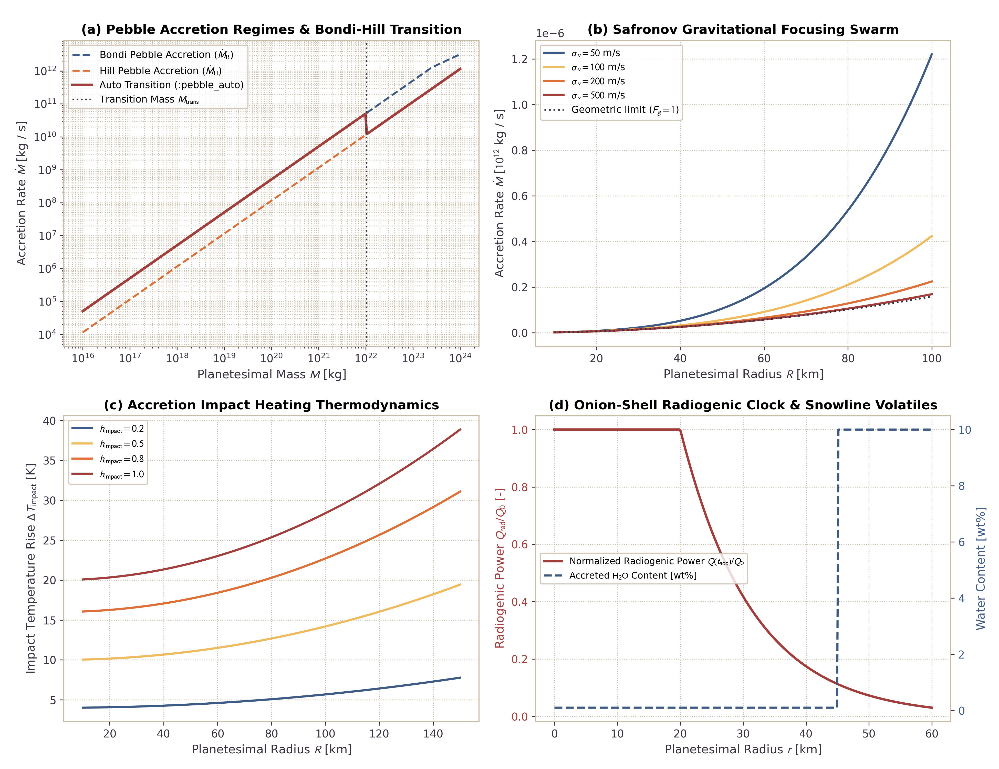

# Planetesimal Accretion Engine, Impact Heating, and Onion-Shell Structure

This page documents the physical formulations, scaling laws, and numerical verification for the planetesimal accretion engine in `Erebus.jl`. The engine models Bondi and Hill pebble accretion regimes, Safronov planetesimal swarm gravitational focusing, analytical growth modes, exact 3D spherical geometric shell mapping, impact heating thermodynamics, protoplanetary disk water snowline coupling, and radiogenic onion-shell thermal structure from $^{26}\mathrm{Al}$ decay.

---

## 1. Physical Motivation

Planetesimals in the early Solar System accreted from pebbles and smaller planetesimals in circumstellar gas disks (Safronov, 1972; Ormel and Klahr, 2010; Lambrechts and Johansen, 2012):

1. **Pebble vs Planetesimal Swarm Regimes:** Small dust grains grow into pebbles that drift through the gas disk. Planetesimals capture these pebbles through aerodynamic drag within their gravitational spheres of influence (Bondi and Hill regimes). Alternatively, planetesimal collisions govern growth in gas-depleted or turbulent disks through Safronov gravitational focusing.
2. **Accretion Duration and $^{26}\mathrm{Al}$ Clock:** The primary heat source driving early planetesimal melting and differentiation is short-lived $^{26}\mathrm{Al}$ ($t_{1/2} \approx 0.717\text{ Myr}$). Because $^{26}\mathrm{Al}$ decays exponentially, planetesimals that accreted over finite durations (e.g. 1 to 3 Myr) developed concentric "onion-shell" thermal structures (Lichtenberg et al., 2019, 2021). The central primordial core absorbed peak radiogenic heating, whereas outer accreted layers inherited lower radionuclide concentrations and remained colder.
3. **Impact Heating:** As planetesimals grow, accreted projectiles strike the surface with velocity $v_{\mathrm{imp}} \ge v_{\mathrm{esc}} = \sqrt{2GM/R}$. Impact kinetic energy converts to heat, raising the temperature of outer accreted shells and promoting early devolatilization.
4. **Snowline Volatile Coupling:** Protoplanetary disk temperatures decline with heliocentric distance. Outside the water snowline ($T \le 160\text{ K}$), planetesimals accrete volatile-rich water ice and hydrated silicates. Inside the snowline, accreted material consists of dry anhydrous silicates.

---

## 2. Governing Equations

### Keplerian Orbital Kinematics

At semi-major axis $a$ around a central star of mass $M_\star$, the Keplerian angular frequency and orbital velocity are:

$$\Omega_K = \sqrt{\frac{G M_\star}{a^3}}$$

$$v_K = \Omega_K \, a = \sqrt{\frac{G M_\star}{a}}$$

---

### Protoplanetary Disk Gas and Pebble Layer Structure

The sound speed in circumstellar gas of temperature $T_{\mathrm{gas}}$, adiabatic index $\gamma$ (default $\gamma = 1.0$ for isothermal disk gas), and mean molecular weight $\mu = 2.34$ is:

$$c_s = \sqrt{\frac{\gamma \, k_B \, T_{\mathrm{gas}}}{\mu \, m_p}}$$

The gas vertical scale height is:

$$H_g = \frac{c_s}{\Omega_K}$$

Aerodynamic gas drag causes pebbles with dimensionless Stokes number $\mathrm{St}$ to settle toward the disk midplane against turbulent diffusion parameterized by $\alpha_{\mathrm{turb}}$ (Youdin and Lithwick, 2007):

$$H_{\mathrm{peb}} = H_g \sqrt{\frac{\alpha_{\mathrm{turb}}}{\alpha_{\mathrm{turb}} + \mathrm{St}}}$$

In the limit of strong coupling ($\mathrm{St} \to 0$), pebbles remain well-mixed with the gas ($H_{\mathrm{peb}} \to H_g$). For decoupled pebbles ($\mathrm{St} \gg \alpha_{\mathrm{turb}}$), the pebble layer settles into a thin midplane sheet ($H_{\mathrm{peb}} \ll H_g$).

The pebble surface density follows a radial power law:

$$\Sigma_{\mathrm{peb}}(a) = \Sigma_{\mathrm{peb},0} \left(\frac{a}{a_0}\right)^{-p_{\mathrm{peb}}}$$

where $\Sigma_{\mathrm{peb},0}$ is the pebble surface density at reference radius $a_0 = 1\text{ AU}$.

---

### Bondi and Hill Pebble Accretion Regimes

The characteristic gravitational interaction scales for a planetesimal of mass $M$ are the Bondi radius $R_B$ and Hill radius $R_H$:

$$R_B = \frac{G M}{c_s^2}$$

$$R_H = a \left(\frac{M}{3 M_\star}\right)^{1/3}$$

The transition between the Bondi and Hill regimes occurs at the transition mass (Lambrechts and Johansen, 2012):

$$M_{\mathrm{trans}} = \sqrt{\frac{1}{3}} \, \frac{\Delta v^3}{G \Omega_K}$$

where the sound speed $c_s = \sqrt{k_B T / (\mu m_p)}$ follows the standard isothermal disk convention.

#### Bondi Pebble Accretion ($M < M_{\mathrm{trans}}$)

In the Bondi regime, gas pressure forces balance gravity. The effective capture radius is bounded by the Hill radius (Lambrechts & Johansen, 2012):

$$r_{\mathrm{acc},B} = \min\left(R_H, \, 2 \sqrt{\frac{\mathrm{St}}{\Omega_K} \frac{G M}{\Delta v}}\right)$$

Relative velocity between pebbles and the planetesimal is set by sub-Keplerian gas headwind $\Delta v = \eta v_K \approx 1.5 (c_s / v_K)^2 v_K$:

$$\dot{M}_{B,\mathrm{2D}} = 2 \, r_{\mathrm{acc},B} \, \Sigma_{\mathrm{peb}} \, \Delta v$$

$$\dot{M}_{B,\mathrm{3D}} = \pi \, r_{\mathrm{acc},B}^2 \, \rho_{\mathrm{peb}} \, \Delta v$$

where $\rho_{\mathrm{peb}} = \Sigma_{\mathrm{peb}} / (\sqrt{2\pi} H_{\mathrm{peb}})$. The 2D or 3D branch is selected based on $r_{\mathrm{acc},B} \gtrless H_{\mathrm{peb}}$.

#### Hill Pebble Accretion ($M \ge M_{\mathrm{trans}}$)

In the Hill regime, stellar tidal forces balance gravity. The capture radius is:

$$r_{\mathrm{acc},H} = R_H \mathrm{St}^{1/3}$$

The relative approach velocity is the Hill shear velocity $v_H = \Omega_K R_H$:

$$\dot{M}_{H,\mathrm{2D}} = 2 \, r_{\mathrm{acc},H} \, \Sigma_{\mathrm{peb}} \, (\Omega_K R_H)$$

$$\dot{M}_{H,\mathrm{3D}} = \pi \, r_{\mathrm{acc},H}^2 \, \rho_{\mathrm{peb}} \, (\Omega_K R_H)$$

In `:pebble_auto` mode, the solver transitions from the Bondi regime to the Hill regime at the transition mass $M_{\mathrm{trans}} = \sqrt{1/3} \, \Delta v^3 / (G \Omega_K)$ (Lambrechts and Johansen, 2012).

---

### Safronov Gravitational Focusing for Planetesimal Swarms

For planetesimal growth in a swarm of velocity dispersion $\sigma_v$ and surface density $\Sigma_{\mathrm{pl}}$, gravitational focusing enhances the geometric collision cross-section (Safronov, 1972; Chambers, 2006):

$$\Theta = \frac{G M}{R \, \sigma_v^2} = \frac{v_{\mathrm{esc}}^2}{2 \, \sigma_v^2}$$

$$F_g = 1 + 2\,\Theta$$

$$\dot{M}_{\mathrm{saf}} = \pi \, R^2 \, \Sigma_{\mathrm{pl}} \, \Omega_K \, F_g$$

When $\sigma_v \gg v_{\mathrm{esc}}$, $\Theta \to 0$ and $F_g \to 1$, returning the geometric limit. When $\sigma_v \ll v_{\mathrm{esc}}$, $\Theta \gg 1$ and $F_g \approx 2\Theta$, producing runaway gravitational focusing.

---

### Analytical Growth Modes

`Erebus.jl` also provides three analytical growth modes:
- **Constant mass rate (`:constant_rate`):** $\dot{M} = \dot{M}_0$.
- **Linear radius expansion (`:linear_radius`):** $\dot{R} = \dot{R}_0 \implies \dot{M} = 4\pi R^2 \rho_{\mathrm{bulk}} \dot{R}_0$.
- **Exponential growth (`:exponential`):** $\dot{M} = M / \tau_{\mathrm{growth}}$.

Accretion occurs within the time window $t \in [t_{\mathrm{start}}, t_{\mathrm{start}} + t_{\mathrm{duration}}]$, and shuts off when $M \ge M_{\mathrm{target}}$ or $R \ge R_{\mathrm{target}}$.

---

### Exact 3D Spherical Geometric Shell Mapping

In 2D Cartesian numerical grids, mass addition $\Delta M = \dot{M} \, \Delta t$ maps to an equivalent 3D spherical shell expansion. The exact radius increment is:

$$\Delta R = \left( R^3 + \frac{3\,\Delta M}{4\pi\,\rho_{\mathrm{bulk}}} \right)^{1/3} - R$$

This formula guarantees exact conservation of spherical volume $\Delta V = \Delta M / \rho_{\mathrm{bulk}}$ without accumulating first-order Taylor series truncation errors.

---

### Impact Heating Thermodynamics

Projectiles strike the planetesimal surface with specific kinetic energy:

$$u_{\mathrm{acc}} = \frac{G M}{R} + \frac{1}{2} v_\infty^2$$

where $v_\infty$ is the approach velocity at infinity. Assuming a fraction $h_{\mathrm{impact}} \in [0, 1]$ of the kinetic energy is retained as thermal energy rather than radiated to space, the temperature rise in the newly accreted rock shell is:

$$\Delta T_{\mathrm{impact}} = \frac{h_{\mathrm{impact}} \, u_{\mathrm{acc}}}{c_p}$$

The initial temperature assigned to newly converted crust markers is:

$$T_{\mathrm{accreted}} = T_{\mathrm{ambient}} + \Delta T_{\mathrm{impact}}$$

---

### Snowline Volatile Coupling and Radiogenic Clock Inheritance

As the accretion boundary $R(t)$ advances, sticky-air markers ($tm = 3$) situated inside $r \le R(t) + \Delta R$ convert to solid rock crust ($tm = 2$). The converted markers receive:
- **Volatile Water Content:** If local disk temperature $T_{\mathrm{disk}} \le T_{\mathrm{snowline\_cond}} = 160\text{ K}$, markers receive hydrated silicate fraction $XW = 0.40$ and bulk water content $10.0\text{ wt\%}$. If $T_{\mathrm{disk}} > 160\text{ K}$, markers receive dry anhydrous silicate rock ($XW = 0.0$, $0.1\text{ wt\% H}_2\mathrm{O}$).
- **Accretion Timestamp:** Each marker records its accretion epoch $t_{\mathrm{acc}} = t$. Radiogenic heating rate from $^{26}\mathrm{Al}$ decay evaluates from global CAI time $Q_{\mathrm{rad}}(t) = Q_0 \exp(-t / \tau_{26\mathrm{Al}})$. Outer shells remain cooler because they are accreted late when $^{26}\mathrm{Al}$ has decayed, combined with efficient surface cooling.

---

## 3. Physical Verification Benchmarks

The 4-panel verification benchmark illustrates the scaling behaviors and physical invariants of the accretion engine:



*Figure 1: Planetesimal accretion benchmark suite. Panel (a): Pebble accretion mass rate versus body mass across Bondi and Hill regimes, which displays the transition at $M_{\mathrm{trans}}$. Panel (b): Safronov gravitational focusing accretion rate versus planetesimal radius for varying velocity dispersions $\sigma_v$. Panel (c): Accretion impact heating temperature rise $\Delta T_{\mathrm{impact}}$ versus planetesimal radius for impact retention efficiencies $h_{\mathrm{impact}} \in [0.2, 1.0]$. Panel (d): Onion-shell radiogenic power profile $Q(t_{\mathrm{acc}})/Q_0$ and step-change in accreted volatile water content across the protoplanetary disk snowline.*

---

## 4. Configuration Example

The TOML configuration snippet below enables pebble accretion with snowline volatile coupling and impact heating:

```toml
[accretion]
active = true
mode = "pebble_auto"
M_initial = 1.0e17        # Initial seed mass [kg]
R_initial = 20000.0       # Initial seed radius [m] (20 km)
rho_bulk = 3000.0         # Accreted rock bulk density [kg/m^3]
M_target = 1.0e20         # Target final mass [kg]
R_target = 60000.0        # Target final radius [m] (60 km)
t_start_myr = 0.1         # Accretion onset time [Myr]
t_duration_myr = 2.0      # Accretion duration [Myr]
h_impact = 0.6            # Impact kinetic energy retention fraction
cp_rock = 1000.0          # Specific heat capacity [J/(kg K)]
phi_accreted = 0.30       # Initial porosity of accreted shell
snowline_coupling = true  # Couple volatile content to disk snowline
T_snowline_cond = 160.0   # Condensation temperature threshold [K]
stokes_number = 0.05      # Aerodynamic pebble Stokes number
alpha_turbulence = 1.0e-3 # Disk turbulence parameter
Sigma_peb_0 = 40.0        # Pebble surface density at 1 AU [kg/m^2]
track_accretion_time = true
```
