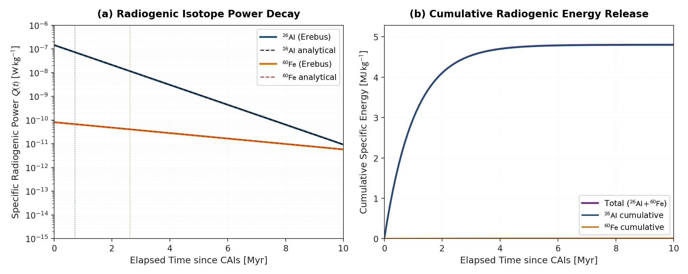

# Radionuclide Heating Validation

This module validates the radiogenic heating rate calculations from short-lived radionuclides ($^{26}\text{Al}$ and $^{60}\text{Fe}$).

---

## Governing Formulation

Radioactive decay generates volumetric heating $Q(t)$ in the solid rock ($^{26}\text{Al}$) and metallic iron ($^{60}\text{Fe}$) phases:

$$Q(t) = Q_0 \exp\left(-\frac{t}{\tau}\right) = Q_0 \left(\frac{1}{2}\right)^{t / t_{1/2}}$$

with mean lifetime $\tau = t_{1/2} / \ln 2$. The initial volumetric power density at time of CAI formation ($t = 0$) for bulk chondritic composition is:

$$Q_0 = \rho f_m \left(\frac{^{26}\text{Al}}{^{27}\text{Al}}\right)_0 E_{\text{al}} \frac{1}{\tau_{\text{al}}}$$

where $\rho$ is phase density, $f_m$ is elemental mass abundance, and $E_{\text{al}}$ is decay energy per atom.

Because aluminium is lithophile, $^{26}\text{Al}$ concentrates exclusively into the silicate phase. The initial volumetric power density of the silicate phase is scaled by:

$$Q_{0,\text{silicate}} = \frac{Q_0}{1 - X_{\text{fe,ref}}}$$

where $X_{\text{fe,ref}}$ is the reference mass fraction of metallic iron ($0.25$ for standard chondritic composition). Similarly, siderophile $^{60}\text{Fe}$ deposits into the metallic iron phase. Solid volume fraction weighting over silicate and metal phases preserves the exact bulk planetary thermal power budget.

---

## Literature Anchors

- **Russell, S. S., Srinivasan, G., Huss, G. R., & Wasserburg, G. J. (1996)**. Evidence for widespread $^{26}\text{Al}$ in the solar nebula and constraints for nebula time scales. *Science*, 273(5276), 757-762.  
  [https://doi.org/10.1126/science.273.5276.757](https://doi.org/10.1126/science.273.5276.757)
- **Tachibana, S., & Huss, G. R. (2003)**. The initial abundance of $^{60}\text{Fe}$ in the Solar System. *The Astrophysical Journal*, 588(1), L41-L44.  
  [https://doi.org/10.1086/374597](https://doi.org/10.1086/374597)
- **Tang, H., & Dauphas, N. (2012)**. Abundance, distribution, and origin of 60Fe in the solar protoplanetary disk. *Earth and Planetary Science Letters*, 359-360, 248-263.
  [https://doi.org/10.1016/j.epsl.2012.10.011](https://doi.org/10.1016/j.epsl.2012.10.011)
- **Lichtenberg, T., Golabek, G. J., Burn, R., Meyer, M. R., Alibert, Y., Gerya, T. V., & Mordasini, C. (2019)**. A water budget dichotomy of rocky protoplanets from 26Al-heating. *Nature Astronomy*, 3(4), 307-313.  
  [https://doi.org/10.1038/s41550-018-0688-5](https://doi.org/10.1038/s41550-018-0688-5)

---

## Benchmark Comparison

The specific radiogenic decay powers and cumulative energy releases for $^{26}\text{Al}$ and $^{60}\text{Fe}$ are evaluated against analytical solutions:

*Specific radiogenic power decay curves and cumulative energy release for $^{26}\text{Al}$ and $^{60}\text{Fe}$ over 10 Myr of planetesimal evolution. Panel (a) shows specific radiogenic power $Q(t)$ as a function of time, comparing Erebus with analytical exponential decay. Dotted vertical lines mark the respective half-lives ($0.717\text{ Myr}$ for $^{26}\text{Al}$ and $2.62\text{ Myr}$ for $^{60}\text{Fe}$). Panel (b) shows the cumulative specific energy release.*

---

## Invariants and Analytical Limits

1. **Total Energy Conservation Closure**:
   The time-integrated radiogenic energy released per unit volume over all time equals the total isotopic energy budget:

   $$\int_0^\infty Q(t) dt = Q_0 \tau = \rho f_m \left(\frac{^{26}\text{Al}}{^{27}\text{Al}}\right)_0 E_{\text{al}}$$

2. **Half-Life Consistency**:
   At $t = t_{1/2}$, $Q(t_{1/2}) = 0.5\, Q_0$ to floating point precision.
   At $t = 2 t_{1/2}$, $Q(2 t_{1/2}) = 0.25\, Q_0$.
3. **Strict Monotonicity**:
   $dQ/dt < 0$ for all $t \ge 0$.
4. **Positivity**:
   $Q(t) > 0$ for all finite $t \ge 0$.
5. **Error Contract**:
   Passing negative times ($t < 0$) or negative isotope ratios throws `DomainError`.

---

## Analytical Energy Conservation

The cumulative energy released per unit volume from initial accretion ($t = 0$) up to time $t$ is obtained by integrating the volumetric heating rate:

$$E(t) = \int_0^t Q(t') \, dt' = Q_0 \tau \left[ 1 - \exp\left(-\frac{t}{\tau}\right) \right]$$

where $\tau = t_{1/2} / \ln 2$ is the mean lifetime of the radionuclide and $E_\infty = Q_0 \tau$ is the total energy released as $t \to \infty$.

The fraction of total isotopic energy released as a function of elapsed half-lives $n = t / t_{1/2}$ evaluates to the closed-form relation:

$$f(n) = \frac{E(n \cdot t_{1/2})}{E_\infty} = 1 - \left(\frac{1}{2}\right)^n$$

The table below tabulates theoretical cumulative energy release fractions $f(n)$ across progressive radioactive decay intervals:

| Elapsed Half-Lives ($t / t_{1/2}$) | Total Elapsed Time ($^{26}\text{Al}$) | Cumulative Energy Fraction $f(n) = 1 - (1/2)^n$ | Unreleased Residual $(1/2)^n$ |
|:---|:---|:---|:---|
| $0.5$ | $0.3585\text{ Ma}$ | $0.292893$ | $0.707107$ |
| $1.0$ | $0.7170\text{ Ma}$ | $0.500000$ | $0.500000$ |
| $2.0$ | $1.4340\text{ Ma}$ | $0.750000$ | $0.250000$ |
| $5.0$ | $3.5850\text{ Ma}$ | $0.968750$ | $0.031250$ |
| $10.0$ | $7.1700\text{ Ma}$ | $0.999023$ | $0.000977$ |

---

## Verification Test Suite

- `test/test_physics.jl`:
  - `@testset "Q_radiogenic(): half-life and conservation closure"`: Verifies initial heating $Q(0) = Q_0$, half-life decay $Q(t_{1/2}) = 0.5 Q_0$, two half-lives $Q(2 t_{1/2}) = 0.25 Q_0$, and total integrated energy closure $\int_0^\infty Q(t) \, dt = Q_0 \tau$ within $10^{-12}$ relative tolerance.
  - `@testset "calculate_radioactive_heating(): isotope activity and density scaling"`: Verifies volumetric heating scaling and phase assignment.

