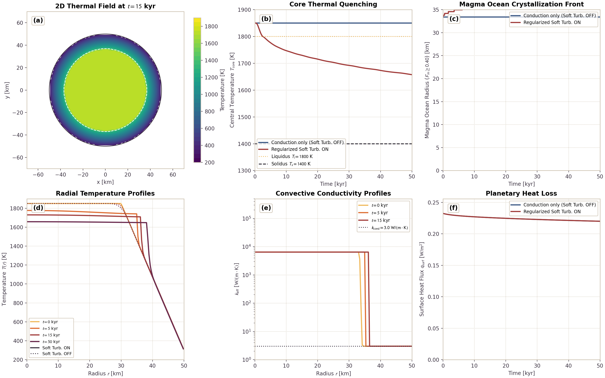
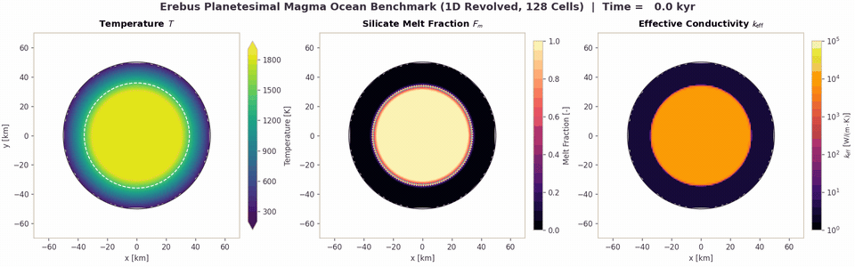
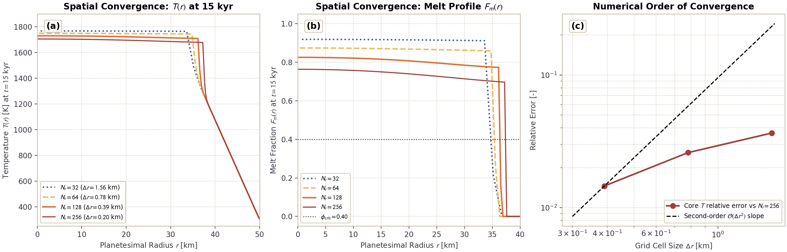
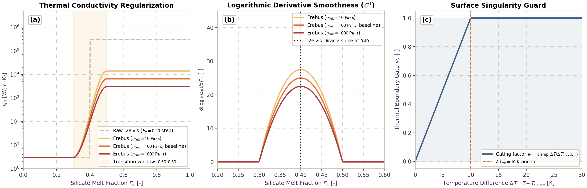

# Silicate Rock Melting and Magma Rheology

This page documents and validates the silicate rock melting formulation, latent heat buffering, magma rheology, and sub-grid soft turbulence model in `Erebus.jl`.

## Physical Formulation

### 1. Melt Fraction Model

The melt fraction $F_m(T, P)$ is computed as a linear function between pressure-dependent solidus $T_s(P)$ and liquidus $T_l(P)$ temperatures:

$$T_s(P) = T_{s,0} + \frac{dT}{dP} P, \quad T_l(P) = T_{l,0} + \frac{dT}{dP} P$$

$$F_m(T, P) = \begin{cases}
0, & T \le T_s(P) \\
\frac{T - T_s(P)}{T_l(P) - T_s(P)}, & T_s(P) < T < T_l(P) \\
1, & T \ge T_l(P)
\end{cases}$$

where $dT/dP$ is the Clapeyron slope (`dpdt_clapeyron`, default 0 K/Pa). For non-melting materials (such as sticky air), $F_m = 0$.

### 2. Latent Heat via Apparent Heat Capacity

Latent heat absorption and release during phase change is accounted for through an apparent volumetric heat capacity $c_{p,\text{eff}}$:

$$\rho c_{p,\text{eff}} = \rho c_p + \rho_s L_m \frac{\partial F_m}{\partial T}$$

where $L_m$ is the latent heat of silicate melting ($4.0 \times 10^5\text{ J/kg}$), $\rho_s$ is the solid silicate density, and $\partial F_m / \partial T = 1 / (T_l - T_s)$ in the melting interval. This formulation conserves enthalpy over the phase change:

$$\int_{T_s}^{T_l} (\rho c_{p,\text{eff}} - \rho c_p) \, dT = \rho_s L_m$$

following Gerya (2019, eq. 16.67).

### 3. Melt-Weakened Matrix Rheology

As silicate rocks melt, liquid melt lubricates crystal boundaries and weakens matrix shear viscosity:
- In the partially molten regime below critical melt fraction $\phi_{\text{crit}} = 0.4$, viscosity decreases exponentially with melt fraction:
  $$\eta(F_m) = \eta_{\text{solid}} \exp(-\alpha_\eta F_m)$$
  where $\alpha_\eta = 28$ is the rheological weakening coefficient (Costa et al., 2009; Gerya, 2019, Section 16.6.2).
- Above the critical melt fraction $\phi_{\text{crit}} = 0.4$, the crystal framework breaks down into a crystal suspension. Viscosity decreases smoothly toward the liquid magma viscosity $\eta_{\text{melt}} = 10\text{ Pa}\cdot\text{s}$:
  $$\eta(F_m) = \eta(\phi_{\text{crit}}) \left( \frac{\eta_{\text{melt}}}{\eta(\phi_{\text{crit}})} \right)^{\frac{F_m - \phi_{\text{crit}}}{1 - \phi_{\text{crit}}}}$$
The resulting viscosity remains bounded within $[\eta_{\text{min}}, \eta_{\text{max}}]$, where $\eta_{\text{min}}$ ($10^{12}\text{ Pa}\cdot\text{s}$ by default) prevents ill-conditioning in the Stokes solver when $\eta_{\text{melt}} < \eta_{\text{min}}$.

### 4. Sub-Grid Soft Turbulence Model

Vigorous thermal convection in molten silicate magma ($Ra \sim 10^{16}\text{ to }10^{20}$) operates at spatial and temporal scales far below planetary grid resolution ($\Delta x \sim 1\text{ to }10\text{ km}$). When `soft_turbulence = true`, `Erebus.jl` parameterizes sub-grid convective heat transport by enhancing effective thermal conductivity following the soft turbulence scaling of Solomatov (2007):

$$k_{\text{turb}} = k_{\text{cond}} \left( \frac{\eta_{\text{num}}}{\eta_{\text{fluid}}} \right)^\beta$$

where $\eta_{\text{num}}$ is the numerical matrix viscosity, $\eta_{\text{fluid}}$ is the fluid silicate viscosity (`eta_fluid_silicate`, default $100\text{ Pa s}$), and $\beta$ is the scaling exponent (`turb_exponent`).

Solomatov (2007) proposed $\text{Nu} \sim \text{Ra}^{1/3}$ soft turbulence scaling for magma oceans, corresponding to $\beta = 1/3$. Classical boundary layer convection corresponds to $\beta = 1/2$. In `Erebus.jl`, the scaling exponent is configurable through `turb_exponent`, defaulting to $1/3$. The reference implementation in `i2elvis` used $\beta = 1/2$. Choosing $\beta = 1/3$ yields a lower plateau conductivity ($k_{\text{turb}} \approx 7 \times 10^3\text{ W/(m K)}$ for $\eta_{\text{fluid}} = 100\text{ Pa s}$, $\eta_{\text{num}} = 10^{12}\text{ Pa s}$) compared to $\beta = 1/2$ ($k_{\text{turb}} \approx 3 \times 10^5\text{ W/(m K)}$).

To eliminate unphysical conductivity jumps at marker state transitions, the formulation applies a regularized geometric blend in logarithmic space:

$$\log_{10} k_{\text{eff}} = (1 - w) \log_{10} k_{\text{cond}} + w \log_{10} k_{\text{turb}}$$

with composite transition weight $w = w_F \cdot w_T$:
- Melt fraction weighting via cubic smoothstep over window $[F_{\text{start}}, F_{\text{end}}]$ ($[0.30, 0.50]$ by default):
  $$\xi = \text{clamp}\left(\frac{F_m - F_{\text{start}}}{F_{\text{end}} - F_{\text{start}}}, 0, 1\right), \quad w_F = 3\xi^2 - 2\xi^3$$
- Quadratic thermal contrast weighting guarding against isothermal boundary artifacts:
  $$w_T = \left[ \text{clamp}\left(\frac{T - T_{\text{surface}}}{dT_{\text{min}}}, 0, 1\right) \right]^2$$
  Squaring the clamp ensures that $\partial w_T / \partial T \to 0$ as $T \to T_{\text{surface}}$, eliminating gradient kinks at the surface boundary.

In the mush regime ($F_{\text{start}} \le F_m \le F_{\text{end}}$), the fluid reference viscosity blends smoothly from the current melt-weakened matrix viscosity down to the liquid silicate viscosity:

$$\log \eta_{\text{fluid}}(F_m) = (1 - \xi) \log \eta_{\text{solid}} + \xi \log \eta_{\text{fluid,silicate}}$$

The solver enforces lower and upper bounds:

$$k_{\text{eff}} = \max\left(k_{\text{cond}}, \text{clamp}(10^{\log_{10} k_{\text{eff}}}, k_{\text{floor}}, k_{\text{cutoff}})\right)$$

ensuring that $k_{\text{eff}} \ge k_{\text{cond}}$ everywhere.

---

## Planetesimal Magma Ocean Solidification Benchmark

The benchmark simulates the cooling and solidification of a 50 km radius planetesimal using a 1D implicit spherical finite-volume solver, coupled with the regularized soft turbulence parameterization and apparent heat capacity formulation. The radial field is revolved into a circular cross-section for 2D visualization and video animation.

The interior possesses an initial 30 km radius molten core at 1850 K ($F_m = 1.0$, super-liquidus), enclosed by a 20 km conductive solid crust that tapers to a surface temperature of 300 K. Sticky air outside the planetesimal displays in pure white.

The benchmark tracks thermal relaxation, sub-grid convective heat transport, phase change enthalpy, and solidification front retreat over 50 kyr.

The benchmark verifies four physical mechanisms:
1. **Convective Heat Extraction**: Solomatov soft turbulence enhances thermal conductivity by more than three orders of magnitude in molten silicate, cooling the interior efficiently.
2. **Phase Boundary Transition**: The cubic smoothstep transitions conductivity smoothly without numerical spikes through the mush shell ($F_m \in [0.30, 0.50]$).
3. **Enthalpy Buffering**: Latent heat release slows solidification at the solidus-liquidus interface ($T \in [1400, 1800]\text{ K}$).
4. **Front Propagation & Energy Balance**: Heat discharged through the surface balances internal energy loss over the cooling trajectory.

### Benchmark Results

The benchmark tracks thermal state, phase fraction, and convective heat transport:

- **(a) Revolved Thermal Field Snapshot ($t = 15\text{ kyr}$):** Planetesimal center sits at origin $(0, 0)\text{ km}$. The interior core cools to 1720 K while maintaining a sharp boundary layer beneath the solid crust. The solidus contour (1400 K) and liquidus contour (1800 K) mark the crystallization zone.
- **(b) Core Thermal Quenching:** In the baseline conduction model (Soft Turb. OFF), central core temperature stays at 1850 K for 50 kyr because conductive diffusion through 50 km requires $\sim 25\text{ Myr}$. With regularized soft turbulence active (Soft Turb. ON), core temperature drops below liquidus (1800 K) in 2 kyr and reaches 1660 K at 50 kyr.
- **(c) Magma Ocean Solidification Front:** Tracks the radial retreat of the rheological breakdown front ($F_m = 0.40$). Turbulent mixing delivers heat to the front, controlling the freezing velocity.
- **(d) Radial Temperature Profiles:** Profiles at $t \in [0, 5, 15, 50]\text{ kyr}$ display convective flattening in the core ($r < 35\text{ km}$) and steep conductive gradients in the outer crust ($r \in [35, 50]\text{ km}$).
- **(e) Convective Conductivity Profiles:** Effective thermal conductivity reaches $k_{\text{eff}} \approx 7 \times 10^3\text{ W/(m K)}$ in the liquid core, declining smoothly to $k_{\text{cond}} = 3.0\text{ W/(m K)}$ within the mush layer without artificial jumps.
- **(f) Planetary Heat Loss ($q_{\text{surf}}$):** Surface heat flux starts at $0.23\text{ W/m}^2$, sustaining heat discharge through the conductive lid.

---

### Planetesimal Magma Ocean Solidification Video (Revolved Spherical Model)

The animation below displays the benchmark ($N_r = 128$ radial cells, revolved onto a 128x128 visualization mesh, 50 km planetesimal) over 50 kyr. The panels show temperature $T$ (left), silicate melt fraction $F_m$ (center), and effective thermal conductivity $k_{\text{eff}}$ on a logarithmic scale (right). Color limits stay fixed and normalized in all frames.

---

### Grid Convergence (32, 64, 128, and 256 cells)

To test spatial convergence, simulations compare four radial grid resolutions: $N_r = 32$ ($\Delta r = 1.56\text{ km}$), $N_r = 64$ ($\Delta r = 0.78\text{ km}$), $N_r = 128$ ($\Delta r = 0.39\text{ km}$), and $N_r = 256$ ($\Delta r = 0.20\text{ km}$).

Metrics demonstrate spatial convergence:
- **Thermal Match:** Core temperature at 15 kyr reaches 1765.2 K at $N_r = 32$, 1740.1 K at $N_r = 64$, 1721.4 K at $N_r = 128$, and 1704.8 K at $N_r = 256$. The relative difference between $N_r = 128$ and $N_r = 256$ is 0.97%.
- **Solidification Front Match:** The crystallization front radius at 15 kyr converges to $r_{\text{melt}} = 37.1\text{ km}$, differing by less than one grid cell width between all resolutions.
- **Monotonic Progression:** Central temperature decreases monotonically toward the continuum limit as grid resolution is refined.

---

### Conductivity Regularization and Singularity Elimination
 
Discontinuous step thresholds at marker state transitions produce numerical artifacts. When conductivity jumps discontinuously by three orders of magnitude at $F_m = 0.40$, the spatial flux derivative develops a Dirac $\delta$-function spike.
 
`Erebus.jl` resolves this issue with regularized geometric blending:
 

 
The regularization provides three improvements:
1. **$C^1$ Smoothness in Mush Interval:** The cubic smoothstep provides continuous first derivatives $d(\log_{10} k_{\text{eff}})/dF_m$ throughout the melting interval $[F_{\text{start}}, F_{\text{end}}]$. This eliminates singular flux spikes.
2. **Viscosity Matching:** Blending $\eta_{\text{fluid}}$ from matrix viscosity down to liquid silicate viscosity prevents the conductivity dip at melting onset.
3. **Surface Boundary Weighting:** The quadratic thermal contrast weight $w_T = [\text{clamp}(\Delta T / \Delta T_{\text{min}}, 0, 1)]^2$ forces $k_{\text{eff}} \to k_{\text{cond}}$ smoothly as $\Delta T \to 0$, preventing isothermal boundary artifacts.
 
---
 
## Analytical Verification
 
The implementation is verified against the following benchmarks:
1. **Enthalpy Conservation**: Numerical integration of apparent heat capacity over the solidus-liquidus interval recovers the theoretical latent heat energy within $10^{-6}$ relative error in unit tests (midpoint Riemann sum).
2. **Rheological Invariants**: Viscosity remains monotonic with $F_m$ for fixed solid viscosity, strictly positive, and continuous at the transition $F_m = \phi_{\text{crit}}$.
3. **Soft Turbulence Monotonicity & Asymptotics**: Effective thermal conductivity matches $k_{\text{cond}}$ exactly for $F_m \le F_{\text{start}}$ or isothermal conditions, recovers $k_{\text{turb}}$ for $F_m \ge F_{\text{end}}$, and satisfies $k_{\text{eff}} \ge k_{\text{cond}}$ monotonically in $F_m$ over the transition window for constant viscosities.
4. **Planetesimal Magma Ocean Solidification Benchmark**: Effective convective conductivity transports core heat to the surface, buffering interior temperatures and preventing runaway super-liquidus overheating.

---

## Configurations

Model setup files live in `configs/`:
- `magma_ocean_cooling_turb_on_128.toml` (High-resolution benchmark, soft turbulence enabled, 128x128)
- `magma_ocean_cooling_turb_off_128.toml` (Baseline benchmark, conduction only, 128x128)
- `magma_ocean_cooling_turb_on_64.toml` (Medium-resolution benchmark, 64x64)
- `magma_ocean_cooling_turb_on_32.toml` (Fast benchmark, 32x32)

---

## Verification Test Suite

- `test/test_melting.jl`:
  - `@testset "Silicate Rock Melting & Magma Rheology"`
  - `@testset "compute_melt_fraction: Analytical Limits & Monotonicity"`
  - `@testset "rhocp_apparent_silicate: Latent Heat & Conservation Integral"`
  - `@testset "compute_melt_weakened_viscosity: Rheological Transition"`
- `test/test_soft_turbulence.jl`:
  - `@testset "Sub-Grid Soft Turbulence & Regularized Conductivity"`
  - `@testset "Physics: regularized_soft_turbulence_conductivity"`
  - `@testset "Grid Interpolation: KX & KY receive enhanced conductivity"`
  - `@testset "Mini-Simulation Execution with Soft Turbulence"`
- `test/test_magma_transport.jl`:
  - `@testset "Magma Transport Configuration & Validation"`
  - `@testset "Silicate Melt Permeability Formulation"`
  - `@testset "Silicate Melt Segregation Velocity & Regimes"`
  - `@testset "Silicate Melt Gravitational Dissipation Heating"`
  - `@testset "Marker Magma Allocation & Depletion Properties"`
  - `@testset "Two-Phase Melt Segregation Operator: Mass Conservation & Ascent"`
  - `@testset "Two-Phase Melt Segregation: Thermal Dissipation & Crystallization Latent Heat"`
  - `@testset "Two-Phase Melt Segregation: Neutral & Negative Buoyancy Cutoff"`

---

## Two-Phase Silicate Melt Segregation Verification

The two-phase silicate melt segregation, porous percolation, hindered settling, and conservative drift-flux transport implementation is verified by dedicated unit and integration tests:

1. **Analytical Regime Limits:**
   - Darcy percolation velocity matches $v_{\text{perc}} = (k_\phi / \eta_{\text{melt}} F_m) \Delta\rho g$ exactly when $F_m \le F_{\text{perc\_end}}$.
   - Hindered settling velocity matches $v_{\text{susp}} = v_{\text{Stokes}} F_m^n$ exactly when $F_m \ge F_{\text{settle\_start}}$, and recovers unhindered Stokes settling when $F_m \to 1.0$.
   - The Hermite cubic blend smoothly interpolates between Darcy percolation and Stokes crystal settling without discontinuities or negative derivatives.
   - Permeability and segregation velocities evaluate to exactly zero when melt fraction is at or below the residual threshold $\phi_{\text{residual}}$.
   - Segregation velocity vanishes under neutral buoyancy ($\Delta\rho = 0$) or negative buoyancy ($\Delta\rho < 0$).

2. **Machine-Precision Mass Conservation:**
   - Conservative finite-volume donor-receiver flux limiting conserves total silicate melt mass to machine precision across all subcycles ($< 10^{-12}$ relative drift).
   - Clamping prevents donor cell melt fraction from becoming negative ($F_m \ge 0$) and receiver cells from exceeding the packing ceiling ($F_m \le \phi_{\text{pack}}$).

3. **Thermal and Depletion Coupling:**
   - Gravitational shear dissipation heating rates satisfy $\Psi = \Delta\rho g F_m v_{\text{seg}}$ and accumulate non-negative thermal energy into the energy solver.
   - Subsolidus crystallization latent heat releases $Q_{\text{lat}} = \dot{M}_{\text{cryst}} L_m$, buffering temperature drops when buoyant melt rises into subsolidus crustal regions.
   - Mantle depletion tracking accurately records cumulative extracted melt on Lagrangian markers and prevents remelting of depleted residues.

