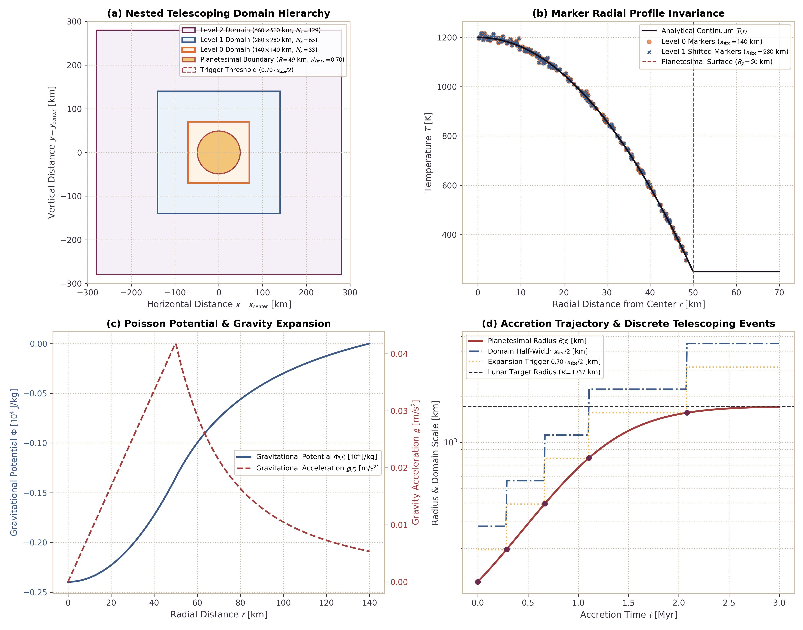

# Telescoping Computational Domain for Growth to Lunar Mass

This page documents the mathematical formulation, grid transformation invariants, marker buffer replenishment mechanics, and physical verification benchmarks for the telescoping domain engine in `Erebus.jl`. The engine doubles spatial domain dimensions during planetary growth, maintaining constant grid cell resolution $dx$ from early planetesimals ($R \sim 20\text{ km}$) to lunar-mass bodies ($R \sim 1,737\text{ km}$).

---

## 1. Physical and Numerical Motivation

Simulating planetesimal evolution from seed bodies to protoplanets presents a severe multiscale spatial challenge:

1. **Spatial Scale Range:** Planetesimal seeds initiate accretion at radii $R \sim 20 - 50\text{ km}$, while oligarchic and pebble growth can grow embryos to lunar mass ($R \approx 1,737\text{ km}$, $M \approx 7.35 \times 10^{22}\text{ kg}$). This represents a factor of 35 increase in radius and nearly five orders of magnitude in mass.
2. **Resolution Trade-Offs on Static Grids:** 
   - A static grid sized to contain the final lunar body ($x_{\text{size}} \approx 5,000\text{ km}$) with modest node counts ($N_x = 101$) yields cell resolution $dx \approx 50\text{ km}$. On such a grid, an initial seed of $R = 25\text{ km}$ spans less than a single cell.
   - Maintaining $dx = 1\text{ km}$ on a static box of $5,000\text{ km}$ requires $N_x = 5001$ nodes. The resulting 2D linear system has $N_{\text{dof}} \approx 2.5 \times 10^7$ degrees of freedom per timestep, which is computationally prohibitive for million-year evolutionary runs.
3. **Free Surface Boundary Proximity:** In the marker-in-cell method, the planetary surface is represented as an internal free surface bounded by low-viscosity sticky air (Gerya, 2019). If the planetary boundary approaches the outer computational boundary, artificial boundary stresses and spurious traction forces contaminate internal convective circulation and compaction flow.
4. **Telescoping Domain Solution:** The telescoping domain doubles domain dimensions ($x_{\text{size}}^{\text{new}} = 2 x_{\text{size}}$) and basic node counts ($N_x^{\text{new}} = 2(N_x - 1) + 1$) whenever the body radius exceeds a predefined fraction of the domain half-width ($R > 0.70 \cdot x_{\text{size}}/2$). This preserves exact cell spacing $dx = \text{const}$, preserves all interior marker positions and thermochemical invariants, and replenishes the newly created outer volume with sticky air markers.

---

## 2. Mathematical Formulation and Invariants

### Spatial Coordinate Doubling

Let the current grid have physical dimensions $(x_{\text{size}}, y_{\text{size}})$ and basic node counts $(N_x, N_y)$. The uniform grid cell spacings are:

$$dx = \frac{x_{\text{size}}}{N_x - 1}, \qquad dy = \frac{y_{\text{size}}}{N_y - 1}$$

When a telescoping trigger occurs, the new domain dimensions and node counts are defined by:

$$x_{\text{size}}^{\text{new}} = 2 \, x_{\text{size}}, \qquad y_{\text{size}}^{\text{new}} = 2 \, y_{\text{size}}$$

$$N_x^{\text{new}} = 2(N_x - 1) + 1, \qquad N_y^{\text{new}} = 2(N_y - 1) + 1$$

The new cell spacing satisfies:

$$dx^{\text{new}} = \frac{x_{\text{size}}^{\text{new}}}{N_x^{\text{new}} - 1} = \frac{2 \, x_{\text{size}}}{2(N_x - 1)} = \frac{x_{\text{size}}}{N_x - 1} = dx$$

$$dy^{\text{new}} = \frac{y_{\text{size}}^{\text{new}}}{N_y^{\text{new}} - 1} = \frac{2 \, y_{\text{size}}}{2(N_y - 1)} = \frac{y_{\text{size}}}{N_y - 1} = dy$$

The spatial resolution remains strictly identical after domain doubling.

---

### Doubling Trigger Criterion

In `Erebus.jl`, the telescoping condition is evaluated at each computational step:

$$\mathcal{T}(R) = \begin{cases} \text{true} & \text{if } R(t) > f_{\text{threshold}} \cdot \dfrac{x_{\text{size}}}{2} \text{ and } \ell < \ell_{\text{max}} \\ \text{false} & \text{otherwise} \end{cases}$$

where:
- $f_{\text{threshold}}$ is the configured threshold fraction (`r_threshold_fraction`, default $0.70$).
- $x_{\text{size}} / 2$ is the domain half-width.
- $\ell$ is the current telescoping level (`telescope_level`, 0-indexed).
- $\ell_{\text{max}}$ is the maximum allowable doubling level (`max_telescope_levels`, default 10).

A threshold fraction of 0.70 ensures that a sticky-air buffer of at least 30% of the domain half-width separates the planetesimal surface from the outer computational boundary. This buffer prevents artificial boundary reflections and spurious stress coupling.

---

### Marker Coordinate Translation and Radial Invariance

The physical center of the planetesimal shifts from $(x_c^{\text{old}}, y_c^{\text{old}})$ to $(x_c^{\text{new}}, y_c^{\text{new}}) = (x_{\text{size}}^{\text{new}}/2, y_{\text{size}}^{\text{new}}/2)$. The spatial shift vector is:

$$\Delta x_{\text{shift}} = x_c^{\text{new}} - x_c^{\text{old}} = \frac{x_{\text{size}}^{\text{new}}}{2} - \frac{x_{\text{size}}}{2} = \frac{x_{\text{size}}}{2}$$

$$\Delta y_{\text{shift}} = y_c^{\text{new}} - y_c^{\text{old}} = \frac{y_{\text{size}}^{\text{new}}}{2} - \frac{y_{\text{size}}}{2} = \frac{y_{\text{size}}}{2}$$

All existing Lagrangian markers $m = 1, \dots, N_{\text{markers}}$ undergo pure translation:

$$x_m^{\text{new}} = x_m^{\text{old}} + \Delta x_{\text{shift}}$$

$$y_m^{\text{new}} = y_m^{\text{old}} + \Delta y_{\text{shift}}$$

The radial distance of any marker from the planetesimal center is strictly invariant:

$$\begin{aligned}
r_m^{\text{new}} &= \sqrt{\left(x_m^{\text{new}} - x_c^{\text{new}}\right)^2 + \left(y_m^{\text{new}} - y_c^{\text{new}}\right)^2} \\
&= \sqrt{\left(x_m^{\text{old}} + \Delta x_{\text{shift}} - \left(x_c^{\text{old}} + \Delta x_{\text{shift}}\right)\right)^2 + \left(y_m^{\text{old}} + \Delta y_{\text{shift}} - \left(y_c^{\text{old}} + \Delta y_{\text{shift}}\right)\right)^2} \\
&= \sqrt{\left(x_m^{\text{old}} - x_c^{\text{old}}\right)^2 + \left(y_m^{\text{old}} - y_c^{\text{old}}\right)^2} = r_m^{\text{old}}
\end{aligned}$$

Radial coordinates, lithostatic stress profiles, thermal depth gradients, and chemical stratification profiles are unaffected by domain doubling.

---

### Staggered Grid Array Centering and Parity Invariant

Symmetric centering of Eulerian field arrays requires odd basic grid dimensions $N_x$ and $N_y$ ($N_x = 2k + 1, N_y = 2m + 1$). Under this parity condition:

$$N_x^{\text{new}} - N_x^{\text{old}} = (2(2k) + 1) - (2k + 1) = 2k$$

$$j_{\text{off}} = \frac{N_x^{\text{new}} - N_x^{\text{old}}}{2} = k$$

$$i_{\text{off}} = \frac{N_y^{\text{new}} - N_y^{\text{old}}}{2} = m$$

The physical translation of the planetary center satisfies:

$$\Delta x_{\text{shift}} = \frac{x_{\text{size}}}{2} = \frac{(N_x^{\text{old}} - 1) dx}{2} = k \, dx = j_{\text{off}} \, dx$$

$$\Delta y_{\text{shift}} = \frac{y_{\text{size}}}{2} = \frac{(N_y^{\text{old}} - 1) dy}{2} = m \, dy = i_{\text{off}} \, dy$$

Because continuous marker coordinate shifts $\Delta x_{\text{shift}}$ and discrete grid node shifts $j_{\text{off}} \, dx$ match identically, markers and Eulerian grid nodes maintain zero relative offset across domain doubling. If $N_x$ or $N_y$ were even, $(N_x - 1)$ would be odd, introducing a half-cell offset ($dx / 2$) between continuous marker centers and discrete node blocks. Consequently, `Erebus.jl` validates and enforces odd grid dimensions whenever telescoping is active.

1. **Basic Node Remapping:** For arrays of size $(N_y, N_x)$ (for example shear viscosity $\eta$, shear modulus $G$, stress components $\sigma_{xy}$):
   $$A^{\text{new}}[i_{\text{off}} + i, \, j_{\text{off}} + j] = A^{\text{old}}[i, j] \qquad \forall \; 1 \le i \le N_y^{\text{old}}, \; 1 \le j \le N_x^{\text{old}}$$
   Outer grid nodes outside this central sub-block are initialized to background values.

2. **Staggered Velocity and Flux Nodes:** In `Erebus.jl`, velocity and flux arrays are allocated with dimensions $(N_{y1}, N_{x1})$ where $N_{y1} = N_y + 1$ and $N_{x1} = N_x + 1$. Because $N_{x1}^{\text{new}} - N_{x1}^{\text{old}} = N_x^{\text{new}} - N_x^{\text{old}} = 2k$, the staggered offsets satisfy $j_{\text{off},1} = j_{\text{off}} = k$ and $i_{\text{off},1} = i_{\text{off}} = m$. Velocity nodes in outer buffer cells are set to zero ($v_x = 0$, $v_y = 0$) to enforce zero-traction boundary conditions in the far field.

---

### Sticky-Air Buffer Marker Generation

When the computational box doubles, the physical area quadruples:

$$A_{\text{new}} = x_{\text{size}}^{\text{new}} \, y_{\text{size}}^{\text{new}} = 4 \, x_{\text{size}} \, y_{\text{size}} = 4 \, A_{\text{old}}$$

The central region of area $A_{\text{old}}$ contains all original planetary and sticky-air markers. The outer buffer cells, encompassing the remaining area $3 A_{\text{old}}$, are populated with new sticky-air markers to maintain consistent marker coverage:

1. **Cell Sub-Grid Invariant:** For each cell $(i, j)$ outside the central region ($1 \le j \le N_{x,\text{cells}}^{\text{new}}$, $1 \le i \le N_{y,\text{cells}}^{\text{new}}$ with $(i, j)$ outside the inner region), $n_{\text{sub}} = \text{buffer\_markers\_per\_cell}$ markers are injected.
2. **Sub-Cell Positioning:** With $n_x$ defined as the largest divisor of $n_{\text{sub}}$ satisfying $n_x \le \lfloor\sqrt{n_{\text{sub}}}\rfloor$ and $n_y = n_{\text{sub}} / n_x$ (yielding $n_x = n_y = \sqrt{n_{\text{sub}}}$ for square values such as 1, 4, 9, 16), markers are positioned uniformly at:
   $$x_m = (j - 1) dx + \left(i_x - \frac{1}{2}\right) \frac{dx}{n_x}, \qquad y_m = (i - 1) dy + \left(i_y - \frac{1}{2}\right) \frac{dy}{n_y}$$
3. **Sticky-Air Material Properties:** Buffer markers receive ambient sticky-air properties:
   - Phase type: $tm = 3$ (sticky air)
   - Temperature: $T = T_{\text{ambient}}$ (default $250.0\text{ K}$)
   - Porosity: $\phi = \phi_{\text{ambient}}$ (default $0.35$)
   - Total density: $\rho = 1.0\text{ kg/m}^3$ (or configured sticky-air density)
   - Viscosity: $\eta = 1.0 \times 10^{16}\text{ Pa s}$ (or configured sticky-air viscosity)
   - Radiogenic heat source: $hr = 0.0\text{ W/kg}$
   - Volatile fractions: $X_{\text{H}_2\text{O}} = 0$, $X_{\text{C}} = 0$, $X_{\text{N}} = 0$, $X_{\text{S}} = 0$
   - Bulk metal fraction: $X_{\text{fe,bulk}} = 0$

---

## 3. Physical Conservation Invariants

Telescoping domain doubling satisfies strict physical conservation laws:

| Invariant | Discrete Conservation Law | Physical Guarantee |
|:---|:---|:---|
| **Solid Mass** | $M_{\text{solid}} = \sum_{m=1}^{N} m_m \, \delta_{tm_m \in \{1, 2\}} = \text{const}$ | No rock mass is created or destroyed during grid doubling. Preserved to machine precision ($< 10^{-15}$). |
| **Thermal Energy** | $E_{\text{thermal}} = \sum_{m=1}^{N} (\rho c_p V)_m \, T_m \, \delta_{tm_m \in \{1, 2\}} = \text{const}$ | Planetary internal heat content is strictly conserved. Added buffer markers carry independent ambient energy. |
| **Volatile Inventory** | $M_{\text{vol}} = \sum_{m=1}^{N} m_m \, X_{m,\text{species}} = \text{const}$ | Total inventories of $\text{H}_2\text{O}$, $\text{C}$, $\text{N}$, and $\text{S}$ are invariant. |
| **Core Metal Volume** | $V_{\text{metal}} = \sum_{m=1}^{N} V_m \, X_{\text{fe},m} = \text{const}$ | Metallic iron volume and segregation budgets are preserved. |
| **Radial Distance** | $r_m^{\text{new}} = r_m^{\text{old}} \quad \forall \; m \le N_{\text{old}}$ | Radial profiles of temperature, melt fraction, and density remain identical. |

---

## 4. Gravitational Poisson Solver Re-factorization

Self-gravitational potential $\Phi$ satisfies the 2D Poisson equation on the discrete staggered grid (Gerya, 2019):

$$\nabla^2 \Phi = \frac{8}{3} \pi G \rho_{\text{total}}$$

where the coefficient $8/3 \pi G = (2/3) \times 4 \pi G$ accounts for the 2D geometric approximation of spherical self-gravity. When grid node counts change from $(N_y, N_x)$ to $(N_y^{\text{new}}, N_x^{\text{new}})$:

1. **Operator Re-assembly:** The sparse 5-point discrete 2D Laplacian operator $L \in \mathbb{R}^{N_{\text{nodes}} \times N_{\text{nodes}}}$ is reassembled for the new dimensions:
   $$L_{(i,j),(i,j)} = -\left(\frac{2}{dx^2} + \frac{2}{dy^2}\right)$$
   $$L_{(i,j),(i\pm 1, j)} = \frac{1}{dy^2}, \qquad L_{(i,j),(i, j\pm 1)} = \frac{1}{dx^2}$$
2. **Dirichlet Boundary Re-indexing:** Boundary nodes along the computational box boundary and nodes outside the inscribed circle enforce homogeneous Dirichlet conditions:
   $$\Phi_{\partial\Omega} = 0$$
3. **LU Re-factorization:** Sparse LU factorization ($P L Q = L_U U_U$) is recomputed via UMFPACK or Pardiso. Re-factorization occurs once per domain doubling event, incurring negligible overhead during an evolutionary run.
4. **Acceleration Update:** Gravitational acceleration components $(g_x, g_y) = -\nabla \Phi$ are re-evaluated on the new grid to provide continuous gravitational body forces for Darcy percolation and Stokes diapirism.

---

## 5. Architectural Scaling and Profile Invariance Benchmarks

The 4-panel benchmark suite illustrates the spatial hierarchy, radial invariance, gravitational potential, and accretion trajectory of the telescoping domain engine:



*Figure 1: Telescoping domain benchmark suite for growth from planetesimal seed ($R = 40\text{ km}$) to lunar radius ($R = 1,737\text{ km}$). Panel (a): Nested computational domain hierarchy across successive doubling levels ($x_{\text{size}} = 140, 280, 560\text{ km}$) with sticky-air buffer regions and the 70% domain threshold circle. Panel (b): Planetesimal radial temperature profile invariance $T(r)$, showing identical radial coordinates for continuum profiles and Lagrangian markers before and after domain translation. Panel (c): Gravitational potential $\Phi(r)$ and gravitational acceleration $g(r)$ across the enlarged computational domain, enforcing homogeneous Dirichlet boundary conditions ($\Phi = 0$ at the domain boundary). Panel (d): Planetesimal accretion growth trajectory to lunar mass ($R_{\text{lunar}} = 1,737\text{ km}$), displaying discrete domain doubling events triggered whenever $R(t) > 0.70 \cdot (x_{\text{size}} / 2)$.*

---

## 6. Configuration Example

The TOML configuration snippet below enables the telescoping domain engine:

```toml
[telescoping]
active = true
r_threshold_fraction = 0.70      # Trigger doubling when R > 0.70 * (xsize / 2)
max_telescope_levels = 10        # Maximum allowable doubling levels
target_radius = 1737000.0        # Target final radius (Moon: 1,737 km)
buffer_markers_per_cell = 4      # Sticky-air markers injected per outer cell

[accretion]
active = true
mode = "pebble_auto"
M_initial = 1.0e17               # Initial seed mass [kg]
R_initial = 20000.0              # Initial seed radius [m] (20 km)
M_target = 7.35e22               # Lunar mass [kg]
R_target = 1737000.0             # Lunar radius [m]
rho_bulk = 3340.0                # Bulk density [kg/m^3]
t_start_myr = 0.1                # Accretion onset time [Myr]
t_duration_myr = 3.0             # Accretion duration [Myr]
```
