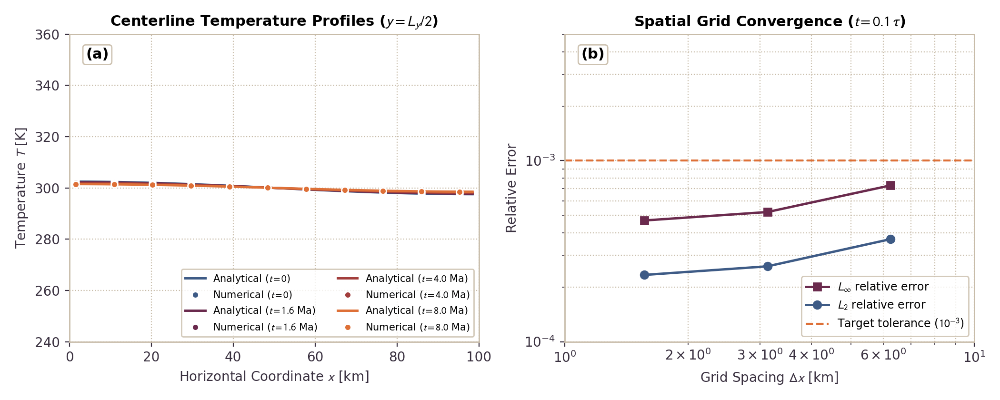

# Thermal Conduction and Metric Geometry Validation

This module validates the effective thermal conductivity of porous rock-fluid mixtures and the geometric metric divergence term for spherical heat conduction in 2D Cartesian coordinates.

---

## 1. Bulk Thermal Conductivity of Porous Mixtures

### Governing Formulation
The effective bulk thermal conductivity $k_{\text{total}}$ of a porous rock matrix saturated with fluid (water or ice) is computed using the quadratic mixture formulation:

$$k_{\text{total}} = \sqrt{\frac{k_s k_f}{2} + \frac{[k_s(3\phi - 2) + k_f(1 - 3\phi)]^2}{16}} - \frac{k_s(3\phi - 2) + k_f(1 - 3\phi)}{4}$$

where $k_s$ is matrix solid conductivity, $k_f$ is pore fluid conductivity, and $\phi$ is porosity.

### Literature Anchors
- **Gerya, T. (2019)**. *Introduction to Numerical Geodynamic Modelling* (2nd ed.). Cambridge University Press.  
  [https://doi.org/10.1017/9781316534243](https://doi.org/10.1017/9781316534243) (Section 10.3)
- **Hubmann, B. (2022)**. *Hydrology of Planetesimals*. Master's thesis, ETH Zurich.  
  [https://doi.org/10.5281/zenodo.7058229](https://doi.org/10.5281/zenodo.7058229) (Equation 2.14)

### Invariants and Limits
1. **Solid Matrix Limit**: As $\phi \to 0$, $k_{\text{total}} \to k_s$.
2. **Pure Fluid Limit**: As $\phi \to 1$, $k_{\text{total}} \to k_f$.
3. **Monotonicity**: For $k_s > k_f$, $\partial k_{\text{total}} / \partial \phi < 0$.
4. **Physical Bounding**: $\min(k_s, k_f) \le k_{\text{total}} \le \max(k_s, k_f)$ for all $\phi \in [0, 1]$.
5. **Error Contract**: Passing $\phi < 0$, $\phi > 1$, $k_s < 0$, or $k_f < 0$ throws `DomainError`.

### Verification Test Suite
- `test/test_physics.jl`: `@testset "ktotal(): physical limits and non-linear mixture invariants"`

---

## 2. Spherical Geometric Metric Divergence (2D Cartesian)

### Governing Formulation
Radial heat conduction in a 3D spherically symmetric body simulated on a 2D Cartesian grid requires adding a geometric curvature heat source term:

$$Q_{\text{metric}} = \frac{k}{r} \frac{\partial T}{\partial r} = \frac{k}{r_{\text{eff}}^2} \left[ (x - x_c)\frac{\partial T}{\partial x} + (y - y_c)\frac{\partial T}{\partial y} \right]$$

with core regularization radius $r_{\text{eff}} = \sqrt{(x - x_c)^2 + (y - y_c)^2 + \epsilon_r^2}$.

### Analytical Benchmark
For steady-state conduction in a sphere of radius $R$ with uniform volumetric heating $H$ and surface temperature $T_s$:
- 3D Spherical analytical solution: $\Delta T_{\text{sph}} = T_{\text{center}} - T_s = \frac{H R^2}{6 k}$
- 2D Cylindrical / planar solution: $\Delta T_{\text{cyl}} = \frac{H R^2}{4 k}$
- Core temperature ratio:

$$\frac{\Delta T_{\text{sph}}}{\Delta T_{\text{cyl}}} = \frac{4}{6} = \frac{2}{3} \approx 0.6667$$

### Verification Test Suite
- `test/test_geometry_radiation.jl`: `@testset "Analytical 1D Steady-State Spherical Conduction Benchmark"`  
  Verifies that the numerical 2D Cartesian solve with $Q_{\text{metric}}$ recovers the analytical $2/3$ temperature gradient ratio within 1% accuracy.
- `test/test_geometry_radiation.jl`: `@testset "Spherical Geometric Metric Divergence"`  
  Verifies core regularization, directional sign consistency ($Q_{\text{metric}} < 0$ for outwardly decreasing temperature), and sticky-air vanishing.

---

## 3. Darcy Thermal Buoyancy and Fluid Equation of State

### Governing Formulation
The fluid thermal expansion relation and the Darcy thermal buoyancy driving force are verified against theoretical scaling:

$$\mathbf{q}_D = - \frac{k_\phi}{\eta_f} \left(\nabla P_f - \rho_f(T) \mathbf{g}\right)$$

In a hydrostatic vertical column with temperature contrast $\Delta T = T - T_{\text{melt}}$, the upward buoyant Darcy discharge velocity scaling is:

$$|q_{yD}| = \frac{k_\phi}{\eta_f} \rho_{f0} \alpha_f \Delta T g$$

### Parameterization Behavior

*Figure 1: Thermal buoyancy and fluid equation of state verification in Erebus. (a) Temperature-dependent fluid density $\rho_f(T)$ over the range $T \in [240, 700]\text{ K}$ displaying sub-freezing ice density ($\rho_{\text{ice}} = 917\text{ kg/m}^3$), liquid water density at $T_{\text{melt}} = 273.0\text{ K}$ ($\rho_{\text{water}} = 1000\text{ kg/m}^3$), and linear density decrease above melting. Curves compare the code baseline ($\alpha_f = 5\times 10^{-5}\text{ K}^{-1}$) against ambient water and hydrothermal regimes. (b) Upward buoyant Darcy discharge velocity $|q_{yD}|$ as a function of thermal contrast $\Delta T$ for representative crustal permeabilities ($k_\phi \in [10^{-14}, 10^{-12}]\text{ m}^2$) at the code baseline $\alpha_f = 5\times 10^{-5}\text{ K}^{-1}$.*

### Verification Test Suite
- `test/test_physics.jl`: Thermal expansion and buoyancy driving forces

---

## 4. 2D Analytical Thermal Slab Diffusion Benchmark (Insulated Box)

### Governing Formulation
Transient thermal diffusion in an insulated 2D Cartesian domain $\Omega = [0, L_x] \times [0, L_y]$ with homogeneous Neumann (zero-flux) boundary conditions satisfies:

$$\rho c_p \frac{\partial T}{\partial t} = \nabla \cdot (k \nabla T) = k \left( \frac{\partial^2 T}{\partial x^2} + \frac{\partial^2 T}{\partial y^2} \right)$$

$$\left. \frac{\partial T}{\partial x} \right|_{x=0, L_x} = 0, \quad \left. \frac{\partial T}{\partial y} \right|_{y=0, L_y} = 0$$

For uniform thermal properties ($k = \text{const}$, $\rho c_p = \text{const}$), thermal diffusivity is $\kappa = k / (\rho c_p)$. Given the initial sinusoidal temperature perturbation:

$$T(x, y, 0) = T_0 + \Delta T \cos\left( \frac{\pi x}{L_x} \right) \cos\left( \frac{\pi y}{L_y} \right)$$

the exact analytical solution for all $t \ge 0$ is:

$$T(x, y, t) = T_0 + \Delta T \cos\left( \frac{\pi x}{L_x} \right) \cos\left( \frac{\pi y}{L_y} \right) \exp(-\lambda t)$$

where the fundamental modal decay rate $\lambda$ and characteristic diffusion timescale $\tau$ are:

$$\lambda = \kappa \pi^2 \left( \frac{1}{L_x^2} + \frac{1}{L_y^2} \right), \quad \tau = \frac{1}{\lambda}$$

### Conservation Invariant
Integration of the heat equation over the insulated domain with zero boundary flux establishes total thermal energy conservation to machine precision:

$$\frac{d}{dt} \int_\Omega \rho c_p T \, dx \, dy = \oint_{\partial \Omega} k \nabla T \cdot \mathbf{n} \, ds = 0$$

### Benchmark Comparison

*Figure 2: 2D thermal slab conduction benchmark in Erebus. (a) Centerline temperature profiles $T(x, y = L_y/2)$ along horizontal distance $x \in [0, 100]\text{ km}$ at four decay epochs ($t = 0.0, 1.6, 4.0, 8.0\text{ Ma}$, corresponding to $0, 0.1\tau, 0.25\tau, 0.5\tau$). Solid curves show the analytical cosine decay solution; circles show the numerical solution. (b) Spatial grid convergence of the $L_\infty$ and $L_2$ relative errors at $t = 0.1\tau$ for grid resolutions $N \in [17, 33, 65]$ ($\Delta x \in [6.25, 3.125, 1.5625]\text{ km}$); errors converge monotonically below the $10^{-3}$ target tolerance.*

### Verification Test Suite
- `test/test_thermal_slab.jl`: `@testset "Analytical 2D Thermal Slab Conduction Benchmark"`
  - `2D Cosine Decay Solution and Energy Conservation`: Verifies $L_\infty < 10^{-3}$, $L_2 < 5\times 10^{-4}$, and closed-box energy conservation $\Delta E / E_0 < 10^{-12}$.
  - `Subcycling with perform_thermal_iterations! (N4)`: Verifies macro-timestep subcycling with `DTmax` enforcement matches the analytical solution and conserves energy to $10^{-12}$.
  - `Spatial Grid Refinement Convergence`: Confirms monotonic spatial convergence under grid refinement ($N = 17, 33, 65$).

