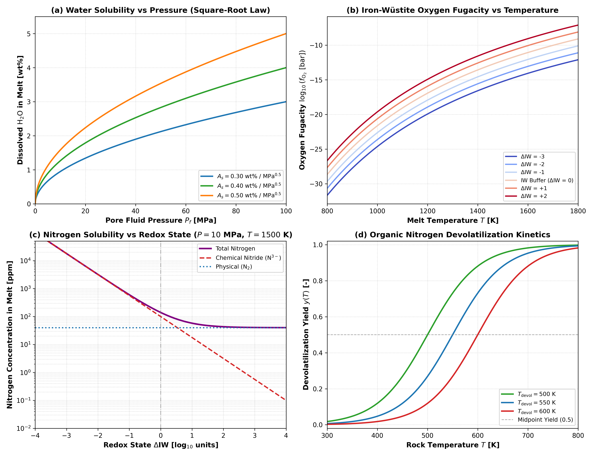

# Multi-Species Volatile Solubility and Organic Devolatilization Parameterization

This module describes multi-species volatile solubility in silicate melt, redox-dependent nitrogen dissolution, and primordial organic nitrogen devolatilization kinetics in `Erebus.jl`.

---

## 1. Physical Motivation

Early planetesimals accreted volatile-rich outer Solar System dust, carbonaceous matter, and hydrous phyllosilicates. Internal radiogenic heating from $^{26}\text{Al}$ and $^{60}\text{Fe}$ raises temperatures through prograde metamorphism ($400\text{ to }900\text{ K}$) and silicate partial melting ($T > 1400\text{ K}$).

During differentiation and magma ocean evolution, volatile elements partition between crystalline minerals, liquid silicate melt, and free hydrothermal fluids:

1. **Water ($\text{H}_2\text{O}$)**: Dissolves predominantly as hydroxyl ($\text{OH}^-$) in silicate melt at low pressures ($P \le 100\text{ MPa}$), following a square-root dependence on pore pressure.
2. **Nitrogen ($\text{N}_2$ and Nitride $\text{N}^{3-}$)**: Dissolves physically as molecular $\text{N}_2$ under oxidized conditions, but shifts to chemical nitride ($\text{N}^{3-}$) dissolution under the reducing conditions typical of early planetesimal interiors ($\Delta\text{IW} \le 0$). Nitride solubility scales strongly with decreasing oxygen fugacity ($f_{\text{O}_2}^{-3/4}$).
3. **Organic Nitrogen**: Primordial organic macromolecules thermally break down during metamorphic heating ($400\text{ to }700\text{ K}$), releasing nitrogenous fluids ($\text{NH}_3$ and $\text{N}_2$) into the porous matrix.

---

## 2. Mathematical Formulation

### Low-Pressure Water Solubility Law

At crustal and interior planetesimal pressures ($P_f \le 100\text{ MPa}$), dissolved water in silicate melt follows the low-pressure square-root relationship of Burnham (1979) and Dixon et al. (1995):

$$w_{\text{sat}}^{\text{H}_2\text{O}} = A_s \sqrt{\max(0, P_f \times 10^{-6})} \quad [\text{wt}\%]$$

The coefficient $A_s = 0.40\text{ wt}\%/\text{MPa}^{0.5}$ is an illustrative baseline for basaltic compositions and is configurable via `VolatilesConfig`.

| Parameter | Description | Standard Value | Units |
|:---|:---|:---|:---|
| $A_s$ | Water solubility coefficient | $0.40$ | $\text{wt}\% / \text{MPa}^{0.5}$ |
| $P_f$ | Pore fluid pressure | - | $\text{Pa}$ |

### Iron-Wüstite Oxygen Fugacity Buffer

The 1-bar oxygen fugacity is evaluated relative to the iron-wüstite (IW) buffer using the empirical parameterization of O'Neill (1988) and Campbell et al. (2009):

$$\log_{10}(f_{\text{O}_2} [\text{bar}]) = 6.541 - \frac{28164}{T} + \Delta\text{IW}$$

where $T$ is temperature in Kelvin and $\Delta\text{IW}$ is the redox offset in $\log_{10}$ units.

### Multi-Species Nitrogen Solubility Partitioning

Nitrogen dissolves through two distinct mechanisms (Libourel et al. 2003; Boulliung et al. 2020). The current implementation is isothermal at reference magmatic conditions ($T \approx 1673\text{ K}$):

1. **Physical Molecular Dissolution ($\text{N}_2$)**:
   $$w_{\text{phys}}^{\text{N}} = K_h \cdot f_{\text{N}_2} \quad [\text{ppm}]$$

2. **Chemical Nitride Dissolution ($\text{N}^{3-}$)**:
   $$w_{\text{chem}}^{\text{N}} = (C_{\text{nitride}} \times 10^4) \sqrt{f_{\text{N}_2}} \cdot \left(\frac{f_{\text{O}_2}}{f_{\text{O}_2}^{\text{IW}}}\right)^{-3/4} \quad [\text{ppm}]$$

3. **Total Nitrogen Melt Capacity**:
   $$w_{\text{total}}^{\text{N}} = w_{\text{phys}}^{\text{N}} + w_{\text{chem}}^{\text{N}} \quad [\text{ppm}]$$

The baseline values $K_h = 0.40\text{ ppm/bar}$ and $C_{\text{nitride}} = 1.0\times 10^{-3}\text{ wt}\%/\text{bar}^{0.5}$ represent illustrative reference values configurable in `VolatilesConfig`.

| Parameter | Description | Standard Value | Units |
|:---|:---|:---|:---|
| $K_h$ | Henry law coefficient for $\text{N}_2$ | $0.40$ | $\text{ppm / bar}$ |
| $C_{\text{nitride}}$ | Chemical nitride capacity | $1.0\times 10^{-3}$ | $\text{wt}\% / \text{bar}^{0.5}$ |
| $f_{\text{N}_2}$ | Nitrogen gas fugacity ($P_f \times 10^{-5}$) | - | $\text{bar}$ |
| $f_{\text{O}_2}^{\text{IW}}$ | Oxygen fugacity at IW buffer ($\Delta\text{IW} = 0$) | - | $\text{bar}$ |

### Organic Nitrogen Devolatilization Kinetics

Thermal decomposition of refractory organic matter releases volatile nitrogen via a continuous logistic transition:

$$y(T) = \frac{1}{1 + \exp\left[-\frac{T - T_{\text{devol}}}{\Delta T}\right]}$$

| Parameter | Description | Standard Value | Units |
|:---|:---|:---|:---|
| $T_{\text{devol}}$ | Midpoint devolatilization temperature | $550.0$ | $\text{K}$ |
| $\Delta T$ | Transition temperature width | $50.0$ | $\text{K}$ |

---

## 3. Literature Anchors

- **Burnham, C. W. (1979)**. The importance of volatile constituents. In *The Evolution of the Igneous Rocks: Fiftieth Anniversary Perspectives*, Princeton University Press, 439-482.
- **O'Neill, H. S. C. (1988)**. Systems Fe-O and Cu-O: thermodynamic data for the equilibria Fe-"FeO", Fe-Fe3O4, "FeO"-Fe3O4, Fe-SiO2-Fe2SiO4, and Cu-Cu2O. *American Mineralogist*, 73(5-6), 470-486.
- **Dixon, J. E., Stolper, E. M., & Holloway, J. R. (1995)**. An experimental study of water and carbon dioxide solubilities in mid-ocean ridge basaltic liquids. Part I: Calibration and solubility models. *Journal of Petrology*, 36(6), 1607-1631.  
  [https://doi.org/10.1093/petrology/36.6.1607](https://doi.org/10.1093/petrology/36.6.1607)
- **Libourel, G., Marty, B., & Humbert, F. (2003)**. Nitrogen solubility in basaltic melt. Part I. Effect of oxygen fugacity. *Geochimica et Cosmochimica Acta*, 67(21), 4123-4135.  
  [https://doi.org/10.1016/S0016-7037(03)00259-X](https://doi.org/10.1016/S0016-7037(03)00259-X)
- **Campbell, A. J., Danielson, L., Righter, K., Seagle, C. T., Wang, Y., & Prakapenka, V. B. (2009)**. High pressure effects on the iron-wüstite and cobalt-palladium oxygen buffers. *Earth and Planetary Science Letters*, 286(3-4), 556-564.  
  [https://doi.org/10.1016/j.epsl.2009.07.022](https://doi.org/10.1016/j.epsl.2009.07.022)
- **Boulliung, J., Dalou, C., Tissandier, L., & Villemant, B. (2020)**. Nitrogen solubility in silicate melts at high pressure: Effect of melt composition and oxygen fugacity. *Geochimica et Cosmochimica Acta*, 284, 120-140.  
  [https://doi.org/10.1016/j.gca.2020.06.017](https://doi.org/10.1016/j.gca.2020.06.017)

---

## 4. Parameterization Behavior

Figure 1 illustrates the operational parameterizations and regimes for multi-species volatile solubility and organic devolatilization:

*Figure 1: Four-panel illustration of volatile solubility and organic devolatilization parameterizations in Erebus.jl. (a) Dissolved water concentration in silicate melt as a function of pore fluid pressure for coefficients $A_s \in \{0.30, 0.40, 0.50\}\text{ wt}\%/\text{MPa}^{0.5}$, with square-root scaling up to $100\text{ MPa}$. (b) Oxygen fugacity $\log_{10}(f_{\text{O}_2}\ [\text{bar}])$ along the iron-wüstite buffer from $800\text{ to }1800\text{ K}$ for redox offsets $\Delta\text{IW} \in \{-3, -2, -1, 0, +1, +2\}$. (c) Nitrogen melt solubility partitioning at $P = 10\text{ MPa}$ ($100\text{ bar}$) across redox offsets $\Delta\text{IW} \in [-4, +4]$, showing the transition from chemical nitride ($\text{N}^{3-}$) dominance under reducing conditions to physical molecular ($\text{N}_2$) dominance under oxidizing conditions. (d) Primordial organic nitrogen devolatilization yield $y(T)$ as a function of rock temperature for midpoint values $T_{\text{devol}} \in \{500, 550, 600\}\text{ K}$ with width $\Delta T = 50\text{ K}$.*

---

## 5. Mathematical Invariants and Implementation Checks

1. **Zero Pressure Limit**: At $P_f \le 0$, water and nitrogen melt solubilities vanish identically ($w_{\text{sat}} = 0$).
2. **Burnham Scaling Invariant**: Quadrupling pore pressure exactly doubles dissolved water concentration ($w(4P) / w(P) = 2.0$).
3. **Redox Scaling Invariant**: Under reducing conditions, a decrease of $2.0$ units in $\Delta\text{IW}$ amplifies chemical nitride solubility by exactly $10^{2.0 \times 0.75} = 10^{1.5} \approx 31.6228$.
4. **Oxidized Physical Dominance**: At $\Delta\text{IW} = +4.0$, molecular physical dissolution ($40\text{ ppm}$ at $100\text{ bar}$) exceeds chemical nitride dissolution ($0.1\text{ ppm}$) by more than two orders of magnitude.
5. **Organic Midpoint Symmetry**: At $T = T_{\text{devol}}$, the organic devolatilization yield equals $0.5$ exactly, approaching $0$ for $T \ll T_{\text{devol}}$ and $1$ for $T \gg T_{\text{devol}}$.
6. **Domain Guards**: Non-positive temperatures, non-finite pressures, non-positive solubility coefficients, and non-physical devolatilization temperatures throw explicit `DomainError` exceptions.
