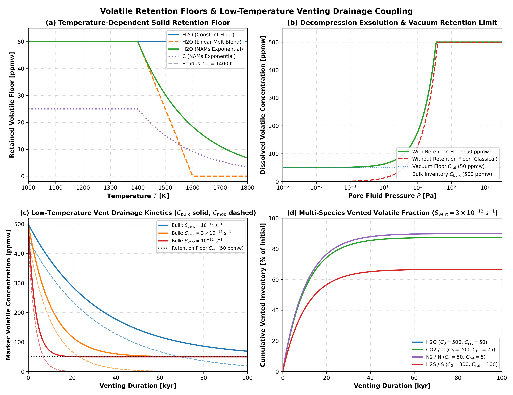

# Volatile Retention Floors and Venting Drainage Validation

This module validates thermodynamic volatile retention floors in nominally anhydrous minerals (NAMs), vacuum decompression exsolution clamping, and low-temperature hydrothermal surface venting drainage coupling in `Erebus.jl`.

---

## 1. Thermodynamic Volatile Retention Floors in Nominally Anhydrous Minerals

### Governing Formulation

In classical melt solubility models, equilibrium volatile solubility vanishes as fluid pressure approaches vacuum ($P \to 0$), predicting total devolatilization of planetary rocks. However, experimental petrology and meteorite analyses show that crystalline silicates maintain trace volatile concentrations in point defects within nominally anhydrous minerals (NAMs: olivine, pyroxenes) and refractory carbonaceous host phases.

To prevent unphysical total degassing under vacuum boundary conditions, `Erebus.jl` defines a temperature-dependent retention floor $C_{\text{ret}}(T)$ for each volatile species (H2O, C, N, S). Below the reference solidus temperature $T_{\text{solidus}}$, volatiles are preserved at nominal floor concentration $C_{\text{floor}}$:

- **Nominally Anhydrous Minerals (NAMs) Exponential Decay** (`:nams_exponential`, default):
  $$C_{\text{ret}}(T) = \begin{cases} C_{\text{floor}}, & T \le T_{\text{solidus}} \\ C_{\text{floor}} \exp\left(-\frac{T - T_{\text{solidus}}}{\Delta T_{\text{ret}}}\right), & T > T_{\text{solidus}} \end{cases}$$
  where $\Delta T_{\text{ret}}$ is the supersolidus melt extraction temperature scale.

- **Linear Melt Blend** (`:linear_melt_blend`):
  $$C_{\text{ret}}(T) = C_{\text{floor}} \left[1 - \text{clamp}\left(\frac{T - T_{\text{solidus}}}{\Delta T_{\text{ret}}}, 0, 1\right)\right]$$

- **Constant Floor** (`:constant_floor`):
  $$C_{\text{ret}}(T) = C_{\text{floor}}$$

When evaluating exsolution, the bulk volatile concentration $C_{\text{bulk}}$ partitions into retained and mobile fractions:

$$C_{\text{mob}} = \max\left(0, C_{\text{bulk}} - C_{\text{ret}}(T)\right)$$
$$C_{\text{sol}} = C_{\text{ret}}(T) + \min\left(C_{\text{mob}}, S_{\text{eq}}\right)$$
$$C_{\text{exs}} = \max\left(0, C_{\text{mob}} - S_{\text{eq}}\right)$$

where $S_{\text{eq}}$ is the equilibrium melt solubility.

### Literature Anchors

- **Hirschmann, M. M., Tenner, C., Falksen, C., Sautter, K., & Hervig, R. L. (2006)**. Water storage capacity of olivine and pyroxenes to 14 GPa: Results from SIMS analysis. *Earth and Planetary Science Letters*, 247(3-4), 199-214.  
  [https://doi.org/10.1016/j.epsl.2006.04.022](https://doi.org/10.1016/j.epsl.2006.04.022)  
  *Water storage capacity in nominally anhydrous minerals (NAMs) and retention floors in planetary mantles.*

- **Peslier, A. H., Schönbächler, M., Busemann, H., & Karato, S. I. (2017)**. Water in the Earth's interior: Distribution and access to domains in time and space. *Space Science Reviews*, 212(1-2), 843-910.  
  [https://doi.org/10.1007/s11214-017-0387-z](https://doi.org/10.1007/s11214-017-0387-z)  
  *Distribution and retention of hydrogen in nominally anhydrous minerals in terrestrial and planetesimal interiors.*

- **Shcheka, S. S., Wiedenbeck, M., Frost, D. J., & Keppler, H. (2006)**. Carbon solubility in mantle minerals. *Earth and Planetary Science Letters*, 245(3-4), 730-742.  
  [https://doi.org/10.1016/j.epsl.2006.03.036](https://doi.org/10.1016/j.epsl.2006.03.036)  
  *Experimental measurements of carbon solubility and retention in olivine, pyroxene, and mantle silicates.*

- **Hirschmann, M. M. (2018)**. Comparative storage capacities for carbon and water in the mantle: Implications for the carbon and water cycles. *Earth and Planetary Science Letters*, 502, 262-273.  
  [https://doi.org/10.1016/j.epsl.2018.08.023](https://doi.org/10.1016/j.epsl.2018.08.023)  
  *Thermodynamic limits on carbon and water storage capacities in crystalline mantle silicates versus basaltic melts.*

- **Li, Y., Wiedenbeck, M., Shcheka, S., & Keppler, H. (2013)**. Nitrogen solubility in upper mantle minerals. *Earth and Planetary Science Letters*, 377-378, 311-323.  
  [https://doi.org/10.1016/j.epsl.2013.10.015](https://doi.org/10.1016/j.epsl.2013.10.015)  
  *Secondary-ion mass spectrometry measurements of nitrogen solubility and retention in nominally anhydrous mantle minerals.*

### Physical Invariants and Limits

1. **Mass Conservation**: For any combination of pressure, temperature, and bulk composition, $C_{\text{sol}} + C_{\text{exs}} = C_{\text{bulk}}$ exactly.
2. **Vacuum Retention Limit**: In the limit $P \to 0$ ($S_{\text{eq}} \to 0$), dissolved volatile concentration $C_{\text{sol}} \to C_{\text{ret}}(T) \ge 0$, while mobile volatiles exsolve fully: $C_{\text{exs}} \to C_{\text{mob}}$.
3. **Sub-Floor Invariance**: When $C_{\text{bulk}} \le C_{\text{ret}}(T)$, mobile volatile concentration $C_{\text{mob}} = 0$, giving $C_{\text{sol}} = C_{\text{bulk}}$ and $C_{\text{exs}} = 0$ identically.
4. **Supersolidus Extraction Monotonicity**: For $T > T_{\text{solidus}}$, $C_{\text{ret}}(T)$ decreases monotonically with increasing temperature in `:nams_exponential` and `:linear_melt_blend` modes.

---

## 2. Low-Temperature Hydrothermal Venting and Mobile Volatile Drainage

### Governing Formulation

When hydrothermal fluid escapes at the planetesimal surface or through tensile fractures ($S_{\text{vent}} > 0$), mobile dissolved volatiles in marker particles drain toward the surface. The rate of mobile volatile depletion is governed by:

$$\frac{d C_{\text{mob}}}{dt} = -S_{\text{vent}} \cdot C_{\text{mob}} \cdot \chi_{\text{vent}}$$

where $\chi_{\text{vent}}$ is the volatile venting extraction efficiency factor. Over timestep $\Delta t$, the analytical integration gives:

$$C_{\text{mob}}(t + \Delta t) = C_{\text{mob}}(t) \exp\left(-S_{\text{vent}} \chi_{\text{vent}} \Delta t\right)$$

The updated bulk concentration is:

$$C_{\text{bulk}}(t + \Delta t) = C_{\text{ret}}(T) + C_{\text{mob}}(t + \Delta t)$$

The extracted mass is summed over markers and scaled to 3D planetary geometry:

$$\Delta M_{\text{vent}} = L_{\text{3D}} \sum_{m} \rho_m V_m \left[C_{\text{bulk}, m}(t) - C_{\text{bulk}, m}(t + \Delta t)\right]$$

where $L_{\text{3D}} = 2 R_{\text{planet}}$ [m] relates 2D planar cross-section markers to the 3D spherical planetesimal volume.

### Physical Invariants and Limits

1. **Retention Floor Lower-Bound Protection**: Even under intense or prolonged venting ($S_{\text{vent}} \Delta t \to \infty$), marker volatile concentration cannot drop below $C_{\text{ret}}(T)$: $C_{\text{bulk}}(t) \ge C_{\text{ret}}(T)$.
2. **Zero-Venting Invariance**: If $S_{\text{vent}} = 0$, $C_{\text{mob}}$ and $C_{\text{bulk}}$ remain constant ($dC_{\text{mob}}/dt = 0$), producing zero vented mass.
3. **Sticky-Air and Non-Rock Protection**: Venting drainage operates on solid rock markers ($t_m < 3$, including $t_m = 1$ core rock and $t_m = 2$ crust rock), leaving ambient sticky-air markers ($t_m = 3$) unaltered.

---

## 3. Four-Panel Verification Benchmark



The verification figure illustrates the four key physical regimes:

1. **Panel (a) - Temperature-Dependent Solid Retention Floor**: Compares the three functional laws (`:constant_floor`, `:linear_melt_blend`, and `:nams_exponential`) under subsolidus and supersolidus conditions ($T \in [1000, 1800]\text{ K}$ with $T_{\text{solidus}} = 1400\text{ K}$, $\Delta T_{\text{ret}} = 200\text{ K}$). NAMs exponential decay preserves the retention floor below the solidus and smoothly transitions toward zero via supersolidus exponential decay as temperature increases.
2. **Panel (b) - Decompression Exsolution and Vacuum Retention Limit**: Contrasts isothermal decompression curves ($P \in [10^{-5}\text{ Pa}, 100\text{ MPa}]$) with and without retention floors for an initial bulk inventory of $500\text{ ppmw}$ $\text{H}_2\text{O}$. Without the floor, classical solubility approaches zero at vacuum; with the floor ($50\text{ ppmw}$), dissolved volatiles plateau at the NAMs lattice retention limit.
3. **Panel (c) - Low-Temperature Vent Drainage Kinetics**: Displays marker volatile concentration evolution over $100\text{ kyr}$ for three venting sink rates ($S_{\text{vent}} \in [10^{-12}, 3\times 10^{-12}, 10^{-11}]\text{ s}^{-1}$). Mobile volatiles (dashed) decay exponentially, while bulk concentration (solid) asymptotes strictly to the $50\text{ ppmw}$ retention floor.
4. **Panel (d) - Multi-Species Vented Volatile Fraction**: Tracks the cumulative percentage of volatile inventory vented to space for four distinct species ($\text{H}_2\text{O}$, $\text{C}$, $\text{N}$, $\text{S}$), verifying bounded extraction kinetics governed by species-specific retention floors.

---

## 4. Test Suite Implementation

The full verification suite is implemented in `test/test_volatile_retention.jl` and executes under `test/runtests.jl`:

```julia
julia --project=. -t 4 test/test_volatile_retention.jl
```

The test suite covers:
- `RetentionConfig` defaults, type stability, and parameter validation.
- TOML serialization and deserialization round-trip.
- Functional laws, temperature boundaries, and asymptotic behavior of `compute_volatile_retention_floor`.
- Decompression vacuum limit clamping and sub-floor undersaturation invariance in `compute_volatile_exsolution`.
- Integration and porosity coupling in `update_single_marker_volatile_exsolution!`.
- Exponential depletion kinetics, floor lower-bound protection, and sticky-air phase invariance in `drain_vented_marker_volatiles!`.
